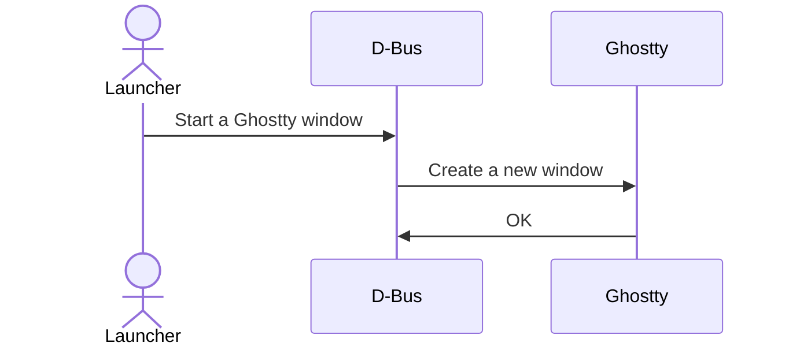
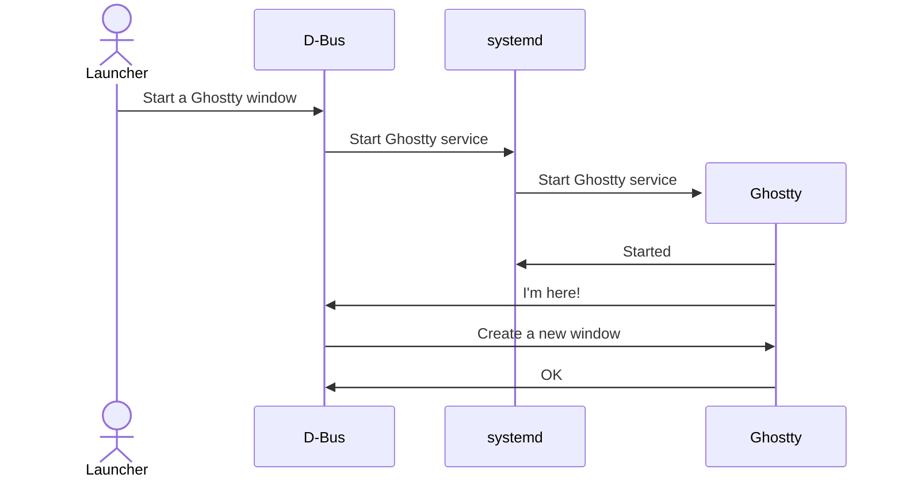

If properly installed[^1], Ghostty comes with several systemd units.
Running Ghostty via these systemd units is the recommended way to
run Ghostty. The two most important benefits provided by Ghostty's
systemd integrations are: instantaneous launching[^2] and centralized
logging.

If you are on a system with `systemd` and you installed Ghostty
via a system package or [as documented](/docs/install/build),
then Ghostty should _just work_. You don't have to read this
documentation unless you want to understand how this all works or
if you're troubleshooting.

<Important>
  Ghostty **does not require systemd** to run. You can run the `ghostty` binary
  directly on any system without systemd and Ghostty will still work. However,
  you'll lose out on the benefits documented on this page.
</Important>

<Important>
  Using `class` in your configuration file can interfere with the proper
  operation of the `systemd` unit files or D-Bus activation. We recommend that
  you remove them from your configuration file and only use them explicitly via
  the command-line when needed.
</Important>

## Starting Ghostty at Login

Ghostty can be configured to start in the background on login,
so that future requests to create new windows are extremely fast.
This is done via `systemd` by enabling the Ghostty user service:

```sh
systemctl enable --user app-com.mitchellh.ghostty.service
```

This will configure your system to start Ghostty when you log in,
but not create any windows. Any startup delay will be "hidden" by
the time that your system needs to finish setting up everything
after logging in.

Adding some configuration entries to your config can improve the
experience even further:

```
quit-after-last-window-closed = true
quit-after-last-window-closed-delay = 5m
```

This configuration will quit Ghostty five minutes after the last window was
closed, thereby saving memory if you haven't been using Ghostty for a while.

```
quit-after-last-window-closed = false
```

This configuration will keep Ghostty running all the time so that new window
creation will always be fast.

## Reloading the Config

You can tell Ghostty to reload it's config (from a script or the CLI) by using
this command:

```sh
systemctl reload --user app-com.mitchellh.ghostty.service
```

Behind the scenes this just sends a SIGUSR2 to the main Ghostty process but
`systemd` handles the work of keeping track of the main Ghostty process. It can
be unreliable to script that using `ps` or similar utilities.

## Scripting New Windows

New windows can be created by using the `ghostty` CLI with no arguments.
However, if you're using the systemd and D-Bus integration, it is much
faster to use `ghostty +new-window` instead.

The `+new-window` command will use D-Bus directly to create a new window.
If Ghostty isn't running, the D-Bus activation unit will start Ghostty.
This is much faster than plain `ghostty` because the plain execution has
to load configuration, examine its environment, initialize GTK, and more
to reach the same conclusion.

```sh
ghostty +new-window
```

This will create a new window even if Ghostty is not already running,
because D-Bus activation will cause Ghostty to be launched.

This command is very useful in particular for window managers such as
i3, Hyperland, or River.

### Hyprland

The following is an example of how to bind `super+return` to open
a new Ghostty window in Hyprland. The configuration typically goes
in `~/.config/hypr/hyprland.conf`:

```
bind = SUPER, return, exec, ghostty +new-window
```

## How Launching Works

On systems with `systemd` and D-Bus, Ghostty will launch via D-Bus
activation by default.

Instead of executing Ghostty directly, the application launcher will
send a signal to the D-Bus session broker asking it to open a Ghostty
window. The D-Bus session broker knows if Ghostty is running or not,
because Ghostty will claim a specific bus name (`com.mitchellh.ghostty`).
If there is a program that claimed this bus name, it is assumed to be
Ghostty.

From this point, the behavior depends on whether Ghostty is already running
or not.

This process ensures that any startup delayed caused by GTK (or any
other initialization) is only incurred once if there are active
windows or if Ghostty is configured to remain running (not the
default).

### Ghostty is Already Running

If Ghostty is already running, the broker will send a D-Bus signal
directly to Ghostty asking it to create a new window. Ghostty listens
for this signal and opens a new window. This is very fast, and very
cheap.



### Ghostty is Not Running

If Ghostty is not running, the D-Bus session broker will ask `systemd`
to start Ghostty in a user service, and then will send Ghostty a D-Bus
signal to create a new window after it starts.



## Other

This "other" section collects less critical information or less
commonly used information. This information may still be extremely
useful (as such it is documented here), but it is not frequently
used.

### Logs

Logs emitted by Ghostty when run via systemd can be viewed using
`journalctl`:

```sh
journalctl -a -f --user -u app-com.mitchellh.ghostty.service
```

### Status

The following command will show you the status of Ghostty:

```sh
systemctl status --user app-com.mitchellh.ghostty.service
```

Which should produce output similar to the following:

```
● app-com.mitchellh.ghostty.service - Ghostty
     Loaded: loaded (/home/mitchellh/.local/share/systemd/user/app-com.mitchellh.ghostty.service; disabled; preset: enabled)
     Active: active (running) since Fri 2025-07-11 14:05:42 PDT; 24h ago
 Invocation: 42b48b0aa1bf4134a030e38acb04b8dd
   Main PID: 2525 (ghostty)
      Tasks: 0 (limit: 71639)
     Memory: 81.4M (peak: 107.9M)
        CPU: 98ms
     CGroup: /user.slice/user-1000.slice/user@1000.service/app.slice/app-com.mitchellh.ghostty.service
             ‣ 2525 /home/mitchellh/.local/bin/ghostty --launched-from=systemd

Jul 11 14:05:42 beach ghostty[2525]: info(gtk): cgroup isolation enabled base=/user.slice/user-1000.slice/user@1000.service/app.slice/app-ghostty-transient-2525.scope
Jul 11 14:05:42 beach systemd[2268]: Started Ghostty.
Jul 11 14:05:42 beach ghostty[2525]: info(gtk): received new window action
Jul 11 14:05:42 beach ghostty[2525]: info(opengl): loaded OpenGL 4.6
Jul 11 14:05:42 beach ghostty[2525]: info(io_exec): found Ghostty resources dir: /home/mitchellh/.local/share/ghostty
```

### Stopping

The Ghostty `systemd` user service can be stopped by running:

```sh
systemctl stop --user app-com.mitchellh.ghostty.service
```

<Caution>
  This will gracefully stop Ghostty, but Ghostty will close any windows and kill
  their running processes _without asking for confirmation_. This may cause data
  or state loss.
</Caution>

### Relevant Files

If properly installed [^1], Ghostty will come with several configuration
files to launch Ghostty.

If installed as a user (e.g. at `$HOME/.local`), the following files
will be created:

```
$PREFIX/share/applications/com.mitchellh.ghostty.desktop
$PREFIX/share/dbus-1/services/com.mitchellh.ghostty.service
$PREFIX/share/systemd/user/app-com.mitchellh.ghostty.service
```

If installed as a system package, the following files will be created:

```
$PREFIX/share/applications/com.mitchellh.ghostty.desktop
$PREFIX/share/dbus-1/services/com.mitchellh.ghostty.service
$PREFiX/lib/systemd/user/app-com.mitchellh.ghostty.service
```

<Warning>
  If these files are not installed in the proper locations and configured
  correctly **Ghostty may fail to launch**. If they are installed in the proper
  location and Ghostty is still not launching, log out and log back in. If that
  doesn't work, try restarting your system. This should rarely be necessary, but
  it can happen depending on system configuration.
</Warning>

### Dev Builds

If you have installed a development build of Ghostty (in `Debug` mode),
paths on this page need to be altered slightly:

```sh
systemctl enable --user app-com.mitchell.ghostty-debug.service
systemctl stop --user app-com.mitchell.ghostty-debug.service
systemctl reload --user app-com.mitchell.ghostty-debug.service
journalctl -a -f --user -u app-com.mitchellh.ghostty-debug.service
ghostty +new-window --class=com.mitchell.ghostty-debug.service
```

These are the files that control the launching of debug versions of Ghostty if
installed as a user:

```
$PREFIX/share/applications/com.mitchellh.ghostty-debug.desktop
$PREFIX/share/dbus-1/services/com.mitchellh.ghostty-debug.service
$PREFIX/share/systemd/user/app-com.mitchellh.ghostty-debug.service
```

If installed as a system package, the files will be found in the following
locations:

```
$PREFIX/share/applications/com.mitchellh.ghostty-debug.desktop
$PREFIX/share/dbus-1/services/com.mitchellh.ghostty-debug.service
$PREFiX/lib/systemd/user/app-com.mitchellh.ghostty-debug.service
```

[^1]:
    "Properly installed" means via a package that followed our
    packaging guidelines or from source in `$HOME/.local`.

[^2]:
    "Instantaneous" is hyperbolic, of course. Practically speaking,
    launching a new Ghostty window goes from somewhere around 300ms on
    a modern system to around 20ms. These numbers will vary based on hardware,
    but the relative increase should be noticeable on all systems.
