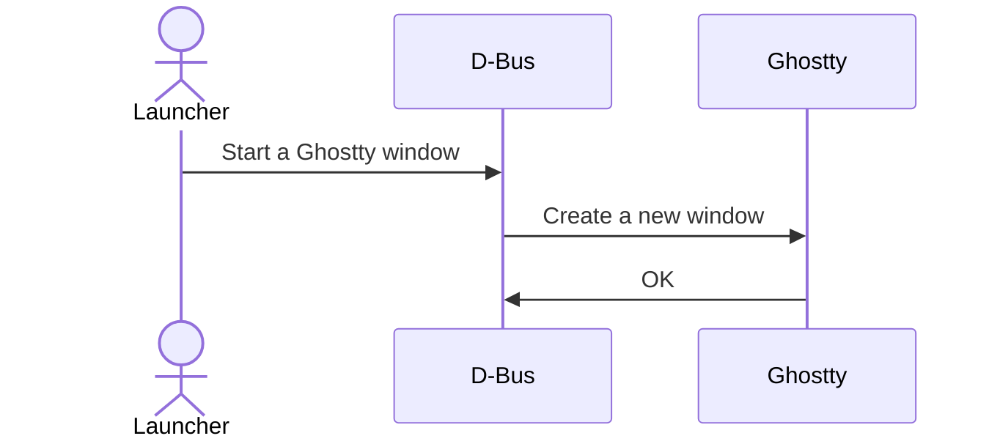
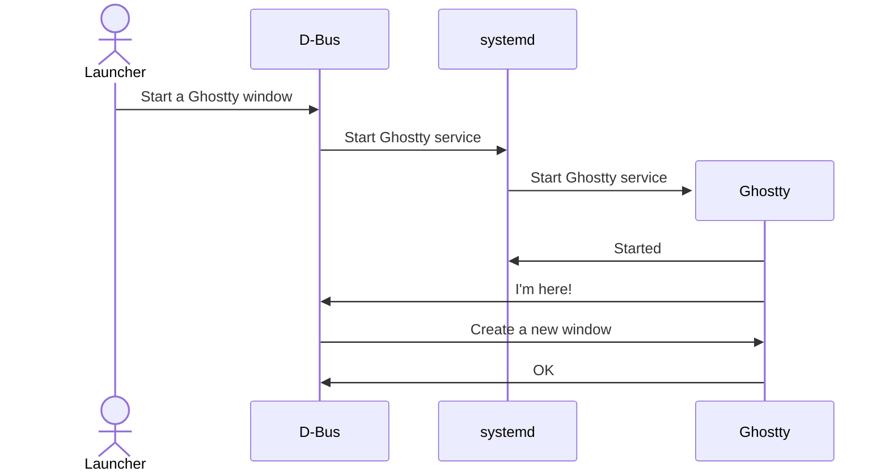

# Ghostty Documentation

> Complete documentation for Ghostty terminal emulator

## Table of Contents

- [About Ghostty](#about-ghostty)
- [Install](#install)
  - [Binaries and Packages](#install-binaries-and-packages)
  - [Build from Source](#install-build-from-source)
  - [Packaging Ghostty](#install-packaging-ghostty)
  - [Prerelease Builds](#install-prerelease-builds)
  - [Release Notes](#release-notes)
    - [Release Notes](#installrelease-notes-release-notes)
    - [1.2.3](#installrelease-notes-123)
    - [1.2.2](#installrelease-notes-122)
    - [1.2.1](#installrelease-notes-121)
    - [1.2.0](#installrelease-notes-120)
    - [1.1.3](#installrelease-notes-113)
    - [1.1.2](#installrelease-notes-112)
    - [1.1.1](#installrelease-notes-111)
    - [1.1.0](#installrelease-notes-110)
    - [1.0.1](#installrelease-notes-101)
- [Configuration](#configuration)
  - [Configuration](#config-configuration)
  - [Option Reference](#config-option-reference)
  - [Keybindings](#keybindings)
    - [Custom Keybindings](#configkeybind-custom-keybindings)
    - [Trigger Sequences](#configkeybind-trigger-sequences)
    - [Action Reference](#configkeybind-action-reference)
- [Linux](#linux)
  - [Linux](#linux-linux)
  - [Systemd and D-Bus](#linux-systemd-and-d-bus)
- [Features](#features)
  - [Features](#features-features)
  - [Color Theme](#features-color-theme)
  - [Shell Integration](#features-shell-integration)
- [Terminal API (VT)](#terminal-api-vt)
  - [Terminal API (VT)](#vt-terminal-api-vt)
  - [Reference](#vt-reference)
  - [Concepts](#concepts)
    - [Control Sequences](#vtconcepts-control-sequences)
    - [Cursor](#vtconcepts-cursor)
    - [Screen](#vtconcepts-screen)
  - [Control](#control)
    - [Backspace (BS)](#vtcontrol-backspace-bs)
    - [Bell (BEL)](#vtcontrol-bell-bel)
    - [Carriage Return (CR)](#vtcontrol-carriage-return-cr)
    - [Linefeed (LF)](#vtcontrol-linefeed-lf)
    - [Tab (TAB)](#vtcontrol-tab-tab)
  - [ESC](#esc)
    - [Screen Alignment Test (DECALN)](#vtesc-screen-alignment-test-decaln)
    - [Keypad Application Mode (DECKPAM)](#vtesc-keypad-application-mode-deckpam)
    - [Keypad Numeric Mode (DECKPNM)](#vtesc-keypad-numeric-mode-deckpnm)
    - [Restore Cursor (DECRC)](#vtesc-restore-cursor-decrc)
    - [Save Cursor (DECSC)](#vtesc-save-cursor-decsc)
    - [Index (IND)](#vtesc-index-ind)
    - [Reverse Index (RI)](#vtesc-reverse-index-ri)
    - [Reset to Initial State (RIS)](#vtesc-reset-to-initial-state-ris)
  - [CSI](#csi)
    - [Cursor Backward Tabulation (CBT)](#vtcsi-cursor-backward-tabulation-cbt)
    - [Cursor Horizontal Tabulation (CHT)](#vtcsi-cursor-horizontal-tabulation-cht)
    - [Cursor Next Line (CNL)](#vtcsi-cursor-next-line-cnl)
    - [Cursor Preceding Line (CPL)](#vtcsi-cursor-preceding-line-cpl)
    - [Cursor Backward (CUB)](#vtcsi-cursor-backward-cub)
    - [Cursor Down (CUD)](#vtcsi-cursor-down-cud)
    - [Cursor Forward (CUF)](#vtcsi-cursor-forward-cuf)
    - [Cursor Position (CUP)](#vtcsi-cursor-position-cup)
    - [Cursor Up (CUU)](#vtcsi-cursor-up-cuu)
    - [Delete Character (DCH)](#vtcsi-delete-character-dch)
    - [Set Cursor Style (DECSCUSR)](#vtcsi-set-cursor-style-decscusr)
    - [Set Left and Right Margins (DECSLRM)](#vtcsi-set-left-and-right-margins-decslrm)
    - [Set Top and Bottom Margins (DECSTBM)](#vtcsi-set-top-and-bottom-margins-decstbm)
    - [Delete Line (DL)](#vtcsi-delete-line-dl)
    - [Device Status Report (DSR)](#vtcsi-device-status-report-dsr)
    - [Erase Character (ECH)](#vtcsi-erase-character-ech)
    - [Erase in Display (ED)](#vtcsi-erase-in-display-ed)
    - [Erase in Line (EL)](#vtcsi-erase-in-line-el)
    - [Horizontal Position Absolute (HPA)](#vtcsi-horizontal-position-absolute-hpa)
    - [Horizontal Position Relative (HPR)](#vtcsi-horizontal-position-relative-hpr)
    - [Insert Character (ICH)](#vtcsi-insert-character-ich)
    - [Insert Line (IL)](#vtcsi-insert-line-il)
    - [Repeat (REP)](#vtcsi-repeat-rep)
    - [Scroll Down (SD)](#vtcsi-scroll-down-sd)
    - [Scroll Up (SU)](#vtcsi-scroll-up-su)
    - [Tab Clear (TBC)](#vtcsi-tab-clear-tbc)
    - [Vertical Position Absolute (VPA)](#vtcsi-vertical-position-absolute-vpa)
    - [Vertical Position Relative (VPR)](#vtcsi-vertical-position-relative-vpr)
    - [Shift-Escape Behavior (XTSHIFTESCAPE)](#vtcsi-shift-escape-behavior-xtshiftescape)
- [Help](#help)
  - [Help](#help-help)
  - [Terminfo](#help-terminfo)
  - [GTK Single Instance](#help-gtk-single-instance)
  - [GTK OpenGL Context](#help-gtk-opengl-context)
  - [macOS Tiling Window Managers](#help-macos-tiling-window-managers)
  - [macOS Login Shells](#help-macos-login-shells)

---

## About Ghostty

Ghostty is a terminal emulator that differentiates itself by being
fast, feature-rich, and native. While there are many excellent terminal
emulators available, they all force you to choose between speed,
features, or native UIs. Ghostty provides all three.

In all categories, I am not trying to claim that Ghostty is the
best (i.e. the fastest, most feature-rich, or most native). But
when I set out to create Ghostty, I felt all terminals made
you choose at most two of these categories. I wanted to create
a terminal that was competitive in all three categories and I
believe Ghostty achieves that goal.

Before diving into the details, I also want to note that Ghostty
is a passion project started by [Mitchell Hashimoto](https://mitchellh.com)
(that's me!). It's something I work on in my free time and is a
labor of love. Please don't forget this when interacting with
the project. I'm doing my best to make something great along with
the lovely contributors, but it's not a full-time job for any of us.

## Native

The big picture of "native" is that Ghostty is designed to look,
feel, and behave like you expect an application to behave in your
desktop environment.

Importantly, Ghostty _is_ a native application for macOS and Linux.
On macOS, the GUI is written in Swift and uses AppKit and SwiftUI.
On Linux, the GUI is written in Zig and uses the GTK4 C API[^1].
The GUIs interface with a shared core written in Zig that we
call "libghostty". For those unfamiliar with Zig, it is a
systems programming language that compiles to native machine code.

Part of this is using native UI components[^2] for features like tabs,
splits, error messages, etc. in contrast to many other terminal
emulators that either use text UIs and custom widgets or
don't support these features at all.

Another part is using standard keyboard and mouse shortcuts
that you're already familiar with. Ghostty uses different default
bindings on macOS and Linux to match the conventions of each
platform.

And a third part is Ghostty integrates with system capabilities
that are unique to the platform it is running on. For example,
on macOS, Ghostty supports Quick Look, force touch, the macOS
secure input API, built-in window state recovery on restart,
etc. These are all native APIs provided by macOS that don't have
equivalents in Linux desktop environments.

## Feature-rich

Ghostty tries to provide a rich set of features that are useful
for everyday use. These can be split into two categories:
terminal features and application features.

Terminal features include the capabilities that programs running
inside the terminal can use. For example, Ghostty supports
the Kitty graphics protocol, light/dark mode notifications,
hyperlinks, and more.
This lets terminal applications like Neovim, Zellij, and
others do more than they could in other terminal emulators[^3].

Application features are higher-level features that are useful
for interacting with the terminal emulator itself. For example,
Ghostty supports native tabs, splits, a drop-down terminal
on macOS, theme switching on system dark/light mode, etc.

## Fast

Ghostty aims to be fast.

Performance is a category where people start getting really
argumentative, so the only claim I make is that Ghostty aims
to be in the same class as the fastest terminal emulators.
In some benchmarks it is faster, in others it is slower, but
in every case it should be impossible to say that Ghostty is
slow.

"Fast" is also a loaded term since "fast" can mean different
things to different people. For example, here is just a
small list of the things that can be "fast": startup time,
scrolling speed, IO throughput, control sequence throughput,
framerates, etc.

In the future, I'd like to provide detailed benchmarks and
explanations about how Ghostty performs in various performance
categories. For the initial public release, I'll just say that
Ghostty aims to be "fast" as described above.

I know many don't believe that speed is that important for a
terminal emulator, but new users to Ghostty repeatedly told me
that they were very surprised how noticeable the speed
improvements were to their everyday use. I hope you'll feel the
same way.

## libghostty

Ghostty also differentiates itself with its architecture. The
core of Ghostty is a cross-platform, C-ABI compatible library called
`libghostty`. `libghostty` provides the core terminal emulation, font handling,
and rendering capabilities.

The Ghostty GUI applications are consumers of `libghostty`. The macOS app is
written in Swift, uses AppKit and SwiftUI, and links against the `libghostty`
C API. The Linux app is written in Zig, uses the GTK4 C API, and also links
against `libghostty`[^4].

This architecture allows for a clean separation between the terminal
emulation and the GUI. It is the key architecture that allows Ghostty
to achieve its goal of being [native](#native).

This architecture makes Ghostty unique since Ghostty the project also aims
to enable other terminal emulator projects to be built on top of a shared
core. This allows for a more diverse ecosystem of terminal emulators that
can focus on higher-level features and UIs without needing to reimplement
the core terminal emulation.

> **Note:** As of the initial public release, `libghostty` is not yet a stable API
> and has not been released as a standalone, stable library. However, it is
> already in use by the macOS and Linux GUI applications. The goal is to
> stabilize the API and release it as a standalone library in the future.

[^1]: Linux doesn't have a "native" GUI toolkit like macOS, but
GTK4 is the closest thing to a standard GUI toolkit that exists.
Most importantly, we don't draw custom widgets and Ghostty will
fit right into your desktop environment.

[^2]: Linux uses GTK4 and (optionally) Adwaita, so Ghostty will
look and feel like a GTK4 application which may or may not be "native"
depending on your desktop environment and definition of "native". See
note 1 too.

[^3]: For example, Neovim uses synchronized rendering to prevent
tearing between frames.

[^4]: Since the GTK4 app is written in Zig, it doesn't link in the traditional
sense. Instead, it uses the public `libghostty` APIs and compiles as a single
Zig compilation unit.


## Install


### Binaries and Packages

The Ghostty project only officially provides prebuilt binaries
for macOS. Other platforms may provide packages for Ghostty,
but those packages are not officially maintained by the Ghostty project.
This page will list both official and community-provided binary packages.

## macOS

Official macOS binaries are provided by the Ghostty project and
are available on the [download page](https://ghostty.org/download).

These binaries are signed and notarized by the Ghostty project.
To install, download the `.dmg` file, open it, and drag the
Ghostty application to your Applications folder. This is the same
process as installing many typical macOS applications.

### Homebrew

A [Homebrew cask](https://formulae.brew.sh/cask/ghostty) is available and maintained by the Ghostty community.

```sh
brew install --cask ghostty
```

## Linux (Official)

Pre-built Linux binaries are packaged by distributions and not the
Ghostty project. The packages listed in this section are all official
packages provided by the respective distributions.
[Community-built packages](#linux-(community)) are also available. See
the warning associated with those packages for more information.

If your platform isn't available, you must
[build Ghostty from source](#install-build-from-source).

> **Tip:** **Interested in creating a package for your platform?** Check out the
>   [packaging
>   guide](https://github.com/ghostty-org/ghostty/blob/main/PACKAGING.md). If you
>   need any help, feel free to make an issue. Once your package is ready, submit
>   a pull request to add it to this page!

### Alpine Linux

Ghostty is available in the official Alpine Linux [testing repository](https://pkgs.alpinelinux.org/package/edge/testing/x86_64/ghostty).

```sh
apk add ghostty
```

### Arch Linux

The latest tagged release of Ghostty is available as
[`ghostty`](https://archlinux.org/packages/extra/x86_64/ghostty/)
in Arch Linux's `[extra]` repository.

```sh
pacman -S ghostty
```

Additionally, a recipe for building and installing the tip of the `main`
branch from source is available in the Arch User Repository (AUR) as
[ghostty-git](https://aur.archlinux.org/packages/ghostty-git).
Installation may be done with an AUR helper or from source per the
[usual AUR instructions](https://wiki.archlinux.org/title/Arch_User_Repository#Installing_and_upgrading_packages).

```sh
# Install Ghostty git
yay -S ghostty-git
```

### Gentoo

Ghostty is available in the official Gentoo repository.

```sh
emerge -av ghostty
```

### NixOS

Ghostty is available in [nixpkgs](https://search.nixos.org/packages?from=0&size=50&sort=relevance&type=packages&query=ghostty).

```
environment.systemPackages = [
  pkgs.ghostty
];
```

### Nix Flake

There is Nix package that can be used in the
[Ghostty flake](https://github.com/ghostty-org/ghostty/blob/main/flake.nix)
(`packages.ghostty` or `packages.default`). This is a good way
to track specific commits of Ghostty.

While the Ghostty project does not maintain any official packages for
Linux, Ghostty maintains an in-repo Nix flake because Nix is used as
our primary development and CI environment. The Ghostty project does
not maintain any official NixOS packages (in `nixpkgs`).

Below is an example:

```nix
{
  inputs = {
    nixpkgs.url = "github:NixOS/nixpkgs/nixos-unstable";

    ghostty = {
      url = "github:ghostty-org/ghostty";
    };
  };

  outputs = {
    nixpkgs,
    ghostty,
    ...
  }: {
    nixosConfigurations.mysystem = nixpkgs.lib.nixosSystem {
      modules = [
        ({ pkgs, ... }: {
          environment.systemPackages = [
            ghostty.packages.${pkgs.stdenv.hostPlatform.system}.default
          ];
        })
      ];
    };
  };
}
```

> **Note:** This isn't an official package in Nixpkgs but it is officially maintained
> by the Ghostty project so we put it in the "official" section.


### openSUSE

Ghostty is available as [`ghostty`](https://software.opensuse.org/package/ghostty) in the official openSUSE Tumbleweed repository.

```sh
zypper install ghostty
```

### Snap

Ghostty is available as [`ghostty`](https://snapcraft.io/ghostty) in the Snap Store.

```sh
snap install ghostty --classic
```

> **Note:** The Snap package at Snapcraft has an external maintainer but the build
> process is triggered by official scripts in the Ghostty repository and
> the package will be transferred to the Ghostty organization in the future,
> probably coinciding with future Ghostty 1.2 release.

### Solus

Ghostty is available in the official package repository.

```sh
eopkg install ghostty
```

### Void Linux

Ghostty is available in the official package repository.

```sh
xbps-install ghostty
```

## Linux (Community)

The packages in this section provide binary installs for Ghostty but
are not official packages within the associated distributions. These
packages are maintained by community members and as such a higher level
of caution should be taken when installing them.

### Debian

Ghostty is available in [this community-maintained repository](https://debian.griffo.io/).

Build, packaging and instructions for each version are available in the README of the [repository](https://github.com/dariogriffo/ghostty-debian)

> **Warning:** These are user-maintained packages and not official Debian packages.

### Fedora

Ghostty is available in [Fedora COPR](https://copr.fedorainfracloud.org/coprs/scottames/ghostty/).

```sh
dnf copr enable scottames/ghostty
dnf install ghostty
```

Ghostty is also available in [Terra](https://terra.fyralabs.com/).

 ```sh
 dnf install --nogpgcheck --repofrompath 'terra,https://repos.fyralabs.com/terra$releasever' terra-release
 dnf install ghostty
 ```

> **Warning:** These are user-maintained packages and not official Fedora packages.

#### Atomic Desktops (Silverblue)

Add the copr repository to your system:

```sh
. /etc/os-release
curl -fsSL "https://copr.fedorainfracloud.org/coprs/scottames/ghostty/repo/fedora-${VERSION_ID}/scottames-ghostty-fedora-${VERSION_ID}.repo" | sudo tee /etc/yum.repos.d/_copr:copr.fedorainfracloud.org:scottames:ghostty.repo > /dev/null
```

After adding the repository, install Ghostty:

```sh
rpm-ostree refresh-md && \
rpm-ostree install ghostty
```

### Ubuntu

An Ubuntu package (.deb) is available from
[ghostty-ubuntu](https://github.com/mkasberg/ghostty-ubuntu) on GitHub. After
downloading the .deb for your Ubuntu version from the
[Releases](https://github.com/mkasberg/ghostty-ubuntu/releases) page, install it
as below:

```sh
sudo apt install ./ghostty_*.deb
```

> **Warning:** This is a user-maintained package. It is not an official Ubuntu package.

### Universal AppImage

Ghostty is available as a Universal AppImage which is compatible with any Linux distribution (Including musl based).
You can access the AppImage at [ghostty-appimage](https://github.com/pkgforge-dev/ghostty-appimage) on GitHub.

To begin, download the appropriate `.appimage` file from the [Releases](https://github.com/pkgforge-dev/ghostty-appimage/releases) page
and follow the instructions below:

```bash
chmod a+x Ghostty-${VERSION}-${ARCH}.appimage
./Ghostty-${VERSION}-${ARCH}.appimage
```

For comprehensive installation instructions, please refer the [installation guide](https://github.com/pkgforge-dev/ghostty-appimage#%EF%B8%8F-installation).

> **Warning:** This is a community-maintained AppImage. It is not an official AppImage.


### Build from Source

> **Tip:** **Building Ghostty from source is not recommended for most users.**
> If you have access to a prebuilt binary or package, you should use that
> instead. See [the binaries and packages page](#install-binaries-and-packages) to
> see if a prebuilt binary or package is available for your platform.
>
> If you intend to develop or package Ghostty, please also check out our
> ["Developing Ghostty"](https://github.com/ghostty-org/ghostty/blob/main/HACKING.md)
> and ["Packaging Ghostty"](https://github.com/ghostty-org/ghostty/blob/main/PACKAGING.md)
> documents respectively. This page is more oriented towards end users who
> want or need to build Ghostty from source for personal use.

To build Ghostty, you need to first install [Zig](https://ziglang.org/).

> **Important:** Each version of Ghostty is only guaranteed to build for one **specific** version
> of Zig as it is still a rapidly-evolving language. **Either older or newer
> Zig compilers may not be able to build Ghostty.** If your package manager
> maintains a different version of Zig than what Ghostty requires, you can use
> static binary releases of the Zig compiler on the [Zig downloads page](https://ziglang.org/download/).

The Zig version that each Ghostty version requires is as follows:

| Ghostty version | Zig version |
| --------------- | ----------- |
| 1.0.x           | 0.13.0      |
| 1.1.x           | 0.13.0      |
| 1.2.x           | 0.14.1      |
| tip             | 0.15.1      |

The official build environment is defined by [Nix](https://nixos.org/).
You do not need to use Nix to build Ghostty, but the Nix environment is the
environment which runs CI tests and builds release artifacts, so it is the most
reliable way to build Ghostty. See the [Building with Nix](#building-with-nix)
section to see how to set up the Nix environment.

Depending on your platform, you may also need to install additional
dependencies to build Ghostty. For Linux, see [Linux](#linux). For macOS,
see [macOS](#macos).

## Getting the source code

Begin by **downloading Ghostty's source tarball**.

> **Warning:** While you can compile Ghostty from source by checking out its Git repository,
> this is **not recommended** for anyone but Ghostty developers and contributors.
> This is because source tarballs contain various preprocessed files that make
> Ghostty require far fewer dependencies to compile.
>
> If you intend to contribute to Ghostty, please consult the
> ["Developing Ghostty"](https://github.com/ghostty-org/ghostty/blob/main/HACKING.md)
> documents on how to build Ghostty in a development environment.
> While most of the steps are exactly the same, we will be assuming a source
> tarball-based build for now on for the sake of simplicity.

For stable releases, source tarballs and their accompanying checksums can be
found at `releases.files.ghostty.org` at the following paths, where `VERSION`
is an unprefixed version number such as `1.0.0`:

```
https://release.files.ghostty.org/VERSION/ghostty-VERSION.tar.gz
https://release.files.ghostty.org/VERSION/ghostty-VERSION.tar.gz.minisig
```

Signature files are signed with
[minisign](https://jedisct1.github.io/minisign/)
using the following public key:

```
RWQlAjJC23149WL2sEpT/l0QKy7hMIFhYdQOFy0Z7z7PbneUgvlsnYcV
```

For development ("tip") versions, the source tarball can be found via the
[`tip` release on GitHub](https://github.com/ghostty-org/ghostty/releases/tag/tip),
under the name `ghostty-source.tar.gz`.

> **Important:** The source tarball is **different** from GitHub's autogenerated tarball
> labelled "Source code (zip)" or "Source code (tar.gz)": the latter of which does
> not contain any preprocessed files, making it identical to a Git checkout.

Decompress the release tarball, and then navigate into the unpacked source folder:

```sh
tar -xf ghostty-VERSION.tar.gz
cd ghostty-VERSION/

# Or when using a tip source tarball:
# (REVISION is the commit SHA of the latest commit)

tar -xf ghostty-source.tar.gz
cd ghostty-VERSION-main+REVISION/
```

With Zig and necessary dependencies installed, a binary can then be built
using `zig build`:

```sh
zig build -Doptimize=ReleaseFast
```

On Linux, this will build a ready-to-use binary at `zig-out/bin/ghostty`.
On macOS, this will build the app bundle at `zig-out/Ghostty.app`.

> **Tip:** For Linux users: To install system-wide or on your user account, see
> [Installation Directory](#installation-directory).

> **Tip:** For a debug build, omit the `-Doptimize=ReleaseFast` flag. Debug builds
> are **extremely slow** (over 100x slower) than release builds, so only
> use them for development.

## Linux

### Dependencies

On Linux, you'll need to install header packages for Ghostty's dependencies
before building it. Only a few dependencies are needed for source builds
because Ghostty will build everything else statically by default.

Required dependencies:

- `gtk4`
- `libadwaita`
- `gtk4-layer-shell`
- `pkg-config` or `pkgconf`
- `gettext`

> **Important:** If you're using a Git checkout, you also need to install these dependencies:

> **Tip:** If your distro has yet to package `gtk4-layer-shell` (e.g. Ubuntu 24.04, Debian
> 12, Linux Mint 22.1, OpenSUSE, etc.), you need to allow Ghostty to compile
> `gtk4-layer-shell` from source by adding the flag `-fno-sys=gtk4-layer-shell`
> to `zig build`.

#### Alpine

```sh
doas apk add \
  gtk4.0-dev \
  libadwaita-dev \
  pkgconf \
  ncurses \
  gettext
```

#### Arch Linux

```sh
sudo pacman -S \
  gtk4 \
  gtk4-layer-shell \
  libadwaita \
  gettext
```

#### Debian and Ubuntu

```sh
sudo apt install \
  libgtk-4-dev \
  libgtk4-layer-shell-dev \
  libadwaita-1-dev \
  gettext \
  libxml2-utils
```

On Debian unstable/testing, the `gcc-multilib` package is also required
for building.

#### Fedora

On Fedora variants, use

```sh
sudo dnf install \
  gtk4-devel \
  gtk4-layer-shell-devel \
  zig \
  libadwaita-devel \
  gettext
```

On Fedora Atomic variants, use

```sh
rpm-ostree install \
  gtk4-devel \
  gtk4-layer-shell-devel \
  zig \
  libadwaita-devel \
  gettext
```

#### Gentoo

```sh
emerge -av \
  libadwaita \
  gtk \
  blueprint-compiler \
  gettext
```

#### openSUSE Tumbleweed

```sh
sudo zypper install \
  gtk4-devel \
  libadwaita-devel \
  pkgconf \
  ncurses-devel \
  zig \
  gettext
```

#### openSUSE Leap

```sh
sudo zypper install \
  gtk4-devel \
  libadwaita-devel \
  pkgconf \
  ncurses-devel \
  zig \
  gettext
```

#### Solus

```sh
sudo eopkg install \
  libgtk-4-devel \
  libadwaita-devel \
  pkgconf \
  zig \
  gettext
```

#### Void

```sh
sudo xbps-install \
  gtk4-devel \
  gtk4-layer-shell-devel \
  libadwaita-devel \
  pkg-config \
  zig \
  gettext
```

### Installation Directory

Use `zig build` with the `-p` (prefix) flag to install Ghostty into
a target directory. This will setup the proper FHS directory structure
that ensures features such as shell integration, icons, GTK shortcuts, etc.
all work.

For local, unprivileged installs, we recommend `$HOME/.local`:

```sh
zig build -p $HOME/.local -Doptimize=ReleaseFast
```

With a typical Freedesktop-compatible desktop environment (i.e. GNOME,
KDE), this will make Ghostty available as an app in your app launcher.
If you don't see it immediately you may have to log out and log back
in or maybe even restart.

If Ghostty fails to launch using an app icon in your app launcher,
ensure that `~/.local/bin` is on your _system_ `PATH`. The desktop environment
itself must have that path in the `PATH`. Google for your specific desktop
environment and distribution to learn how to do that.

For system-wide installs, we recommend `/usr` (likely requires `sudo`):

```shell-session
zig build -p /usr -Doptimize=ReleaseFast
```

### Building with Nix

The Nix build environment can be accessed like any other
[Nix dev shell](https://nix.dev/tutorials/first-steps/declarative-shell.html),
via the `nix develop` command (or `nix-shell` if you don't have the
[`nix-command` experimental feature](https://nix.dev/manual/nix/2.24/development/experimental-features#xp-feature-nix-command)
enabled).

If you use [`nix-direnv`](https://github.com/nix-community/nix-direnv),
Ghostty provides an `.envrc` file you can source by running `direnv allow`.
This will allow you to seamlessly enter and exit the Ghostty development
environment as you enter and exit the Ghostty repository. Direnv is not
required.

After setting up the Nix environment, you can run the same `zig build`
as on other distributions or you can also build the package with Nix
by running:

```sh
nix build .#ghostty
```

The binary would then be located under `./result/bin/ghostty`.

Building with Nix should yield the same result as building it with Zig,
but with higher reproducibility guarantees that ensure every part of
Ghostty can be built reliably.

## macOS

### Dependencies

#### Xcode

To build the macOS application, you must build on a macOS machine with
Xcode installed and the active developer directory pointing to it. If
you're not sure that's the case, check the output of `xcode-select
--print-path`:

```sh
xcode-select --print-path
/Library/Developer/CommandLineTools        # <-- BAD

sudo xcode-select --switch /Applications/Xcode.app/Contents/Developer
xcode-select --print-path
/Applications/Xcode.app/Contents/Developer # <-- GOOD
```

The above can happen if you install the Xcode Command Line Tools _after_ Xcode
is installed.

Next, make sure you have both the macOS and iOS SDKs installed (from
inside Xcode → Settings → Components).

#### Other Dependencies

Ghostty also requires some additional library dependencies to be
installed. You can choose to install them however you'd like, but
the easiest way is via Homebrew:

```sh
brew install gettext
```

> **Note:** If you're using the **Nix development environment**, these dependencies are
>   handled for you and you do not need to install them manually.

### Mac `.app`

```sh
zig build -Doptimize=ReleaseFast
```

This will output the app to `zig-out/Ghostty.app`.

The app created will use the "ReleaseLocal" Xcode build configuration.
The "ReleaseLocal" build configuration is specifically for local release
builds and disables some security features (such as "Library Validation")
to make it easier to run without having to have a code signing identity
and so on. These builds aren't meant for distribution. If you want a release
build with all security features,
[use the official binary build](https://ghostty.org/download).


### Packaging Ghostty

> **Warning:** **This page is for people who want to build and package Ghostty for
> others.** If you want to just use Ghostty, you should follow the
> [installation instructions](https://ghostty.org/download).

Ghostty relies on downstream package maintainers to distribute
Ghostty to end-users. If you're interested in packaging Ghostty for
your platform, _thank you very much_.

We've put together a
[packaging guide](https://github.com/ghostty-org/ghostty/blob/main/PACKAGING.md)
within the Ghostty source tree. This is the most up to date
information on how to package Ghostty. Please refer to that guide.

If you have any questions or need help, we're very happy to help.
Please open an issue directly on the Ghostty repository.


### Prerelease Builds

If you're comfortable with running prerelease software, you can
help test the latest features and get the most recent bug fixes
by running prerelease builds of Ghostty. This helps the project
significantly by providing feedback on new features and addressing
possible issues before they are released to the public.

> **Note:** During the private beta period of Ghostty, testers daily drove
> prerelease builds using this same process. Many didn't have a single
> issue for months or even over a year. The prerelease builds are
> generally stable, but users should always be prepared for the
> possibility of stability issues.

An overview of how to install prerelease builds is provided below
with more details in the sections following the table.

| Platform | Description |
| -------- | ----------- |
| macOS | `auto-update-channel` to get the latest prerelease builds |
| Nix   | Standard `flake.nix` in the Ghostty repository |
| Linux | [Build from source](#install-build-from-source) |

## macOS

For macOS, the Ghostty project provides signed and notarized builds
for the latest commit on the `main` branch. These are available
via [GitHub Releases](https://github.com/ghostty-org/ghostty/releases/tag/tip)
but also via the standard macOS auto-update mechanism.

If you are on a release build, you can switch to the prerelease channel
by setting [`auto-update-channel`](#config-referenceauto-update-channel) to `tip`.

```ini
auto-update-channel = tip
```

> **Tip:** Don't forget to restart Ghostty after changing the `auto-update-channel`
> setting! This setting does not take effect until Ghostty is restarted.

> **Warning:** While you can set this setting back to `stable` at any time, this will
> only take effect when a later stable release is available. If you want
> to downgrade back to the previous stable release, you must
> [re-download](https://ghostty.org/download) Ghostty.

> **Note:** **Why is this setting called "tip"?** The term "tip" is a common term
> to refer to the latest commit on a branch in Git. Since we build
> prerelease builds from the latest commit on the `main` branch, we
> use the term "tip" to refer to the latest prerelease build rather than
> something like "nightly".

### Homebrew

You can also install prerelease builds using Homebrew using the
`@tip` version.

```shell-session
brew install --cask ghostty@tip
```

> **Warning:** This is community-maintained. The `auto-update-channel` setting
> is an official distribution channel.

## Nix

For Nix users on Linux, there is a standard
[`flake.nix` in the Ghostty repository](https://github.com/ghostty-org/ghostty/blob/main/flake.nix).
Follow the same instructions as the
[Nix Flake](#install-buildbuilding-with-nix)
section on the building from source page.

> **Note:** **The package in the flake only supports Linux.** Building macOS app
> bundles is not well supported by Nix, so the package in the flake
> only supports Linux. If you want to contribute a macOS package to
> the flake, feel free to make a pull request!


### Release Notes


#### Release Notes

- [1.2.3](#installrelease-notes-123) - Released on October 23, 2025
- [1.2.2](#installrelease-notes-122) - Released on October 8, 2025
- [1.2.1](#installrelease-notes-121) - Released on October 6, 2025
- [1.2.0](#installrelease-notes-120) - Released on September 15, 2025
- [1.1.3](#installrelease-notes-113) - Released on March 24, 2025
- [1.1.2](#installrelease-notes-112) - Released on February 13, 2025
- [1.1.1](#installrelease-notes-111) – Released on February 13, 2025
- [1.1.0](#installrelease-notes-110) – Released on January 30, 2025
- [1.0.1](#installrelease-notes-101) – Released on December 31, 2024


#### 1.2.3

Ghostty 1.2.3 features **two weeks of work** with changes from
**6 contributors** over **27 commits.** This is a patch release primarily
focused on fixing issues introduced in the 1.2.x series.

> **Important:** This release contains a critical fix for a deadlock scenario that can happen
>   on all platforms. We highly recommend that all users on prior 1.2.x versions
>   upgrade to this version at their soonest convenience.

## Highlights

### macOS Titlebar Tabs Improvements

PRs: GH-9090 GH-9163 GH-9168 GH-1787 GH-1813 GH-1945 GH-8612

Ghostty 1.2.3 includes multiple fixes for `macos-titlebar-style = tabs`,
including many issues that have existed since pre-1.0! Additionally, multiple
Tahoe-specific (macOS 26) bugs related to this configuration were also fixed,
since Tahoe introduced a dramatically different tab bar.

An overview of the changes:

- Fixed title misalignment and clipping in tab titlebar style.
- Corrected titlebar coloring in fullscreen mode when titlebar tabs are enabled.
- Resolved issues where theme changes would cause the titlebar to lose styling.
- Fixed truncated title appearing in top-left corner when using tab titlebar
  style in fullscreen.
- Improved behavior with macOS 26 native fullscreen and titlebar tabs.

### Font Rendering Improvements

PRs: GH-9142 GH-9152 GH-9160

Ghostty 1.2.3 continues to include a number of refinements to the rewritten
font rendering system introduced in 1.2.0. The changes in Ghostty 1.2.3
focus primarily on icon glyphs (e.g. Nerd Fonts). Ghostty 1.2.3 users should
see better sized icons in all scenarios.

This addresses all currently known font _rendering_ issues, particularly
those stemming from the rewritten renderer in 1.2.0. Note that there are
still other known font-related issues but they either predate Ghostty 1.2
or are otherwise unrelated to font rendering (and are instead related to
font discovery, loading, shaping, etc.).

## Full Changelog

[Full list of closed issues on GitHub](https://github.com/ghostty-org/ghostty/milestone/10?closed=1).

In each section, we try to sort improvements before bug fixes.

- font: Numerous tweaks to improve various edge cases, especially around
  icon glyphs. GH-9076 GH-9142 GH-9160 GH-9152
- terminal: add semi-colon character to word boundary list for selection. GH-9069
- input: modify other keys 2 should use all mods, ignore consumed mods.
  This fixes a misencoding that caused shifted modifiers to not work
  with tmux (but also any other terminal program using modify other keys state 2)
  GH-9289
- Fix a deadlock scenario where programs that emit many color change
  or query operations could cause Ghostty to hang. GH-9224
- Fix a resource leak by not starting the scroll timer when scrolling
  outside the viewport if the scroll timer is already active. GH-9195
- Fix memory corruption that could happen when starting a scroll in
  one screen (primary vs alt) and continuing to scroll after the terminal
  program switched screens. GH-9223
- renderer: fix garbled rendering under some cases. GH-9252
- shell-integration: `ssh-terminfo` now caches properly for IPv6 addresses. GH-9251 GH-9281
- shell-integration: cursor integration now works in vi mode for fish. GH-9157
- shell-integration: no longer updates universal `fish_user_paths` variable. GH-9273

### macOS

- macOS: Quick terminal size is now properly remembered per screen. GH-9256
- macOS: `goto_split` direction is now compatible with `performable:` bindings.
  GH-9283 GH-9284
- macOS: `window-position-x/y` works properly paired with `window-width/height`. GH-9313
- macOS: Fix UI hang when pasting large unsafe text. GH-9322 GH-9324
- macOS: Fixed multiple `macos-titlebar-style=tabs` related issues. GH-1787
  GH-1813 GH-1945 GH-8612 GH-9090 GH-9163
- macOS: New Tab action now reliably opens tab instead of window when
  appropriate. GH-9124
- macOS: Fix crash if Cocoa APIs return a nil locale. GH-9290

### GTK (Linux, FreeBSD)

- GTK: If `title` is configured, set the correct window title immediately. GH-9120
- GTK: quick terminal autohide now works properly. GH-9145 GH-9139

### Changes for Package Maintainers

- A new `-Demit-themes` (default true) build option has been added to
  build Ghostty without any bundled themes. This was added for packagers
  who are sensitive to licensing issues that may exist in our upstream
  dependency. We're looking into this in more detail but this is meant as
  a short-term solution to avoid the themes entirely if there are concerns.
  GH-9288

## Roadmap

We don't plan on releasing any further 1.2.x releases, except in the
circumstance that a critical issue is found. The 1.2.x series has already
been very stable, and we believe 1.2.3 addresses the remaining major issues
that exist.

That doesn't mean Ghostty is without bugs, of course! We'll continue to fix
bugs and improve features, but unless those bugs are critical, we'll hold
their release until Ghostty 1.3.0.


#### 1.2.2

Ghostty 1.2.2 is a hotfix to fix a critical regression from 1.2.1
where we accidentally forgot to backport a memory leak fix. As a result,
Ghostty 1.2.1 has a significant memory leak under certain scenarios that
can cause runaway memory growth. This issue affects all platforms.

We've also included a very small fix for macOS font rendering that would
cause very small (one pixel or half pixel) offsets for some glyphs that could
result in blurriness.

This was released very shortly after 1.2.1, please see the
[1.2.1 release notes](#installrelease-notes-121).


#### 1.2.1

Ghostty 1.2.1 features **two weeks of work** with changes from
**13 contributors** over **62 commits.** This is a patch release primarily
focused on fixing issues introduced in the 1.2.0 release. It includes
a small handful of improvements, too.

## Highlights

### Font Rendering Improvements

PRs: GH-8563 GH-8580 GH-8738 GH-8720 GH-8847

Ghostty 1.2.0 contained a substantial overhaul of the font rendering
system. As expected with such a large change, some issues were discovered
outside of our testing. Ghostty 1.2.1 addresses many of these issues.

An overview of the changes:

- Nerd Font icons are now larger and better matched in size relative to each
  other, making better use of available cell space. Icons wider than a single
  cell are now left-aligned rather than centered across cells.
- CJK characters no longer appear oversized when using wide-aspect primary fonts.
  The IC width (ideographic character width) is now upper-bounded by measuring
  the overall bounding box of ASCII characters.
- Glyph constraints are now applied before thickening and centering operations,
  ensuring that icon sizes and positions are consistent regardless of font size,
  thickening strength, or display DPI.
- Fixed bugs in Nerd Font patch extraction where rules were applied to wrong
  glyphs due to codepoint offset issues, and irrelevant patch sets were
  incorrectly included.
- Improved FreeType glyph measurements to ensure glyphs are measured with the
  same hinting as they are rendered.

### Shell Integration Adds `ghostty` to `PATH`

PR: GH-8976

Shell integration now automatically adds `GHOSTTY_BIN_DIR` to your PATH,
making the `ghostty` binary available in many shells without additional
configuration.

Ghostty previously (and still) adds `ghostty` to your PATH prior to executing
the shell, but many shell configurations reset PATH. This change adds an
additional layer as part of the shell integration scripts to increase the
chances that `ghostty` is available in your shell.

This is supported for bash, zsh, fish, and elvish.

### Mouse Scroll Multiplier for Precision Scrolling Devices

PR: GH-8927

The `mouse-scroll-multiplier` configuration now supports precision
scrolling devices like Apple trackpads. You can now independently control
multipliers for both discrete (mouse wheel) and precision (trackpad)
scrolling, making navigation through large scrollback buffers smoother
and more predictable across different input devices.

Examples:

```
# Apply the same multiplier to both precision and discrete
mouse-scroll-multiplier = 3

# Apply different multipliers (order doesn't matter)
mouse-scroll-multiplier = precision:0.1,discrete:3

# Apply only to precision, use default for discrete
mouse-scroll-multiplier = precision:2
```

The default precision multiplier is `0.1` while the default discrete
multiplier remains `1`.

## Full Changelog

[Full list of closed issues on GitHub](https://github.com/ghostty-org/ghostty/milestone/8?closed=1).

In each section, we try to sort improvements before bug fixes.

- config: `font-size` now reloads at runtime if font wasn't manually set. GH-8680
- cli: `+list-themes` now includes cursor and selection colors in preview. GH-8446
- cli: `+edit-config` properly handles `$EDITOR` values with arguments. GH-8898
- config: `command-palette-entry` now supports commas in fields. GH-8849
- config: binding values containing `=` now parse properly. GH-8675
- Scrolling no longer reverses direction when dragging mouse outside the window. GH-8683
- Config template creates properly even if config directory already exists. GH-8892
- config: treat empty XDG environment variables as not existing. GH-8830
- shell-integration: now adds `GHOSTTY_BIN_DIR` to PATH for all supported shells. GH-8976
- shell-integration/bash: mark ssh wrapper as a function to avoid alias conflicts. GH-8647
- i18n: add Croatian (hr_HR) translation. GH-8668
- i18n: add Traditional Chinese (zh_TW) translation. GH-6773
- i18n: Portuguese translation updates. GH-8633
- contrib/vim: use `:setf` to set the filetype. GH-8914

### macOS

- macOS: implement `bell-features=border` on macOS. GH-8768
- macOS: `bell-features=title` now works properly. GH-8766
- macOS: progress bar widget now renders correctly on macOS 26. GH-8731 GH-8753
- macOS: allocation error when editing config file no longer causes a crash. GH-8886
- macOS: custom shaders now work on Intel GPUs. GH-8751 GH-8749
- macOS: "New Terminal" shortcut properly passes desired configuration to splits. GH-8638
- macOS: add support for `~` expansion in `macos-custom-icon`. GH-9024
- macOS: quick terminal restores size more reliably when used with muiltiple monitors. GH-8796
- macOS: "New Terminal" app intent now opens only one terminal when Ghostty isn't running. GH-8669
- macOS: "Copy Screen to Temporary File and Open" action now opens the file properly. GH-8763
- macOS: `window-position-x/y` now correctly use top-left corner as reference. GH-8672 GH-8760
- macOS: "New Ghostty Tab Here" service now opens a tab instead of a new window. GH-8783 GH-8784
- macOS: Services no longer show warning dialog "the service could not be used". GH-8785 GH-8790
- macOS: `window-step-resize` now works more reliably with Stage Manager. GH-9020
- macOS: Delay app icon update in syncAppearance to improve startup time. GH-8792
- font/coretext: crash with certain RTL languages and trailing spaces no longer occurs. GH-9002

### GTK (Linux, FreeBSD)

- GTK: Enter key now confirms "Change Terminal Title" dialog. GH-8949
- GTK: dragging last tab out of tab overview no longer crashes. GH-8944 GH-8955
- GTK: `minimum-contrast` for black text now sets proper color instead of being invisible. GH-8782
- GTK: `quit-after-last-window-closed-delay` now works as expected. GH-9052 GH-9053
- GTK: `split-divider-color` now applies correctly. GH-8853
- GTK: `unfocused-split-fill` now renders properly. GH-8813
- GTK: bell features now trigger on every BEL character. GH-8962
- GTK: duplicate signal handlers no longer cause multiple toasts. GH-9001
- GTK: Flatpak-aware resource directory support restored. GH-8816

### Changes for Package Maintainers

- Ghostty now limits builds to 32 cores on Linux to workaround a known
  memory corruption bug in Zig, allowing Ghostty to be reliably built on
  machines with more than 32 cores. This bug has been resolved in Zig but
  won't be backported to the 0.14.x series that Ghostty 1.2.x relies on.
  GH-8925

## Roadmap

We believe there will likely be a 1.2.2 release at some point to continue to
address minor issues introduced by the changes in 1.2.0 and 1.2.1. A possible
1.2.2 release is probably going to be a mid-cycle release (months away) rather
than a quick follow-up.

As it stands, the 1.2.x series has been very stable and we don't feel a rush to
release any more bugfix releases. We've heard very positive feedback about the
release and we're happy to see people enjoying the new features.

See the roadmap from the [1.2.0 release notes](#install-release-notes-1-2-0roadmap)
for bigger picture plans.


#### 1.2.0

Ghostty 1.2.0 features **6 months of work** with changes from
**149 contributors** over **2,676 commits**. Thank you to all the contributors,
maintainers, community moderators, translators, packagers, and users
who each helped make this release possible. This release contains major
improvements to every part of Ghostty, including hundreds of bug fixes.

## Security

- macOS: [GHSA-q9fg-cpmh-c78x](https://github.com/ghostty-org/ghostty/security/advisories/GHSA-q9fg-cpmh-c78x).
  Fixed an issue where Ghostty can be used as a vector for privilege
  escalation from other vulnerable or malicious sources. This requires a
  vulnerable application outside of Ghostty to initiate this chain of events.
  As such, this is considered a low risk advisory.

## Highlights

### New App Icons

PRs: GH-7638 GH-8038

On macOS, Ghostty 1.2 ships with a new macOS Tahoe compatible icon shown
below. This icon is built with the new Icon Composer application and allows
the icon to work with all of the new macOS light, dark, translucent, and
custom tinting styles.

<p align="center">
  <a href="/images/1-2-0/macos.png" target="_blank">
    
  </a>
</p>

On GTK (Linux and FreeBSD), Ghostty 1.2 ships with a new icon that better
matches _many_ desktop environments. We chose to align with the GNOME styling
since that is common and doesn't generally look out of place in most
environments.

<p align="center">
  <a href="/images/1-2-0/gnome.png" target="_blank">
    
  </a>
</p>

> **Note:** It's impossible to make a perfect, globally consistent icon for the Linux and
>   BSD ecosystem due to the diversity of desktop environments. We believe this
>   icon looks better in more environments than the prior icon, and avoids some
>   negative reactions that the prior icon demonstrated a macOS-centric point of
>   view.

### Command Palette

PRs: GH-7153 GH-7156

Ghostty now has a command palette that can invoke most keybind actions,
such as creating new terminals, moving focus, changing text selection,
copy and paste, etc.

The command palette is bound by default to `ctrl+shift+p` on GTK and
`cmd+shift+p` on macOS. This can be rebound to any keybind using the
`toggle_command_palette` keybind action. The command palette is also available
via the menubar on both macOS and GTK.

<p align="center">
  <a href="/images/1-2-0/palette-macos.png" target="_blank">
    
  </a>
</p>

<p align="center">
  <a href="/images/1-2-0/palette-gtk.png" target="_blank">
    
  </a>
</p>

The command palette exposes almost every available keybind. As new keybind
actions are added to Ghostty, they will be automatically available in the
command palette as well. This has some immediate benefits, namely that you can
access keybind actions even if they aren't bound to a keybind. This is useful
for infrequently used actions.

For example, I personally find myself using the `move_tab` action via the
command palette frequently, but not frequently enough to justify binding it.

In future versions of Ghostty, we'll continue to expand the features that
are available in the command palette. For example, we're working on a new
terminal sequence specification that would allow terminal programs to expose
any of their actions directly in the command palette (e.g. imagine Neovim
commands being fully available in the command palette).

### Quick Terminal Size

PRs: GH-2384

A new configuration `quick-terminal-size` can now configure the default size
of the quick terminal. This was one of the most highly requested features.

The `quick-terminal-size` configuration supports both percentage and pixel
size. If you specify only one value, it specifies the size of the primary
axis (depending on the location). If you specify two values, then the second
value is the secondary axis. The example below illustrates:

```
# Percentage, primary axis only
quick-terminal-size = 25%

# Pixels work too, primary axis only
quick-terminal-size = 600px

# Two values specify primary and secondary axis
quick-terminal-size = 25%,75%

# You can also mix units
quick-terminal-size = 300px,80%
```

The _primary axis_ is defined by the `quick-terminal-position` configuration.
For the `top` and `bottom` values, the primary axis is the height. For
the `left` and `right` values, the primary axis is the width. For `center`,
it depends on your monitor orientation: it is height for landscape and width for
portrait.

Beyond simply specifying the size, the quick terminal is now resizable at
runtime and will remember that size for the duration that Ghostty is running.
In prior versions, the size was fixed, which caused real problems depending
on monitor size and resolution.

Screenshots with a couple examples on GTK are shown below:

<p align="center">
  <a href="/images/1-2-0/quick-terminal-pos1.png" target="_blank">
    
  </a>
</p>

<p align="center">
  <a href="/images/1-2-0/quick-terminal-pos2.png" target="_blank">
    
  </a>
</p>

### SSH Improvements (Work-in-Progress)

PR: GH-7608

Ghostty now has opt-in shell integration features to make Ghostty more
compatible with SSH for remote machines that haven't updated to support
[Ghostty's terminfo](#help-terminfo).

The new `ssh-env` opt-in feature will automatically set the `TERM` variable
to `xterm-256color` for SSH sessions (as well as forward some other
environment variables to make sessions work better). While not strictly correct,
this band-aid solution helps more than it hurts in most cases.

The new `ssh-terminfo` opt-in feature will automatically copy the Ghostty
terminfo to the remote machine so that the proper `xterm-ghostty` `TERM`
setting can be used and remote programs can take full advantage of all of
Ghostty's features (and avoid xterm features we don't support).

Both of these features are opt-in because they require overriding the `ssh`
command in your shell. This operation is not without risk, so we want to make
sure users are aware of what they're doing. We do our best to make this
stable and reliable, but there are edge cases we can't account for. As such,
this is still a work-in-progress and we welcome feedback.

### Renderer Rework

PRs: GH-7620

The renderer backends have been reworked so that the core logic is shared,
whether rendering with OpenGL or Metal. This change will allow for quicker
improvements to that area of the code in the future, and will also help to
ensure feature parity between the two backends, which is something that was
starting to become an issue as many features were implemented for Metal but
not for OpenGL.

In the process of this rework, several improvements were made for the OpenGL
backend, which should now be more efficient and has near feature parity with
the Metal backend.

This means that Linux users will now see proper linear alpha blending, which
removes artifacts seen around the edges of text with certain combinations of
background and foreground color. The default `alpha-blending` configuration
value on Linux is now `linear-corrected`, which performs linear blending with
a correction step for text so that the apparent weight matches the non-linear
blending that people are used to.

This rework also made it so that custom shaders can now be hot reloaded.

### Custom Cursor Shaders

PRs: GH-7648

Custom shaders are now provided information about the terminal cursor, so that
custom effects and animations can be applied to it, like a trail or smear.

The example below shows a
["cursor blaze" shader](https://raw.githubusercontent.com/hackr-sh/ghostty-shaders/refs/heads/main/cursor_blaze.glsl)
that leaves a trail behind the cursor as it moves:

<Video src="https://web.files.ghostty.org/release-notes-1-2-0-cursor-trails.mp4" />

Cursor shaders and custom shaders in general are not for everyone, but
we've seen some incredibly creative shaders from the community. A lot of
people are having a lot of fun, and beyond simple eye candy they can be
practically useful too, such as making the cursor easier to follow as it
moves (but perhaps less loudly).

We do eventually plan to add a first-party animated cursor, so that users don't
need to take on the additional performance cost of a custom shader just to have
a cursor that's easier to follow as it moves, but adding this feature to custom
shaders was an easy stop-gap measure. Plus, this will still be useful even after
we add the first-party animated cursors, since some users may still want to have
very specific custom effects that aren't possible through the built-in option.

### Terminal Background Images

PRs: GH-3645

You can now specify a background image for your terminal using the
`background-image` configuration. This comes with a set of other
configurations so that the image appears just how you'd like it:
`background-image-opacity`, `background-image-position`,
`background-image-fit`, and `background-image-repeat`.

<p align="center">
  <a href="/images/1-2-0/background-image.png" target="_blank">
    
  </a>
</p>

> **Warning:** In Ghostty 1.2.0, the background image is duplicated in VRAM for each
>   terminal. For sufficiently large images and many terminals, this can lead to a
>   large increase in memory usage (specifically VRAM). A future Ghostty release
>   will share image textures across terminals to avoid this issue.

### Graphical Progress Bars

PRs: GH-7975, GH-8477

Ghostty now recognizes the [ConEmu `OSC 9;4` sequences](https://conemu.github.io/en/AnsiEscapeCodes.html#ConEmu_specific_OSC)
and renders a GUI native progress bar.

As far as we know, we believe Ghostty is the first terminal emulator on
macOS to support this feature. Multiple terminals other than Ghostty on both
Linux and Windows already support this feature.

Progress bars can show success/error states, numerical progress towards
completion, indeterminate progress (pulsing), and more. Programs like
[Amp](https://ampcode.com/) are already utilizing the progress bar today to
show activity, as shown below:

<Video src="https://web.files.ghostty.org/release-notes-1-2-0-progress.mp4" />

Graphical progress bars are now supported by multiple terminals across Windows,
Linux, and macOS as well as a handful of major terminal programs such as
the systemd and Zig CLIs. We hope, given the growing terminal support, that more
programs will start using this feature.

Today, Ghostty shows a simple, basic progress bar at the top of the terminal.
In future versions, we will expand progress so it is shown in tab headers,
task bars, dock icons, etc.

> **Note:** The progress report `OSC 9;4` sequence collides with the iTerm2 notification
>   sequence. Ghostty is the only emulator to support both sequences. To handle
>   this, `OSC 9;4` always parses as a progress report, meaning you can't send any
>   notifications starting with `;4` as notifications. We think this is a
>   reasonable trade-off given the extremely specific text and the wider support
>   for the more recommended `OSC 777` notification sequence.

### Fallback Font Size Adjustment

PRs: GH-7840, GH-7953

When the font(s) you configured for Ghostty don't have a glyph for a character
we need to render, we find a font on the system that does. These fonts are now
adjusted in size to better match the primary font. This is similar (but
not identical) to [`font-size-adjust` in CSS](https://developer.mozilla.org/en-US/docs/Web/CSS/font-size-adjust).

This helps account for the differing sizes of fonts, and creates a generally
more consistent appearance. This is also helpful for users who use multiple
writing systems; for example, CJK (Chinese, Japanese, and Korean) text now
avoids having large vertical "gutters" between characters.

| Ghostty 1.1.3 (Old)                                                                          | Ghostty 1.2.0 (New)                                                                          |
| -------------------------------------------------------------------------------------------- | -------------------------------------------------------------------------------------------- |
| <p align="center"></p> | <p align="center"></p> |

The example above is a subtle difference. The difference is more apparent
when many differing font faces get used in a single line. To ensure we were
on the right path, we also polled a number of Chinese readers within
the community and feedback leaned strongly positive towards the new behavior.

In the future, we plan to rework font configuration so that you can specify
sizes per-font, or let a configured font be sized automatically like fallback
fonts are.

### Lots of New Built-in Glyphs

PRs: GH-7732, GH-7755, GH-7761

A variety of new characters are now drawn directly by Ghostty instead of having
to rely on a font for them. We draw glyphs directly so that we can ensure they
align correctly with the cell and each other.

An example of just a fraction of the newly supported glyphs is shown below.
Notice how the glyphs align perfectly with each other along the cell edges
with no gaps in between. This kind of pixel-perfect rendering is very important
for TUI applications that use glyphs such as these for UI elements.

| Ghostty 1.1.3 (Old)                                                                           | Ghostty 1.2.0 (New)                                                                           |
| --------------------------------------------------------------------------------------------- | --------------------------------------------------------------------------------------------- |
| <p align="center"></p> | <p align="center"></p> |

### Built-in Nerd Font Improvement

PRs: GH-7809, and subsequent PRs to fix minor issues

The built-in Nerd Font symbols are now provided by a standalone symbols-only
font, rather than using patched versions of JetBrains Mono in Regular, Bold,
Italic, and Bold Italic styles, and the built-in JetBrains Mono now uses a
variable font rather than 4 static ones. This makes it so that the embedded
fonts in Ghostty take significantly less space than they used to.

This also means we're now using a more up-to-date copy of the Nerd Fonts
symbols, so newer symbols will now render correctly.

The big change, however, is that Ghostty now automatically resizes Nerd Fonts
symbols to match the cell size, in the same way that the official Nerd Fonts
patcher does, which means that the experience of using Ghostty with a normal
un-patched font should be nearly or completely identical to using it with a
patched font before.

This means that there is now _no reason_ to use patched fonts in Ghostty, since
things like powerline glyphs will always be scaled appropriately for the cell
size either way.

### Key Binding Rework

PR: GH-7320

We've reworked our keybindings to be more consistent, based on the
[W3C key event code specification](https://www.w3.org/TR/uievents-code/).
This work should result in more predictable, working keybindings across
operating systems and keyboard layouts, but also brings with it some
**major behavior changes that may break existing keybindings.**

All single codepoint characters now match the character produced by the
keyboard layout (i.e. are layout-dependent). So `ctrl+c` matches the
physical "c" key on a US standard keyboard with a US layout, but matches
the "i" key on a Dvorak layout. This also works for international characters.
Codepoints are case-insensitive and match via Unicode case folding (this is
how both Windows and macOS treat keyboard shortcuts).

All other key names match physical keys, and the key names are named
according to the W3C key codes. Example: `ctrl+KeyA` will always match the "a"
key on a US physical layout (the name `KeyA` lining up with US keyboards is
mandated by the spec, not us). Note when we say "physical" here we mean the
keycode sent by the OS or GUI framework; these can often be overridden
using programs to remap keys at the "hardware" level but software layouts
do not do this.

As a result of the above, **the `physical:` prefix has been removed.**
Physical keybinds are now explicit through the use of multi-codepoint key
names as noted above. Previous `physical:` keybinds continue to work but
should be updated to the new format.

For backwards compatibility, all existing key names in Ghostty that didn't
match W3C map to their W3C equivalent. For example, `grave_accent` maps to
`backquote`.

### Terminal Bell

PRs: GH-7099, GH-5326, GH-7087, GH-7101, GH-7118, GH-7148, GH-7842, GH-7533

Ghostty on both macOS and GTK support the terminal bell (ASCII `BEL` or
`0x07`). Ghostty's behavior when the bell is rung can be customized using
the `bell-features` configuration. We've shipped with defaults which we believe
are the least intrusive while still being useful, and more intrusive optional
features can be set with `bell-features`.

On macOS, the bell by default will put the bell emoji (🔔) in the title of
the terminal, will bounce the dock icon once, and will put a badge on the
Ghostty icon visible in the dock and application switcher. No audio will be
played.

On GTK, the bell by default will put the bell emoji (🔔) in the title of
the terminal and will mark the window as requesting attention. The exact
behavior of "requesting attention" is determined by the window manager or
desktop environment. No audio will be played.

GTK also supports an audio bell feature which is off by default. This can be
enabled with `bell-features=audio`. You can even specify custom audio to
play using the `bell-audio-path` configuration. The `bell-features=system`
feature (default off) will use the "system beep" which usually can be audio
as well, configured via a central system setting.

GTK also supports a border flashing animation that can be enabled with
`bell-features=border`. This is similar to the "visual bell" feature provided
by other terminal emulators.

A future version of Ghostty will bring parity to macOS with all the bell
features.

### Terminal Emulation Compatibility

Ghostty 1.2 includes dozens of improvements to core terminal emulation to
ensure terminal programs work consistently and correctly in Ghostty as they
do in other terminal emulators. You can find the full list of related changes
in the [terminal capabilities](#terminal-capabilities) section.

The improvements range from very minor (GH-7443, a sequence not used by any
known program in the wild) to very important (GH-8590, which broke some real
programs). In any case, Ghostty takes terminal emulation compatibility very
seriously and we work hard to ensure that Ghostty can support the wide
spectrum of terminal features that exist.

Getting this right is easier said than done: a very small subset of terminal
emulation functionality is formally specified, with the vast majority
being defined by de facto standards based on how terminal emulators behave.
Additionally, since no singular standards body exists, protocols often
conflict with each other and we're left determining which protocol is more
important or how we can compromise to support both.

For example, the [progress bars](#graphical-progress-bars) sequence
collides with the iTerm2 desktop notification sequence. As a compromise,
any unambiguous progress bar sequence takes priority over notifications,
so if you wanted to send a notification that exactly said the sequence to
set a progress bar, it will not work. This is a compromise Ghostty made
so that we can be one of the only terminals to support both progress bars
and iTerm2 desktop notifications.[^2]

### macOS: Tahoe Support

Ghostty 1.2 adds support for macOS 26 (Tahoe).

When running on macOS 26, Ghostty will use the new Liquid Glass style. The
[app icon has been updated](#install-release-notes-1-2-0new-app-icons)
to support macOS 26 features such as light, dark, tinting, etc.
A number of UI details have been updated to better match the new macOS style,
such as icons in menu bars. In addition to visual support, a number of
compatibility issues were also fixed.

Ghostty 1.2 remains fully compatible with prior macOS versions back to
and including macOS 13 (Ventura).

> **Note:** Ghostty 1.1.x is functional on macOS 26. Due to the way macOS SDKs work,
>   Ghostty 1.1.x will use the old pre-Tahoe UI styling. There are still some
>   compatibility issues, but it is largely functional if you are unable to
>   upgrade to Ghostty 1.2 in the near term.

### macOS: Undo/Redo Close

PRs: GH-7535

All operations that close a terminal now support undo and redo using
standard macOS keybinds (`Cmd+Z` and `Cmd+Shift+Z`, but can be rebound).
This includes closing a split, closing a tab, closing a window, closing
all windows, closing other tabs, etc.

Undo/redo works by keeping recently closed terminals running but hidden
for a configurable amount of time (by default 5 seconds). During this time,
you can undo the close and the terminal will be reopened in the same location
as before. Since the terminal was always running, your exact terminal state
is restored.

The time that a terminal can be undone can be configured with the
`undo-timeout` configuration.

<Video src="https://web.files.ghostty.org/release-notes-1-2-0-undo.mp4" />

In future versions of Ghostty we plan to expand the GUI interactions
that can be undone and redone, such as resizing splits, moving tabs, etc.

### macOS: Apple Shortcuts

PR: GH-7634

Ghostty on macOS now integrates with Apple Shortcuts. This enables a Ghostty
to be scripted on macOS, especially when combined with non-Ghostty-specific
shortcut actions like taking screenshots, moving windows, etc.

<p align="center">
  <a href="/images/1-2-0/shortcuts.png" target="_blank">
    
  </a>
</p>

Apple Shortcuts can be bound to global shortcuts, synced across devices,
and more. It is a really powerful tool!

This feature doesn't replace our future plans for a full cross-platform
Ghostty API. This macOS-specific feature does address many of those use cases
for macOS users, but we still plan to build alternate scripting choices in
the future.

### GTK: Quick Terminal

PRs: GH-4624

The quick terminal is now supported on Linux while running on Wayland
with access to the
[widely supported `wlr-layer-shell` protocol](https://wayland.app/protocols/wlr-layer-shell-unstable-v1#compositor-support).
The quick terminal has been available on macOS since Ghostty 1.0.

As a reminder, the "quick terminal" is the feature of Ghostty where a
singleton window of a terminal can be shown and hidden with a single
hotkey bound to `toggle_quick_terminal` (usually a global hotkey that
works even when Ghostty isn't focused). This is sometimes referred to
as a "dropdown terminal" or a "DOOM-style terminal."

The quick terminal on Linux fully supports tabs and splits.

<p align="center">
  <a href="/images/1-2-0/quick-terminal-gtk.png" target="_blank">
    
  </a>
</p>

### GTK: Global Keybinds

PRs: GH-6051

The GTK application now supports global keybinds, keybinds that
work even while Ghostty is not the focused application. These keybinds
are defined with the `global:` prefix in the Ghostty configuration.

Global keybinds require a functional XDG desktop portal installed on your
system. Other parts of Ghostty already rely on XDG desktop portal, so it likely
already exists. If not, it's usually a single well-supported package away (plus
a restart).

Global keybinds support any keybind action but are particularly well
suited when paired with features such as `toggle_quick_terminal`, which is
now [also supported on GTK](#gtk:-quick-terminal).

### GTK: Localization (Work-in-Progress)

PRs: GH-6004 plus too many to list for each locale.

Preliminary support for localization of the GTK application has been added.
Currently, only GTK GUI elements are translated. Localization support for
macOS and other parts of Ghostty will arrive in future releases.

Ghostty 1.2 has complete localization for GUI elements for the following
locales:

- bg_BG
- ca_ES
- de_DE
- es_AR
- es_BO
- fr_FR
- ga_IE
- he_IL
- hu_HU
- id_ID
- it_IT
- ja_JP
- ko_KR
- mk_MK
- nb_NO
- nl_NL
- pl_PL
- pt_BR
- ru_RU
- tr_TR
- uk_UA
- zh_CN

Localization is done by volunteers for each locale. The Ghostty project
is extremely grateful to the volunteers who have contributed their time
to localize Ghostty. If you would like to localize Ghostty to your locale,
please see the `CONTRIBUTING.md` documentation for instructions.

### GTK: FreeBSD Support

PRs: GH-7606

The Ghostty GTK application now supports FreeBSD. This work was driven
almost completely by a single community member, who did the hard work of
submitting patches to all our dependencies to support FreeBSD, updating
our build scripts, and assisting with automated testing to ensure Ghostty
remains functional on FreeBSD.

In addition to building and running properly on FreeBSD, the community
is developing a FreeBSD port to make installation easier. We will update
the installation documentation when that port is available.

### GTK: Full, Leak-free Rewrite

PRs: GH-7961, [`gtk-ng` PRs](https://github.com/ghostty-org/ghostty/pulls?page=4&q=is%3Apr+is%3Aclosed+gtk-ng)

We've rewritten the entire GTK application from the ground up using the
full [GObject type system](https://docs.gtk.org/gobject/concepts.html).
Throughout the process, we tested every feature with [Valgrind](https://valgrind.org/)
to check for memory leaks, undefined memory access, use-after-free, and more.

See the original PR for full motivations, but the result is a more stable,
modern GTK application that is much more maintainable for contributors.

The GTK application in 1.1.3 had some known memory leaks that required
Ghostty to be restarted after very extended periods of time. Terminals
are usually never closed for many developers and no application should require
restarts. The GTK application now is completely stable and tip users
have reported no issues keeping it running for weeks at a time.

This doesn't just benefit GTK users: as a result of this work, we now
run all Ghostty unit tests under Valgrind for every commit (GH-8309).
Over 90% of our unit tests cover cross-platform code, so this helps
ensure that all of Ghostty is more stable and reliable.

> **Note:** Valgrind is only able to detect memory issues in executed code paths. We
>   exercised every possible GUI interaction, but we didn't exercise every
>   possible code path in Ghostty.

## System Requirements

**macOS:** The minimum required macOS version for Ghostty 1.2 remains
unchanged (macOS 13 Ventura). Ghostty is now compatible with macOS 26 (Tahoe).

**GTK:** Ghostty 1.2 requires **GTK 4.14** and **libadwaita 1.5**. This
aligns with our [GTK/Adwaita version policy](#linux-supported-gtkadwaita-versions).
Systems with older GTK or Adwaita versions can workaround this requirement
by using an older version of Ghostty or a community-maintained snap or
flatpak package.

## Breaking Changes

- GTK: libadwaita is now required. We've
  [warned that this was coming](#install-release-notes-1-1-0gtk-forcing-a-dependency-on-libadwaita)
  since the 1.1.0 release notes and our motivations are well explained in
  the prior link. Please read that carefully before reacting! We put out a
  call for feedback from the community and discussed this decision at length.
  We shipped features addressing those concerns such as our SSD support, first
  class CSS styling, and more.
- GTK: The minimum required OpenGL version is now 4.3. This was required
  to improve performance, fix some rendering bugs more easily, and make our
  OpenGL backend more maintainable. OpenGL 4.3 was released in 2012, so this is
  still over a decade old. GH-7620
- Bundled themes have been updated to
  [release-20250915-154825-b4500fc](https://github.com/mbadolato/iTerm2-Color-Schemes/releases/tag/release-20250915-154825-b4500fc).
  Since the themes are managed upstream, this may include theme renames
  and color changes. **If your theme that was working in 1.1.3 stops working
  when updating to 1.2, please check the linked release to verify your theme
  name.**
- The `dlig` font feature is now disabled by default. This may result in
  ligatures that were previously working to no longer work. This was always
  formally specified as a "discretionary ligature" feature, meaning that it
  should be opt-in. The more common `calt` (contextual ligature) feature remains
  on by default. You can re-enable this feature with the `font-features` config.
  GH-8164

### Deprecations

The list below contains deprecations that remain compatible today through
a compatibility layer, but may break in a future release if they are
ignored:

- `adw-toolbar-style` has been renamed to `gtk-toolbar-style`.
- `gtk-tabs-location=hidden` is replaced with `window-show-tab-bar=never`.
- `selection-invert-fg-bg` is replaced with
  `selection-foreground=cell-background` and
  `selection-background=cell-foreground`. GH-5219
- `cursor-invert-fg-bg` is replaced with
  `cursor-color=cell-foreground` and
  `cursor-text=cell-background`. GH-5219

There is no set timeline to remove these deprecations, but we recommend
adapting to the new configurations sooner rather than later to avoid
any possible disruptions in the future.

> **Note:** The deprecations above will continue to work without any visible warnings. We
>   plan to augment our GUI to show warnings about the configuration in a future
>   release.

## Full Changelog

[Full list of closed issues on GitHub](https://github.com/ghostty-org/ghostty/milestone/5?closed=1).

In each section, we try to sort improvements before bug fixes.

- Commands through `-e` no longer are run wrapped with `/bin/sh`
  and instead are executed directly. GH-7032
- Add a new command palette feature to macOS and GTK that allows
  executing most keybind actions even if they aren't bound. GH-7153 GH-7156
- Directional `goto_split` on both macOS and GTK navigates to the nearest
  split in that direction from the top-left corner of the current split.
  We call this "spatial navigation" and it results in more intuitive split
  navigation. GH-574
- The `equalize_splits` keybind action now produces more expected, pleasing
  results when multiple splits are oriented in the same direction. GH-7710
- New opt-in shell integration features `ssh-terminfo` and `ssh-env`
  improve the experience of using Ghostty over SSH. GH-7608
- Cursor information is now available to custom shaders, enabling custom
  shaders to do things such as draw cool animations for cursor movement.
  GH-7648
- A new CLI command `+edit-config` will open the Ghostty configuration
  in your configured terminal `$EDITOR`. GH-7668
- Add a new keybind `prompt_surface_title` that can be used to change
  the title of a terminal manually. GH-2509 GH-5769
- Add a new keybind `scroll_to_selection` which scrolls the viewport
  to the top-left of the current selection, if it exists. GH-7265
- Add a new keybind `set_font_size` to set the font size. GH-7795
- Add a new keybind `copy_title_to_clipboard` that copies the current terminal title
  to the clipboard. GH-7829
- Add a new keybind `close_tabs:other` that closes all tabs except the
  current one. GH-8363
- The keybinds `write_screen_file`, `write_scrollback_file`, and
  `write_selection_file` now support `copy` as a value to copy the file
  path to the clipboard. GH-7721
- config `app-notifications` has a new value `config-reload` (default on)
  to control whether a notification is shown when the config is reloaded.
  GH-8366
- config: `command` value can be prefixed with `shell:` or `direct:`
  to execute a command via the shell (default) or directly via
  `exec`. GH-7032
- config: copy on right click with `right-click-action = copy`. GH-4404
- config: `background-image` can be used to set a background image for
  the terminal. This currently applies to each terminal, not to windows.
  GH-3645
- config: `env` can be used to specify environment variables to set
  in the terminal environment. GH-5257
- config: `quick-terminal-size` can be used to customize the
  size of the quick terminal. GH-2384
- config: `font-shaping-break` configures when a ligature should be
  broken (split). GH-4515
- config: new values `cell-foreground` and `cell-background` can be used
  with `selection-foreground`, `selection-background`, and `cursor-color`
  to set their color values to the dynamic cell colors. GH-5219
- config: new `bold-color` option to specify a custom color for bold to
  make it easier to read. GH-7168
- config: new `selection-clear-on-typing` option to clear selection
  when typing. GH-7394
- config: new `link-previews` option determines when URL previews in the
  bottom of windows appear. GH-7831
- config: new `background-opacity-cells` applies the `background-opacity`
  configuration to explicit cell backgrounds (e.g. from the running program).
  GH-7913
- config: new `faint-opacity` configures the cell opacity to use for
  cells marked as faint by the terminal program. GH-8472
- config: new `right-click-action` option can configure the behavior when
  the right mouse button is clicked. GH-8254
- cli: pressing `enter` in `+list-themes` now shows help text on
  how to configure the theme. GH-4731
- cli: `+list-themes` now has a flag to filter light and dark themes. GH-7235
- cli: add theme filtering to `+list-themes`. GH-8082
- cli: `+list-colors` shows the colors in addition to their hex code. GH-8393
- custom shaders can now be reloaded at runtime. GH-7620
- custom shaders blend properly with the background color. GH-7620
- holding the mouse above or below the window while clicking now
  scrolls the viewport without having to jiggle the mouse. GH-4422
- shell-integration: now uses a single `GHOSTTY_SHELL_INTEGRATION_FEATURES`
  env var to specify enabled features instead of multiple env vars. GH-6871
- shell-integration/elvish: use the `kitty-shell-cwd://` scheme for OSC 7
  reporting so we don't have to encode it. GH-7033
- Split and tab navigation keybinds such as `goto_split` and `next_tab`
  support `performable`. GH-7680
- font: improve the performance of glyph hashing for caching yielding
  a roughly 5% speed in synthetic stress tests. GH-7677
- fix crash that could happen with certain `font-family` flags provided
  specifically to the CLI. GH-7481
- The config `adjust-cursor-thickness` now works with `cursor-style=underline`.
  GH-7732
- Resolve issue when pressing `backspace` with preedit text (such as
  when using an IME). GH-5728
- config: `keybind=` (blank) restores default keybindings, behaving
  like other `<key>=` blank values. GH-5936
- config: `palette` configuration now supports whitespace between
  the palette number and color. GH-5921
- config: All configurations that take a list of colors (e.g.
  `macos-icon-ghost-color`) support spaces after commas. GH-5918
- the `copy_url_to_clipboard` keybind action works properly with OSC 8
  hyperlinks. GH-7499
- font: fallback fonts sizes are automatically adjusted to more closely match
  the primary font size visually. GH-7840
- font: Support new sprites: U+1CC00 to U+1CCFF, U+1CE00 to U+1CEFF, U+2500
  to U+25FF, U+1CE00 to U+1CEFF, U+1FB00 to U+1FBFF. GH-7755 GH-7761
- font: U+25E4 and U+25E2 (geometric shapes) are now rasterized
  with the built-in sprite font. GH-3344
- font: corner pieces of Geometric Shapes are now rasterized with
  the built-in sprite font. GH-7562
- font: glyph constraint logic dramatically improved, resulting in things like
  Nerd Font icons appearing more correctly. GH-7809
- input: for keyboards that support it, the `copy` and `paste` physical
  keys now bind by default to `copy_to_clipboard` and `paste_from_clipboard`,
  respectively. GH-8586
- input: the default `copy_to_clipboard` bindings are marked as performable,
  meaning the key will be encoded to the pty if there is no text to copy.
  This allows TUIs to capture this. GH-8504
- input: mouse scrollwheel mapping to mouse events was modified to
  better match other terminal emulators. GH-6052
- input: `ctrl+<ASCII>` works across a wider variety of keyboard layouts.
  GH-7309
- input: mouse dragging while clicking cancels any mouse link actions. GH-7080
- input: the `goto_tab` binding now binds by default to both the physical
  and logical numeric keys to work with more keyboard layouts. GH-8486
- renderer: micro-optimization to improve cached glyph lookup performance
  GH-8536.
- gracefully handle the case that the `exec` syscall fails when starting the
  terminal command. GH-7793
- The "failed to launch process" error message can no longer be dismissed by
  pressing a modifier key. GH-7794
- fix rendering issues when rectangular selection with top-left or bottom-right
  outside of the viewport. GH-7692
- fix some rounding errors for octant rendering which caused octants to not
  line up in some scenarios. GH-7479
- fix some mouse selection logic which sometimes caused Ghostty to incorrectly
  select an extra line or character. GH-7444
- fix file path regular expression to require at least one slash. GH-7355
- fix a crash when reflowing a grapheme with a spacer head in a specific
  location. GH-7537
- Images rendered using the Kitty image protocol now use correct gamma
  blending. GH-7368
- Fix scenario where renderer could crash when zooming out if the viewport
  pointer when out of bounds. GH-7899
- Fix a crash that could happen if a memory page ran out of space for
  hyperlinks. GH-8009
- Fix undefined memory access on first frame render. GH-7982
- Fix memory leak each time the modifier was held to search for links. GH-7998
- Fix crashes when our bitmap allocator had exactly 64 chunks allocated. GH-8276
- Fix possible use-after-free in font atlas error paths. There are no known
  cases of this being exercised in the wild. GH-8249
- Fix possible crashes in some internal OOM conditions where growing the
  backing buffer was not implemented properly. GH-8277
- Fix undefined memory access in OSC parser that could lead to crashes. GH-8307
- Fix issues with Kitty image z-indexing. GH-7671
- shell-integration/bash: no longer depends on a valid `GHOSTTY_RESOURCES_DIR`
  env var. GH-7611
- shell-integration/bash: fix a scenario where garbage characters could be
  printed. GH-7802
- shell-integration/bash: preserve existing env more reliably. GH-7908
- Do not resolve symbolic links in OSC 7 path reporting. GH-7773
- Bundled themes updated to [release-20250915-154825-b4500fc](https://github.com/mbadolato/iTerm2-Color-Schemes/releases/tag/release-20250915-154825-b4500fc).
  This may rename existing themes. If your theme stops working, please check
  to see if the theme was renamed. The renames are done upstream so there
  isn't any way for us to avoid them.
- inspector: fix display of fractional pixel sizes. GH-8179
- contrib/vim: fix syntax highlighting of the config in scratch buffers. GH-7119

### Terminal Capabilities

This section covers the changes to terminal emulation and other capabilities
exposed to applications running inside the terminal.

Ghostty remains focused
on terminal emulator compatibility so the changes in Ghostty 1.2 only add
or improve compatibility with features in other terminal emulators. In future
versions of Ghostty, we plan to add new Ghostty-specific features that
application developers can take advantage of.

- vt: add support for mode 47. GH-7443
- vt: add support for mode 1048. GH-7473
- vt: parse more ConEmu OSC 9 sequences. The only ConEmu OSC 9 sequence that
  Ghostty reacts to is the `9;4` progress bar sequence. The remainder are
  parsed but ignored. GH-8410
- vt: Significant improvements in feature support and compatibility of
  color operations with xterm. Specifically OSC 4, 5, 10-19, 104, 105, and
  110-119. This adds new sequence support in addition to fixing compatibility
  of previously supported color operations. GH-8590
- vt: Indicate support for OSC 52 in the primary DA report. GH-7725
- vt: OSC 4/104 allow multiple color specifications. GH-7402
- vt: Allow SGR sequences to contain up to 24 parameters, fixing some
  Kakoune themes. GH-8417
- vt: OSC 52 can empty the current clipboard by sending an empty string. GH-8018
- vt: `XTGETTCAP` works properly for lowercase hex characters. GH-7229
- vt: Kitty image protocol supports delete by range operations. GH-5957
- vt: Fix aspect ratio issues with some images using the Kitty image
  protocol. GH-6673
- vt: Kitty image protocol should accept commands with no control data. GH-7023
- vt: don't force Kitty images to a grid size. GH-7367
- vt: fix a variety of alt screen edge cases for mode 47, 1047, and 1049 to
  better match xterm behavior. I don't know any real programs that exercised
  these bugs, but its good hygiene. GH-7471
- vt: clear hyperlink state when switching between normal and alt screen.
  GH-7471
- vt: `ctrl+esc` now produces the proper Kitty keyboard encoding. GH-7000
- vt: clear correct row on index (`\n`) operation in certain edge cases.
  This fixes a misrender that could happen with the vim status line
  in certain scenarios. GH-7093
- vt: clicking on an unfocused window no longer encodes a mouse event. GH-2595
- vt: fix undefined memory access on certain incomplete escape sequences.
  GH-8007
- vt: OSC 9 notifications can contain single character messages. GH-8396
- vt: when VS15 makes a default wide character narrow, the cursor moves back
  one cell. GH-8538

### macOS

- macOS: Support macOS 26 (Tahoe).
- macOS: You can now undo and redo closing any type of terminal (window, tab,
  or split). We keep recently closed terminals in memory for a configurable
  amount of time (default 10 seconds) so you can recover them if you close
  them by accident. GH-7535
- macOS: Read-only accessibility API integration allows screen readers
  to read Ghostty's structure and contents. This is also useful for AI software
  to read Ghostty's contents. This requires accessibility permissions, so it is
  opt-in. GH-7601
- macOS: Integration with App Intents enables Ghostty to be automated with
  Apple Shortcuts. GH-7634
- macOS: Bell implementation. By default, the bell will bounce the dock icon
  and put a bell emoji in the title. This is cleared when the terminal is
  focused or on any input. The bell does not make any audio sounds. These
  can all be disabled with `bell-features`. GH-7099
- macOS: Scripts executed from Finder or dropped onto the dock now execute
  via the login shell and sending `<filepath>; exit` via stdin. This is how
  the built-in Terminal and other terminals work to allow loading your
  login scripts. GH-7647
- macOS: Custom icons are now persisted while Ghostty is not running. GH-8230
- macOS: Display a native GUI progress bar for `OSC 9;4` progress bar sequences.
  GH-8477
- macOS: Add `bring_all_to_front` keybind action to bring all
  Ghostty windows to the front. GH-4704
- macOS: Add `reset_window_size` keybind action to reset the window
  size to its initial configured size. GH-6038
- macOS: Add `check_for_update` keybind action. GH-7235
- macOS: Add "Return to Default Size" menu item. GH-1328
- macOS: `macos-hidden` configuration will hide Ghostty from the
  dock and tab menu. GH-4538
- macOS: Clicking links now uses the `NSWorkspace` API rather than
  the `open` command. This preserves the source application (Ghostty)
  which other programs can now use to change their behavior if
  desired. GH-5256
- macOS: New config `macos-window-buttons` to hide the traffic light
  buttons. GH-7504
- macOS: New option `padded-notch` for the existing `macos-non-native-fullscreen`
  configuration to put the non-native fullscreen window below the notch
  but still hide the menu bar. GH-5750
- macOS: New keybind action and menu item `toggle_window_float_on_top` to
  have a specific terminal window float above all other windows even when
  unfocused. GH-7237
- macOS: Equalize splits now works in the quick terminal. GH-7480
- macOS: `quick-terminal-position=center` now supports resize while retaining
  the center position. GH-8398
- macOS: Scripts executed from Finder or dropped onto the dock always
  require manual confirmation to run. GH-8442
- macOS: The reset zoom button for splits is now visible with titlebar tabs
  and a single tab. GH-7502
- macOS: `window-save-state` now saves terminal titles. GH-7938
- macOS: `Cmd+h` (macOS hide window) no longer sends `h` if attempting to
  hide the last visible window. GH-5929
- macOS: `maximize` configuration now works on macOS. GH-5928
- macOS: Improve key input handling speed by about 10x. GH-7121
- macOS: Differentiate between closing a tab vs a window when pressing the
  red traffic light. GH-7618
- macOS: Title text is vertically centered with `macos-titlebar-style=tabs`.
  GH-5777
- macOS: Ghostty launched via the CLI now comes to the front. GH-8546
- macOS: focus no longer goes to the first split when toggling
  non-native fullscreen. GH-6999
- macOS: `cmd+.` can now be bound. GH-6909
- macOS: font glyphs constrained to a terminal cell now appear sharper. GH-6914
- macOS: the `close_window` keybind action now works. GH-7003
- macOS: quick terminal can appear and disappear more reliably
  on fullscreen spaces. GH-7070
- macOS: selection off the left edge of the window no longer
  scrolls up by one line. GH-7071
- macOS: New windows created with `macos-titlebar-style=hidden` now cascade
  their position like other windows. GH-7567
- macOS: Key input that clears preedit without text shouldn't encode to pty.
  GH-7226
- macOS: keyboard shortcuts now work properly with the "Dvorak - QWERTY
  ⌘" macOS keyboard layout. GH-7315
- macOS: Round up fractional mouse scroll events, making mice with scroll
  wheels feel more usable. GH-7185
- macOS: All split directions are now available in the menubar and
  context menus. GH-5807
- macOS: Setting the pwd with OSC 7 now works with macOS's "Private Wi-Fi
  Address" feature. GH-7029
- macOS: Resize overlay now uses language-neutral `w x h` format
  and omits units. GH-7142
- macOS: "Services -> New Ghostty Window/Tab Here" now works with files.
  GH-7286
- macOS: Reliably retain focus when using non-native fullscreen. GH-7279
- macOS: Dictation now streams pending text in real-time. GH-8490
- macOS: Dictation icon properly shows the language picker. GH-8490
- macOS: Dictation icon now properly follows the text as it streams. GH-8490
- macOS: Fix memory leak that would retain memory of the last closed
  surface (only one at a time). GH-7507
- macOS: Fix memory leak where we failed to free CoreText font features. GH-7770
- macOS: Fix memory leak in fallback discovery font descriptors. GH-7770
- macOS: Fix memory leak for ObjC blocks. GH-7770
- macOS: Fix crash that would occur if non-native fullscreen and
  `fullscreen = true` were both set. GH-7277
- macOS: If `title` is set, the title is set on the window on load,
  allowing window managers to see the title sooner. GH-6056
- macOS: Any keypress with `cmd` pressed is not encoded for legacy
  key encoding. GH-6057
- macOS: Invoking `new_tab` in any way within the quick terminal now
  shows a helpful error rather than creating a new window. Tabs in the
  quick terminal will be supported in a future release. GH-5939
- macOS: Closing non-native fullscreen windows no properly restores
  the menu bar. GH-7525
- macOS: Dismiss any notifications on window focus. GH-7531
- macOS: Dismiss any notifications on window close. GH-7531
- macOS: Dismiss any notifications of an already-focused window after
  a few seconds. GH-7531
- font/coretext: improve font search sorting to be more consistent. GH-7483
- man pages now mention macOS-specific configuration path. GH-5938

### GTK (Linux, FreeBSD)

- GTK: Support for FreeBSD. This work was all driven by a single community
  member and we are very grateful for their contributions. GH-7606
- GTK: New icon that matches a wider variety of desktop environments
  stylistically. This is never going to be perfect due to the diversity of
  the Linux/BSD ecosystems, but the new icon is a big improvement and makes
  the app feel less macOS-centric. GH-8038
- GTK: Configuration can be reloaded by sending `SIGUSR2` to Ghostty. GH-7759
- GTK: A new `gtk-titlebar-style=tabs` puts the tabs into the titlebar
  of windows. GH-8166
- GTK: The quick terminal now works on Linux under Wayland and the
  `wlr-layer-shell` protocol. GH-4624
- GTK: `global:` keybinds now work whenever XDG desktop portal
  is available (almost all desktop environments). GH-6051
- GTK: Display a native GUI progress bar for `OSC 9;4` progress bar sequences,
  such as those emitted by systemd. GH-7975
- GTK: Audio bell support (default off) can be enabled with
  `bell-features=audio` and setting `bell-audio-path` and
  `bell-audio-volume`. GH-5326
- GTK: Install DBus and Systemd activation services for faster startup. GH-7433
- GTK: OpenGL renderer now supports linear blending for more correct
  color blending. GH-7620
- GTK: Register the `X-KDE-Shortcut` key so that a shortcut can be registered
  on KDE to open Ghostty. GH-7673
- GTK: Dynamically choose between `io_uring` and `epoll` for the
  async API on Linux. Previously, this was hardcoded to `io_uring`
  and epoll-only systems had to build from source. GH-5916
- GTK: New config `async-backend` can be set to `epoll` to force using
  epoll instead of io_uring on Linux. This can be useful on kernels where
  iowait reporting is broken. GH-5916
- GTK: New config `window-show-tab-bar` customizes when the tab bar
  is visible. GH-5590
- GTK: New config `quick-terminal-keyboard-interactivity` to specifically
  customize the keyboard interactivity setting on Wayland. GH-7477
- GTK: New keybind action `show_gtk_inspector` to show the GTK inspector
  since terminal keybinds usually clobber the GTK default. GH-7468
- GTK: The new tab button now has a dropdown menu to create new splits. GH-7127
- GTK: A new "remember choice" toggle is added to the clipboard confirmation
  dialog. GH-6783
- GTK: A new native GUI element is used to show when a command exits
  improperly or while `wait-after-command` is set. GH-7836
- GTK: Support on-screen keyboards. GH-7987
- GTK: If `title` is set, windows are initialized with the title immediately,
  rather than after the surface is initialized. This lets window managers
  read and use this value. GH-8535
- GTK: Show a native GUI element if the OpenGL renderer fails to initialize
  rather than a blank window. GH-8390
- GTK: Escape `(` and `)` when dropping filepaths onto the terminal. GH-6922
- GTK: `copy-on-select=clipboard` no longer causes toast spam while
  selecting. The copy only happens when the mouse is released. GH-4800
- GTK: All split directions are now available in the menubar and
  context menus. GH-5779
- GTK: Windows do not request close confirmation for `wait-after-command`.
  GH-7500
- GTK: When server-side decorations are used, remove the `solid-csd`
  CSS class from windows that resulted in a visible border. GH-8127
- GTK: Fix an issue where the window would sometimes become blank
  and not close after the last tab was closed. GH-5837
- GTK: Resize overlay now uses language-neutral `w x h` format
  and omits units. GH-6013
- GTK: Clean up surface cgroup properly on close. GH-6766
- GTK: Reduce flickering/stretching on resize for OpenGL. GH-7155
- GTK: Detect `GHOSTTY_RESOURCES_DIR` in more installation environments.
  GH-6814
- GTK: Fix cases where `xdg-open` calls would leave defunct processes. GH-7657
  GTK/X11: Fix blur regions when using > 200% scaling. GH-6978
- font/freetype: true bitmap fonts are now supported. GH-8512
- font/freetype: fix possible crashes when using a font with no SFNT tables.
  GH-8483
- font/freetype: error when loading SVG glyphs, since we don't support them
  anyways. GH-6824
- font/freetype: fix data races that could cause crashes in rare scenarios.
  GH-7238
- font/freetype: convert more non-UTF-8 encodings of font names to UTF-8.
  GH-8204
- packaging: experimental snap packaging is now tested in CI. The
  published snap image is maintained by an external maintainer for now.
  GH-3931

### Changes for Package Maintainers

- We now generate source tarballs with some preprocessed files as is
  standard with many source tarballs (e.g. converting parser `.y` to `.c`).
  For Ghostty, we preprocess Blueprint `ui` to `xml` files, translations,
  and GTK resource files. This allows Ghostty to be built on older platforms
  without access to newer build tools. **Packagers should use the source
  tarball, not the Git checkout. The `PACKAGING.md` documentation has been
  updated with this information.** GH-6800

- The GLFW apprt has been deleted. This was never a supported apprt and
  was only used for development and testing. We warned against packaging GLFW
  in our `PACKAGING.md` documentation. This is now gone because we don't need
  it for development or testing anymore. GH-7815

- The "tip" releases do not overwrite previously released tips with the
  same commit. This ensures that checksums remain stable once a release
  is cut. For packagers that provide tip packages, this should improve
  security and compatibility with tooling. Tip releases have always been
  signed. GH-8549

#### Flatpak/Snap Update

Ghostty 1.2 now comes with a configuration to build for Flatpak as well as
Snap. We test this for every commit in CI and strive to keep Ghostty
working via these distribution methods. However, we do not officially
provide or maintain Flatpak or Snap packages, yet.

This is major progress: Ghostty 1.1.x didn't work at all as a Flatpak
or Snap package without patches, and the official project made no guarantees
about maintaining these packages. Now, we at least build and test on these
platforms, while still falling short of official distribution.

Our major blocker for official distribution is **maintainer interest**
and release automation. None of the current Ghostty maintainers main the
Snap or Flatpak builds of Ghostty, and we don't feel confident in our
ability to maintain these packages long term. If you are interested in
helping maintain the Flatpak or Snap packages of Ghostty, please join
Discord and message us in `#packaging`.

## Roadmap

Ghostty 1.3 will continue the focus of making Ghostty the
["best existing terminal emulator"](https://mitchellh.com/writing/ghostty-1-0-reflection)
by shipping the last remaining major missing features to achieve
parity with other popular terminal emulators. Namely, we plan on shipping
scrollback search and scrollbars for 1.3, at a minimum.[^1]

The primary focus of Ghostty 1.3 will be on desktop application features
(of which scrollback search and scrollbars are a part). The core terminal
emulation features of Ghostty have already proven to be very feature
rich and stable. However, we plan on continuing to expand our VT feature
support, such as adopting new experimental protocols that have been recently
released into the ecosystem by others.

To answer common requests, **Windows** and **libghostty as a
standalone library** are not planned for Ghostty 1.3. These remain part
of the long term roadmap, but we want to focus on our existing platforms
and desktop applications first.

### Moving to a March/September Release Cycle

Ghostty will move to a 6-month release cycle for major/minor releases,
with the next minor release (1.3.0) planned for March 2026. A March/September
release cycle aligns well with many major Linux distributions and macOS.
Patch releases (e.g. 1.2.1) will be made as needed on an unscheduled basis.

This is a relatively long release cycle for modern applications, but
lets the development team focus on large, impactful features with enough
time to stabilize in tip releases. For packagers, it avoids the churn of
packaging new releases frequently. And the alignment with major OS releases
lets us ensure we ship major releases that work well on new OS versions.

For users who are interested in more frequent updates, we recommend using
the [`tip` release channel](#config-referenceauto-update-channel) on macOS or
[building from source](#install-release-notes-1-1-0roadmap) frequently on Linux.
We have thousands of nightly users (thank you for testing!) and the entire
maintainer team works hard to keep tip releases stable. For the entire 1.1
to 1.2 development cycle, I can't remember tip releases ever being broken
for daily use.

[^1]:
    "Parity" here is used loosely to describe the most popular, frequently
    used features of other terminal emulators. There is a long tail of features
    we'll likely never fully implement (and vice versa for our features).

[^2]:
    I didn't do a full survey of this, but I couldn't find any other
    terminal emulator that supported both OSC 9 notifications, OSC 777 notifications,
    _and_ OSC `9;4` progress bars.


#### 1.1.3

Ghostty 1.1.3 primarily addresses Gnome 48 and GTK 4.18 compatibility issues
but also includes bug fixes for all platforms. This release contains no
features or improvements and is only focused on stability and
compatibility. The next major release (1.2.0) will include new features
and improvements. This release includes changes from **11 contributors**
over **21 commits.**

## Highlights

### Gnome 48, GTK 4.18 Compatibility

PR:
[#6877](https://github.com/ghostty-org/ghostty/pull/6877)

Ghostty 1.1.3 is fully compatible with Gnome 48 and GTK 4.18.

GTK 4.18 changes the default renderer for GTK applications to the
["ngl" renderer](https://blog.gtk.org/2024/01/28/new-renderers-for-gtk/).
This change exposed some bugs in Ghostty's rendering code that caused
major visual glitches that effectively made Ghostty unusable on GTK 4.18
with prior versions (1.1.2 and earlier).

Since Ghostty now works with all current GTK GSK renderers, the
`gtk-gsk-renderer` configuration is deprecated and no longer has any effect.
If users want to force a specific GTK renderer, they can use the
standard GTK
[`GSK_RENDERER` environment variable](https://docs.gtk.org/gtk4/running.html#gsk_renderer).
The configuration option still exists but will be removed in Ghostty
1.2.0.

## Full List

[Full list of closed issues on GitHub](https://github.com/ghostty-org/ghostty/milestone/6?closed=1).

- OSC 21 (Kitty color protocol): Ghostty no longer sends a response for
  non-query requests.
  [#5770](https://github.com/ghostty-org/ghostty/pull/5770)
- The pty no longer has an initialize size of `0x0`. The size is something
  non-zero but may still be incorrect due to a race condition between
  initializing the pty and drawing the GUI window. We do not consider
  this a bug.
  [#5776](https://github.com/ghostty-org/ghostty/pull/5776)
- Increase the maximum number of parameters for CSI sequences to 24.
  This fixes some SGR sequences that were not working properly in
  Kakoune.
  [#5949](https://github.com/ghostty-org/ghostty/pull/5949)
- The default binding for `equalize_splits` is now usable by default
  for US (and similar) keyboard layouts. It was previously an impossible
  binding. The binding is `super+ctrl+shift+plus`.
  [#5646](https://github.com/ghostty-org/ghostty/pull/5646)
- The elvish shell integration `sudo` feature now works properly.
  [#5992](https://github.com/ghostty-org/ghostty/pull/5992)

### macOS

- macOS: The new tab button is now more visible with semi-transparent
  dark backgrounds.
  [#5897](https://github.com/ghostty-org/ghostty/pull/5897)
- macOS: New windows created while the quick terminal is in focused
  now properly transfer focus to the new window.
  [#5834](https://github.com/ghostty-org/ghostty/pull/5834)
- macOS: Fix an issue where the terminal draw area would appear
  garbled until focused under various conditions, most reliably when
  a DPI change occurred.
  [#6008](https://github.com/ghostty-org/ghostty/pull/6008)
- macOS: Fix an issue where the terminal inspector menu item would
  become deactivated under certain conditions in the Quick Terminal.
  [#6024](https://github.com/ghostty-org/ghostty/pull/6024)
- macOS: The equalize splits keybind and menu item now only affect
  the focused tab, as expected.
  [#6080](https://github.com/ghostty-org/ghostty/pull/6080)

### Linux (GTK)

- GTK: Fix various rendering issues with the "ngl" GSK renderer.
  This resolves compatibility issues with GTK 4.18 and Gnome 48.
  [#6877](https://github.com/ghostty-org/ghostty/pull/6877)
- GTK: Treat negative content scale values from GTK as 1.0.
  This fixes some known default setting issues on Gentoo systems.
  [#5954](https://github.com/ghostty-org/ghostty/pull/5954)
- GTK: Make the split drag handle area smaller to allow selecting
  text on the boundary. This fix isn't perfect but is an improvement.
  A more comprehensive fix is planned for 1.2.0.
  [#6000](https://github.com/ghostty-org/ghostty/pull/6000)
- GTK: The `title` configuration is now respected when a new tab
  is created from the tab overview.
  [#6032](https://github.com/ghostty-org/ghostty/pull/6032)
- GTK: Improve the reliability of Korean input methods, specifically
  the `fcitx5-hangul` input method.
  [#6779](https://github.com/ghostty-org/ghostty/pull/6779)

### Changes for Package Maintainers

- The `fetch-zig-cache.sh` script is back in the source tarball.
  This was erroneously removed in 1.1.1 and 1.1.2.
  [#5762](https://github.com/ghostty-org/ghostty/pull/5762)
- A new `build.zig.zon.txt` file is included in the source tarball.
  This is an easily parsable file that contains the URL of every
  dependency used to build Ghostty (for all configurations, so this
  includes optional dependencies).
  [#5764](https://github.com/ghostty-org/ghostty/pull/5764)

This release still requires Zig 0.13, but note that the next major
release (1.2.0) will require Zig 0.14. This is just a heads-up for
package maintainers. The main branch of Ghostty is already updated
to Zig 0.14 so you can start testing now, if you wish. There is no
schedule for the 1.2.0 release yet, we expect it to still be months
away.

Any future patch releases for 1.1.x will continue to require Zig 0.13.

## Roadmap

The focus of our efforts remain on the 1.2.0 release, which is shaping
up very nicely. We didn't expect to have a 1.1.3 release, but the
compatibility issues with GTK 4.18 and Gnome 48 were severe enough
that we felt it was necessary to release a patch.

I don't want to make any promises for any specific features coming in
1.2.0, but we are working hard to address many of the most requested
features and improvements.

Ghostty 1.1.x has been a very stable series, and we are in no rush to
ship 1.2.0, so there is no timeline for that release yet. We will
cut the release when we feel it is ready. Thank you!


#### 1.1.2

Ghostty 1.1.2 is a hotfix to fix a critical regression from 1.1.1
on macOS that caused control-modified keys to not work properly
in programs using Kitty Keyboard protocol such as Neovim and Fish 4.0.

This was released on the same day as 1.1.1, please see the
[1.1.1 release notes](#installrelease-notes-111).

> **Note:** **There are no changes in this release for Linux.** Package managers
> can skip this release and stay on 1.1.1 until the next release if that
> is more convenient.


#### 1.1.1

Ghostty 1.1.1 features **two weeks of work** with changes from
**13 contributors** over **125 commits.** The focus of this release
is on fixing regressions or bugs introduced as part of the 1.1.0
release. We've also snuck in some nice improvements to existing
features.

> **Important:** A critical regression was found in Ghostty 1.1.1 on macOS that caused
> control-modified keys to not work properly in programs using the Kitty
> Keyboard protocol such as Neovim and Fish 4.0. This was fixed in
> [1.1.2](#installrelease-notes-112).

## Highlights

### Server Side Decorations (SSD) on Linux X11

PR:
[#5533](https://github.com/ghostty-org/ghostty/pull/5533)

Ghostty 1.1.0 introduced support for
[server-side decorations (SSD) on Linux for Wayland compositors](#install-release-notes-1-1-0server-side-decorations-ssd)-on-linux).
This allows Ghostty to look and feel
more like a native application on a wider variety of desktop environments.
Notably, however, this did not work on X11.

With Ghostty 1.1.1, we've added support for SSD on X11 as well when
`window-decoration = server`. X11 doesn't provide a standard way to
tell us if it prefers SSD or client-side decorations (CSD), so SSD on
X11 only works with the explicit `server` configuration and does not work
with the `auto` value.

### Continued Input Method Editor (IME) Improvements

PR:
[#5550](https://github.com/ghostty-org/ghostty/pull/5550)
[#5448](https://github.com/ghostty-org/ghostty/pull/5448)

A lot of effort went into Ghostty 1.1.0 to improve IME support, but
ironically broke the scenario where no input method was active (the
GTK "simple" input method). This has been fixed in 1.1.1.
A workaround in 1.1.0 was to install `ibus` or `fcitx`. This is no
longer necessary, and the "simple" input method should work as expected.

Additionally, on macOS, improved IME support regressed the ability for
certain keyboard layouts to input control characters (e.g. `ctrl+c`).
This has been fixed in 1.1.1.

### macOS: Renderer Improvements for Intel GPUs

PR:
[#5625](https://github.com/ghostty-org/ghostty/pull/5625),
[#5652](https://github.com/ghostty-org/ghostty/pull/5652)

It turns out Ghostty was triggering undefined behavior on macOS
when using discrete GPUs. Practically, this only affected Intel Macs because
all Apple Silicon Macs have integrated GPUs and Ghostty will always prefer
an integrated GPU if available for power efficiency.

The undefined behavior would sometimes work but sometimes result in rendering
artifacts or other strange visual behaviors. We now properly detect
discrete GPUs and use the proper APIs and behaviors to avoid undefined
behavior.

## Full List

[Full list of closed issues on GitHub](https://github.com/ghostty-org/ghostty/milestone/4?closed=1).

In each section, we try to sort improvements before bug fixes.

- `goto_split` and `goto_tab` now work properly with the `performable:`
  keybind prefix.
  [#5644](https://github.com/ghostty-org/ghostty/issues/5644)
- The `+list-actions` CLI command now includes actions that have no
  associated documentation.
  [#4958](https://github.com/ghostty-org/ghostty/issues/4958)
- Added keyboard navigation to the terminal IO window for the
  terminal inspector.
  [#3909](https://github.com/ghostty-org/ghostty/issues/3909)
- Fix a crash that could occur when resetting the terminal with
  Kitty graphics on the screen.
  [#5693](https://github.com/ghostty-org/ghostty/issues/5693)
- Fix a crash that could occur with very large OSC8 hyperlinks. There
  are likely other scenarios where this crash could be triggered but
  the entire class of crash has been resolved.
  [#5666](https://github.com/ghostty-org/ghostty/issues/5666)
- Fix an issue where the character under the cursor would not be visible
  when the cursor color matched the background color.
  [#5570](https://github.com/ghostty-org/ghostty/issues/5570)
- Fix crashes that could occur when loading themes that were not files.
  [#5632](https://github.com/ghostty-org/ghostty/issues/5632)
- iTerm2 color themes updated to
  [db227d159](https://github.com/mbadolato/iTerm2-Color-Schemes/tree/db227d159adc265818f2e898da0f70ef8d7b580e)
  [#5511](https://github.com/ghostty-org/ghostty/pull/5511)

### macOS

- macOS: Add a handful of new alternate artist-drawn icon choices.
  These can be set using the `macos-icon` configuration.
  [#5696](https://github.com/ghostty-org/ghostty/issues/5696)
- macOS: Place the window at the location of the last focused window
  on startup, following the behavior of other native macOS applications.
  [#5529](https://github.com/ghostty-org/ghostty/issues/5529)
- macOS: Close confirmation now appears if there is an active but
  hidden quick terminal that requires close confirmation.
  [#5450](https://github.com/ghostty-org/ghostty/issues/5450)
- macOS: Fix control characters not working with certain keyboard layouts.
  [#5448](https://github.com/ghostty-org/ghostty/issues/5448)
- macOS: Fix graphical flickering when invoking the `move_tab` keybind.
  [#5729](https://github.com/ghostty-org/ghostty/issues/5729)
- macOS: `toggle_visibility` now restores focus to the proper tab
  when called from a global keybind.
  [#5692](https://github.com/ghostty-org/ghostty/issues/5692)
- macOS: Fixed an issue where some command characters such as
  `cmd+backtick` would leak the unmodified character into the terminal.
  [#5558](https://github.com/ghostty-org/ghostty/issues/5558)
- macOS: `toggle_visibility` no longer has any effect while the window
  is in native fullscreen. Previously, it would cause the window to
  lose focus.
  [#5472](https://github.com/ghostty-org/ghostty/issues/5472)
- macOS: Fix undefined behavior for discrete GPUs.
  [#5625](https://github.com/ghostty-org/ghostty/issues/5625)
- macOS: Update our Sparkle dependency to 2.6.4 to fix security issues.
  [#5598](https://github.com/ghostty-org/ghostty/issues/5598)

### Linux (GTK)

- GTK: Server-side decorations (SSD) now work on X11.
  [#5533](https://github.com/ghostty-org/ghostty/pull/5533)
- GTK: Set the `WINDOWID` environment variable to the X11 window ID.
  [#5650](https://github.com/ghostty-org/ghostty/issues/5650)
- GTK: Fix incorrect context menu location in certain circumstances.
  [#5710](https://github.com/ghostty-org/ghostty/issues/5710)
- GTK: The "simple" input method now works properly.
  [#5550](https://github.com/ghostty-org/ghostty/pull/5550)
- GTK: Add option to disable color management to workaround GTK bugs.
  [#5593](https://github.com/ghostty-org/ghostty/issues/5593)
- GTK: `window-decoration=none` works properly on GNOME
  [#5463](https://github.com/ghostty-org/ghostty/pull/5463)
- GTK: Remove CSD styling such as borders when CSDs are not
  in use.
  [#5581](https://github.com/ghostty-org/ghostty/issues/5581)
- GTK: Nautilus integration now uses a properly named file.
  [#5469](https://github.com/ghostty-org/ghostty/pull/5469)
- GTK: Close cgroup file descriptor after clone to prevent a
  small fd leak.
  [#5515](https://github.com/ghostty-org/ghostty/issues/5515)

### Changes for Package Maintainers

- A new Zig dependency [`zig-gobject`](https://github.com/ianprime0509/zig-gobject)
  was introduced. This is licensed 0BSD. The introduction of this dependency
  does not change the existing process for packaging Ghostty.

## Roadmap

At the time of this release, we do not plan to have followup patch releases.
We believe the remaining bugs are minor and can be addressed as part of
a future, larger 1.2.0 release. We will continue to monitor the issue
tracker and pull requests for any critical issues that may arise.

The focus will shift to the 1.2.0 release. This will be a larger release
with more significant changes and features. The timeline for this release
is not yet determined, but is likely to be several months away.

One major breaking change planned with 1.2.0 for Linux is to require
`libadwaita`. We announced this intention as part of the 1.1.0 release
and have asked for feedback if this is an issue. Before providing feedback,
please
[carefully read the details about this change](#install-release-notes-1-1-0gtk-forcing-a-dependency-on-libadwaita).


#### 1.1.0

Ghostty 1.1.0 features **1 month of work** with changes from
**84 contributors** over **564 commits.** The focus of this release
remains on critical bug fixes and quality of life improvements based
on feedback from the initial 1.0 release.

## Security

- [GHSA-98wc-794w-gjx3](https://github.com/ghostty-org/ghostty/security/advisories/GHSA-98wc-794w-gjx3).
  Fixed an issue where Ghostty would leak some file descriptors to the
  running shell or command.

## Highlights

### Server Side Decorations (SSD) on Linux

PR:
[#4630](https://github.com/ghostty-org/ghostty/pull/4630),
[#4723](https://github.com/ghostty-org/ghostty/pull/4723),
[#5124](https://github.com/ghostty-org/ghostty/pull/5124)

On Linux in particular, window decorations have a wide variety of
styles and behaviors. Ghostty's previous behavior was to always use
client-side decorations (CSD), which made Ghostty look and feel too
much like a "GNOME" application. In particular, Ghostty looked out of
place on popular desktop environments like KDE Plasma.

Ghostty 1.1 on Linux now supports server-side decorations (SSD) for
compositors that support it. This allows Ghostty to look and feel more
like a native application on a wider variety of desktop environments.
This can be disabled if you prefer CSD or no decorations at all.

<p align="center">
  <a href="/images/1-1-0/csd.png" target="_blank">
    
  </a>
  <a href="/images/1-1-0/ssd.png" target="_blank">
    
  </a>
</p>

(Left/Top: Old Client-Side Decorations, Right/Bottom: New Server-Side Decorations)

The `window-decoration` configuration option now has a new value `auto`
which will use SSD if the compositor supports it and prefers it. A value
of `server` will force SSD (if available). A value of `client` will force
client-side decorations. And a value of `none` will disable decorations
entirely.

SSD is only supported on Wayland. Ghostty uses the
[KDE Server Decoration](https://wayland.app/protocols/kde-server-decoration)
protocol. Despite the name, this protocol is supported on almost every
major Wayland compositor, not just KDE. For X11, we could not find a
well-supported protocol for SSD, so we continue to use CSD.

Future versions of Ghostty will continue to improve the native look and
feel across different desktop environments in Linux to the best of our
ability and protocol availability. For example, we're looking into native
menu bars, currently.

> **Important:** Future versions of Ghostty will remove the `gtk-adwaita` option
> and force a dependency on libadwaita. This is relevant to this change
> because we found the vast majority of users who wanted SSD were using
> `gtk-adwaita = false` to achieve this (which only worked in some cases).
> With the new SSD support, this workaround is no longer necessary.
> See [the dedication section](#gtk:-forcing-a-dependency-on-libadwaita) for more
> details.

### Input Method Editor (IME) Improvements

PR:
[#3567](https://github.com/ghostty-org/ghostty/pull/3567),
[#4332](https://github.com/ghostty-org/ghostty/pull/4332),
[#4539](https://github.com/ghostty-org/ghostty/issues/4539),
[#4854](https://github.com/ghostty-org/ghostty/pull/4854),
[#4933](https://github.com/ghostty-org/ghostty/pull/4933),
[#4999](https://github.com/ghostty-org/ghostty/pull/4999)

For both macOS and Linux, we've tested IME with the following
paradigms: CJK (Chinese, Japanese, Korean), dead keys (such as
accented characters), emoji, Unicode hex input, and more and
have massively improved the reliability and consistency of IME
input.

On Linux, we've tested both `fcitx` and `ibus` under both X11 and
Wayland. We also tested multiple versions of each (in particular
versions that are common in LTS distributions). We found a bug in
ibus 1.5.29 that caused deadkey input to become "stuck" and worked
around it.

On macOS, we've ensured in particular that the AquaSKK and macSKK
Japanese language input methods work out of the box, although we've
also tested other IMEs and found them to work well as well.

### "Performable" Keybindings

PR:
[#4328](https://github.com/ghostty-org/ghostty/pull/4328)

Keybinds support a new `performable:` prefix. This prefix indicates that
the keybind should only consume the input if the action is performed.

For example, the keybind below will only consume `ctrl+c` if there is
text able to be copied. Otherwise, `ctrl+c` will be passed to the shell
(typically causing an interrupt signal).

```
keybind = performable:ctrl+c=copy_to_clipboard
```

> **Note:** Not all actions support `performable:`. Namely, many actions are always
> performed (e.g. `text`, `new_tab`, etc.). The performable prefix only
> applies to actions that have a meaningful "perform" state.

### macOS: Alpha Blending Improvements

PR:
[#4913](https://github.com/ghostty-org/ghostty/pull/4913),
[#5401](https://github.com/ghostty-org/ghostty/pull/5401)

Alpha blending is the process of determining the result when a semi-transparent
foreground color is placed in front of a background color. This affects the
edges of text, and any images (displayed with Kitty Graphic Protocol) which
have transparency in them.

Before, this was performed by blending colors in the sRGB color space, which
causes darkening around the edges of text when the foreground and background
colors are different highly saturated colors. With Ghostty 1.1 on macOS, alpha
blending is now performed in the P3 color space by default, which reduces the
darkening issue thanks to the wider gamut and matches the appearance of native
macOS applications like Terminal.app and TextEdit.

Additionally, a configuration, `alpha-blending`, has been added to control this.
The default is `native`, which has been described, but two more options are
available:

- `linear` performs blending in a linear color space, which is technically
correct but has downsides like dark text seeming too thin and light text
seeming too thick.
- `linear-corrected` is like `linear` but applies a correction step to text
which makes it appear extremely close to `native`, but without _any_ darkening
problems.

Below you can compare (from left to right) the old blending, the new `native`
blending, `linear` blending, and `linear-corrected` blending. You may have to
zoom in to see the differences correctly.

<p align="center">
  
  
  
  
</p>

This is currently only available on macOS, but work is underway which should
bring it to Linux as well in the future.

### macOS: Quick Terminal Improvements

PR:
[#4049](https://github.com/ghostty-org/ghostty/pull/4049),
[#4501](https://github.com/ghostty-org/ghostty/pull/4501),
[#4999](https://github.com/ghostty-org/ghostty/pull/4999),
[#5361](https://github.com/ghostty-org/ghostty/pull/5361)

The quick terminal now works with native fullscreen windows,
space changes while the quick terminal is open, IME widgets, left/right
docks, and more.

A new configuration `quick-terminal-space-behavior` has been added to
control how the quick terminal reacts to changing macOS spaces while it
is open. The default behavior is to follow the active space (`move`).
You can also set it to `remain` to stay on the space it was opened on.

## Full List

[Full list of closed issues on GitHub](https://github.com/ghostty-org/ghostty/milestone/3?closed=1).

In each section, we try to sort improvements before bug fixes.

- Add the new `performable:` prefix to keybindings to only consume
  the input if the action is performed. See
  ["Performable" Keybindings](#%22performable%22-keybindings).
  [#4328](https://github.com/ghostty-org/ghostty/pull/4328)
- `shell-integration-features` now sets the proper environment variables
  even when `shell-integration` is disabled. This is useful for environments
  that manually source shell integration.
  [#5046](https://github.com/ghostty-org/ghostty/pull/5046)
- A new keybinding action `copy_url_to_clipboard` is available to copy
  the URL (if any) under the cursor to the clipboard.
  [#4633](https://github.com/ghostty-org/ghostty/pull/4633)
- A new keybinding action `close_tab` can be used to close the tab and
  all splits within the tab. This works on both macOS and GTK builds.
  [#4331](https://github.com/ghostty-org/ghostty/pull/4331)
- Update default `ctrl+shift+j`/`ctrl+shift+alt+j` keybindings to capture full
  screen contents.
  [#5285](https://github.com/ghostty-org/ghostty/pull/5285)
- IPv6 URLs are now automatically turned into hyperlinks.
  [#4743](https://github.com/ghostty-org/ghostty/issues/4743)
- Filepaths without an explicit `file://` protocol can now be clicked
  like any other hyperlink.
  [#4713](https://github.com/ghostty-org/ghostty/issues/4713)
- New configuration `split-divider-color` to explicitly set the divider
  color for splits. If this is not set, the previous default behavior of
  automatically determining the color based on your terminal background
  color is used.
  [#4236](https://github.com/ghostty-org/ghostty/issues/4326)
- The `palette` configuration option now allows binary, octal, and hexadecimal
  keys.
  [#4298](https://github.com/ghostty-org/ghostty/issues/4298)
- `goto_split` keybind parameter `top` and `bottom` have been renamed to
  `up` and `down`, respectively. The old names are still supported for
  backwards compatibility.
  [#3427](https://github.com/ghostty-org/ghostty/pull/3427)
- bash: use `\w` instead of `$PWD` for abbreviated titles.
  [#4656](https://github.com/ghostty-org/ghostty/pull/4656)
- bash: drop dependency on `sed`, which significantly reduces
  per-prompt overhead
  [#5141](https://github.com/ghostty-org/ghostty/pull/5141),
  [#5142](https://github.com/ghostty-org/ghostty/pull/5142)
- fish: fix sudo integration
  [#5276](https://github.com/ghostty-org/ghostty/pull/5276)
- Fix scenario where CPU would spin at 100% if `wait-after-command` was enabled.
  [#4884](https://github.com/ghostty-org/ghostty/pull/4884)
- Fix a possible memory corruption race condition when the renderer grid
  size and terminal grid size mismatched.
  [#5265](https://github.com/ghostty-org/ghostty/pull/5265)
- Triple-click-and-drag now works when the triple click starts from a
  blank line.
  [#5068](https://github.com/ghostty-org/ghostty/pull/5068)
- `super+triple-click` properly selects command output if the command line
  wrapped.
  [#5373](https://github.com/ghostty-org/ghostty/issues/5373)
- vt: Fix incorrect alpha blending for Kitty image protocol.
  [#5189](https://github.com/ghostty-org/ghostty/pull/5189)
- vt: More robust and correct handling of mixed semicolon and colon
  usage in SGR sequences. Practically, fixes some styling within the
  Kakoune editor.
  [#5022](https://github.com/ghostty-org/ghostty/pull/5022)
- The `cursor-invert-fg-bg` option now works well with the invert VT sequence.
  [#4777](https://github.com/ghostty-org/ghostty/issues/4777)
- Remove `VTE_VERSION` from environment prior to executing shell. This
  fixes issues where VTE's shell integration would mistakenly think Ghostty
  was libvte-based.
  [#4710](https://github.com/ghostty-org/ghostty/issues/4710)
- Fix an issue that didn't allow an initial window size smaller than
  `640x480`
  [#4688](https://github.com/ghostty-org/ghostty/issues/4688)
- vt: ConEmu OSC `9;4` parsing better matches ConEmu logic, fixing an
  issue with some versions of systemd.
  [#4727](https://github.com/ghostty-org/ghostty/issues/4727)
- The `unbind` keybind action now also unbinds any matching physical
  mapping.
  [#4703](https://github.com/ghostty-org/ghostty/issues/4703)
- Non-existent `config-file` now properly shows an error when `theme`
  is also set.
  [#4509](https://github.com/ghostty-org/ghostty/issues/4509)
- vt: ConEmu OSC `9;1`, `9;2`, `9;3`, `9;5` are now parsed and ignored so they
  don't conflict with OSC 9 desktop notifications.
  [#4644](https://github.com/ghostty-org/ghostty/issues/4644),
  [#4327](https://github.com/ghostty-org/ghostty/issues/4327),
  [#4948](https://github.com/ghostty-org/ghostty/issues/4948),
  [#4447](https://github.com/ghostty-org/ghostty/issues/4447)
- Inspector: Memory values now specify units rather than raw bytes
  [#4549](https://github.com/ghostty-org/ghostty/issues/4549)
- Fix control sequence (e.g. `ctrl+c`) encoding in legacy mode for
  various keyboard layouts such as Russian.
  [#4518](https://github.com/ghostty-org/ghostty/issues/4518)
- vt: Kitty graphics protocol temporary files must be named according to
  the specification.
  [#4451](https://github.com/ghostty-org/ghostty/issues/4451)
- The default file limit (`RLIMIT_NOFILE`) is restored for the executed
  shell or command.
  [#4241](https://github.com/ghostty-org/ghostty/issues/4241)
- Multiple `font-feature` values can be comma-separated. Previously,
  you had to repeat `font-feature` multiple times. This is still supported.
  [#3128](https://github.com/ghostty-org/ghostty/issues/3128)
- vt: CSI intermediate bytes are now validated for all supported CSI
  sequences.
  [#3122](https://github.com/ghostty-org/ghostty/issues/3122)
- Selected text no longer remains after a `clear_screen` keybinding.
  [#3414](https://github.com/ghostty-org/ghostty/issues/3414)
- Tilde (`~`) in filepaths now expands to the user's home directory
  in path-typed configuration values.
  [#3328](https://github.com/ghostty-org/ghostty/issues/3328)
- Cache data now respects `XDG_CACHE_HOME`.
  [#3458](https://github.com/ghostty-org/ghostty/pull/3458)
- Default configuration file will now be created even if the parent
  directories do not exist.
  [#4295](https://github.com/ghostty-org/ghostty/pull/4295)
- Inspector: Font size now shows fractional values.
  [#4371](https://github.com/ghostty-org/ghostty/pull/4371)

### macOS

- macOS: Consistent and correct alpha blending for correct colors.
  Options for matching Apple-style alpha blending as well as an
  experimental "linear" blending mode that we think produces better
  results for certain foreground/background color combinations.
  See [macOS Alpha Blending Improvements](#macos-alpha-blending-improvements).
  [#4913](https://github.com/ghostty-org/ghostty/pull/4913)
- macOS: New config option `quick-terminal-space-behavior` to configure
  how the quick terminal reacts to changing macOS spaces while it is open.
  The default behavior is to follow the active space (remain open).
  [#4049](https://github.com/ghostty-org/ghostty/pull/4049)
- macOS: Selection clipboard is now supported. The `copy-on-select` option
  now defaults to true for macOS. A new "Paste Selection" menu item is
  available on macOS. This behavior matches Terminal.app.
  [#4733](https://github.com/ghostty-org/ghostty/pull/4733)
- macOS: A very short delay has been introduced for the default window
  title to prevent a FOUC ("flash of unknown content") for new surfaces.
  [#4799](https://github.com/ghostty-org/ghostty/pull/4799)
- macOS: `font-thicken` now accepts an optional numeric value to adjust
  the thickening factor.
  [#4531](https://github.com/ghostty-org/ghostty/issues/4531)
- macOS: Explicit Ghostty keybindings now take priority over
  system keybindings (e.g. `cmd+h` can now be bound).
  [#4591](https://github.com/ghostty-org/ghostty/issues/4591)
- macOS: Non-boolean `font-feature` values such as `cv02 = 2` are now
  supported.
  [#3128](https://github.com/ghostty-org/ghostty/issues/3128)
- macOS: Cache data now uses macOS system APIs to store data in the
  OS-configured cache directory (typically `~/Library/Caches`).
  [#3458](https://github.com/ghostty-org/ghostty/pull/3458)
- macOS: Autohide the dock if the quick terminal would overlap with it.
  [#5361](https://github.com/ghostty-org/ghostty/pull/5361)
- macOS: Fix zombie processes leaking when the shell or command exits
  before the containing UI is closed.
  [#4554](https://github.com/ghostty-org/ghostty/pull/4554)
- macOS: Hyperlinks in the top-left no loner appear hovered when
  command is held anywhere outside the window.
  [#5252](https://github.com/ghostty-org/ghostty/pull/5252)
- macOS: When `macos-titlebar-style = hidden`, the titlebar area
  can no longer be used to drag the window. You must now use option+drag
  (standard macOS bindings) in the resize area.
  [#2523](https://github.com/ghostty-org/ghostty/pull/2523)
- macOS: Closing a tab with Stage Manager enabled no longer causes
  Ghostty to lose focus.
  [#5108](https://github.com/ghostty-org/ghostty/pull/5108)
- macOS: Fix "background flash" for new and resized terminals.
  [#5083](https://github.com/ghostty-org/ghostty/pull/5083)
- macOS: Filepaths are shell escaped when files, URLs, are pasted.
  [#5036](https://github.com/ghostty-org/ghostty/pull/5036)
- macOS: Quick terminal no longer covers IME widget.
  [#4999](https://github.com/ghostty-org/ghostty/pull/4999)
- macOS: Text can now be dragged onto the terminal.
  [#4932](https://github.com/ghostty-org/ghostty/pull/4932)
- macOS: IME window position is now correct when `window-padding` is set.
  [#4933](https://github.com/ghostty-org/ghostty/pull/4933)
- macOS: Pasting multiple files now separates their path by a space
  instead of a newline.
  [#4956](https://github.com/ghostty-org/ghostty/pull/4956)
- macOS: `toggle_visibility` no longer separates tabs from their parent
  window.
  [#4329](https://github.com/ghostty-org/ghostty/pull/4329)
- macOS: Control-characters such as `ctrl+h` now work as expected for
  input method editors (IME).
  [#4854](https://github.com/ghostty-org/ghostty/pull/4854)
- macOS: Fix crash when `window-step-resize` was used in conjunction with
  an overly large initial window size.
  [#4801](https://github.com/ghostty-org/ghostty/pull/4801)
- macOS: Quick terminal now properly overlays native fullscreen windows.
  [#4049](https://github.com/ghostty-org/ghostty/pull/4049)
- macOS: Add strings for more macOS system permission requests that can
  be triggered by child processes (e.g. Bluetooth access).
  [#4668](https://github.com/ghostty-org/ghostty/issues/4668)
- macOS: `new_tab` keybinding without any windows creates a new window.
  [#4691](https://github.com/ghostty-org/ghostty/issues/4691)
- macOS: Fix a retain cycle that prevented the `NSWindow` from being
  released when closed.
  [#4689](https://github.com/ghostty-org/ghostty/issues/4689)
- macOS: Preedit text no longer disappears when a modifier key is pressed.
  [#4634](https://github.com/ghostty-org/ghostty/issues/4634)
- macOS: AquaSKK/macSKK Japanese language input methods now work.
  [#4539](https://github.com/ghostty-org/ghostty/issues/4539)
- macOS: Quick terminal now appears in the correct location with certain
  multi-monitor configurations.
  [#4501](https://github.com/ghostty-org/ghostty/issues/4501)
- macOS: `command+<key>` release events are now properly encoded for
  the Kitty keyboard protocol.
  [#4591](https://github.com/ghostty-org/ghostty/issues/4591)
- macOS: `cmd+period` and other keybinds can now be bound.
  [#4591](https://github.com/ghostty-org/ghostty/issues/4591)
- macOS: Window borders with dark mode now match macOS styling.
  [#4308](https://github.com/ghostty-org/ghostty/issues/4308)
- macOS: Auto-update no longer defaults to on. On first run, Ghostty will
  ask for your permission to check for updates. The `auto-update` option
  can still be used to configure this.
  [#4433](https://github.com/ghostty-org/ghostty/issues/4433)
- macOS: New configurations `window-position-x` and `window-position-y`
  can be used to set the initial window position.
  [#3929](https://github.com/ghostty-org/ghostty/issues/3929)
- macOS: `macos-titlebar-style = hidden` restores properly after exiting
  non-native fullscreen.
  [#3535](https://github.com/ghostty-org/ghostty/issues/3535)

### Linux (GTK)

- GTK: Support for server-side decorations (SSD) has been added.
  This utilizes the existing `window-decoration` configuration option.
  The new value is `auto` which will use SSD if the compositor supports
  it and prefers it. A value of `server` will force SSD (if available).
  A value of `client` will force client-side decorations. And a value
  of `none` will disable decorations entirely.
  See [Server Side Decorations (SSD) on Linux](#server-side-decorations-(ssd)-on-linux).
  [#4630](https://github.com/ghostty-org/ghostty/pull/4630)
- GTK(X11): `background-blur` is now supported for any window manager
  that respects the `_KDE_NET_WM_BLUR_BEHIND_REGION` atom.
  [#4403](https://github.com/ghostty-org/ghostty/issues/4403)
- GTK(Wayland): `background-blur` is now supported for any compositor
  supporting the `org_kde_kwin_blur_manager` protocol (namely, KDE).
  [#4403](https://github.com/ghostty-org/ghostty/issues/4403)
- GTK: Add new configuration `app-notifications` to control what toasts
  are shown.
  [#4460](https://github.com/ghostty-org/ghostty/pull/4460)
- GTK: Multiple `custom-shader` values are now supported (matching macOS)
  [#5037](https://github.com/ghostty-org/ghostty/pull/5037)
- GTK: A new configuration option `gtk-titlebar-hide-when-maximized`
  (default false) added to hide the titlebar when the window is maximized
  (not fullscreen).
  [#3381](https://github.com/ghostty-org/ghostty/pull/3381)
- GTK: Ghostty can now be pinned in the dock or task manager for
  supported desktop environments.
  [#4930](https://github.com/ghostty-org/ghostty/pull/4930)
- GTK: Dropping files and selected text now works and matches
  macOS.
  [#4211](https://github.com/ghostty-org/ghostty/pull/4211)
- "Open in Ghostty" shortcut for Nautilus is now available
  [#4816](https://github.com/ghostty-org/ghostty/pull/4816)

- GTK: Fix adwaita tab bars appearing above the titlebar in some
  older versions of libadwaita.
  [#5410](https://github.com/ghostty-org/ghostty/issues/5410)
- GTK: Fix slow startup times when XDG desktop portal is not available.
  [#5064](https://github.com/ghostty-org/ghostty/pull/5064)
- GTK: `fcitx` and `ibus` under both X11 and Wayland work.
  [#4332](https://github.com/ghostty-org/ghostty/pull/4332)
- GTK: Workaround bug in `ibus` 1.5.29 that caused deadkey input to
  become "stuck."
  [#3567](https://github.com/ghostty-org/ghostty/pull/3567)
- GTK(X11): When a new window is initially maximized, the `_NET_WM_STATE`
  atom is properly set so the titlebar properly reflects the maximized
  state.
  [#4646](https://github.com/ghostty-org/ghostty/pull/4646)
- GTK: `last_tab` keybind action works
  [#5004](https://github.com/ghostty-org/ghostty/pull/5004)
- GTK: The titlebar is automatically hidden when the window is fullscreen
  (and restored when the window exits fullscreen).
  [#5008](https://github.com/ghostty-org/ghostty/pull/5008)
- GTK: Mouse no longer appears when the title changes and
  `mouse-hide-while-typing` is set.
  [#3345](https://github.com/ghostty-org/ghostty/pull/3345)
- GTK: Fix segfault that would happen with older libadwaita versions
  when `ctrl+d` was used to exit a window.
  [#4971](https://github.com/ghostty-org/ghostty/pull/4971)
- GTK: Ensure close confirmation appears in more scenarios such as
  pressing the "X" in the tab bar.
  [#4234](https://github.com/ghostty-org/ghostty/pull/4234)
- GTK: OpenGL debug logging is now disabled by default for release
  builds but can be configured to be turned back on.
  [#4662](https://github.com/ghostty-org/ghostty/pull/4662)
- GTK: Windows with libadwaita enabled can now be sized smaller than
  482x322.
  [#4836](https://github.com/ghostty-org/ghostty/pull/4836)
- GTK: Fix a handful of cases where compile-time version checks were
  done instead of runtime, disabling behavior when we shouldn't have.
  [#4783](https://github.com/ghostty-org/ghostty/issues/4783)
- GTK: `window-title-font-family` now works (previously this was macOS-only)
  [#4560](https://github.com/ghostty-org/ghostty/issues/4560)
- GTK: Menu separator colors now match the system theme.
  [#4421](https://github.com/ghostty-org/ghostty/issues/4421)
- GTK: Fix issues with fractional scaling. The terminal should now appear
  crisp on GTK displays with fractional scaling.
  [#4255](https://github.com/ghostty-org/ghostty/issues/4255)
- GTK: A new configuration `gtk-custom-css` allows loading custom CSS
  to theme GTK elements.
  [#4200](https://github.com/ghostty-org/ghostty/issues/4200)
- GTK: `focus-follows-mouse` works properly with `goto_split` keybindings.
  [#3229](https://github.com/ghostty-org/ghostty/issues/3229)
- GTK: Use `gtk-xft-dpi` for font scaling on Wayland (previously
  we only used the value for X11). This allows the GNOME "Large Text"
  setting to work properly.
  [#4424](https://github.com/ghostty-org/ghostty/pull/4424)
- GTK: `ctrl+insert` and `shift+insert` bindings have been added as
  secondary defaults for `copy` and `paste`, respectively.
  [#2870](https://github.com/ghostty-org/ghostty/pull/2870)
- GTK: Paste preview text is now monospace.
  [#4227](https://github.com/ghostty-org/ghostty/pull/4227)

### Changes for Package Maintainers

> **Note:** All of the build changes are minor and should not impact previously
> functional builds. Feel free to ignore these changes unless you're
> simply curious about them.

- Build: `-Dstrip` can be used to control binary stripping. Previously,
  we automatically stripped release binaries. This can now be configured.
  [#3945](https://github.com/ghostty-org/ghostty/issues/3945)
- Build: `-Dsentry` can be used to explicitly enable or disable Sentry.
  Linux builds by default have Sentry disabled. macOS builds by default
  have Sentry enabled. Sentry only collects crash logs locally, it does
  not transmit them via the network.
  [#3934](https://github.com/ghostty-org/ghostty/issues/3934)
- Build: Terminfo/Termcap sources are no longer installed by default.
  Note the _compiled_ version is still properly installed so the terminfo
  is available. Build flags `-Demit-terminfo` and `-Demit-termcap` can be
  used to emit the source files.
  [#5311](https://github.com/ghostty-org/ghostty/pull/5311)
- Build: Fix incorrect libadwaita pkg-config name.
  [#4818](https://github.com/ghostty-org/ghostty/pull/4818)

## Roadmap

We plan to release a version 1.1.1 to address some additional bugs that
didn't quite make the 1.1.0 release. We don't expect this release to happen
quickly unless any critical issues or regressions are raised. Therefore,
we recommend all package managers to upgrade to 1.1.0 as quickly as possible.

The focus for the next release will be to continue to resolve some issues
with certain keyboard layouts along with some fundamental issues with
`window-step-resize` on macOS. Additional unplanned functionality may
be introduced if unexpected contributors appear (thank you!).

We're reaching general wide-scale stability since our initial 1.0 release.
I expect soon we'll move to even longer release cycles (months long) to
allow the development team to focus on larger, more impactful features.

### GTK: Forcing a Dependency on libadwaita

Starting with Ghostty 1.2, we plan to remove the `gtk-adwaita` option
and force a dependency on libadwaita. libadwaita is defaulted to on
already so unless you've explicitly disabled it, this change should
not affect you.

> **Important:** **I expect for some this will be a controversial decision**,
> so please read this section carefully to understand
> our motivation and the diligence we've done in making this decision. If you
> still have concerns, please reach out to us on GitHub or Discord.

The primary use case for `gtk-adwaita = false` in earlier versions of Ghostty
was to use it in concert with `window-decoration = none` to force some
compositors to use server-side decorations (SSD). Note this didn't work
in all cases and was never an explicit configuration goal; it just happened
to work in some cases. With the introduction of
[explicit SSD support](#server-side-decorations-(ssd)-on-linux)
in Ghostty 1.1, _this workaround is no longer necessary_.

Another use case for `gtk-adwaita = false` was in relation to theming.
Ghostty 1.1 introduces a
[`gtk-custom-css` option](https://github.com/ghostty-org/ghostty/issues/4200)
to easily inject custom CSS to theme GTK elements. We also introduced
more easily targetable class names across our GTK widgets. You could always
use system-wide CSS to theme Ghostty, but this new option makes it easier
to test and apply custom CSS specific to Ghostty.

For Ghostty maintainers, maintaining "classic GTK" and "libadwaita" code
paths is a significant burden, especially in addition to differences in
behavior across GTK and Adwaita versions and the complex interactions
of various Ghostty configurations (all the `gtk-` and `adw-` prefixed
options). This has led to a number of bugs and regressions that are
difficult to fix and test without expensive and complex CI setups.

With the SSD support in Ghostty 1.1 and the primary use case for
`gtk-adwaita = false` no longer necessary, we believe now is a good
time to make this change. We believe this will result in a more stable,
more maintainable, and more feature-rich Ghostty in the future (the last
point because we can go all-in on libadwaita features).

To better feel confident in this decision, we've also reached out directly
to non-GNOME users of Ghostty as well as non-Ghostty users who complained
about the look and feel of Ghostty (namely: bloggers, streamers, and
YouTubers). The feedback was unanimously supportive of this change,
understanding the reasoning and the benefits it would bring and acknowledging
that explicit SSD support addresses the major concerns.

If you have strong opinions on this change, please reach out to us
on Discord or GitHub. Please justify your argument with specific use cases
and scenarios where this change would negatively impact you. Please do not
just say "I don't like it" without providing a reason; it's not helpful.
We are open to feedback and will consider it carefully. Thank you!


#### 1.0.1

## Security

- [GHSA-5hcq-3j4q-4v6p](https://github.com/ghostty-org/ghostty/security/advisories/GHSA-5hcq-3j4q-4v6p).
  Fixed a security vulnerability where Ghostty was improperly handling
  window title sequences in such a way that could lead to arbitrary code
  execution (required user interaction).

- [GHSA-hfg5-8q2c-crhc](https://github.com/ghostty-org/ghostty/security/advisories/GHSA-hfg5-8q2c-crhc).
  The file created with `write_*_file` keybind actions previously defaulted to
  mode `0644` allowing any local user to read the file. The file now defaults
  to mode `0600` to prevent unauthorized access.

## Highlights

### Default Configuration File

PR: [#3460](https://github.com/ghostty-org/ghostty/pull/3460)

Ghostty will now create a default configuration file on launch if no
non-empty configuration files are found. In line with our
[zero configuration philosophy](#configzero-configuration-philosophy),
the default configuration file only has comments, but the comments help
educate users on file location, syntax, and documentation.

For the 1.0.0 release, we noticed there was a significant amount of confusion
about where the configuration file was located, how to edit it, and what
options were available. This change is intended to help users better
understand how to configure Ghostty.

### Bitmap Font Support

PR: [#4115](https://github.com/ghostty-org/ghostty/pull/4115) (CoreText),
[#3837](https://github.com/ghostty-org/ghostty/pull/3837) (Freetype)

Ghostty now supports bitmap fonts on both macOS and Linux. Bitmap fonts
must still be in truetype format, but may contain bitmaps for each glyph
instead of outlines.

### macOS: "Settings" Improvements

PR: [#4004](https://github.com/ghostty-org/ghostty/pull/4004)

The "Settings" menu option (`open_config` keybinding action) has
improved in several ways.

First, Ghostty now finds the first non-empty configuration file to open
if one exists. Previously, Ghostty would always open the XDG configuration
path first, even if the AppSupport path existed. This led to confusion because
the AppSupport path overrides the XDG path. Now, Ghostty will open the
AppSupport path if it exists, and if not, it will open the XDG path.

Second, Ghostty now properly prioritizes opening the AppSupport path over
the XDG path if neither path exists. This is important because the AppSupport
path overrides all other paths on macOS.

Third, Ghostty now uses the `-t` flag with `open` to open the configuration
file in a text editor.

> **Note:** A future update will allow users to use their `$EDITOR` to open the
> configuration file. And another future update will allow users to use
> a GUI to modify the configuration file.

## Improvements

- Color values now accept shorthand hex values (e.g. `#ABC`).
  [#4111](https://github.com/ghostty-org/ghostty/issues/4111)
- `confirm-close-surface` can now be set to `always` to always show the
  confirmation dialog when closing a window.
  [#3700](https://github.com/ghostty-org/ghostty/pull/3700)
- macOS: Add "terminal" keyword to the Spotlight search metadata.
  [#3745](https://github.com/ghostty-org/ghostty/pull/3745)
- GTK: Add `window-titlebar-foreground` and `window-titlebar-background`
  configuration options.
  [#3806](https://github.com/ghostty-org/ghostty/pull/3806)
- Bundled iTerm2 color schemes updated to
  [e030599a](https://github.com/mbadolato/iTerm2-Color-Schemes/tree/e030599a6a6e19fcd1ea047c7714021170129d56).

## Bug Fixes

[Full list of closed issues on GitHub](https://github.com/ghostty-org/ghostty/milestone/2?closed=1).

- keybinds with triggers that map to a key are now treated as a translated
  key and not a unicode trigger, i.e. `cmd+1` now works in addition to
  `cmd+one` and `cmd+.` is the same as `cmd+period`.
  [#4147](https://github.com/ghostty-org/ghostty/pull/4147)
- `write_selection_file` would sometimes write empty contents.
  [#4078](https://github.com/ghostty-org/ghostty/pull/4078)
- Hyperlinks within TUI applications are more stable.
  [#3903](https://github.com/ghostty-org/ghostty/pull/3903)
- Reloading configuration no longer overrides OSC 10/11/12.
  [#3228](https://github.com/ghostty-org/ghostty/pull/3228)
- `scrollback-limit` configuration now accepts numbers larger than 32-bit.
  [#3906](https://github.com/ghostty-org/ghostty/pull/3906)
- Fix issues `background-opacity` on both macOS and Linux.
  [#3347](https://github.com/ghostty-org/ghostty/pull/3347)
- Fix a crash that could happen if `--font-family=""` was set specifically
  on the command-line.
  [#4151](https://github.com/ghostty-org/ghostty/pull/4151)
- vt: mode 2031 DSR reports are no longer sent for OSC 10/11/12 in
  accordance with the updated specification.
  [#3994](https://github.com/ghostty-org/ghostty/pull/3994)
- vt: fix direct-color parsing edge cases
  [#4216](https://github.com/ghostty-org/ghostty/pull/4216)
- bash: shell integration works better with `sudo` aliases.
  [#4080](https://github.com/ghostty-org/ghostty/pull/4080)

### macOS

- macOS: Fixed a resource leak where windows were not fully destroyed.
  [#4128](https://github.com/ghostty-org/ghostty/pull/4128)
- macOS: Fixed an issue where `toggle_visibility` would bring up unusable
  "ghost windows" in certain circumstances. [#3219](https://github.com/ghostty-org/ghostty/issues/3219)
- macOS: Quick Terminal now works with `focus-follows-mouse`.
  [#3337](https://github.com/ghostty-org/ghostty/issues/3337)
- macOS: Titlebar is now opaque like the rest of Ghostty when fullscreen.
  [#3834](https://github.com/ghostty-org/ghostty/pull/3834)
- macOS: Exiting fullscreen now restores proper background opacity.
  [#3553](https://github.com/ghostty-org/ghostty/issues/3553)
- macOS: `open_config` action now prefers AppSupport path over XDG to
  match loading priority.
  [#3953](https://github.com/ghostty-org/ghostty/issues/3953)
- macOS: `open_config` action now uses the `-t` flag with `open` so
  that a text editor opens.
  [#3284](https://github.com/ghostty-org/ghostty/issues/3284)
- macOS: Fixed an issue that would sometimes cause the quick terminal
  to consume 100% CPU, causing significant battery drain. The quick
  terminal now idles with no CPU usage.
  [#4055](https://github.com/ghostty-org/ghostty/pull/4055)
- macOS: App bundle now contains the `nvim` directory.
  [#3966](https://github.com/ghostty-org/ghostty/issues/3966)
- macOS: Help menu item opens the Ghostty documentation.
  [#3990](https://github.com/ghostty-org/ghostty/pull/3990)
- macOS: Blur radius being unset now properly reloads at runtime.
  [#3954](https://github.com/ghostty-org/ghostty/pull/3954)
- macOS: Fix startup crash when `$HOME` was not writable.
  [#3949](https://github.com/ghostty-org/ghostty/pull/3949)

### Linux (GTK)

- GTK: Detect proper system color scheme on older GTK versions by falling
  back to a deprecated API if the recommended one is not available.
  [#4035](https://github.com/ghostty-org/ghostty/pull/4035)
- GTK: Fixed a broken window when both `gtk-titlebar=false` and
  `gtk-tabs-location=hidden`.
  [#3178](https://github.com/ghostty-org/ghostty/issues/3178)
- GTK: Fix version comparison that was incorrectly detecting minimum
  GTK versions for some features.
  [#3977](https://github.com/ghostty-org/ghostty/pull/3977)
- GTK: Install the 1024x1024 app icon for supporting desktop environments.
  [#4003](https://github.com/ghostty-org/ghostty/pull/4003)
- GTK: Fix artifacting issues when `window-decoration=false` and
  `gtk-titlebar=true`.
  [#3999](https://github.com/ghostty-org/ghostty/pull/3999)
- GTK: Tab overview is now styled when `window-theme=ghostty`
  (requires libadwaita 1.8).
  [#3920](https://github.com/ghostty-org/ghostty/pull/3920)
- GTK: Tab overview works even when `gtk-titlebar=false`.
  [#3940](https://github.com/ghostty-org/ghostty/pull/3940)
- GTK: Add a small delay to title changes to avoid flickering.
  [#3746](https://github.com/ghostty-org/ghostty/pull/3746)
- GTK: Add `xdg-terminal-exec` fields to the desktop file.
  [#3853](https://github.com/ghostty-org/ghostty/pull/3853)
- GTK: Support building against libgtk without X11 support.
  [#3748](https://github.com/ghostty-org/ghostty/pull/3748)
- GTK: Fix possible segfault when closing surfaces.
  [#3694](https://github.com/ghostty-org/ghostty/pull/3694)

## Changes for Package Maintainers

- The Ghostty source tarball is now named `ghostty-${VERSION}.tar.gz`
  (from `ghostty-source.tar.gz`) and extracts to a directory named
  `ghostty-${VERSION}` (from `ghostty-source`). This better aligns with
  standard source tarball conventions. The `PACKAGING.md` file has been
  updated to reflect this change.
  [#3490](https://github.com/ghostty-org/ghostty/pull/3490)
- `DESTDIR` now works properly as documented in `PACKAGING.md`.
  [#3426](https://github.com/ghostty-org/ghostty/pull/3426)

## Known Issues

Ghostty 1.0.1 still contains many known issues, but is considered stable
for general, professional use.

We are working hard to triage and resolve these issues. This release addresses
what we felt were the most critical issues, especially given many people are
about to return from holiday and get back to work.
Please see the GitHub discussions and issue tracker for more information
on known or newly discovered issues.

## Roadmap

We plan to release a version 1.0.2 in the near future. We don't want to
get in the habit of releasing too many patch versions, but there are still
a number of important issues discovered from our initial public release that
we feel are important to resolve as quickly as possible.

The major categories of issues we are looking into for 1.0.2 are keyboard
input issues especially with non-US keyboard layouts, xterm compatibility
issues, and GUI issues on both Linux and macOS.

Long term, we plan to follow a general pattern of only releasing one or
two patch versions after a significant release, followed by a months-long
period of development towards the next significant release[^1]. This pattern
will allow package maintainers to keep up with our releases and get them into
distribution channels without too much churn, and allow maintainers to focus
on new features and improvements.

[^1]: Barring any critical issues or security advisories that require
      immediate attention.


## Configuration


### Configuration

## Zero Configuration Philosophy

Ghostty is designed to work out of the box with no configuration
for most users. Ghostty has sensible defaults, embeds a default
font (JetBrains Mono), has built-in nerd fonts, and more. We are
constantly challenging ourself as a project to eliminate any
_necessary configuration_ to use Ghostty.

To that end, if you find yourself needing to configure something
other than highly subjective things like the theme and you think
it should be a default, please
[open a discussion](https://github.com/ghostty-org/ghostty/discussions).

And, if you're used to feeling you need to configure your terminal,
maybe give Ghostty a try without any configuration first. You might
be surprised!

## Configuration Format

Ghostty is configured using a text-based configuration file.

> **Note:** In the future, we plan to also support native GUIs for
>   configuration in line with our native UI philosophy. This will
>   be in addition to the text-based configuration. Presently, the
>   text-based configuration is the only way to configure Ghostty.

### File Location

The configuration file, `config`, is loaded from these locations in the following order:

#### XDG configuration Path (all platforms):
- `$XDG_CONFIG_HOME/ghostty/config`.
- if **XDG_CONFIG_HOME** is not defined, it defaults to `$HOME/.config/ghostty/config`.
#### macOS-specific Path (macOS only):
- `$HOME/Library/Application\ Support/com.mitchellh.ghostty/config`.
- macOS also supports the XDG configuration path mentioned above.

If both locations exist, they are loaded in the order above
with conflicting values in later files overriding earlier ones.
Configuration is optional and if no configuration file is found,
Ghostty will use its defaults.

### Syntax

Ghostty uses a custom, but very simplistic `key = value` syntax.
The syntax is documented below using comments in a sample configuration
file.

```ini
# The syntax is "key = value". The whitespace around the
# equals doesn't matter.
background = 282c34
foreground = ffffff

# Comments start with a `#` and are only valid on their own line.
# Blank lines are ignored!

keybind = ctrl+z=close_surface
keybind = ctrl+d=new_split:right

# Empty values reset the configuration to the default value
font-family =
```

Some other notes about the syntax:

- Keys are case-sensitive. `background` and `Background` are not
  the same. Ghostty always uses lowercase keys.

- Values can be quoted or unquoted. `font-family = "JetBrains Mono"`
  is the same as `font-family = JetBrains Mono`.

- Every configuration key is a valid CLI flag when launching
  Ghostty from the command-line. For example, the `background`
  key can be set with `ghostty --background=282c34`. Or the
  `font-family` key can be set with `ghostty --font-family="JetBrains Mono"`.

### Splitting into Multiple Files

You can split your configuration into multiple files by using
the `config-file` key in your configuration file. This key specifies
a path to another configuration file to load and can be specified
multiple times (cycles are detected and produce a warning).

Note that any `config-file` keys are processed at the _end_ of the
current file. This means that any keys after a `config-file` key
will not override the keys in the loaded file if they are set.

If the value is a relative path, it is relative to the configuration
file that contains the `config-file` key.

If the value is prefixed with `?`, the file is optional and if it
doesn't exist, it is ignored. This is particularly useful for
platform-specific or machine-specific configuration files.
(If for some cursed reason you have a file you want to load
that actually starts with `?`, you can escape by quoting
the entire value with double quotes.)

Example combining all of the above concepts:

```ini
config-file = some/relative/sub/config
config-file = ?optional/config
config-file = /absolute/path/config
```

## Reloading the Configuration

The configuration can be reloaded at runtime by pressing
`ctrl+shift+,` (Linux) or `cmd+shift+,` (macOS). These are
the default keybindings, but it is possible to define your
own via the `reload_config` action.

> **Note:** Some configuration options cannot be reloaded at runtime;
> others may only apply to newly created terminals. See the
> specific configuration option for details.

## Offline Reference Documentation

There are multiple places to find documentation on the configuration
options besides the website. All locations are identical (they're all
generated from the same source).

> **Tip:** The online reference documentation
> [is available here](#config-option-reference).

1. There are HTML and Markdown formatted docs in the
   `$prefix/share/ghostty/docs` directory. This directory is created
   when you build or install Ghostty. The `$prefix` is `zig-out` if you're
   building from source (or the specified `--prefix` flag). On macOS,
   `$prefix` is the `Contents/Resources` subdirectory of the `.app` bundle.

2. There are man pages in the `$prefix/share/man` directory. This directory
   is created when you build or install Ghostty.

3. In the CLI, you can run `ghostty +show-config --default --docs`.
   Note that this will output the full default configuration with docs to
   stdout, so you may want to pipe that through a pager, an editor, etc.

4. In the source code, you can find the configuration structure in the
   [Config structure](https://github.com/ghostty-org/ghostty/blob/main/src/config/Config.zig).
   The available keys are the keys verbatim, and their possible values are typically
   documented in the comments.

5. Not documentation per se, but you can search for the
   [public config files](https://github.com/search?q=path%3Aghostty%2Fconfig&type=code)
   of many Ghostty users for examples and inspiration.

> **Note:** You may see strange looking blank configurations like `font-family =`. This
> is a valid syntax to specify the default behavior (no value). The
> `+show-config` outputs it so it's clear that key is defaulting and also
> to have something to attach the doc comment to.


### Option Reference

This is a reference of all Ghostty configuration options. These
options are ordered roughly by how common they are to be used
and grouped with related options. I recommend utilizing your
browser's search functionality to find the option you're looking
for.

In the future, we'll have a more user-friendly way to view and
organize these options.

## `font-family`
## `font-family-bold`
## `font-family-italic`
## `font-family-bold-italic`

The font families to use.

You can generate the list of valid values using the CLI:

```
ghostty +list-fonts
```

This configuration can be repeated multiple times to specify preferred
fallback fonts when the requested codepoint is not available in the primary
font. This is particularly useful for multiple languages, symbolic fonts,
etc.

Notes on emoji specifically: On macOS, Ghostty by default will always use
Apple Color Emoji and on Linux will always use Noto Emoji. You can
override this behavior by specifying a font family here that contains
emoji glyphs.

The specific styles (bold, italic, bold italic) do not need to be
explicitly set. If a style is not set, then the regular style (font-family)
will be searched for stylistic variants. If a stylistic variant is not
found, Ghostty will use the regular style. This prevents falling back to a
different font family just to get a style such as bold. This also applies
if you explicitly specify a font family for a style. For example, if you
set `font-family-bold = FooBar` and "FooBar" cannot be found, Ghostty will
use whatever font is set for `font-family` for the bold style.

Finally, some styles may be synthesized if they are not supported.
For example, if a font does not have an italic style and no alternative
italic font is specified, Ghostty will synthesize an italic style by
applying a slant to the regular style. If you want to disable these
synthesized styles then you can use the `font-style` configurations
as documented below.

You can disable styles completely by using the `font-style` set of
configurations. See the documentation for `font-style` for more information.

If you want to overwrite a previous set value rather than append a fallback,
specify the value as `""` (empty string) to reset the list and then set the
new values. For example:

```
font-family = ""
font-family = "My Favorite Font"
```

Setting any of these as CLI arguments will automatically clear the
values set in configuration files so you don't need to specify
`--font-family=""` before setting a new value. You only need to specify
this within config files if you want to clear previously set values in
configuration files or on the CLI if you want to clear values set on the
CLI.

Changing this configuration at runtime will only affect new terminals, i.e.
new windows, tabs, etc.

## `font-style`
## `font-style-bold`
## `font-style-italic`
## `font-style-bold-italic`

The named font style to use for each of the requested terminal font styles.
This looks up the style based on the font style string advertised by the
font itself. For example, "Iosevka Heavy" has a style of "Heavy".

You can also use these fields to completely disable a font style. If you set
the value of the configuration below to literal `false` then that font style
will be disabled. If the running program in the terminal requests a disabled
font style, the regular font style will be used instead.

These are only valid if its corresponding font-family is also specified. If
no font-family is specified, then the font-style is ignored unless you're
disabling the font style.

## `font-synthetic-style`

Control whether Ghostty should synthesize a style if the requested style is
not available in the specified font-family.

Ghostty can synthesize bold, italic, and bold italic styles if the font
does not have a specific style. For bold, this is done by drawing an
outline around the glyph of varying thickness. For italic, this is done by
applying a slant to the glyph. For bold italic, both of these are applied.

Synthetic styles are not perfect and will generally not look as good
as a font that has the style natively. However, they are useful to
provide styled text when the font does not have the style.

Set this to "false" or "true" to disable or enable synthetic styles
completely. You can disable specific styles using "no-bold", "no-italic",
and "no-bold-italic". You can disable multiple styles by separating them
with a comma. For example, "no-bold,no-italic".

Available style keys are: `bold`, `italic`, `bold-italic`.

If synthetic styles are disabled, then the regular style will be used
instead if the requested style is not available. If the font has the
requested style, then the font will be used as-is since the style is
not synthetic.

> **Warning:** An easy mistake is to disable `bold` or `italic` but not
> `bold-italic`. Disabling only `bold` or `italic` will NOT disable either
> in the `bold-italic` style. If you want to disable `bold-italic`, you must
> explicitly disable it. You cannot partially disable `bold-italic`.

By default, synthetic styles are enabled.

## `font-feature`

Apply a font feature. To enable multiple font features you can repeat
this multiple times or use a comma-separated list of feature settings.

The syntax for feature settings is as follows, where `feat` is a feature:

  * Enable features with e.g. `feat`, `+feat`, `feat on`, `feat=1`.
  * Disabled features with e.g. `-feat`, `feat off`, `feat=0`.
  * Set a feature value with e.g. `feat=2`, `feat = 3`, `feat 4`.
  * Feature names may be wrapped in quotes, meaning this config should be
    syntactically compatible with the `font-feature-settings` CSS property.

The syntax is fairly loose, but invalid settings will be silently ignored.

The font feature will apply to all fonts rendered by Ghostty. A future
enhancement will allow targeting specific faces.

To disable programming ligatures, use `-calt` since this is the typical
feature name for programming ligatures. To look into what font features
your font has and what they do, use a font inspection tool such as
[fontdrop.info](https://fontdrop.info).

To generally disable most ligatures, use `-calt, -liga, -dlig`.

## `font-size`

Font size in points. This value can be a non-integer and the nearest integer
pixel size will be selected. If you have a high dpi display where 1pt = 2px
then you can get an odd numbered pixel size by specifying a half point.

For example, 13.5pt @ 2px/pt = 27px

Changing this configuration at runtime will only affect new terminals,
i.e. new windows, tabs, etc. Note that you may still not see the change
depending on your `window-inherit-font-size` setting. If that setting is
true, only the first window will be affected by this change since all
subsequent windows will inherit the font size of the previous window.

On Linux with GTK, font size is scaled according to both display-wide and
text-specific scaling factors, which are often managed by your desktop
environment (e.g. the GNOME display scale and large text settings).

## `font-variation`
## `font-variation-bold`
## `font-variation-italic`
## `font-variation-bold-italic`

A repeatable configuration to set one or more font variations values for
a variable font. A variable font is a single font, usually with a filename
ending in `-VF.ttf` or `-VF.otf` that contains one or more configurable axes
for things such as weight, slant, etc. Not all fonts support variations;
only fonts that explicitly state they are variable fonts will work.

The format of this is `id=value` where `id` is the axis identifier. An axis
identifier is always a 4 character string, such as `wght`. To get the list
of supported axes, look at your font documentation or use a font inspection
tool.

Invalid ids and values are usually ignored. For example, if a font only
supports weights from 100 to 700, setting `wght=800` will do nothing (it
will not be clamped to 700). You must consult your font's documentation to
see what values are supported.

Common axes are: `wght` (weight), `slnt` (slant), `ital` (italic), `opsz`
(optical size), `wdth` (width), `GRAD` (gradient), etc.

## `font-codepoint-map`

Force one or a range of Unicode codepoints to map to a specific named font.
This is useful if you want to support special symbols or if you want to use
specific glyphs that render better for your specific font.

The syntax is `codepoint=fontname` where `codepoint` is either a single
codepoint or a range. Codepoints must be specified as full Unicode
hex values, such as `U+ABCD`. Codepoints ranges are specified as
`U+ABCD-U+DEFG`. You can specify multiple ranges for the same font separated
by commas, such as `U+ABCD-U+DEFG,U+1234-U+5678=fontname`. The font name is
the same value as you would use for `font-family`.

This configuration can be repeated multiple times to specify multiple
codepoint mappings.

Changing this configuration at runtime will only affect new terminals,
i.e. new windows, tabs, etc.

## `font-thicken`

Draw fonts with a thicker stroke, if supported.
This is currently only supported on macOS.

## `font-thicken-strength`

Strength of thickening when `font-thicken` is enabled.

Valid values are integers between `0` and `255`. `0` does not correspond to
*no* thickening, rather it corresponds to the lightest available thickening.

Has no effect when `font-thicken` is set to `false`.

This is currently only supported on macOS.

## `font-shaping-break`

Locations to break font shaping into multiple runs.

A "run" is a contiguous segment of text that is shaped together. "Shaping"
is the process of converting text (codepoints) into glyphs (renderable
characters). This is how ligatures are formed, among other things.
For example, if a coding font turns "!=" into a single glyph, then it
must see "!" and "=" next to each other in a single run. When a run
is broken, the text is shaped separately. To continue our example, if
"!" is at the end of one run and "=" is at the start of the next run,
then the ligature will not be formed.

Ghostty breaks runs at certain points to improve readability or usability.
For example, Ghostty by default will break runs under the cursor so that
text editing can see the individual characters rather than a ligature.
This configuration lets you configure this behavior.

Combine values with a comma to set multiple options. Prefix an
option with "no-" to disable it. Enabling and disabling options
can be done at the same time.

Available options:

  * `cursor` - Break runs under the cursor.

Available since: 1.2.0

## `alpha-blending`

What color space to use when performing alpha blending.

This affects the appearance of text and of any images with transparency.
Additionally, custom shaders will receive colors in the configured space.

On macOS the default is `native`, on all other platforms the default is
`linear-corrected`.

Valid values:

* `native` - Perform alpha blending in the native color space for the OS.
  On macOS this corresponds to Display P3, and on Linux it's sRGB.

* `linear` - Perform alpha blending in linear space. This will eliminate
  the darkening artifacts around the edges of text that are very visible
  when certain color combinations are used (e.g. red / green), but makes
  dark text look much thinner than normal and light text much thicker.
  This is also sometimes known as "gamma correction".

* `linear-corrected` - Same as `linear`, but with a correction step applied
  for text that makes it look nearly or completely identical to `native`,
  but without any of the darkening artifacts.

Available since: 1.1.0

## `adjust-cell-width`
## `adjust-cell-height`

All of the configurations behavior adjust various metrics determined by the
font. The values can be integers (1, -1, etc.) or a percentage (20%, -15%,
etc.). In each case, the values represent the amount to change the original
value.

For example, a value of `1` increases the value by 1; it does not set it to
literally 1. A value of `20%` increases the value by 20%. And so on.

There is little to no validation on these values so the wrong values (e.g.
`-100%`) can cause the terminal to be unusable. Use with caution and reason.

Some values are clamped to minimum or maximum values. This can make it
appear that certain values are ignored. For example, many `*-thickness`
adjustments cannot go below 1px.

`adjust-cell-height` has some additional behaviors to describe:

  * The font will be centered vertically in the cell.

  * The cursor will remain the same size as the font, but may be
    adjusted separately with `adjust-cursor-height`.

  * Powerline glyphs will be adjusted along with the cell height so
    that things like status lines continue to look aligned.

## `adjust-font-baseline`

Distance in pixels or percentage adjustment from the bottom of the cell to the text baseline.
Increase to move baseline UP, decrease to move baseline DOWN.
See the notes about adjustments in `adjust-cell-width`.

## `adjust-underline-position`

Distance in pixels or percentage adjustment from the top of the cell to the top of the underline.
Increase to move underline DOWN, decrease to move underline UP.
See the notes about adjustments in `adjust-cell-width`.

## `adjust-underline-thickness`

Thickness in pixels of the underline.
See the notes about adjustments in `adjust-cell-width`.

## `adjust-strikethrough-position`

Distance in pixels or percentage adjustment from the top of the cell to the top of the strikethrough.
Increase to move strikethrough DOWN, decrease to move strikethrough UP.
See the notes about adjustments in `adjust-cell-width`.

## `adjust-strikethrough-thickness`

Thickness in pixels or percentage adjustment of the strikethrough.
See the notes about adjustments in `adjust-cell-width`.

## `adjust-overline-position`

Distance in pixels or percentage adjustment from the top of the cell to the top of the overline.
Increase to move overline DOWN, decrease to move overline UP.
See the notes about adjustments in `adjust-cell-width`.

## `adjust-overline-thickness`

Thickness in pixels or percentage adjustment of the overline.
See the notes about adjustments in `adjust-cell-width`.

## `adjust-cursor-thickness`

Thickness in pixels or percentage adjustment of the bar cursor and outlined rect cursor.
See the notes about adjustments in `adjust-cell-width`.

## `adjust-cursor-height`

Height in pixels or percentage adjustment of the cursor. Currently applies to all cursor types:
bar, rect, and outlined rect.
See the notes about adjustments in `adjust-cell-width`.

## `adjust-box-thickness`

Thickness in pixels or percentage adjustment of box drawing characters.
See the notes about adjustments in `adjust-cell-width`.

## `adjust-icon-height`

Height in pixels or percentage adjustment of maximum height for nerd font icons.

Increasing this value will allow nerd font icons to be larger, but won't
necessarily force them to be. Decreasing this value will make nerd font
icons smaller.

The default value for the icon height is 1.2 times the height of capital
letters in your primary font, so something like -16.6% would make icons
roughly the same height as capital letters.

See the notes about adjustments in `adjust-cell-width`.

Available in: 1.2.0

## `grapheme-width-method`

The method to use for calculating the cell width of a grapheme cluster.
The default value is `unicode` which uses the Unicode standard to determine
grapheme width. This results in correct grapheme width but may result in
cursor-desync issues with some programs (such as shells) that may use a
legacy method such as `wcswidth`.

Valid values are:

* `legacy` - Use a legacy method to determine grapheme width, such as
  wcswidth This maximizes compatibility with legacy programs but may result
  in incorrect grapheme width for certain graphemes such as skin-tone
  emoji, non-English characters, etc.

  This is called "legacy" and not something more specific because the
  behavior is undefined and we want to retain the ability to modify it.
  For example, we may or may not use libc `wcswidth` now or in the future.

* `unicode` - Use the Unicode standard to determine grapheme width.

If a running program explicitly enables terminal mode 2027, then `unicode`
width will be forced regardless of this configuration. When mode 2027 is
reset, this configuration will be used again.

This configuration can be changed at runtime but will not affect existing
terminals. Only new terminals will use the new configuration.

## `freetype-load-flags`

FreeType load flags to enable. The format of this is a list of flags to
enable separated by commas. If you prefix a flag with `no-` then it is
disabled. If you omit a flag, its default value is used, so you must
explicitly disable flags you don't want. You can also use `true` or `false`
to turn all flags on or off.

This configuration only applies to Ghostty builds that use FreeType.
This is usually the case only for Linux builds. macOS uses CoreText
and does not have an equivalent configuration.

Available flags:

  * `hinting` - Enable or disable hinting. Enabled by default.

  * `force-autohint` - Always use the freetype auto-hinter instead of
    the font's native hinter. Disabled by default.

  * `monochrome` - Instructs renderer to use 1-bit monochrome rendering.
    This will disable anti-aliasing, and probably not look very good unless
    you're using a pixel font. Disabled by default.

  * `autohint` - Enable the freetype auto-hinter. Enabled by default.

Example: `hinting`, `no-hinting`, `force-autohint`, `no-force-autohint`

## `theme`

A theme to use. This can be a built-in theme name, a custom theme
name, or an absolute path to a custom theme file. Ghostty also supports
specifying a different theme to use for light and dark mode. Each
option is documented below.

If the theme is an absolute pathname, Ghostty will attempt to load that
file as a theme. If that file does not exist or is inaccessible, an error
will be logged and no other directories will be searched.

If the theme is not an absolute pathname, two different directories will be
searched for a file name that matches the theme. This is case sensitive on
systems with case-sensitive filesystems. It is an error for a theme name to
include path separators unless it is an absolute pathname.

The first directory is the `themes` subdirectory of your Ghostty
configuration directory. This is `$XDG_CONFIG_HOME/ghostty/themes` or
`~/.config/ghostty/themes`.

The second directory is the `themes` subdirectory of the Ghostty resources
directory. Ghostty ships with a multitude of themes that will be installed
into this directory. On macOS, this list is in the
`Ghostty.app/Contents/Resources/ghostty/themes` directory. On Linux, this
list is in the `share/ghostty/themes` directory (wherever you installed the
Ghostty "share" directory.

To see a list of available themes, run `ghostty +list-themes`.

A theme file is simply another Ghostty configuration file. They share
the same syntax and same configuration options. A theme can set any valid
configuration option so please do not use a theme file from an untrusted
source. The built-in themes are audited to only set safe configuration
options.

Some options cannot be set within theme files. The reason these are not
supported should be self-evident. A theme file cannot set `theme` or
`config-file`. At the time of writing this, Ghostty will not show any
warnings or errors if you set these options in a theme file but they will
be silently ignored.

Any additional colors specified via background, foreground, palette, etc.
will override the colors specified in the theme.

To specify a different theme for light and dark mode, use the following
syntax: `light:theme-name,dark:theme-name`. For example:
`light:Rose Pine Dawn,dark:Rose Pine`. Whitespace around all values are
trimmed and order of light and dark does not matter. Both light and dark
must be specified in this form. In this form, the theme used will be
based on the current desktop environment theme.

There are some known bugs with light/dark mode theming. These will
be fixed in a future update:

  - macOS: titlebar tabs style is not updated when switching themes.

## `background`

Background color for the window.
Specified as either hex (`#RRGGBB` or `RRGGBB`) or a named X11 color.

## `foreground`

Foreground color for the window.
Specified as either hex (`#RRGGBB` or `RRGGBB`) or a named X11 color.

## `background-image`

Background image for the terminal.

This should be a path to a PNG or JPEG file, other image formats are
not yet supported.

The background image is currently per-terminal, not per-window. If
you are a heavy split user, the background image will be repeated across
splits. A future improvement to Ghostty will address this.

> **Warning:** Background images are currently duplicated in VRAM per-terminal.
> For sufficiently large images, this could lead to a large increase in
> memory usage (specifically VRAM usage). A future Ghostty improvement
> will resolve this by sharing image textures across terminals.

Available since: 1.2.0

## `background-image-opacity`

Background image opacity.

This is relative to the value of `background-opacity`.

A value of `1.0` (the default) will result in the background image being
placed on top of the general background color, and then the combined result
will be adjusted to the opacity specified by `background-opacity`.

A value less than `1.0` will result in the background image being mixed
with the general background color before the combined result is adjusted
to the configured `background-opacity`.

A value greater than `1.0` will result in the background image having a
higher opacity than the general background color. For instance, if the
configured `background-opacity` is `0.5` and `background-image-opacity`
is set to `1.5`, then the final opacity of the background image will be
`0.5 * 1.5 = 0.75`.

Available since: 1.2.0

## `background-image-position`

Background image position.

Valid values are:
  * `top-left`
  * `top-center`
  * `top-right`
  * `center-left`
  * `center`
  * `center-right`
  * `bottom-left`
  * `bottom-center`
  * `bottom-right`

The default value is `center`.

Available since: 1.2.0

## `background-image-fit`

Background image fit.

Valid values are:

 * `contain`

   Preserving the aspect ratio, scale the background image to the largest
   size that can still be contained within the terminal, so that the whole
   image is visible.

 * `cover`

   Preserving the aspect ratio, scale the background image to the smallest
   size that can completely cover the terminal. This may result in one or
   more edges of the image being clipped by the edge of the terminal.

 * `stretch`

   Stretch the background image to the full size of the terminal, without
   preserving the aspect ratio.

 * `none`

   Don't scale the background image.

The default value is `contain`.

Available since: 1.2.0

## `background-image-repeat`

Whether to repeat the background image or not.

If this is set to true, the background image will be repeated if there
would otherwise be blank space around it because it doesn't completely
fill the terminal area.

The default value is `false`.

Available since: 1.2.0

## `selection-foreground`
## `selection-background`

The foreground and background color for selection. If this is not set, then
the selection color is just the inverted window background and foreground
(note: not to be confused with the cell bg/fg).
Specified as either hex (`#RRGGBB` or `RRGGBB`) or a named X11 color.
Since version 1.2.0, this can also be set to `cell-foreground` to match
the cell foreground color, or `cell-background` to match the cell
background color.

## `selection-clear-on-typing`

Whether to clear selected text when typing. This defaults to `true`.
This is typical behavior for most terminal emulators as well as
text input fields. If you set this to `false`, then the selected text
will not be cleared when typing.

"Typing" is specifically defined as any non-modifier (shift, control,
alt, etc.) keypress that produces data to be sent to the application
running within the terminal (e.g. the shell). Additionally, selection
is cleared when any preedit or composition state is started (e.g.
when typing languages such as Japanese).

If this is `false`, then the selection can still be manually
cleared by clicking once or by pressing `escape`.

Available since: 1.2.0

## `selection-clear-on-copy`

Whether to clear selected text after copying. This defaults to `false`.

When set to `true`, the selection will be automatically cleared after
any copy operation that invokes the `copy_to_clipboard` keyboard binding.
Importantly, this will not clear the selection if the copy operation
was invoked via `copy-on-select`.

When set to `false`, the selection remains visible after copying, allowing
to see what was copied and potentially perform additional operations
on the same selection.

## `minimum-contrast`

The minimum contrast ratio between the foreground and background colors.
The contrast ratio is a value between 1 and 21. A value of 1 allows for no
contrast (e.g. black on black). This value is the contrast ratio as defined
by the [WCAG 2.0 specification](https://www.w3.org/TR/WCAG20/).

If you want to avoid invisible text (same color as background), a value of
1.1 is a good value. If you want to avoid text that is difficult to read, a
value of 3 or higher is a good value. The higher the value, the more likely
that text will become black or white.

This value does not apply to Emoji or images.

## `palette`

Color palette for the 256 color form that many terminal applications use.
The syntax of this configuration is `N=COLOR` where `N` is 0 to 255 (for
the 256 colors in the terminal color table) and `COLOR` is a typical RGB
color code such as `#AABBCC` or `AABBCC`, or a named X11 color.

The palette index can be in decimal, binary, octal, or hexadecimal.
Decimal is assumed unless a prefix is used: `0b` for binary, `0o` for octal,
and `0x` for hexadecimal.

For definitions on the color indices and what they canonically map to,
[see this cheat sheet](https://www.ditig.com/256-colors-cheat-sheet).

## `cursor-color`

The color of the cursor. If this is not set, a default will be chosen.

Direct colors can be specified as either hex (`#RRGGBB` or `RRGGBB`)
or a named X11 color.

Additionally, special values can be used to set the color to match
other colors at runtime:

  * `cell-foreground` - Match the cell foreground color.
    (Available since: 1.2.0)

  * `cell-background` - Match the cell background color.
    (Available since: 1.2.0)

## `cursor-opacity`

The opacity level (opposite of transparency) of the cursor. A value of 1
is fully opaque and a value of 0 is fully transparent. A value less than 0
or greater than 1 will be clamped to the nearest valid value. Note that a
sufficiently small value such as 0.3 may be effectively invisible and may
make it difficult to find the cursor.

## `cursor-style`

The style of the cursor. This sets the default style. A running program can
still request an explicit cursor style using escape sequences (such as `CSI
q`). Shell configurations will often request specific cursor styles.

Note that shell integration will automatically set the cursor to a bar at
a prompt, regardless of this configuration. You can disable that behavior
by specifying `shell-integration-features = no-cursor` or disabling shell
integration entirely.

Valid values are:

  * `block`
  * `bar`
  * `underline`
  * `block_hollow`

## `cursor-style-blink`

Sets the default blinking state of the cursor. This is just the default
state; running programs may override the cursor style using `DECSCUSR` (`CSI
q`).

If this is not set, the cursor blinks by default. Note that this is not the
same as a "true" value, as noted below.

If this is not set at all (`null`), then Ghostty will respect DEC Mode 12
(AT&T cursor blink) as an alternate approach to turning blinking on/off. If
this is set to any value other than null, DEC mode 12 will be ignored but
`DECSCUSR` will still be respected.

Valid values are:

  * ` ` (blank)
  * `true`
  * `false`

## `cursor-text`

The color of the text under the cursor. If this is not set, a default will
be chosen.
Specified as either hex (`#RRGGBB` or `RRGGBB`) or a named X11 color.
Since version 1.2.0, this can also be set to `cell-foreground` to match
the cell foreground color, or `cell-background` to match the cell
background color.

## `cursor-click-to-move`

Enables the ability to move the cursor at prompts by using `alt+click` on
Linux and `option+click` on macOS.

This feature requires shell integration (specifically prompt marking
via `OSC 133`) and only works in primary screen mode. Alternate screen
applications like vim usually have their own version of this feature but
this configuration doesn't control that.

It should be noted that this feature works by translating your desired
position into a series of synthetic arrow key movements, so some weird
behavior around edge cases are to be expected. This is unfortunately how
this feature is implemented across terminals because there isn't any other
way to implement it.

## `mouse-hide-while-typing`

Hide the mouse immediately when typing. The mouse becomes visible again
when the mouse is used (button, movement, etc.). Platform-specific behavior
may dictate other scenarios where the mouse is shown. For example on macOS,
the mouse is shown again when a new window, tab, or split is created.

## `scroll-to-bottom`

When to scroll the surface to the bottom. The format of this is a list of
options to enable separated by commas. If you prefix an option with `no-`
then it is disabled. If you omit an option, its default value is used.

Available options:

- `keystroke` If set, scroll the surface to the bottom when the user
  presses a key that results in data being sent to the PTY (basically
  anything but modifiers or keybinds that are processed by Ghostty).

- `output` If set, scroll the surface to the bottom if there is new data
  to display. (Currently unimplemented.)

The default is `keystroke, no-output`.

## `mouse-shift-capture`

Determines whether running programs can detect the shift key pressed with a
mouse click. Typically, the shift key is used to extend mouse selection.

The default value of `false` means that the shift key is not sent with
the mouse protocol and will extend the selection. This value can be
conditionally overridden by the running program with the `XTSHIFTESCAPE`
sequence.

The value `true` means that the shift key is sent with the mouse protocol
but the running program can override this behavior with `XTSHIFTESCAPE`.

The value `never` is the same as `false` but the running program cannot
override this behavior with `XTSHIFTESCAPE`. The value `always` is the
same as `true` but the running program cannot override this behavior with
`XTSHIFTESCAPE`.

If you always want shift to extend mouse selection even if the program
requests otherwise, set this to `never`.

Valid values are:

  * `true`
  * `false`
  * `always`
  * `never`

## `mouse-scroll-multiplier`

Multiplier for scrolling distance with the mouse wheel. Any value less
than 0.01 or greater than 10,000 will be clamped to the nearest valid
value.

A value of "3" (default) scrolls 3 lines per tick.

Available since: 1.2.0

## `background-opacity`

The opacity level (opposite of transparency) of the background. A value of
1 is fully opaque and a value of 0 is fully transparent. A value less than 0
or greater than 1 will be clamped to the nearest valid value.

On macOS, background opacity is disabled when the terminal enters native
fullscreen. This is because the background becomes gray and it can cause
widgets to show through which isn't generally desirable.

On macOS, changing this configuration requires restarting Ghostty completely.

## `background-opacity-cells`

Applies background opacity to cells with an explicit background color
set.

Normally, `background-opacity` is only applied to the window background.
If a cell has an explicit background color set, such as red, then that
background color will be fully opaque. An effect of this is that some
terminal applications that repaint the background color of the terminal
such as a Neovim and Tmux may not respect the `background-opacity`
(by design).

Setting this to `true` will apply the `background-opacity` to all cells
regardless of whether they have an explicit background color set or not.

Available since: 1.2.0

## `background-blur`

Whether to blur the background when `background-opacity` is less than 1.

Valid values are:

  * a nonnegative integer specifying the *blur intensity*
  * `false`, equivalent to a blur intensity of 0
  * `true`, equivalent to the default blur intensity of 20, which is
    reasonable for a good looking blur. Higher blur intensities may
    cause strange rendering and performance issues.

Supported on macOS and on some Linux desktop environments, including:

  * KDE Plasma (Wayland and X11)

> **Warning:** the exact blur intensity is _ignored_ under KDE Plasma, and setting
> this setting to either `true` or any positive blur intensity value would
> achieve the same effect. The reason is that KWin, the window compositor
> powering Plasma, only has one global blur setting and does not allow
> applications to specify individual blur settings.

To configure KWin's global blur setting, open System Settings and go to
"Apps & Windows" > "Window Management" > "Desktop Effects" and select the
"Blur" plugin. If disabled, enable it by ticking the checkbox to the left.
Then click on the "Configure" button and there will be two sliders that
allow you to set background blur and noise intensities for all apps,
including Ghostty.

All other Linux desktop environments are as of now unsupported. Users may
need to set environment-specific settings and/or install third-party plugins
in order to support background blur, as there isn't a unified interface for
doing so.

## `unfocused-split-opacity`

The opacity level (opposite of transparency) of an unfocused split.
Unfocused splits by default are slightly faded out to make it easier to see
which split is focused. To disable this feature, set this value to 1.

A value of 1 is fully opaque and a value of 0 is fully transparent. Because
"0" is not useful (it makes the window look very weird), the minimum value
is 0.15. This value still looks weird but you can at least see what's going
on. A value outside of the range 0.15 to 1 will be clamped to the nearest
valid value.

## `unfocused-split-fill`

The color to dim the unfocused split. Unfocused splits are dimmed by
rendering a semi-transparent rectangle over the split. This sets the color of
that rectangle and can be used to carefully control the dimming effect.

This will default to the background color.

Specified as either hex (`#RRGGBB` or `RRGGBB`) or a named X11 color.

## `split-divider-color`

The color of the split divider. If this is not set, a default will be chosen.
Specified as either hex (`#RRGGBB` or `RRGGBB`) or a named X11 color.

Available since: 1.1.0

## `command`

The command to run, usually a shell. If this is not an absolute path, it'll
be looked up in the `PATH`. If this is not set, a default will be looked up
from your system. The rules for the default lookup are:

  * `SHELL` environment variable

  * `passwd` entry (user information)

This can contain additional arguments to run the command with. If additional
arguments are provided, the command will be executed using `/bin/sh -c`
to offload shell argument expansion.

To avoid shell expansion altogether, prefix the command with `direct:`, e.g.
`direct:nvim foo`. This will avoid the roundtrip to `/bin/sh` but will also
not support any shell parsing such as arguments with spaces, filepaths with
`~`, globs, etc. (Available since: 1.2.0)

You can also explicitly prefix the command with `shell:` to always wrap the
command in a shell. This can be used to ensure our heuristics to choose the
right mode are not used in case they are wrong. (Available since: 1.2.0)

This command will be used for all new terminal surfaces, i.e. new windows,
tabs, etc. If you want to run a command only for the first terminal surface
created when Ghostty starts, use the `initial-command` configuration.

Ghostty supports the common `-e` flag for executing a command with
arguments. For example, `ghostty -e fish --with --custom --args`.
This flag sets the `initial-command` configuration, see that for more
information.

## `initial-command`

This is the same as "command", but only applies to the first terminal
surface created when Ghostty starts. Subsequent terminal surfaces will use
the `command` configuration.

After the first terminal surface is created (or closed), there is no
way to run this initial command again automatically. As such, setting
this at runtime works but will only affect the next terminal surface
if it is the first one ever created.

If you're using the `ghostty` CLI there is also a shortcut to set this
with arguments directly: you can use the `-e` flag. For example: `ghostty -e
fish --with --custom --args`. The `-e` flag automatically forces some
other behaviors as well:

  * Disables shell expansion since the input is expected to already
    be shell-expanded by the upstream (e.g. the shell used to type in
    the `ghostty -e` command).

  * `gtk-single-instance=false` - This ensures that a new instance is
    launched and the CLI args are respected.

  * `quit-after-last-window-closed=true` - This ensures that the Ghostty
    process will exit when the command exits. Additionally, the
    `quit-after-last-window-closed-delay` is unset.

  * `shell-integration=detect` (if not `none`) - This prevents forcibly
    injecting any configured shell integration into the command's
    environment. With `-e` its highly unlikely that you're executing a
    shell and forced shell integration is likely to cause problems
    (e.g. by wrapping your command in a shell, setting env vars, etc.).
    This is a safety measure to prevent unexpected behavior. If you want
    shell integration with a `-e`-executed command, you must either
    name your binary appropriately or source the shell integration script
    manually.

## `env`

Extra environment variables to pass to commands launched in a terminal
surface. The format is `env=KEY=VALUE`.

`env = foo=bar`
`env = bar=baz`

Setting `env` to an empty string will reset the entire map to default
(empty).

`env =`

Setting a key to an empty string will remove that particular key and
corresponding value from the map.

`env = foo=bar`
`env = foo=`

will result in `foo` not being passed to the launched commands.

Setting a key multiple times will overwrite previous entries.

`env = foo=bar`
`env = foo=baz`

will result in `foo=baz` being passed to the launched commands.

These environment variables will override any existing environment
variables set by Ghostty. For example, if you set `GHOSTTY_RESOURCES_DIR`
then the value you set here will override the value Ghostty typically
automatically injects.

These environment variables _will not_ be passed to commands run by Ghostty
for other purposes, like `open` or `xdg-open` used to open URLs in your
browser.

Available since: 1.2.0

## `input`

Data to send as input to the command on startup.

The configured `command` will be launched using the typical rules,
then the data specified as this input will be written to the pty
before any other input can be provided.

The bytes are sent as-is with no additional encoding. Therefore, be
cautious about input that can contain control characters, because this
can be used to execute programs in a shell.

The format of this value is:

  * `raw:<string>` - Send raw text as-is. This uses Zig string literal
    syntax so you can specify control characters and other standard
    escapes.

  * `path:<path>` - Read a filepath and send the contents. The path
    must be to a file with finite length. e.g. don't use a device
    such as `/dev/stdin` or `/dev/urandom` as these will block
    terminal startup indefinitely. Files are limited to 10MB
    in size to prevent excessive memory usage. If you have files
    larger than this you should write a script to read the file
    and send it to the terminal.

If no valid prefix is found, it is assumed to be a `raw:` input.
This is an ergonomic choice to allow you to simply write
`input = "Hello, world!"` (a common case) without needing to prefix
every value with `raw:`.

This can be repeated multiple times to send more data. The data
is concatenated directly with no separator characters in between
(e.g. no newline).

If any of the input sources do not exist, then none of the input
will be sent. Input sources are not verified until the terminal
is starting, so missing paths will not show up in config validation.

Changing this configuration at runtime will only affect new
terminals.

Available since: 1.2.0

## `wait-after-command`

If true, keep the terminal open after the command exits. Normally, the
terminal window closes when the running command (such as a shell) exits.
With this true, the terminal window will stay open until any keypress is
received.

This is primarily useful for scripts or debugging.

## `abnormal-command-exit-runtime`

The number of milliseconds of runtime below which we consider a process exit
to be abnormal. This is used to show an error message when the process exits
too quickly.

On Linux, this must be paired with a non-zero exit code. On macOS, we allow
any exit code because of the way shell processes are launched via the login
command.

## `scrollback-limit`

The size of the scrollback buffer in bytes. This also includes the active
screen. No matter what this is set to, enough memory will always be
allocated for the visible screen and anything leftover is the limit for
the scrollback.

When this limit is reached, the oldest lines are removed from the
scrollback.

Scrollback currently exists completely in memory. This means that the
larger this value, the larger potential memory usage. Scrollback is
allocated lazily up to this limit, so if you set this to a very large
value, it will not immediately consume a lot of memory.

This size is per terminal surface, not for the entire application.

It is not currently possible to set an unlimited scrollback buffer.
This is a future planned feature.

This can be changed at runtime but will only affect new terminal surfaces.

## `link`

Match a regular expression against the terminal text and associate clicking
it with an action. This can be used to match URLs, file paths, etc. Actions
can be opening using the system opener (e.g. `open` or `xdg-open`) or
executing any arbitrary binding action.

Links that are configured earlier take precedence over links that are
configured later.

A default link that matches a URL and opens it in the system opener always
exists. This can be disabled using `link-url`.

TODO: This can't currently be set!

## `link-url`

Enable URL matching. URLs are matched on hover with control (Linux) or
command (macOS) pressed and open using the default system application for
the linked URL.

The URL matcher is always lowest priority of any configured links (see
`link`). If you want to customize URL matching, use `link` and disable this.

## `link-previews`

Show link previews for a matched URL.

When true, link previews are shown for all matched URLs. When false, link
previews are never shown. When set to "osc8", link previews are only shown
for hyperlinks created with the OSC 8 sequence (in this case, the link text
can differ from the link destination).

Available since: 1.2.0

## `maximize`

Whether to start the window in a maximized state. This setting applies
to new windows and does not apply to tabs, splits, etc. However, this setting
will apply to all new windows, not just the first one.

Available since: 1.1.0

## `fullscreen`

Start new windows in fullscreen. This setting applies to new windows and
does not apply to tabs, splits, etc. However, this setting will apply to all
new windows, not just the first one.

On macOS, this setting does not work if window-decoration is set to
"false", because native fullscreen on macOS requires window decorations
to be set.

## `title`

The title Ghostty will use for the window. This will force the title of the
window to be this title at all times and Ghostty will ignore any set title
escape sequences programs (such as Neovim) may send.

If you want a blank title, set this to one or more spaces by quoting
the value. For example, `title = " "`. This effectively hides the title.
This is necessary because setting a blank value resets the title to the
default value of the running program.

This configuration can be reloaded at runtime. If it is set, the title
will update for all windows. If it is unset, the next title change escape
sequence will be honored but previous changes will not retroactively
be set. This latter case may require you to restart programs such as Neovim
to get the new title.

## `class`

The setting that will change the application class value.

This controls the class field of the `WM_CLASS` X11 property (when running
under X11), the Wayland application ID (when running under Wayland), and the
bus name that Ghostty uses to connect to DBus.

Note that changing this value between invocations will create new, separate
instances, of Ghostty when running with `gtk-single-instance=true`. See that
option for more details.

Changing this value may break launching Ghostty from `.desktop` files, via
DBus activation, or systemd user services as the system is expecting Ghostty
to connect to DBus using the default `class` when it is launched.

The class name must follow the requirements defined [in the GTK
documentation](https://docs.gtk.org/gio/type_func.Application.id_is_valid.html).

The default is `com.mitchellh.ghostty`.

This only affects GTK builds.

## `x11-instance-name`

This controls the instance name field of the `WM_CLASS` X11 property when
running under X11. It has no effect otherwise.

The default is `ghostty`.

This only affects GTK builds.

## `working-directory`

The directory to change to after starting the command.

This setting is secondary to the `window-inherit-working-directory`
setting. If a previous Ghostty terminal exists in the same process,
`window-inherit-working-directory` will take precedence. Otherwise, this
setting will be used. Typically, this setting is used only for the first
window.

The default is `inherit` except in special scenarios listed next. On macOS,
if Ghostty can detect it is launched from launchd (double-clicked) or
`open`, then it defaults to `home`. On Linux with GTK, if Ghostty can detect
it was launched from a desktop launcher, then it defaults to `home`.

The value of this must be an absolute value or one of the special values
below:

  * `home` - The home directory of the executing user.

  * `inherit` - The working directory of the launching process.

## `keybind`

Key bindings. The format is `trigger=action`. Duplicate triggers will
overwrite previously set values. The list of actions is available in
the documentation or using the `ghostty +list-actions` command.

Trigger: `+`-separated list of keys and modifiers. Example: `ctrl+a`,
`ctrl+shift+b`, `up`.

If the key is a single Unicode codepoint, the trigger will match
any presses that produce that codepoint. These are impacted by
keyboard layouts. For example, `a` will match the `a` key on a
QWERTY keyboard, but will match the `q` key on a AZERTY keyboard
(assuming US physical layout).

For Unicode codepoints, matching is done by comparing the set of
modifiers with the unmodified codepoint. The unmodified codepoint is
sometimes called an "unshifted character" in other software, but all
modifiers are considered, not only shift. For example, `ctrl+a` will match
`a` but not `ctrl+shift+a` (which is `A` on a US keyboard).

Further, codepoint matching is case-insensitive and the unmodified
codepoint is always case folded for comparison. As a result,
`ctrl+A` configured will match when `ctrl+a` is pressed. Note that
this means some key combinations are impossible depending on keyboard
layout. For example, `ctrl+_` is impossible on a US keyboard because
`_` is `shift+-` and `ctrl+shift+-` is not equal to `ctrl+_` (because
the modifiers don't match!). More details on impossible key combinations
can be found at this excellent source written by Qt developers:
https://doc.qt.io/qt-6/qkeysequence.html#keyboard-layout-issues

Physical key codes can be specified by using any of the key codes
as specified by the [W3C specification](https://www.w3.org/TR/uievents-code/).
For example, `KeyA` will match the physical `a` key on a US standard
keyboard regardless of the keyboard layout. These are case-sensitive.

For aesthetic reasons, the w3c codes also support snake case. For
example, `key_a` is equivalent to `KeyA`. The only exceptions are
function keys, e.g. `F1` is `f1` (no underscore). This is a consequence
of our internal code using snake case but is purposely supported
and tested so it is safe to use. It allows an all-lowercase binding
which I find more aesthetically pleasing.

Function keys such as `insert`, `up`, `f5`, etc. are also specified
using the keys as specified by the previously linked W3C specification.

Physical keys always match with a higher priority than Unicode codepoints,
so if you specify both `a` and `KeyA`, the physical key will always be used
regardless of what order they are configured.

Valid modifiers are `shift`, `ctrl` (alias: `control`), `alt` (alias: `opt`,
`option`), and `super` (alias: `cmd`, `command`). You may use the modifier
or the alias. When debugging keybinds, the non-aliased modifier will always
be used in output.

> **Note:** The fn or "globe" key on keyboards are not supported as a
> modifier. This is a limitation of the operating systems and GUI toolkits
> that Ghostty uses.

Some additional notes for triggers:

  * modifiers cannot repeat, `ctrl+ctrl+a` is invalid.

  * modifiers and keys can be in any order, `shift+a+ctrl` is *weird*,
    but valid.

  * only a single key input is allowed, `ctrl+a+b` is invalid.

You may also specify multiple triggers separated by `>` to require a
sequence of triggers to activate the action. For example,
`ctrl+a>n=new_window` will only trigger the `new_window` action if the
user presses `ctrl+a` followed separately by `n`. In other software, this
is sometimes called a leader key, a key chord, a key table, etc. There
is no hardcoded limit on the number of parts in a sequence.

> **Warning:** If you define a sequence as a CLI argument to `ghostty`,
> you probably have to quote the keybind since `>` is a special character
> in most shells. Example: ghostty --keybind='ctrl+a>n=new_window'

A trigger sequence has some special handling:

  * Ghostty will wait an indefinite amount of time for the next key in
    the sequence. There is no way to specify a timeout. The only way to
    force the output of a prefix key is to assign another keybind to
    specifically output that key (e.g. `ctrl+a>ctrl+a=text:foo`) or
    press an unbound key which will send both keys to the program.

  * If a prefix in a sequence is previously bound, the sequence will
    override the previous binding. For example, if `ctrl+a` is bound to
    `new_window` and `ctrl+a>n` is bound to `new_tab`, pressing `ctrl+a`
    will do nothing.

  * Adding to the above, if a previously bound sequence prefix is
    used in a new, non-sequence binding, the entire previously bound
    sequence will be unbound. For example, if you bind `ctrl+a>n` and
    `ctrl+a>t`, and then bind `ctrl+a` directly, both `ctrl+a>n` and
    `ctrl+a>t` will become unbound.

  * Trigger sequences are not allowed for `global:` or `all:`-prefixed
    triggers. This is a limitation we could remove in the future.

Action is the action to take when the trigger is satisfied. It takes the
format `action` or `action:param`. The latter form is only valid if the
action requires a parameter.

  * `ignore` - Do nothing, ignore the key input. This can be used to
    black hole certain inputs to have no effect.

  * `unbind` - Remove the binding. This makes it so the previous action
    is removed, and the key will be sent through to the child command
    if it is printable. Unbind will remove any matching trigger,
    including `physical:`-prefixed triggers without specifying the
    prefix.

  * `csi:text` - Send a CSI sequence. e.g. `csi:A` sends "cursor up".

  * `esc:text` - Send an escape sequence. e.g. `esc:d` deletes to the
    end of the word to the right.

  * `text:text` - Send a string. Uses Zig string literal syntax.
    e.g. `text:\x15` sends Ctrl-U.

  * All other actions can be found in the documentation or by using the
    `ghostty +list-actions` command.

Some notes for the action:

  * The parameter is taken as-is after the `:`. Double quotes or
    other mechanisms are included and NOT parsed. If you want to
    send a string value that includes spaces, wrap the entire
    trigger/action in double quotes. Example: `--keybind="up=csi:A B"`

There are some additional special values that can be specified for
keybind:

  * `keybind=clear` will clear all set keybindings. Warning: this
    removes ALL keybindings up to this point, including the default
    keybindings.

The keybind trigger can be prefixed with some special values to change
the behavior of the keybind. These are:

 * `all:`

   Make the keybind apply to all terminal surfaces. By default,
   keybinds only apply to the focused terminal surface. If this is true,
   then the keybind will be sent to all terminal surfaces. This only
   applies to actions that are surface-specific. For actions that
   are already global (e.g. `quit`), this prefix has no effect.

   Available since: 1.0.0

 * `global:`

   Make the keybind global. By default, keybinds only work within Ghostty
   and under the right conditions (application focused, sometimes terminal
   focused, etc.). If you want a keybind to work globally across your system
   (e.g. even when Ghostty is not focused), specify this prefix.
   This prefix implies `all:`.

   Note: this does not work in all environments; see the additional notes
   below for more information.

   Available since: 1.0.0 on macOS, 1.2.0 on GTK

 * `unconsumed:`

   Do not consume the input. By default, a keybind will consume the input,
   meaning that the associated encoding (if any) will not be sent to the
   running program in the terminal. If you wish to send the encoded value
   to the program, specify the `unconsumed:` prefix before the entire
   keybind. For example: `unconsumed:ctrl+a=reload_config`. `global:` and
   `all:`-prefixed keybinds will always consume the input regardless of
   this setting. Since they are not associated with a specific terminal
   surface, they're never encoded.

   Available since: 1.0.0

 * `performable:`

   Only consume the input if the action is able to be performed.
   For example, the `copy_to_clipboard` action will only consume the input
   if there is a selection to copy. If there is no selection, Ghostty
   behaves as if the keybind was not set. This has no effect with `global:`
   or `all:`-prefixed keybinds. For key sequences, this will reset the
   sequence if the action is not performable (acting identically to not
   having a keybind set at all).

   Performable keybinds will not appear as menu shortcuts in the
   application menu. This is because the menu shortcuts force the
   action to be performed regardless of the state of the terminal.
   Performable keybinds will still work, they just won't appear as
   a shortcut label in the menu.

   Available since: 1.1.0

Keybind triggers are not unique per prefix combination. For example,
`ctrl+a` and `global:ctrl+a` are not two separate keybinds. The keybind
set later will overwrite the keybind set earlier. In this case, the
`global:` keybind will be used.

Multiple prefixes can be specified. For example,
`global:unconsumed:ctrl+a=reload_config` will make the keybind global
and not consume the input to reload the config.

> **Note:** `global:` is only supported on macOS and certain Linux platforms.

On macOS, this feature requires accessibility permissions to be granted
to Ghostty. When a `global:` keybind is specified and Ghostty is launched
or reloaded, Ghostty will attempt to request these permissions.
If the permissions are not granted, the keybind will not work. On macOS,
you can find these permissions in System Preferences -> Privacy & Security
-> Accessibility.

On Linux, you need a desktop environment that implements the
[Global Shortcuts](https://flatpak.github.io/xdg-desktop-portal/docs/doc-org.freedesktop.portal.GlobalShortcuts.html)
protocol as a part of its XDG desktop protocol implementation.
Desktop environments that are known to support (or not support)
global shortcuts include:

 - Users using KDE Plasma (since [5.27](https://kde.org/announcements/plasma/5/5.27.0/#wayland))
   and GNOME (since [48](https://release.gnome.org/48/#and-thats-not-all)) should be able
   to use global shortcuts with little to no configuration.

 - Some manual configuration is required on Hyprland. Consult the steps
   outlined on the [Hyprland Wiki](https://wiki.hyprland.org/Configuring/Binds/#dbus-global-shortcuts)
   to set up global shortcuts correctly.
   (Important: [`xdg-desktop-portal-hyprland`](https://wiki.hyprland.org/Hypr-Ecosystem/xdg-desktop-portal-hyprland/)
   must also be installed!)

 - Notably, global shortcuts have not been implemented on wlroots-based
   compositors like Sway (see [upstream issue](https://github.com/emersion/xdg-desktop-portal-wlr/issues/240)).

## `window-padding-x`

Horizontal window padding. This applies padding between the terminal cells
and the left and right window borders. The value is in points, meaning that
it will be scaled appropriately for screen DPI.

If this value is set too large, the screen will render nothing, because the
grid will be completely squished by the padding. It is up to you as the user
to pick a reasonable value. If you pick an unreasonable value, a warning
will appear in the logs.

Changing this configuration at runtime will only affect new terminals, i.e.
new windows, tabs, etc.

To set a different left and right padding, specify two numerical values
separated by a comma. For example, `window-padding-x = 2,4` will set the
left padding to 2 and the right padding to 4. If you want to set both
paddings to the same value, you can use a single value. For example,
`window-padding-x = 2` will set both paddings to 2.

## `window-padding-y`

Vertical window padding. This applies padding between the terminal cells and
the top and bottom window borders. The value is in points, meaning that it
will be scaled appropriately for screen DPI.

If this value is set too large, the screen will render nothing, because the
grid will be completely squished by the padding. It is up to you as the user
to pick a reasonable value. If you pick an unreasonable value, a warning
will appear in the logs.

Changing this configuration at runtime will only affect new terminals,
i.e. new windows, tabs, etc.

To set a different top and bottom padding, specify two numerical values
separated by a comma. For example, `window-padding-y = 2,4` will set the
top padding to 2 and the bottom padding to 4. If you want to set both
paddings to the same value, you can use a single value. For example,
`window-padding-y = 2` will set both paddings to 2.

## `window-padding-balance`

The viewport dimensions are usually not perfectly divisible by the cell
size. In this case, some extra padding on the end of a column and the bottom
of the final row may exist. If this is `true`, then this extra padding
is automatically balanced between all four edges to minimize imbalance on
one side. If this is `false`, the top left grid cell will always hug the
edge with zero padding other than what may be specified with the other
`window-padding` options.

If other `window-padding` fields are set and this is `true`, this will still
apply. The other padding is applied first and may affect how many grid cells
actually exist, and this is applied last in order to balance the padding
given a certain viewport size and grid cell size.

## `window-padding-color`

The color of the padding area of the window. Valid values are:

* `background` - The background color specified in `background`.
* `extend` - Extend the background color of the nearest grid cell.
* `extend-always` - Same as "extend" but always extends without applying
  any of the heuristics that disable extending noted below.

The "extend" value will be disabled in certain scenarios. On primary
screen applications (e.g. not something like Neovim), the color will not
be extended vertically if any of the following are true:

* The nearest row has any cells that have the default background color.
  The thinking is that in this case, the default background color looks
  fine as a padding color.
* The nearest row is a prompt row (requires shell integration). The
  thinking here is that prompts often contain powerline glyphs that
  do not look good extended.
* The nearest row contains a perfect fit powerline character. These
  don't look good extended.

## `window-vsync`

Synchronize rendering with the screen refresh rate. If true, this will
minimize tearing and align redraws with the screen but may cause input
latency. If false, this will maximize redraw frequency but may cause tearing,
and under heavy load may use more CPU and power.

This defaults to true because out-of-sync rendering on macOS can
cause kernel panics (macOS 14.4+) and performance issues for external
displays over some hardware such as DisplayLink. If you want to minimize
input latency, set this to false with the known aforementioned risks.

Changing this value at runtime will only affect new terminals.

This setting is only supported currently on macOS.

## `window-inherit-working-directory`

If true, new windows and tabs will inherit the working directory of the
previously focused window. If no window was previously focused, the default
working directory will be used (the `working-directory` option).

## `window-inherit-font-size`

If true, new windows and tabs will inherit the font size of the previously
focused window. If no window was previously focused, the default font size
will be used. If this is false, the default font size specified in the
configuration `font-size` will be used.

## `window-decoration`

Configure a preference for window decorations. This setting specifies
a _preference_; the actual OS, desktop environment, window manager, etc.
may override this preference. Ghostty will do its best to respect this
preference but it may not always be possible.

Valid values:

 * `none`

   All window decorations will be disabled. Titlebar, borders, etc. will
   not be shown. On macOS, this will also disable tabs (enforced by the
   system).

 * `auto`

   Automatically decide to use either client-side or server-side
   decorations based on the detected preferences of the current OS and
   desktop environment. This option usually makes Ghostty look the most
   "native" for your desktop.

 * `client`

   Prefer client-side decorations.

   Available since: 1.1.0

 * `server`

   Prefer server-side decorations. This is only relevant on Linux with GTK,
   either on X11, or Wayland on a compositor that supports the
   `org_kde_kwin_server_decoration` protocol (e.g. KDE Plasma, but almost
   any non-GNOME desktop supports this protocol).

   If `server` is set but the environment doesn't support server-side
   decorations, client-side decorations will be used instead.

   Available since: 1.1.0

The default value is `auto`.

For the sake of backwards compatibility and convenience, this setting also
accepts boolean true and false values. If set to `true`, this is equivalent
to `auto`. If set to `false`, this is equivalent to `none`.
This is convenient for users who live primarily on systems that don't
differentiate between client and server-side decorations (e.g. macOS and
Windows).

The "toggle_window_decorations" keybind action can be used to create
a keybinding to toggle this setting at runtime.

macOS: To hide the titlebar without removing the native window borders
       or rounded corners, use `macos-titlebar-style = hidden` instead.

## `window-title-font-family`

The font that will be used for the application's window and tab titles.

If this setting is left unset, the system default font will be used.

> **Note:** any font available on the system may be used, this font is not
> required to be a fixed-width font.

Available since: 1.1.0 (on GTK)

## `window-subtitle`

The text that will be displayed in the subtitle of the window. Valid values:

  * `false` - Disable the subtitle.
  * `working-directory` - Set the subtitle to the working directory of the
     surface.

This feature is only supported on GTK.

Available since: 1.1.0

## `window-theme`

The theme to use for the windows. Valid values:

  * `auto` - Determine the theme based on the configured terminal
     background color. This has no effect if the "theme" configuration
     has separate light and dark themes. In that case, the behavior
     of "auto" is equivalent to "system".
  * `system` - Use the system theme.
  * `light` - Use the light theme regardless of system theme.
  * `dark` - Use the dark theme regardless of system theme.
  * `ghostty` - Use the background and foreground colors specified in the
    Ghostty configuration. This is only supported on Linux builds.

On macOS, if `macos-titlebar-style` is "tabs", the window theme will be
automatically set based on the luminosity of the terminal background color.
This only applies to terminal windows. This setting will still apply to
non-terminal windows within Ghostty.

This is currently only supported on macOS and Linux.

## `window-colorspace`

The color space to use when interpreting terminal colors. "Terminal colors"
refers to colors specified in your configuration and colors produced by
direct-color SGR sequences.

Valid values:

  * `srgb` - Interpret colors in the sRGB color space. This is the default.
  * `display-p3` - Interpret colors in the Display P3 color space.

This setting is currently only supported on macOS.

## `window-height`
## `window-width`

The initial window size. This size is in terminal grid cells by default.
Both values must be set to take effect. If only one value is set, it is
ignored.

We don't currently support specifying a size in pixels but a future change
can enable that. If this isn't specified, the app runtime will determine
some default size.

Note that the window manager may put limits on the size or override the
size. For example, a tiling window manager may force the window to be a
certain size to fit within the grid. There is nothing Ghostty will do about
this, but it will make an effort.

Sizes larger than the screen size will be clamped to the screen size.
This can be used to create a maximized-by-default window size.

This will not affect new tabs, splits, or other nested terminal elements.
This only affects the initial window size of any new window. Changing this
value will not affect the size of the window after it has been created. This
is only used for the initial size.

BUG: On Linux with GTK, the calculated window size will not properly take
into account window decorations. As a result, the grid dimensions will not
exactly match this configuration. If window decorations are disabled (see
`window-decoration`), then this will work as expected.

Windows smaller than 10 wide by 4 high are not allowed.

## `window-position-x`
## `window-position-y`

The starting window position. This position is in pixels and is relative
to the top-left corner of the primary monitor. Both values must be set to take
effect. If only one value is set, it is ignored.

Note that the window manager may put limits on the position or override
the position. For example, a tiling window manager may force the window
to be a certain position to fit within the grid. There is nothing Ghostty
will do about this, but it will make an effort.

Also note that negative values are also up to the operating system and
window manager. Some window managers may not allow windows to be placed
off-screen.

Invalid positions are runtime-specific, but generally the positions are
clamped to the nearest valid position.

On macOS, the window position is relative to the top-left corner of
the visible screen area. This means that if the menu bar is visible, the
window will be placed below the menu bar.

> **Note:** this is only supported on macOS. The GTK runtime does not support
> setting the window position, as windows are only allowed position
> themselves in X11 and not Wayland.

## `window-save-state`

Whether to enable saving and restoring window state. Window state includes
their position, size, tabs, splits, etc. Some window state requires shell
integration, such as preserving working directories. See `shell-integration`
for more information.

There are three valid values for this configuration:

  * `default` will use the default system behavior. On macOS, this
    will only save state if the application is forcibly terminated
    or if it is configured systemwide via Settings.app.

  * `never` will never save window state.

  * `always` will always save window state whenever Ghostty is exited.

If you change this value to `never` while Ghostty is not running, the next
Ghostty launch will NOT restore the window state.

If you change this value to `default` while Ghostty is not running and the
previous exit saved state, the next Ghostty launch will still restore the
window state. This is because Ghostty cannot know if the previous exit was
due to a forced save or not (macOS doesn't provide this information).

If you change this value so that window state is saved while Ghostty is not
running, the previous window state will not be restored because Ghostty only
saves state on exit if this is enabled.

The default value is `default`.

This is currently only supported on macOS. This has no effect on Linux.

## `window-step-resize`

Resize the window in discrete increments of the focused surface's cell size.
If this is disabled, surfaces are resized in pixel increments. Currently
only supported on macOS.

## `window-new-tab-position`

The position where new tabs are created. Valid values:

  * `current` - Insert the new tab after the currently focused tab,
    or at the end if there are no focused tabs.

  * `end` - Insert the new tab at the end of the tab list.

## `window-show-tab-bar`

Whether to show the tab bar.

Valid values:

 - `always`

   Always display the tab bar, even when there's only one tab.

   Available since: 1.2.0

 - `auto` *(default)*

   Automatically show and hide the tab bar. The tab bar is only
   shown when there are two or more tabs present.

 - `never`

   Never show the tab bar. Tabs are only accessible via the tab
   overview or by keybind actions.

Currently only supported on Linux (GTK).

## `window-titlebar-background`

Background color for the window titlebar. This only takes effect if
window-theme is set to ghostty. Currently only supported in the GTK app
runtime.

Specified as either hex (`#RRGGBB` or `RRGGBB`) or a named X11 color.

## `window-titlebar-foreground`

Foreground color for the window titlebar. This only takes effect if
window-theme is set to ghostty. Currently only supported in the GTK app
runtime.

Specified as either hex (`#RRGGBB` or `RRGGBB`) or a named X11 color.

## `resize-overlay`

This controls when resize overlays are shown. Resize overlays are a
transient popup that shows the size of the terminal while the surfaces are
being resized. The possible options are:

  * `always` - Always show resize overlays.
  * `never` - Never show resize overlays.
  * `after-first` - The resize overlay will not appear when the surface
                    is first created, but will show up if the surface is
                    subsequently resized.

The default is `after-first`.

## `resize-overlay-position`

If resize overlays are enabled, this controls the position of the overlay.
The possible options are:

  * `center`
  * `top-left`
  * `top-center`
  * `top-right`
  * `bottom-left`
  * `bottom-center`
  * `bottom-right`

The default is `center`.

## `resize-overlay-duration`

If resize overlays are enabled, this controls how long the overlay is
visible on the screen before it is hidden. The default is ¾ of a second or
750 ms.

The duration is specified as a series of numbers followed by time units.
Whitespace is allowed between numbers and units. Each number and unit will
be added together to form the total duration.

The allowed time units are as follows:

  * `y` - 365 SI days, or 8760 hours, or 31536000 seconds. No adjustments
    are made for leap years or leap seconds.
  * `d` - one SI day, or 86400 seconds.
  * `h` - one hour, or 3600 seconds.
  * `m` - one minute, or 60 seconds.
  * `s` - one second.
  * `ms` - one millisecond, or 0.001 second.
  * `us` or `µs` - one microsecond, or 0.000001 second.
  * `ns` - one nanosecond, or 0.000000001 second.

Examples:
  * `1h30m`
  * `45s`

Units can be repeated and will be added together. This means that
`1h1h` is equivalent to `2h`. This is confusing and should be avoided.
A future update may disallow this.

The maximum value is `584y 49w 23h 34m 33s 709ms 551µs 615ns`. Any
value larger than this will be clamped to the maximum value.

Available since 1.0.0

## `focus-follows-mouse`

If true, when there are multiple split panes, the mouse selects the pane
that is focused. This only applies to the currently focused window; e.g.
mousing over a split in an unfocused window will not focus that split
and bring the window to front.

Default is false.

## `clipboard-read`
## `clipboard-write`

Whether to allow programs running in the terminal to read/write to the
system clipboard (OSC 52, for googling). The default is to allow clipboard
reading after prompting the user and allow writing unconditionally.

Valid values are:

  * `ask`
  * `allow`
  * `deny`


## `clipboard-trim-trailing-spaces`

Trims trailing whitespace on data that is copied to the clipboard. This does
not affect data sent to the clipboard via `clipboard-write`.

## `clipboard-paste-protection`

Require confirmation before pasting text that appears unsafe. This helps
prevent a "copy/paste attack" where a user may accidentally execute unsafe
commands by pasting text with newlines.

## `clipboard-paste-bracketed-safe`

If true, bracketed pastes will be considered safe. By default, bracketed
pastes are considered safe. "Bracketed" pastes are pastes while the running
program has bracketed paste mode enabled (a setting set by the running
program, not the terminal emulator).

## `title-report`

Enables or disabled title reporting (CSI 21 t). This escape sequence
allows the running program to query the terminal title. This is a common
security issue and is disabled by default.

> **Warning:** This can expose sensitive information at best and enable
> arbitrary code execution at worst (with a maliciously crafted title
> and a minor amount of user interaction).

Available since: 1.0.1

## `image-storage-limit`

The total amount of bytes that can be used for image data (e.g. the Kitty
image protocol) per terminal screen. The maximum value is 4,294,967,295
(4GiB). The default is 320MB. If this is set to zero, then all image
protocols will be disabled.

This value is separate for primary and alternate screens so the effective
limit per surface is double.

## `copy-on-select`

Whether to automatically copy selected text to the clipboard. `true`
will prefer to copy to the selection clipboard, otherwise it will copy to
the system clipboard.

The value `clipboard` will always copy text to the selection clipboard
as well as the system clipboard.

Middle-click paste will always use the selection clipboard. Middle-click
paste is always enabled even if this is `false`.

The default value is true on Linux and macOS.

## `right-click-action`

The action to take when the user right-clicks on the terminal surface.

Valid values:
  * `context-menu` - Show the context menu.
  * `paste` - Paste the contents of the clipboard.
  * `copy` - Copy the selected text to the clipboard.
  * `copy-or-paste` - If there is a selection, copy the selected text to
     the clipboard; otherwise, paste the contents of the clipboard.
  * `ignore` - Do nothing, ignore the right-click.

The default value is `context-menu`.

## `click-repeat-interval`

The time in milliseconds between clicks to consider a click a repeat
(double, triple, etc.) or an entirely new single click. A value of zero will
use a platform-specific default. The default on macOS is determined by the
OS settings. On every other platform it is 500ms.

## `config-file`

Additional configuration files to read. This configuration can be repeated
to read multiple configuration files. Configuration files themselves can
load more configuration files. Paths are relative to the file containing the
`config-file` directive. For command-line arguments, paths are relative to
the current working directory.

Prepend a ? character to the file path to suppress errors if the file does
not exist. If you want to include a file that begins with a literal ?
character, surround the file path in double quotes (").

Cycles are not allowed. If a cycle is detected, an error will be logged and
the configuration file will be ignored.

Configuration files are loaded after the configuration they're defined
within in the order they're defined. **THIS IS A VERY SUBTLE BUT IMPORTANT
POINT.** To put it another way: configuration files do not take effect
until after the entire configuration is loaded. For example, in the
configuration below:

```
config-file = "foo"
a = 1
```

If "foo" contains `a = 2`, the final value of `a` will be 2, because
`foo` is loaded after the configuration file that configures the
nested `config-file` value.

## `config-default-files`

When this is true, the default configuration file paths will be loaded.
The default configuration file paths are currently only the XDG
config path ($XDG_CONFIG_HOME/ghostty/config).

If this is false, the default configuration paths will not be loaded.
This is targeted directly at using Ghostty from the CLI in a way
that minimizes external effects.

This is a CLI-only configuration. Setting this in a configuration file
will have no effect. It is not an error, but it will not do anything.
This configuration can only be set via CLI arguments.

## `confirm-close-surface`

Confirms that a surface should be closed before closing it.

This defaults to `true`. If set to `false`, surfaces will close without
any confirmation. This can also be set to `always`, which will always
confirm closing a surface, even if shell integration says a process isn't
running.

## `quit-after-last-window-closed`

Whether or not to quit after the last surface is closed.

This defaults to `false` on macOS since that is standard behavior for
a macOS application. On Linux, this defaults to `true` since that is
generally expected behavior.

On Linux, if this is `true`, Ghostty can delay quitting fully until a
configurable amount of time has passed after the last window is closed.
See the documentation of `quit-after-last-window-closed-delay`.

## `quit-after-last-window-closed-delay`

Controls how long Ghostty will stay running after the last open surface has
been closed. This only has an effect if `quit-after-last-window-closed` is
also set to `true`.

The minimum value for this configuration is `1s`. Any values lower than
this will be clamped to `1s`.

The duration is specified as a series of numbers followed by time units.
Whitespace is allowed between numbers and units. Each number and unit will
be added together to form the total duration.

The allowed time units are as follows:

  * `y` - 365 SI days, or 8760 hours, or 31536000 seconds. No adjustments
    are made for leap years or leap seconds.
  * `d` - one SI day, or 86400 seconds.
  * `h` - one hour, or 3600 seconds.
  * `m` - one minute, or 60 seconds.
  * `s` - one second.
  * `ms` - one millisecond, or 0.001 second.
  * `us` or `µs` - one microsecond, or 0.000001 second.
  * `ns` - one nanosecond, or 0.000000001 second.

Examples:
  * `1h30m`
  * `45s`

Units can be repeated and will be added together. This means that
`1h1h` is equivalent to `2h`. This is confusing and should be avoided.
A future update may disallow this.

The maximum value is `584y 49w 23h 34m 33s 709ms 551µs 615ns`. Any
value larger than this will be clamped to the maximum value.

By default `quit-after-last-window-closed-delay` is unset and
Ghostty will quit immediately after the last window is closed if
`quit-after-last-window-closed` is `true`.

Only implemented on Linux.

## `initial-window`

This controls whether an initial window is created when Ghostty
is run. Note that if `quit-after-last-window-closed` is `true` and
`quit-after-last-window-closed-delay` is set, setting `initial-window` to
`false` will mean that Ghostty will quit after the configured delay if no
window is ever created. Only implemented on Linux and macOS.

## `undo-timeout`

The duration that undo operations remain available. After this
time, the operation will be removed from the undo stack and
cannot be undone.

The default value is 5 seconds.

This timeout applies per operation, meaning that if you perform
multiple operations, each operation will have its own timeout.
New operations do not reset the timeout of previous operations.

A timeout of zero will effectively disable undo operations. It is
not possible to set an infinite timeout, but you can set a very
large timeout to effectively disable the timeout (on the order of years).
This is highly discouraged, as it will cause the undo stack to grow
indefinitely, memory usage to grow unbounded, and terminal sessions
to never actually quit.

The duration is specified as a series of numbers followed by time units.
Whitespace is allowed between numbers and units. Each number and unit will
be added together to form the total duration.

The allowed time units are as follows:

  * `y` - 365 SI days, or 8760 hours, or 31536000 seconds. No adjustments
    are made for leap years or leap seconds.
  * `d` - one SI day, or 86400 seconds.
  * `h` - one hour, or 3600 seconds.
  * `m` - one minute, or 60 seconds.
  * `s` - one second.
  * `ms` - one millisecond, or 0.001 second.
  * `us` or `µs` - one microsecond, or 0.000001 second.
  * `ns` - one nanosecond, or 0.000000001 second.

Examples:
  * `1h30m`
  * `45s`

Units can be repeated and will be added together. This means that
`1h1h` is equivalent to `2h`. This is confusing and should be avoided.
A future update may disallow this.

This configuration is only supported on macOS. Linux doesn't
support undo operations at all so this configuration has no
effect.

Available since: 1.2.0

## `quick-terminal-position`

The position of the "quick" terminal window. To learn more about the
quick terminal, see the documentation for the `toggle_quick_terminal`
binding action.

Valid values are:

  * `top` - Terminal appears at the top of the screen.
  * `bottom` - Terminal appears at the bottom of the screen.
  * `left` - Terminal appears at the left of the screen.
  * `right` - Terminal appears at the right of the screen.
  * `center` - Terminal appears at the center of the screen.

On macOS, changing this configuration requires restarting Ghostty
completely.

> **Note:** There is no default keybind for toggling the quick terminal.
> To enable this feature, bind the `toggle_quick_terminal` action to a key.

## `quick-terminal-size`

The size of the quick terminal.

The size can be specified either as a percentage of the screen dimensions
(height/width), or as an absolute size in pixels. Percentage values are
suffixed with `%` (e.g. `20%`) while pixel values are suffixed with `px`
(e.g. `300px`). A bare value without a suffix is a config error.

When only one size is specified, the size parameter affects the size of
the quick terminal on its *primary axis*, which depends on its position:
height for quick terminals placed on the top or bottom, and width for left
or right. The primary axis of a centered quick terminal depends on the
monitor's orientation: height when on a landscape monitor, and width when
on a portrait monitor.

The *secondary axis* would be maximized for non-center positioned
quick terminals unless another size parameter is specified, separated
from the first by a comma (`,`). Percentage and pixel sizes can be mixed
together: for instance, a size of `50%,500px` for a top-positioned quick
terminal would be half a screen tall, and 500 pixels wide.

Available since: 1.2.0

## `gtk-quick-terminal-layer`

The layer of the quick terminal window. The higher the layer,
the more windows the quick terminal may conceal.

Valid values are:

 * `overlay`

   The quick terminal appears in front of all windows.

 * `top` (default)

   The quick terminal appears in front of normal windows but behind
   fullscreen overlays like lock screens.

 * `bottom`

   The quick terminal appears behind normal windows but in front of
   wallpapers and other windows in the background layer.

 * `background`

   The quick terminal appears behind all windows.

GTK Wayland only.

Available since: 1.2.0

## `gtk-quick-terminal-namespace`

The namespace for the quick terminal window.

This is an identifier that is used by the Wayland compositor and/or
scripts to determine the type of layer surfaces and to possibly apply
unique effects.

GTK Wayland only.

Available since: 1.2.0

## `quick-terminal-screen`

The screen where the quick terminal should show up.

Valid values are:

 * `main` - The screen that the operating system recommends as the main
   screen. On macOS, this is the screen that is currently receiving
   keyboard input. This screen is defined by the operating system and
   not chosen by Ghostty.

 * `mouse` - The screen that the mouse is currently hovered over.

 * `macos-menu-bar` - The screen that contains the macOS menu bar as
   set in the display settings on macOS. This is a bit confusing because
   every screen on macOS has a menu bar, but this is the screen that
   contains the primary menu bar.

The default value is `main` because this is the recommended screen
by the operating system.

Only implemented on macOS.

## `quick-terminal-animation-duration`

Duration (in seconds) of the quick terminal enter and exit animation.
Set it to 0 to disable animation completely. This can be changed at
runtime.

Only implemented on macOS.

## `quick-terminal-autohide`

Automatically hide the quick terminal when focus shifts to another window.
Set it to false for the quick terminal to remain open even when it loses focus.

Defaults to true on macOS and on false on Linux/BSD. This is because global
shortcuts on Linux require system configuration and are considerably less
accessible than on macOS, meaning that it is more preferable to keep the
quick terminal open until the user has completed their task.
This default may change in the future.

## `quick-terminal-space-behavior`

This configuration option determines the behavior of the quick terminal
when switching between macOS spaces. macOS spaces are virtual desktops
that can be manually created or are automatically created when an
application is in full-screen mode.

Valid values are:

 * `move` - When switching to another space, the quick terminal will
   also moved to the current space.

 * `remain` - The quick terminal will stay only in the space where it
   was originally opened and will not follow when switching to another
   space.

The default value is `move`.

Only implemented on macOS.
On Linux the behavior is always equivalent to `move`.

Available since: 1.1.0

## `quick-terminal-keyboard-interactivity`

Determines under which circumstances that the quick terminal should receive
keyboard input. See the corresponding [Wayland documentation](https://wayland.app/protocols/wlr-layer-shell-unstable-v1#zwlr_layer_surface_v1:enum:keyboard_interactivity)
for a more detailed explanation of the behavior of each option.

> [!NOTE]
> The exact behavior of each option may differ significantly across
> compositors -- experiment with them on your system to find one that
> suits your liking!

Valid values are:

 * `none`

   The quick terminal will not receive any keyboard input.

 * `on-demand` (default)

   The quick terminal would only receive keyboard input when it is focused.

 * `exclusive`

   The quick terminal will always receive keyboard input, even when another
   window is currently focused.

Only has an effect on Linux Wayland.
On macOS the behavior is always equivalent to `on-demand`.

Available since: 1.2.0

## `shell-integration`

Whether to enable shell integration auto-injection or not. Shell integration
greatly enhances the terminal experience by enabling a number of features:

  * Working directory reporting so new tabs, splits inherit the
    previous terminal's working directory.

  * Prompt marking that enables the "jump_to_prompt" keybinding.

  * If you're sitting at a prompt, closing a terminal will not ask
    for confirmation.

  * Resizing the window with a complex prompt usually paints much
    better.

Allowable values are:

  * `none` - Do not do any automatic injection. You can still manually
    configure your shell to enable the integration.

  * `detect` - Detect the shell based on the filename.

  * `bash`, `elvish`, `fish`, `zsh` - Use this specific shell injection scheme.

The default value is `detect`.

## `shell-integration-features`

Shell integration features to enable. These require our shell integration
to be loaded, either automatically via shell-integration or manually.

The format of this is a list of features to enable separated by commas. If
you prefix a feature with `no-` then it is disabled. If you omit a feature,
its default value is used, so you must explicitly disable features you don't
want. You can also use `true` or `false` to turn all features on or off.

Example: `cursor`, `no-cursor`, `sudo`, `no-sudo`, `title`, `no-title`

Available features:

  * `cursor` - Set the cursor to a blinking bar at the prompt.

  * `sudo` - Set sudo wrapper to preserve terminfo.

  * `title` - Set the window title via shell integration.

  * `ssh-env` - Enable SSH environment variable compatibility. Automatically
    converts TERM from `xterm-ghostty` to `xterm-256color` when connecting to
    remote hosts and propagates COLORTERM, TERM_PROGRAM, and TERM_PROGRAM_VERSION.
    Whether or not these variables will be accepted by the remote host(s) will
    depend on whether or not the variables are allowed in their sshd_config.
    (Available since: 1.2.0)

  * `ssh-terminfo` - Enable automatic terminfo installation on remote hosts.
    Attempts to install Ghostty's terminfo entry using `infocmp` and `tic` when
    connecting to hosts that lack it. Requires `infocmp` to be available locally
    and `tic` to be available on remote hosts. Once terminfo is installed on a
    remote host, it will be automatically "cached" to avoid repeat installations.
    If desired, the `+ssh-cache` CLI action can be used to manage the installation
    cache manually using various arguments.
    (Available since: 1.2.0)

SSH features work independently and can be combined for optimal experience:
when both `ssh-env` and `ssh-terminfo` are enabled, Ghostty will install its
terminfo on remote hosts and use `xterm-ghostty` as TERM, falling back to
`xterm-256color` with environment variables if terminfo installation fails.

## `command-palette-entry`

Custom entries into the command palette.

Each entry requires the title, the corresponding action, and an optional
description. Each field should be prefixed with the field name, a colon
(`:`), and then the specified value. The syntax for actions is identical
to the one for keybind actions. Whitespace in between fields is ignored.

```ini
command-palette-entry = title:Reset Font Style, action:csi:0m
command-palette-entry = title:Crash on Main Thread,description:Causes a crash on the main (UI) thread.,action:crash:main
```

By default, the command palette is preloaded with most actions that might
be useful in an interactive setting yet do not have easily accessible or
memorizable shortcuts. The default entries can be cleared by setting this
setting to an empty value:

```ini
command-palette-entry =
```

Available since: 1.2.0

## `osc-color-report-format`

Sets the reporting format for OSC sequences that request color information.
Ghostty currently supports OSC 10 (foreground), OSC 11 (background), and
OSC 4 (256 color palette) queries, and by default the reported values
are scaled-up RGB values, where each component are 16 bits. This is how
most terminals report these values. However, some legacy applications may
require 8-bit, unscaled, components. We also support turning off reporting
altogether. The components are lowercase hex values.

Allowable values are:

  * `none` - OSC 4/10/11 queries receive no reply

  * `8-bit` - Color components are return unscaled, e.g. `rr/gg/bb`

  * `16-bit` - Color components are returned scaled, e.g. `rrrr/gggg/bbbb`

The default value is `16-bit`.

## `vt-kam-allowed`

If true, allows the "KAM" mode (ANSI mode 2) to be used within
the terminal. KAM disables keyboard input at the request of the
application. This is not a common feature and is not recommended
to be enabled. This will not be documented further because
if you know you need KAM, you know. If you don't know if you
need KAM, you don't need it.

## `custom-shader`

Custom shaders to run after the default shaders. This is a file path
to a GLSL-syntax shader for all platforms.

> **Warning:** Invalid shaders can cause Ghostty to become unusable such as by
> causing the window to be completely black. If this happens, you can
> unset this configuration to disable the shader.

Custom shader support is based on and compatible with the Shadertoy shaders.
Shaders should specify a `mainImage` function and the available uniforms
largely match Shadertoy, with some caveats and Ghostty-specific extensions.

The uniform values available to shaders are as follows:

 * `sampler2D iChannel0` - Input texture.

   A texture containing the current terminal screen. If multiple custom
   shaders are specified, the output of previous shaders is written to
   this texture, to allow combining multiple effects.

 * `vec3 iResolution` - Output texture size, `[width, height, 1]` (in px).

 * `float iTime` - Time in seconds since first frame was rendered.

 * `float iTimeDelta` - Time in seconds since previous frame was rendered.

 * `float iFrameRate` - Average framerate. (NOT CURRENTLY SUPPORTED)

 * `int iFrame` - Number of frames that have been rendered so far.

 * `float iChannelTime[4]` - Current time for video or sound input. (N/A)

 * `vec3 iChannelResolution[4]` - Resolutions of the 4 input samplers.

   Currently only `iChannel0` exists, and `iChannelResolution[0]` is
   identical to `iResolution`.

 * `vec4 iMouse` - Mouse input info. (NOT CURRENTLY SUPPORTED)

 * `vec4 iDate` - Date/time info. (NOT CURRENTLY SUPPORTED)

 * `float iSampleRate` - Sample rate for audio. (N/A)

Ghostty-specific extensions:

 * `vec4 iCurrentCursor` - Info about the terminal cursor.

   - `iCurrentCursor.xy` is the -X, +Y corner of the current cursor.
   - `iCurrentCursor.zw` is the width and height of the current cursor.

 * `vec4 iPreviousCursor` - Info about the previous terminal cursor.

 * `vec4 iCurrentCursorColor` - Color of the terminal cursor.

 * `vec4 iPreviousCursorColor` - Color of the previous terminal cursor.

 * `float iTimeCursorChange` - Timestamp of terminal cursor change.

   When the terminal cursor changes position or color, this is set to
   the same time as the `iTime` uniform, allowing you to compute the
   time since the change by subtracting this from `iTime`.

If the shader fails to compile, the shader will be ignored. Any errors
related to shader compilation will not show up as configuration errors
and only show up in the log, since shader compilation happens after
configuration loading on the dedicated render thread.  For interactive
development, use [shadertoy.com](https://shadertoy.com).

This can be repeated multiple times to load multiple shaders. The shaders
will be run in the order they are specified.

This can be changed at runtime and will affect all open terminals.

## `custom-shader-animation`

If `true` (default), the focused terminal surface will run an animation
loop when custom shaders are used. This uses slightly more CPU (generally
less than 10%) but allows the shader to animate. This only runs if there
are custom shaders and the terminal is focused.

If this is set to `false`, the terminal and custom shader will only render
when the terminal is updated. This is more efficient but the shader will
not animate.

This can also be set to `always`, which will always run the animation
loop regardless of whether the terminal is focused or not. The animation
loop will still only run when custom shaders are used. Note that this
will use more CPU per terminal surface and can become quite expensive
depending on the shader and your terminal usage.

This can be changed at runtime and will affect all open terminals.

## `bell-features`

Bell features to enable if bell support is available in your runtime. Not
all features are available on all runtimes. The format of this is a list of
features to enable separated by commas. If you prefix a feature with `no-`
then it is disabled. If you omit a feature, its default value is used.

Valid values are:

 * `system`

   Instruct the system to notify the user using built-in system functions.
   This could result in an audiovisual effect, a notification, or something
   else entirely. Changing these effects require altering system settings:
   for instance under the "Sound > Alert Sound" setting in GNOME,
   or the "Accessibility > System Bell" settings in KDE Plasma. (GTK only)

 * `audio`

   Play a custom sound. (GTK only)

 * `attention` *(enabled by default)*

   Request the user's attention when Ghostty is unfocused, until it has
   received focus again. On macOS, this will bounce the app icon in the
   dock once. On Linux, the behavior depends on the desktop environment
   and/or the window manager/compositor:

   - On KDE, the background of the desktop icon in the task bar would be
     highlighted;

   - On GNOME, you may receive a notification that, when clicked, would
     bring the Ghostty window into focus;

   - On Sway, the window may be decorated with a distinctly colored border;

   - On other systems this may have no effect at all.

 * `title` *(enabled by default)*

   Prepend a bell emoji (🔔) to the title of the alerted surface until the
   terminal is re-focused or interacted with (such as on keyboard input).

 * `border`

   Display a border around the alerted surface until the terminal is
   re-focused or interacted with (such as on keyboard input).

   GTK only.

Example: `audio`, `no-audio`, `system`, `no-system`

Available since: 1.2.0

## `bell-audio-path`

If `audio` is an enabled bell feature, this is a path to an audio file. If
the path is not absolute, it is considered relative to the directory of the
configuration file that it is referenced from, or from the current working
directory if this is used as a CLI flag. The path may be prefixed with `~/`
to reference the user's home directory. (GTK only)

Available since: 1.2.0

## `bell-audio-volume`

If `audio` is an enabled bell feature, this is the volume to play the audio
file at (relative to the system volume). This is a floating point number
ranging from 0.0 (silence) to 1.0 (as loud as possible). The default is 0.5.
(GTK only)

Available since: 1.2.0

## `app-notifications`

Control the in-app notifications that Ghostty shows.

On Linux (GTK), in-app notifications show up as toasts. Toasts appear
overlaid on top of the terminal window. They are used to show information
that is not critical but may be important.

Possible notifications are:

  - `clipboard-copy` (default: true) - Show a notification when text is copied
    to the clipboard.
  - `config-reload` (default: true) - Show a notification when
    the configuration is reloaded.

To specify a notification to enable, specify the name of the notification.
To specify a notification to disable, prefix the name with `no-`. For
example, to disable `clipboard-copy`, set this configuration to
`no-clipboard-copy`. To enable it, set this configuration to `clipboard-copy`.

Multiple notifications can be enabled or disabled by separating them
with a comma.

A value of "false" will disable all notifications. A value of "true" will
enable all notifications.

This configuration only applies to GTK.

Available since: 1.1.0

## `macos-non-native-fullscreen`

If anything other than false, fullscreen mode on macOS will not use the
native fullscreen, but make the window fullscreen without animations and
using a new space. It's faster than the native fullscreen mode since it
doesn't use animations.

Important: tabs DO NOT WORK in this mode. Non-native fullscreen removes
the titlebar and macOS native tabs require the titlebar. If you use tabs,
you should not use this mode.

If you fullscreen a window with tabs, the currently focused tab will
become fullscreen while the others will remain in a separate window in
the background. You can switch to that window using normal window-switching
keybindings such as command+tilde. When you exit fullscreen, the window
will return to the tabbed state it was in before.

Allowable values are:

  * `true` - Use non-native macOS fullscreen, hide the menu bar
  * `false` - Use native macOS fullscreen
  * `visible-menu` - Use non-native macOS fullscreen, keep the menu bar
    visible
  * `padded-notch` - Use non-native macOS fullscreen, hide the menu bar,
    but ensure the window is not obscured by the notch on applicable
    devices. The area around the notch will remain transparent currently,
    but in the future we may fill it with the window background color.

Changing this option at runtime works, but will only apply to the next
time the window is made fullscreen. If a window is already fullscreen,
it will retain the previous setting until fullscreen is exited.

## `macos-window-buttons`

Whether the window buttons in the macOS titlebar are visible. The window
buttons are the colored buttons in the upper left corner of most macOS apps,
also known as the traffic lights, that allow you to close, miniaturize, and
zoom the window.

This setting has no effect when `window-decoration = false` or
`macos-titlebar-style = hidden`, as the window buttons are always hidden in
these modes.

Valid values are:

  * `visible` - Show the window buttons.
  * `hidden` - Hide the window buttons.

The default value is `visible`.

Changing this option at runtime only applies to new windows.

Available since: 1.2.0

## `macos-titlebar-style`

The style of the macOS titlebar. Available values are: "native",
"transparent", "tabs", and "hidden".

The "native" style uses the native macOS titlebar with zero customization.
The titlebar will match your window theme (see `window-theme`).

The "transparent" style is the same as "native" but the titlebar will
be transparent and allow your window background color to come through.
This makes a more seamless window appearance but looks a little less
typical for a macOS application and may not work well with all themes.

The "transparent" style will also update in real-time to dynamic
changes to the window background color, e.g. via OSC 11. To make this
more aesthetically pleasing, this only happens if the terminal is
a window, tab, or split that borders the top of the window. This
avoids a disjointed appearance where the titlebar color changes
but all the topmost terminals don't match.

The "tabs" style is a completely custom titlebar that integrates the
tab bar into the titlebar. This titlebar always matches the background
color of the terminal. There are some limitations to this style:
On macOS 13 and below, saved window state will not restore tabs correctly.
macOS 14 does not have this issue and any other macOS version has not
been tested.

The "hidden" style hides the titlebar. Unlike `window-decoration = false`,
however, it does not remove the frame from the window or cause it to have
squared corners. Changing to or from this option at run-time may affect
existing windows in buggy ways.

When "hidden", the top titlebar area can no longer be used for dragging
the window. To drag the window, you can use option+click on the resizable
areas of the frame to drag the window. This is a standard macOS behavior
and not something Ghostty enables.

The default value is "transparent". This is an opinionated choice
but its one I think is the most aesthetically pleasing and works in
most cases.

Changing this option at runtime only applies to new windows.

## `macos-titlebar-proxy-icon`

Whether the proxy icon in the macOS titlebar is visible. The proxy icon
is the icon that represents the folder of the current working directory.
You can see this very clearly in the macOS built-in Terminal.app
titlebar.

The proxy icon is only visible with the native macOS titlebar style.

Valid values are:

  * `visible` - Show the proxy icon.
  * `hidden` - Hide the proxy icon.

The default value is `visible`.

This setting can be changed at runtime and will affect all currently
open windows but only after their working directory changes again.
Therefore, to make this work after changing the setting, you must
usually `cd` to a different directory, open a different file in an
editor, etc.

## `macos-dock-drop-behavior`

Controls the windowing behavior when dropping a file or folder
onto the Ghostty icon in the macOS dock.

Valid values are:

  * `new-tab` - Create a new tab in the current window, or open
    a new window if none exist.
  * `new-window` - Create a new window unconditionally.

The default value is `new-tab`.

This setting is only supported on macOS and has no effect on other
platforms.

## `macos-option-as-alt`

macOS doesn't have a distinct "alt" key and instead has the "option"
key which behaves slightly differently. On macOS by default, the
option key plus a character will sometimes produce a Unicode character.
For example, on US standard layouts option-b produces "∫". This may be
undesirable if you want to use "option" as an "alt" key for keybindings
in terminal programs or shells.

This configuration lets you change the behavior so that option is treated
as alt.

The default behavior (unset) will depend on your active keyboard
layout. If your keyboard layout is one of the keyboard layouts listed
below, then the default value is "true". Otherwise, the default
value is "false". Keyboard layouts with a default value of "true" are:

  - U.S. Standard
  - U.S. International

Note that if an *Option*-sequence doesn't produce a printable character, it
will be treated as *Alt* regardless of this setting. (e.g. `alt+ctrl+a`).

Explicit values that can be set:

If `true`, the *Option* key will be treated as *Alt*. This makes terminal
sequences expecting *Alt* to work properly, but will break Unicode input
sequences on macOS if you use them via the *Alt* key.

You may set this to `false` to restore the macOS *Alt* key unicode
sequences but this will break terminal sequences expecting *Alt* to work.

The values `left` or `right` enable this for the left or right *Option*
key, respectively.

## `macos-window-shadow`

Whether to enable the macOS window shadow. The default value is true.
With some window managers and window transparency settings, you may
find false more visually appealing.

## `macos-hidden`

If true, the macOS icon in the dock and app switcher will be hidden. This is
mainly intended for those primarily using the quick-terminal mode.

Note that setting this to true means that keyboard layout changes
will no longer be automatic.

Control whether macOS app is excluded from the dock and app switcher,
a "hidden" state. This is mainly intended for those primarily using
quick-terminal mode, but is a general configuration for any use
case.

Available values:

  * `never` - The macOS app is never hidden.
  * `always` - The macOS app is always hidden.

> **Note:** When the macOS application is hidden, keyboard layout changes
> will no longer be automatic. This is a limitation of macOS.

Available since: 1.2.0

## `macos-auto-secure-input`

If true, Ghostty on macOS will automatically enable the "Secure Input"
feature when it detects that a password prompt is being displayed.

"Secure Input" is a macOS security feature that prevents applications from
reading keyboard events. This can always be enabled manually using the
`Ghostty > Secure Keyboard Entry` menu item.

Note that automatic password prompt detection is based on heuristics
and may not always work as expected. Specifically, it does not work
over SSH connections, but there may be other cases where it also
doesn't work.

A reason to disable this feature is if you find that it is interfering
with legitimate accessibility software (or software that uses the
accessibility APIs), since secure input prevents any application from
reading keyboard events.

## `macos-secure-input-indication`

If true, Ghostty will show a graphical indication when secure input is
enabled. This indication is generally recommended to know when secure input
is enabled.

Normally, secure input is only active when a password prompt is displayed
or it is manually (and typically temporarily) enabled. However, if you
always have secure input enabled, the indication can be distracting and
you may want to disable it.

## `macos-icon`

Customize the macOS app icon.

This only affects the icon that appears in the dock, application
switcher, etc. This does not affect the icon in Finder because
that is controlled by a hardcoded value in the signed application
bundle and can't be changed at runtime. For more details on what
exactly is affected, see the `NSApplication.icon` Apple documentation;
that is the API that is being used to set the icon.

Valid values:

 * `official` - Use the official Ghostty icon.
 * `blueprint`, `chalkboard`, `microchip`, `glass`, `holographic`,
   `paper`, `retro`, `xray` - Official variants of the Ghostty icon
   hand-created by artists (no AI).
 * `custom` - Use a completely custom icon. The location must be specified
   using the additional `macos-custom-icon` configuration
 * `custom-style` - Use the official Ghostty icon but with custom
   styles applied to various layers. The custom styles must be
   specified using the additional `macos-icon`-prefixed configurations.
   The `macos-icon-ghost-color` and `macos-icon-screen-color`
   configurations are required for this style.

> **Warning:** The `custom-style` option is _experimental_. We may change
> the format of the custom styles in the future. We're still finalizing
> the exact layers and customization options that will be available.

Other caveats:

  * The icon in the update dialog will always be the official icon.
    This is because the update dialog is managed through a
    separate framework and cannot be customized without significant
    effort.

## `macos-custom-icon`

The absolute path to the custom icon file.
Supported formats include PNG, JPEG, and ICNS.

Defaults to `~/.config/ghostty/Ghostty.icns`

> **Note:** This configuration is required when `macos-icon` is set to
> `custom`

## `macos-icon-frame`

The material to use for the frame of the macOS app icon.

Valid values:

 * `aluminum` - A brushed aluminum frame. This is the default.
 * `beige` - A classic 90's computer beige frame.
 * `plastic` - A glossy, dark plastic frame.
 * `chrome` - A shiny chrome frame.

> **Note:** This configuration is required when `macos-icon` is set to
> `custom-style`.

## `macos-icon-ghost-color`

The color of the ghost in the macOS app icon.

> **Note:** This configuration is required when `macos-icon` is set to
> `custom-style`.

Specified as either hex (`#RRGGBB` or `RRGGBB`) or a named X11 color.

## `macos-icon-screen-color`

The color of the screen in the macOS app icon.

The screen is a linear gradient so you can specify multiple colors
that make up the gradient. Up to 64 comma-separated colors may be
specified as either hex (`#RRGGBB` or `RRGGBB`) or as named X11
colors. The first color is the bottom of the gradient and the last
color is the top of the gradient.

> **Note:** This configuration is required when `macos-icon` is set to
> `custom-style`.

## `macos-shortcuts`

Whether macOS Shortcuts are allowed to control Ghostty.

Ghostty exposes a number of actions that allow Shortcuts to
control and interact with Ghostty. This includes creating new
terminals, sending text to terminals, running commands, invoking
any keybind action, etc.

This is a powerful feature but can be a security risk if a malicious
shortcut is able to be installed and executed. Therefore, this
configuration allows you to disable this feature.

Valid values are:

* `ask` - Ask the user whether for permission. Ghostty will remember
  this choice and never ask again. This is similar to other macOS
  permissions such as microphone access, camera access, etc.

* `allow` - Allow Shortcuts to control Ghostty without asking.

* `deny` - Deny Shortcuts from controlling Ghostty.

Available since: 1.2.0

## `linux-cgroup`

Put every surface (tab, split, window) into a dedicated Linux cgroup.

This makes it so that resource management can be done on a per-surface
granularity. For example, if a shell program is using too much memory,
only that shell will be killed by the oom monitor instead of the entire
Ghostty process. Similarly, if a shell program is using too much CPU,
only that surface will be CPU-throttled.

This will cause startup times to be slower (a hundred milliseconds or so),
so the default value is "single-instance." In single-instance mode, only
one instance of Ghostty is running (see gtk-single-instance) so the startup
time is a one-time cost. Additionally, single instance Ghostty is much
more likely to have many windows, tabs, etc. so cgroup isolation is a
big benefit.

This feature requires systemd. If systemd is unavailable, cgroup
initialization will fail. By default, this will not prevent Ghostty
from working (see linux-cgroup-hard-fail).

Valid values are:

  * `never` - Never use cgroups.
  * `always` - Always use cgroups.
  * `single-instance` - Enable cgroups only for Ghostty instances launched
    as single-instance applications (see gtk-single-instance).

## `linux-cgroup-memory-limit`

Memory limit for any individual terminal process (tab, split, window,
etc.) in bytes. If this is unset then no memory limit will be set.

Note that this sets the "memory.high" configuration for the memory
controller, which is a soft limit. You should configure something like
systemd-oom to handle killing processes that have too much memory
pressure.

## `linux-cgroup-processes-limit`

Number of processes limit for any individual terminal process (tab, split,
window, etc.). If this is unset then no limit will be set.

Note that this sets the "pids.max" configuration for the process number
controller, which is a hard limit.

## `linux-cgroup-hard-fail`

If this is false, then any cgroup initialization (for linux-cgroup)
will be allowed to fail and the failure is ignored. This is useful if
you view cgroup isolation as a "nice to have" and not a critical resource
management feature, because Ghostty startup will not fail if cgroup APIs
fail.

If this is true, then any cgroup initialization failure will cause
Ghostty to exit or new surfaces to not be created.

> **Note:** This currently only affects cgroup initialization. Subprocesses
> must always be able to move themselves into an isolated cgroup.

## `gtk-opengl-debug`

Enable or disable GTK's OpenGL debugging logs. The default is `true` for
debug builds, `false` for all others.

Available since: 1.1.0

## `gtk-single-instance`

If `true`, the Ghostty GTK application will run in single-instance mode:
each new `ghostty` process launched will result in a new window if there is
already a running process.

If `false`, each new ghostty process will launch a separate application.

If `detect`, Ghostty will assume true (single instance) unless one of
the following scenarios is found:

1. TERM_PROGRAM environment variable is a non-empty value. In this
case, we assume Ghostty is being launched from a graphical terminal
session and you want a dedicated instance.

2. Any CLI arguments exist. In this case, we assume you are passing
custom Ghostty configuration. Single instance mode inherits the
configuration from when it was launched, so we must disable single
instance to load the new configuration.

If either of these scenarios is producing a false positive, you can
set this configuration explicitly to the behavior you want.

The pre-1.2 option `desktop` has been deprecated. Please replace
this with `detect`.

The default value is `detect`.

Note that debug builds of Ghostty have a separate single-instance ID
so you can test single instance without conflicting with release builds.

## `gtk-titlebar`

When enabled, the full GTK titlebar is displayed instead of your window
manager's simple titlebar. The behavior of this option will vary with your
window manager.

This option does nothing when `window-decoration` is false or when running
under macOS.

## `gtk-tabs-location`

Determines the side of the screen that the GTK tab bar will stick to.
Top, bottom, and hidden are supported. The default is top.

When `hidden` is set, a tab button displaying the number of tabs will appear
in the title bar. It has the ability to open a tab overview for displaying
tabs. Alternatively, you can use the `toggle_tab_overview` action in a
keybind if your window doesn't have a title bar, or you can switch tabs
with keybinds.

## `gtk-titlebar-hide-when-maximized`

If this is `true`, the titlebar will be hidden when the window is maximized,
and shown when the titlebar is unmaximized. GTK only.

Available since: 1.1.0

## `gtk-toolbar-style`

Determines the appearance of the top and bottom bars tab bar.

Valid values are:

 * `flat` - Top and bottom bars are flat with the terminal window.
 * `raised` - Top and bottom bars cast a shadow on the terminal area.
 * `raised-border` - Similar to `raised` but the shadow is replaced with a
   more subtle border.

## `gtk-titlebar-style`

The style of the GTK titlbar. Available values are `native` and `tabs`.

The `native` titlebar style is a traditional titlebar with a title, a few
buttons and window controls. A separate tab bar will show up below the
titlebar if you have multiple tabs open in the window.

The `tabs` titlebar merges the tab bar and the traditional titlebar.
This frees up vertical space on your screen if you use multiple tabs. One
limitation of the `tabs` titlebar is that you cannot drag the titlebar
by the titles any longer (as they are tab titles now). Other areas of the
`tabs` title bar can be used to drag the window around.

The default style is `native`.

## `gtk-wide-tabs`

If `true` (default), then the Ghostty GTK tabs will be "wide." Wide tabs
are the new typical Gnome style where tabs fill their available space.
If you set this to `false` then tabs will only take up space they need,
which is the old style.

## `gtk-custom-css`

Custom CSS files to be loaded.

GTK CSS documentation can be found at the following links:

  * https://docs.gtk.org/gtk4/css-overview.html - An overview of GTK CSS.
  * https://docs.gtk.org/gtk4/css-properties.html - A comprehensive list
    of supported CSS properties.

Launch Ghostty with `env GTK_DEBUG=interactive ghostty` to tweak Ghostty's
CSS in real time using the GTK Inspector. Errors in your CSS files would
also be reported in the terminal you started Ghostty from. See
https://developer.gnome.org/documentation/tools/inspector.html for more
information about the GTK Inspector.

This configuration can be repeated multiple times to load multiple files.
Prepend a ? character to the file path to suppress errors if the file does
not exist. If you want to include a file that begins with a literal ?
character, surround the file path in double quotes (").
The file size limit for a single stylesheet is 5MiB.

Available since: 1.1.0

## `desktop-notifications`

If `true` (default), applications running in the terminal can show desktop
notifications using certain escape sequences such as OSC 9 or OSC 777.

## `bold-color`

Modifies the color used for bold text in the terminal.

This can be set to a specific color, using the same format as
`background` or `foreground` (e.g. `#RRGGBB` but other formats
are also supported; see the aforementioned documentation). If a
specific color is set, this color will always be used for the default
bold text color. It will set the rest of the bold colors to `bright`.

This can also be set to `bright`, which uses the bright color palette
for bold text. For example, if the text is red, then the bold will
use the bright red color. The terminal palette is set with `palette`
but can also be overridden by the terminal application itself using
escape sequences such as OSC 4. (Since Ghostty 1.2.0, the previous
configuration `bold-is-bright` is deprecated and replaced by this
usage).

Available since Ghostty 1.2.0.

## `faint-opacity`

The opacity level (opposite of transparency) of the faint text. A value of
1 is fully opaque and a value of 0 is fully transparent. A value less than 0
or greater than 1 will be clamped to the nearest valid value.

Available since Ghostty 1.2.0.

## `term`

This will be used to set the `TERM` environment variable.
HACK: We set this with an `xterm` prefix because vim uses that to enable key
protocols (specifically this will enable `modifyOtherKeys`), among other
features. An option exists in vim to modify this: `:set
keyprotocol=ghostty:kitty`, however a bug in the implementation prevents it
from working properly. https://github.com/vim/vim/pull/13211 fixes this.

## `enquiry-response`

String to send when we receive `ENQ` (`0x05`) from the command that we are
running. Defaults to an empty string if not set.

## `async-backend`

Configures the low-level API to use for async IO, eventing, etc.

Most users should leave this set to `auto`. This will automatically detect
scenarios where APIs may not be available (for example `io_uring` on
certain hardened kernels) and fall back to a different API. However, if
you want to force a specific backend for any reason, you can set this
here.

Based on various benchmarks, we haven't found a statistically significant
difference between the backends with regards to memory, CPU, or latency.
The choice of backend is more about compatibility and features.

Available options:

  * `auto` - Automatically choose the best backend for the platform
    based on available options.
  * `epoll` - Use the `epoll` API
  * `io_uring` - Use the `io_uring` API

If the selected backend is not available on the platform, Ghostty will
fall back to an automatically chosen backend that is available.

Changing this value requires a full application restart to take effect.

This is only supported on Linux, since this is the only platform
where we have multiple options. On macOS, we always use `kqueue`.

Available since: 1.2.0

## `auto-update`

Control the auto-update functionality of Ghostty. This is only supported
on macOS currently, since Linux builds are distributed via package
managers that are not centrally controlled by Ghostty.

Checking or downloading an update does not send any information to
the project beyond standard network information mandated by the
underlying protocols. To put it another way: Ghostty doesn't explicitly
add any tracking to the update process. The update process works by
downloading information about the latest version and comparing it
client-side to the current version.

Valid values are:

 * `off` - Disable auto-updates.
 * `check` - Check for updates and notify the user if an update is
   available, but do not automatically download or install the update.
 * `download` - Check for updates, automatically download the update,
   notify the user, but do not automatically install the update.

If unset, we defer to Sparkle's default behavior, which respects the
preference stored in the standard user defaults (`defaults(1)`).

Changing this value at runtime works after a small delay.

## `auto-update-channel`

The release channel to use for auto-updates.

The default value of this matches the release channel of the currently
running Ghostty version. If you download a pre-release version of Ghostty
then this will be set to `tip` and you will receive pre-release updates.
If you download a stable version of Ghostty then this will be set to
`stable` and you will receive stable updates.

Valid values are:

 * `stable` - Stable, tagged releases such as "1.0.0".
 * `tip` - Pre-release versions generated from each commit to the
   main branch. This is the version that was in use during private
   beta testing by thousands of people. It is generally stable but
   will likely have more bugs than the stable channel.

Changing this configuration requires a full restart of
Ghostty to take effect.

This only works on macOS since only macOS has an auto-update feature.


### Keybindings


#### Custom Keybindings

Ghostty supports flexible, custom keybindings through the
[`keybind` configuration option](#config-referencekeybind).
The configuration reference has detailed reference documentation
for the option, but this page will give a high-level overview
of how to specify keybindings in Ghostty.

> **Note:** The CLI command `list-keybinds` can be used to list all the available keybinds for Ghostty.
> You can run this to see the default ones:
> ```sh
> ghostty +list-keybinds --default
> ```

The basic syntax of a keybinding configuration is:

```ini
keybind = trigger=action
```

## Trigger

The `trigger` part of a keybinding specifies the keypress events
that will trigger the action. The trigger can be a single key,
a single key with modifiers, or a sequence of keys.

A trigger has zero or more modifiers combined with one key.
For example, `a`, `ctrl+a`, `ctrl+shift+a`, `ctrl+alt+a` are
all valid triggers.

The set of possible keys is currently only available for
reference by [viewing the source code](https://github.com/ghostty-org/ghostty/blob/485b6b73bf8007dee396ca515c5b45cddfc2f5d3/src/input/key.zig#L260).
This list is derived from Chromium's keycodes and is closely
associated with keys that have associated USB HID codes.

If a key is not in the list, **you can also specify a Unicode codepoint**.
If your key can decode into a single Unicode codepoint, Ghostty
will consider it a valid trigger and the trigger will activate
when a keypress event occurs which generates that codepoint. This
is particularly useful on non-US keyboard layouts.

For example, on a German keyboard you could bind "ö" with the
configuration below. This would trigger when the "ö" key is pressed
(";" on a US physical keyboard) because that key generates "ö"
in Unicode.

```ini
keybind = ctrl+ö=action
```

### Modifiers

Valid modifiers are:

- `shift`
- `ctrl` (alias: `control`)
- `alt` (alias: `opt`, `option`)
- `super` (alias: `cmd`, `command`)

> **Note:** The fn or "globe" key on keyboards are not supported as a
> modifier. This is a limitation of the operating systems and GUI toolkits
> that Ghostty uses.

### Trigger Prefixes

A trigger can also be prefixed with some special values
to change the behavior of the keybind. These are listed below.

Keybind triggers are not unique per prefix combination. For example,
`ctrl+a` and `global:ctrl+a` are not two separate keybinds. The keybind
set later will overwrite the keybind set earlier. In this case, the
`global:` keybind will be used.

Multiple prefixes can be specified. For example,
`global:unconsumed:ctrl+a=reload_config` will make the keybind global
in addition to not consuming the input to reload the config.

#### `all:`

Make the keybind apply to all terminal surfaces. By default,
keybinds only apply to the focused terminal surface. If this is true,
then the keybind will be sent to all terminal surfaces. This only
applies to actions that are surface-specific. For actions that
are already global (i.e. `quit`), this prefix has no effect.

#### `global:`

Make the keybind global. By default, keybinds only work
within Ghostty and under the right conditions (application focused,
sometimes terminal focused, etc.). If you want a keybind to work
globally across your system (i.e. even when Ghostty is not focused),
specify this prefix. This prefix implies `all:`. Note: this does not
work in all environments; see the additional notes below for more
information.

This feature is only supported on macOS. On macOS, this feature
requires accessibility permissions to be granted to Ghostty.
When a `global:` keybind is specified and Ghostty is launched or reloaded,
Ghostty will attempt to request these permissions. If the permissions are
not granted, the keybind will not work. On macOS, you can find these
permissions in System Preferences -> Privacy & Security -> Accessibility.

> **Note:** The `global:` prefix is only available on macOS.

#### `unconsumed:`

Do not consume the input. By default, a keybind
will consume the input, meaning that the associated encoding (if
any) will not be sent to the running program in the terminal. If
you wish to send the encoded value to the program, specify the
`unconsumed:` prefix before the entire keybind. For example:
`unconsumed:ctrl+a=reload_config`.

`global:` and `all:`-prefixed
keybinds will always consume the input regardless of this setting.
Since they are not associated with a specific terminal surface,
they're never encoded.

#### `performable:`

Only consume the input if the action is able to be performed. For example,
the `copy_to_clipboard` action will only consume the input if there is a
selection to copy. If there is no selection, Ghostty behaves as if the
keybind was not set. This has no effect with `global:` or `all:`-prefixed
keybinds. For key sequences, this will reset the sequence if the action is
not performable (acting identically to not having a keybind set at all).

Performable keybinds will not appear as menu shortcuts in the application
menu. This is because the menu shortcuts force the action to be performed
regardless of the state of the terminal. Performable keybinds will still
work, they just won't appear as a shortcut label in the menu.

Example:

```ini
keybind = performable:ctrl+c=copy_to_clipboard
```

## Action

Action is what happens when the trigger is activated. It is
in the format of `action` or `action:parameter` if the action
requires a parameter.

Here are some common actions that can be used in keybinds.
Please view the
[full list of actions](#configkeybind-action-reference)
for a complete list. Ghostty supports dozens of actions.

| Action | Description |
|--------|-------------|
| `ignore` | Do nothing, ignore the key input. This can be used to black hole certain inputs to have no effect and no encoding. |
| `unbind` | Remove the binding. This makes it so the previous action is removed, and the key will be sent through to the child command if it is printable. |
| `text:text` | Send a string. Uses Zig string literal syntax. i.e. `text:\x15` sends Ctrl-U. By using a prefix of `\x1b[` you can send control sequences but the convenience actions `csi:` and `esc:` are recommended instead. |
| `csi:text` | Send a CSI sequence. i.e. `csi:A` sends "cursor up". |
| `esc:text` | Send an escape sequence. i.e. `esc:d` deletes to the end of the word to the right. |


#### Trigger Sequences

Ghostty supports keybindings that require a sequence of triggers
to activate the action. For example, you could require `ctrl+a`
followed by `n` to open a new window. In other software, this is sometimes
referred to as a "leader key", a "key chord", a "key table",
etc.

To specify a sequence of triggers, use the
[normal trigger syntax](#config-keybindtrigger) and
separate the triggers in the sequence with a `>` character.
An example is shown below:

```ini
keybind = ctrl+a>n=new_window
```

> **Warning:** If you define a sequence as a CLI argument to `ghostty`,
> you probably have to quote the keybind since `>` is a special character
> in most shells. Example: ghostty --keybind='ctrl+a>n=new_window'

A trigger sequence has some special handling:

  * Ghostty will wait an indefinite amount of time for the next key in
    the sequence. There is no way to specify a timeout. The only way to
    force the output of a prefix key is to assign another keybind to
    specifically output that key (i.e. `ctrl+a>ctrl+a=text:foo`) or
    press an unbound key which will send both keys to the program.

  * If a prefix in a sequence is previously bound, the sequence will
    override the previous binding. For example, if `ctrl+a` is bound to
    `new_window` and `ctrl+a>n` is bound to `new_tab`, pressing `ctrl+a`
    will do nothing.

  * Adding to the above, if a previously bound sequence prefix is
    used in a new, non-sequence binding, the entire previously bound
    sequence will be unbound. For example, if you bind `ctrl+a>n` and
    `ctrl+a>t`, and then bind `ctrl+a` directly, both `ctrl+a>n` and
    `ctrl+a>t` will become unbound.

  * Trigger sequences are not allowed for `global:` or `all:`-prefixed
    triggers. This is a limitation we could remove in the future.


#### Action Reference

This is a reference of all Ghostty keybinding actions.


## `ignore`
Ignore this key combination.

Ghostty will not process this combination nor forward it to the child
process within the terminal, but it may still be processed by the OS or
other applications.

## `unbind`
Unbind a previously bound key binding.

This cannot unbind bindings that were not bound by Ghostty or the user
(e.g. bindings set by the OS or some other application).

## `csi`
Send a CSI sequence.

The value should be the CSI sequence without the CSI header (`ESC [` or
`\x1b[`).

For example, `csi:0m` can be sent to reset all styles of the current text.

## `esc`
Send an `ESC` sequence.

## `text`
Send the specified text.

Uses Zig string literal syntax. This is currently not validated.
If the text is invalid (i.e. contains an invalid escape sequence),
the error will currently only show up in logs.

## `cursor_key`
Send data to the pty depending on whether cursor key mode is enabled
(`application`) or disabled (`normal`).

## `reset`
Reset the terminal.

This can fix a lot of issues when a running program puts the terminal
into a broken state, equivalent to running the `reset` command.

If you do this while in a TUI program such as vim, this may break
the program. If you do this while in a shell, you may have to press
enter after to get a new prompt.

## `copy_to_clipboard`
Copy the selected text to the clipboard.

## `paste_from_clipboard`
Paste the contents of the default clipboard.

## `paste_from_selection`
Paste the contents of the selection clipboard.

## `copy_url_to_clipboard`
If there is a URL under the cursor, copy it to the default clipboard.

## `copy_title_to_clipboard`
Copy the terminal title to the clipboard. If the terminal title is not
set or is empty this has no effect.

## `increase_font_size`
Increase the font size by the specified amount in points (pt).

For example, `increase_font_size:1.5` will increase the font size
by 1.5 points.

## `decrease_font_size`
Decrease the font size by the specified amount in points (pt).

For example, `decrease_font_size:1.5` will decrease the font size
by 1.5 points.

## `reset_font_size`
Reset the font size to the original configured size.

## `set_font_size`
Set the font size to the specified size in points (pt).

For example, `set_font_size:14.5` will set the font size
to 14.5 points.

## `clear_screen`
Clear the screen and all scrollback.

## `select_all`
Select all text on the screen.

## `scroll_to_top`
Scroll to the top of the screen.

## `scroll_to_bottom`
Scroll to the bottom of the screen.

## `scroll_to_selection`
Scroll to the selected text.

## `scroll_page_up`
Scroll the screen up by one page.

## `scroll_page_down`
Scroll the screen down by one page.

## `scroll_page_fractional`
Scroll the screen by the specified fraction of a page.

Positive values scroll downwards, and negative values scroll upwards.

For example, `scroll_page_fractional:0.5` would scroll the screen
downwards by half a page, while `scroll_page_fractional:-1.5` would
scroll it upwards by one and a half pages.

## `scroll_page_lines`
Scroll the screen by the specified amount of lines.

Positive values scroll downwards, and negative values scroll upwards.

For example, `scroll_page_lines:3` would scroll the screen downwards
by 3 lines, while `scroll_page_lines:-10` would scroll it upwards by 10
lines.

## `adjust_selection`
Adjust the current selection in the given direction or position,
relative to the cursor.

WARNING: This does not create a new selection, and does nothing when
there currently isn't one.

Valid arguments are:

  - `left`, `right`

    Adjust the selection one cell to the left or right respectively.

  - `up`, `down`

    Adjust the selection one line upwards or downwards respectively.

  - `page_up`, `page_down`

    Adjust the selection one page upwards or downwards respectively.

  - `home`, `end`

    Adjust the selection to the top-left or the bottom-right corner
    of the screen respectively.

  - `beginning_of_line`, `end_of_line`

    Adjust the selection to the beginning or the end of the line
    respectively.

## `jump_to_prompt`
Jump the viewport forward or back by the given number of prompts.

Requires shell integration.

Positive values scroll downwards, and negative values scroll upwards.

## `write_scrollback_file`
Write the entire scrollback into a temporary file with the specified
action. The action determines what to do with the filepath.

Valid actions are:

  - `copy`

    Copy the file path into the clipboard.

  - `paste`

    Paste the file path into the terminal.

  - `open`

    Open the file in the default OS editor for text files.

    The default OS editor is determined by using `open` on macOS
    and `xdg-open` on Linux.

## `write_screen_file`
Write the contents of the screen into a temporary file with the
specified action.

See `write_scrollback_file` for possible actions.

## `write_selection_file`
Write the currently selected text into a temporary file with the
specified action.

See `write_scrollback_file` for possible actions.

Does nothing when no text is selected.

## `new_window`
Open a new window.

If the application isn't currently focused,
this will bring it to the front.

## `new_tab`
Open a new tab.

## `previous_tab`
Go to the previous tab.

## `next_tab`
Go to the next tab.

## `last_tab`
Go to the last tab.

## `goto_tab`
Go to the tab with the specific index, starting from 1.

If the tab number is higher than the number of tabs,
this will go to the last tab.

## `move_tab`
Moves a tab by a relative offset.

Positive values move the tab forwards, and negative values move it
backwards. If the new position is out of bounds, it is wrapped around
cyclically within the tab list.

For example, `move_tab:1` moves the tab one position forwards, and if
it was already the last tab in the list, it wraps around and becomes
the first tab in the list. Likewise, `move_tab:-1` moves the tab one
position backwards, and if it was the first tab, then it will become
the last tab.

## `toggle_tab_overview`
Toggle the tab overview.

This is only supported on Linux and when the system's libadwaita
version is 1.4 or newer. The current libadwaita version can be
found by running `ghostty +version`.

## `prompt_surface_title`
Change the title of the current focused surface via a pop-up prompt.

This requires libadwaita 1.5 or newer on Linux. The current libadwaita
version can be found by running `ghostty +version`.

## `new_split`
Create a new split in the specified direction.

Valid arguments:

  - `right`, `down`, `left`, `up`

    Creates a new split in the corresponding direction.

  - `auto`

    Creates a new split along the larger direction.
    For example, if the parent split is currently wider than it is tall,
    then a left-right split would be created, and vice versa.

## `goto_split`
Focus on a split either in the specified direction (`right`, `down`,
`left` and `up`), or in the adjacent split in the order of creation
(`previous` and `next`).

## `toggle_split_zoom`
Zoom in or out of the current split.

When a split is zoomed into, it will take up the entire space in
the current tab, hiding other splits. The tab or tab bar would also
reflect this by displaying an icon indicating the zoomed state.

## `resize_split`
Resize the current split in the specified direction and amount in
pixels. The two arguments should be joined with a comma (`,`),
like in `resize_split:up,10`.

## `equalize_splits`
Equalize the size of all splits in the current window.

## `reset_window_size`
Reset the window to the default size. The "default size" is the
size that a new window would be created with. This has no effect
if the window is fullscreen.

Only implemented on macOS.

## `inspector`
Control the visibility of the terminal inspector.

Valid arguments: `toggle`, `show`, `hide`.

## `show_gtk_inspector`
Show the GTK inspector.

Has no effect on macOS.

## `show_on_screen_keyboard`
Show the on-screen keyboard if one is present.

Only implemented on Linux (GTK). On GNOME, the "Screen Keyboard"
accessibility feature must be turned on, which can be found under
Settings > Accessibility > Typing. Other platforms are as of now
untested.

## `open_config`
Open the configuration file in the default OS editor.

If your default OS editor isn't configured then this will fail.
Currently, any failures to open the configuration will show up only in
the logs.

## `reload_config`
Reload the configuration.

The exact meaning depends on the app runtime in use, but this usually
involves re-reading the configuration file and applying any changes
Note that not all changes can be applied at runtime.

## `close_surface`
Close the current "surface", whether that is a window, tab, split, etc.

This might trigger a close confirmation popup, depending on the value
of the `confirm-close-surface` configuration setting.

## `close_tab`
Close the current tab and all splits therein _or_ close all tabs and
splits thein of tabs _other_ than the current tab, depending on the
mode.

If the mode is not specified, defaults to closing the current tab.

This might trigger a close confirmation popup, depending on the value
of the `confirm-close-surface` configuration setting.

## `close_window`
Close the current window and all tabs and splits therein.

This might trigger a close confirmation popup, depending on the value
of the `confirm-close-surface` configuration setting.

## `close_all_windows`
Close all windows.

WARNING: This action has been deprecated and has no effect on either
Linux or macOS. Users are instead encouraged to use `all:close_window`
instead.

## `toggle_maximize`
Maximize or unmaximize the current window.

This has no effect on macOS as it does not have the concept of
maximized windows.

## `toggle_fullscreen`
Fullscreen or unfullscreen the current window.

## `toggle_window_decorations`
Toggle window decorations (titlebar, buttons, etc.) for the current window.

Only implemented on Linux.

## `toggle_window_float_on_top`
Toggle whether the terminal window should always float on top of other
windows even when unfocused.

Terminal windows always start as normal (not float-on-top) windows.

Only implemented on macOS.

## `toggle_secure_input`
Toggle secure input mode.

This is used to prevent apps from monitoring your keyboard input
when entering passwords or other sensitive information.

This applies to the entire application, not just the focused terminal.
You must manually untoggle it or quit Ghostty entirely to disable it.

Only implemented on macOS, as this uses a built-in system API.

## `toggle_command_palette`
Toggle the command palette.

The command palette is a popup that lets you see what actions
you can perform, their associated keybindings (if any), a search bar
to filter the actions, and the ability to then execute the action.

This requires libadwaita 1.5 or newer on Linux. The current libadwaita
version can be found by running `ghostty +version`.

## `toggle_quick_terminal`
Toggle the quick terminal.

The quick terminal, also known as the "Quake-style" or drop-down
terminal, is a terminal window that appears on demand from a keybinding,
often sliding in from a screen edge such as the top. This is useful for
quick access to a terminal without having to open a new window or tab.

The terminal state is preserved between appearances, so showing the
quick terminal after it was already hidden would display the same
window instead of creating a new one.

As quick terminals are often useful when other windows are currently
focused, they are best used with *global* keybinds. For example, one
can define the following key bind to toggle the quick terminal from
anywhere within the system by pressing `` Cmd+` ``:

```ini
keybind = global:cmd+backquote=toggle_quick_terminal
```

The quick terminal has some limitations:

  - Only one quick terminal instance can exist at a time.

  - Unlike normal terminal windows, the quick terminal will not be
    restored when the application is restarted on systems that support
    window restoration like macOS.

  - On Linux, the quick terminal is only supported on Wayland and not
    X11, and only on Wayland compositors that support the `wlr-layer-shell-v1`
    protocol. In practice, this means that only GNOME users would not be
    able to use this feature.

  - On Linux, slide-in animations are only supported on KDE, and when
    the "Sliding Popups" KWin plugin is enabled.

    If you do not have this plugin enabled, open System Settings > Apps
    & Windows > Window Management > Desktop Effects, and enable the
    plugin in the plugin list. Ghostty would then need to be restarted
    fully for this to take effect.

  - Quick terminal tabs are only supported on Linux and not on macOS.
    This is because tabs on macOS require a title bar.

  - On macOS, a fullscreened quick terminal will always be in non-native
    fullscreen mode. This is a requirement due to how the quick terminal
    is rendered.

See the various configurations for the quick terminal in the
configuration file to customize its behavior.

## `toggle_visibility`
Show or hide all windows. If all windows become shown, we also ensure
Ghostty becomes focused. When hiding all windows, focus is yielded
to the next application as determined by the OS.

Note: When the focused surface is fullscreen, this method does nothing.

Only implemented on macOS.

## `check_for_updates`
Check for updates.

Only implemented on macOS.

## `undo`
Undo the last undoable action for the focused surface or terminal,
if possible. This can undo actions such as closing tabs or
windows.

Not every action in Ghostty can be undone or redone. The list
of actions support undo/redo is currently limited to:

  - New window, close window
  - New tab, close tab
  - New split, close split

All actions are only undoable/redoable for a limited time.
For example, restoring a closed split can only be done for
some number of seconds since the split was closed. The exact
amount is configured with the `undo-timeout` configuration settings.

The undo/redo actions being limited ensures that there is
bounded memory usage over time, closed surfaces don't continue running
in the background indefinitely, and the keybinds become available
for terminal applications to use.

Only implemented on macOS.

## `redo`
Redo the last undoable action for the focused surface or terminal,
if possible. See "undo" for more details on what can and cannot
be undone or redone.

## `quit`
Quit Ghostty.

## `crash`
Crash Ghostty in the desired thread for the focused surface.

WARNING: This is a hard crash (panic) and data can be lost.

The purpose of this action is to test crash handling. For some
users, it may be useful to test crash reporting functionality in
order to determine if it all works as expected.

The value determines the crash location:

  - `main`

    Crash on the main (GUI) thread.

  - `io`

    Crash on the IO thread for the focused surface.

  - `render`

    Crash on the render thread for the focused surface.


## Linux


### Linux

Ghostty works really hard to "just work" on Linux, with detection
and code covering a wide variety of scenarios, but due to the diversity
of Linux distributions, desktop environments, launchers, etc. we
can't be perfect and some environments require additional notes.

This section covers Linux-specific information, including Linux-only
features of Ghostty, documentation on integrating Ghostty with specific
Linux distributions and environments, etc.

> **Note:** This section is dedicated to Linux for Linux users but Ghostty is just as
>   first-class on macOS, as well, with a native application written in Swift and
>   built with Xcode.

## Installing on Linux

Options for installing Ghostty on Linux include pre-built packages
on most popular distributions or building from source. Both of these
options are well documented at the links below.


## Supported GTK/Adwaita Versions

The table below shows the minimum required GTK and Adwaita versions
for specific Ghostty versions.

| Ghostty Version | GTK Version | Adwaita Version |
| --------------- | ----------- | --------------- |
| 1.2.x           | 4.14        | 1.5             |
| 1.1.x           | 4.8         | 1.2             |

### Policy

The minimum required GTK and Adwaita versions for Ghostty is the
minimum version that is available in the most recent LTS releases of
Debian, Fedora, and Ubuntu at the time of a Ghostty minor release.
In a Ghostty version number `X.Y.Z`, the `Y` is a minor release.

Patch releases will never bump dependency requirements, so users can always
safely and confidently update to the latest patch release within the same
minor release. In a Ghostty version number `X.Y.Z`, the `Z` is a patch release.

Ghostty supports many more distributions, but we explicitly specify Debian,
Fedora, and Ubuntu since they tend to have the most conservative package
repository practices that typically contain the oldest versions of any
other popular distributions.

> **Note:** **Why not continue to support older GTK/Adwaita versions?** Backporting
>   feature support to older GTK/Adwaita versions is impractical from a
>   maintenance perspective. Beyond a certain point, it overcomplicates the widget
>   tree and the version sprawl becomes harder and harder to test against. We
>   don't currently have a robust system for testing GUI interactions on older
>   GTK/Adwaita versions beyond manual testing.

> **Note:** **So if I have an older version of GTK/Adwaita, I can't use Ghostty?** Not
>   necessarily. You can continue to use the specified Ghostty versions in the
>   table above that match your GTK/Adwaita versions. If your GTK/Adwaita versions
>   are older than the minimum required versions in the table, then unfortunately
>   you will not be able to use Ghostty. Sorry.

### Other Dependencies

Our other dependencies are typically much more API-stable so we tend to
support a wider range of versions than GTK and Adwaita. As a matter of policy,
we follow the same policy as stated above for all dependencies, but we're
more likely to be flexible with other dependencies.


### Systemd and D-Bus

If properly installed[^1], Ghostty comes with several systemd units.
Running Ghostty via these systemd units is the recommended way to
run Ghostty. The two most important benefits provided by Ghostty's
systemd integrations are: instantaneous launching[^2] and centralized
logging.

If you are on a system with `systemd` and you installed Ghostty
via a system package or [as documented](#install-build-from-source),
then Ghostty should _just work_. You don't have to read this
documentation unless you want to understand how this all works or
if you're troubleshooting.

> **Important:** Ghostty **does not require systemd** to run. You can run the `ghostty` binary
>   directly on any system without systemd and Ghostty will still work. However,
>   you'll lose out on the benefits documented on this page.

> **Important:** Using `class` in your configuration file can interfere with the proper
>   operation of the `systemd` unit files or D-Bus activation. We recommend that
>   you remove them from your configuration file and only use them explicitly via
>   the command-line when needed.

## Starting Ghostty at Login

Ghostty can be configured to start in the background on login,
so that future requests to create new windows are extremely fast.
This is done via `systemd` by enabling the Ghostty user service:

```sh
systemctl enable --user app-com.mitchellh.ghostty.service
```

This will configure your system to start Ghostty when you log in,
but not create any windows. Any startup delay will be "hidden" by
the time that your system needs to finish setting up everything
after logging in.

Adding some configuration entries to your config can improve the
experience even further:

```
quit-after-last-window-closed = true
quit-after-last-window-closed-delay = 5m
```

This configuration will quit Ghostty five minutes after the last window was
closed, thereby saving memory if you haven't been using Ghostty for a while.

```
quit-after-last-window-closed = false
```

This configuration will keep Ghostty running all the time so that new window
creation will always be fast.

## Reloading the Config

You can tell Ghostty to reload its config (from a script or the CLI) by using
this command:

```sh
systemctl reload --user app-com.mitchellh.ghostty.service
```

Behind the scenes this just sends a SIGUSR2 to the main Ghostty process but
`systemd` handles the work of keeping track of the main Ghostty process. It can
be unreliable to script that using `ps` or similar utilities.

## Scripting New Windows

New windows can be created by using the `ghostty` CLI with no arguments.
However, if you're using the systemd and D-Bus integration, it is much
faster to use `ghostty +new-window` instead.

The `+new-window` command will use D-Bus directly to create a new window.
If Ghostty isn't running, the D-Bus activation unit will start Ghostty.
This is much faster than plain `ghostty` because the plain execution has
to load configuration, examine its environment, initialize GTK, and more
to reach the same conclusion.

```sh
ghostty +new-window
```

This will create a new window even if Ghostty is not already running,
because D-Bus activation will cause Ghostty to be launched.

This command is very useful in particular for window managers such as
i3, Hyprland, or River.

### Hyprland

The following is an example of how to bind `super+return` to open
a new Ghostty window in Hyprland. The configuration typically goes
in `~/.config/hypr/hyprland.conf`:

```
bind = SUPER, return, exec, ghostty +new-window
```

## How Launching Works

On systems with `systemd` and D-Bus, Ghostty will launch via D-Bus
activation by default.

Instead of executing Ghostty directly, the application launcher will
send a signal to the D-Bus session broker asking it to open a Ghostty
window. The D-Bus session broker knows if Ghostty is running or not,
because Ghostty will claim a specific bus name (`com.mitchellh.ghostty`).
If there is a program that claimed this bus name, it is assumed to be
Ghostty.

From this point, the behavior depends on whether Ghostty is already running
or not.

This process ensures that any startup delay caused by GTK (or any
other initialization) is only incurred once if there are active
windows or if Ghostty is configured to remain running (not the
default).

### Ghostty is Already Running

If Ghostty is already running, the broker will send a D-Bus signal
directly to Ghostty asking it to create a new window. Ghostty listens
for this signal and opens a new window. This is very fast, and very
cheap.



### Ghostty is Not Running

If Ghostty is not running, the D-Bus session broker will ask `systemd`
to start Ghostty in a user service, and then will send Ghostty a D-Bus
signal to create a new window after it starts.



## Other

This "other" section collects less critical information or less
commonly used information. This information may still be extremely
useful (as such it is documented here), but it is not frequently
used.

### Logs

Logs emitted by Ghostty when run via systemd can be viewed using
`journalctl`:

```sh
journalctl -a -f --user -u app-com.mitchellh.ghostty.service
```

### Status

The following command will show you the status of Ghostty:

```sh
systemctl status --user app-com.mitchellh.ghostty.service
```

Which should produce output similar to the following:

```
● app-com.mitchellh.ghostty.service - Ghostty
     Loaded: loaded (/home/mitchellh/.local/share/systemd/user/app-com.mitchellh.ghostty.service; disabled; preset: enabled)
     Active: active (running) since Fri 2025-07-11 14:05:42 PDT; 24h ago
 Invocation: 42b48b0aa1bf4134a030e38acb04b8dd
   Main PID: 2525 (ghostty)
      Tasks: 0 (limit: 71639)
     Memory: 81.4M (peak: 107.9M)
        CPU: 98ms
     CGroup: /user.slice/user-1000.slice/user@1000.service/app.slice/app-com.mitchellh.ghostty.service
             ‣ 2525 /home/mitchellh/.local/bin/ghostty --launched-from=systemd

Jul 11 14:05:42 beach ghostty[2525]: info(gtk): cgroup isolation enabled base=/user.slice/user-1000.slice/user@1000.service/app.slice/app-ghostty-transient-2525.scope
Jul 11 14:05:42 beach systemd[2268]: Started Ghostty.
Jul 11 14:05:42 beach ghostty[2525]: info(gtk): received new window action
Jul 11 14:05:42 beach ghostty[2525]: info(opengl): loaded OpenGL 4.6
Jul 11 14:05:42 beach ghostty[2525]: info(io_exec): found Ghostty resources dir: /home/mitchellh/.local/share/ghostty
```

### Stopping

The Ghostty `systemd` user service can be stopped by running:

```sh
systemctl stop --user app-com.mitchellh.ghostty.service
```

> **Caution:** This will gracefully stop Ghostty, but Ghostty will close any windows and kill
>   their running processes _without asking for confirmation_. This may cause data
>   or state loss.

### Relevant Files

If properly installed [^1], Ghostty will come with several configuration
files to launch Ghostty.

If installed as a user (e.g. at `$HOME/.local`), the following files
will be created:

```
$PREFIX/share/applications/com.mitchellh.ghostty.desktop
$PREFIX/share/dbus-1/services/com.mitchellh.ghostty.service
$PREFIX/share/systemd/user/app-com.mitchellh.ghostty.service
```

If installed as a system package, the following files will be created:

```
$PREFIX/share/applications/com.mitchellh.ghostty.desktop
$PREFIX/share/dbus-1/services/com.mitchellh.ghostty.service
$PREFIX/lib/systemd/user/app-com.mitchellh.ghostty.service
```

> **Warning:** If these files are not installed in the proper locations and configured
>   correctly **Ghostty may fail to launch**. If they are installed in the proper
>   location and Ghostty is still not launching, log out and log back in. If that
>   doesn't work, try restarting your system. This should rarely be necessary, but
>   it can happen depending on system configuration.

### Dev Builds

If you have installed a development build of Ghostty (in `Debug` mode),
paths on this page need to be altered slightly:

```sh
systemctl enable --user app-com.mitchellh.ghostty-debug.service
systemctl stop --user app-com.mitchellh.ghostty-debug.service
systemctl reload --user app-com.mitchellh.ghostty-debug.service
journalctl -a -f --user -u app-com.mitchellh.ghostty-debug.service
ghostty +new-window --class=com.mitchellh.ghostty-debug.service
```

These are the files that control the launching of debug versions of Ghostty if
installed as a user:

```
$PREFIX/share/applications/com.mitchellh.ghostty-debug.desktop
$PREFIX/share/dbus-1/services/com.mitchellh.ghostty-debug.service
$PREFIX/share/systemd/user/app-com.mitchellh.ghostty-debug.service
```

If installed as a system package, the files will be found in the following
locations:

```
$PREFIX/share/applications/com.mitchellh.ghostty-debug.desktop
$PREFIX/share/dbus-1/services/com.mitchellh.ghostty-debug.service
$PREFIX/lib/systemd/user/app-com.mitchellh.ghostty-debug.service
```

[^1]:
    "Properly installed" means via a package that followed our
    packaging guidelines or from source in `$HOME/.local`.

[^2]:
    "Instantaneous" is hyperbolic, of course. Practically speaking,
    launching a new Ghostty window goes from somewhere around 300ms on
    a modern system to around 20ms. These numbers will vary based on hardware,
    but the relative increase should be noticeable on all systems.


## Features


### Features

Ghostty is a very feature-rich terminal.

Terminal features can be divided into two categories: features for
end-users and features for terminal application developers.

Features for end-users are things like multi-window, tabs, splits, ligatures,
auto-update, etc. These are features that make using a terminal
more pleasant without requiring any changes to the running terminal
applications (such as your shell, text editor, etc.).

Features for terminal application developers are things like the
Kitty graphics protocol, Kitty keyboard protocol, synchronized
rendering, light/dark mode notifications, etc. These features allow
terminal applications to do more than they could in other terminal
emulators. While these features are not directly used by end-users,
end-users benefit from them because terminal applications they use
every day can do more.

## Feature Highlight

Here is a list highlighting some of the larger or more interesting
features that Ghostty supports:

- **Cross-platform**: Ghostty runs on macOS and Linux. It uses native
  UI components on each platform to provide an idiomatic experience.
  Windows support is planned for the future.

- **Windows, tabs, and splits**: Ghostty supports multiple windows,
  each with its own tabs and splits. These are all rendered using
  native UI components.

- **GPU-accelerated rendering**: Ghostty uses Metal on macOS and
  OpenGL on Linux to render the terminal screen.

- **Themes**: Ghostty ships with hundreds of themes that can be
  selected with a single line of configuration. Themes can be
  switched automatically based on system dark/light mode. Users
  can author their own themes.

- **Ligatures**: You can use fonts that have ligatures and Ghostty
  will render them correctly. You can also specify specific font
  features to enable or disable.

- **Grapheme clustering**: Multi-codepoint emoji such as flags,
  skin tones, etc. are rendered correctly as a single character.
  Individual grapheme clusters in certain right-to-left scripts
  like Arabic and Hebrew are also rendered correctly, although
  only left-to-right text is supported.

- **Kitty graphics protocol**: Ghostty supports the Kitty graphics
  protocol, which allows terminal applications to render images
  directly in the terminal.

### Platform-Native Features

One of the primary [design goals](#about-ghostty) of Ghostty is to
look, feel, and behave like a purpose-built native application
on each platform.
Here is a list of some of the platform-native features that Ghostty has.

### macOS

- **Quick Terminal**: Lightweight terminal that animates down below the
  menu bar for instant access without interrupting work.
- **Native Tabs, Splits, etc.**: We use native macOS components for
  UI elements such as tabs and splits as opposed to custom-drawn
  text such as other terminal emulators.
- **Proxy Icon**: Drag the proxy icon in the title bar to move or
  access terminal session files, or navigate to the file path directly.
- **Quick Look**: Tap text with three fingers or force touch to use macOS
  Quick Look for definitions, web searches, and more.
- **Secure Keyboard Entry**: Automatically detect password prompts
  or manually enable secure keyboard entry to protect passwords from
  other processes. You can know when secure keyboard entry is active
  because an animated lock icon appears in the top-right corner of the
  terminal.

## Terminal (VT) Features

For terminal application developers, we believe Ghostty is one of
the most modern and comprehensive terminal emulators available[^1].
Our goal with Ghostty is to be the most compatible for legacy
applications while also providing the most modern features for
new applications.

What that means in practice is that Ghostty supports a wide range
of control sequences, terminal features, and terminal protocols.
And to determine the behavior of these features, we follow
the following principles:

  1. Xterm compatibility: xterm is the de facto standard for
     terminal emulation. If xterm does something, we should do
     the same thing[^2].

  2. Protocol origin compatibility: If the terminal that defined
     a protocol behaves a certain way, we should follow that behavior,
     even if it is not specified[^3].

  3. Defacto standard compatibility: If a behavior is widely
     accepted as the standard, we should follow that behavior.
     "Widely accepted" is generally subjective based on popular
     opinion and usage.

For a list of terminal developer features Ghostty supports, see the
[reference](#vt-reference)
(but note at the time of writing this is still a work-in-progress).

[^1]: If not, we want to know! Please
[open a discussion](https://github.com/ghostty-org/ghostty/discussions).
[^2]: We may put some xterm behaviors behind a configuration flag if
the behavior is questionable or not widely accepted.
[^3]: If a behavior differs between the specification and the terminal that defined the protocol, we open a discussion to determine the correct behavior.


### Color Theme

## Built-in Themes

Ghostty ships with hundreds of built-in themes that can be selected
with one line of configuration by using the [`theme` configuration option](#config-referencetheme). For example, to use the popular Catppucin theme:

```ini
theme = Catppuccin Frappe
```

> **Tip:** Don't forget to [reload your configuration](#configreloading-the-configuration)
>   after changing the theme.

The built-in themes are sourced from
[iterm2-color-schemes](https://iterm2colorschemes.com) and
updated in the Ghostty repository on the main branch weekly.
If you want to contribute a new theme, please contribute it to
iterm2-color-schemes and it will be automatically picked up by
Ghostty.

### Listing Available Themes

To see a list of available themes, you can use the `+list-themes` CLI:

```sh
ghostty +list-themes
```

For built-in themes, you can also view the theme list online
at [iterm2-color-schemes](https://iterm2colorschemes.com). This
also includes a preview of each theme.

## Separate Light and Dark Themes

Ghostty supports specifying separate light and dark themes.

```ini
theme = dark:Catppuccin Frappe,light:Catppuccin Latte
```

When separate light and dark themes are specified, Ghostty will
automatically switch between the light and dark theme based on
the system appearance.

## Authoring a Custom Theme

Themes are no different than any other configuration file
in Ghostty; they just happen to typically only set color options.
However, a theme file _could_ set any configuration option such
as cursor styles, fonts, etc.

> **Warning:** Themes can modify any configuration option, so be careful
>   when using themes from untrusted sources. Always review the
>   theme file before using it to ensure it doesn't contain
>   malicious configuration.

The primary difference between a theme file and a regular
configuration file is how it is loaded. Themes are loaded
_first_ and any conflicting options in the user configuration
will override the theme (versus
[`config-file`](#config-referenceconfig-file)
which is loaded _after_ the user configuration).

To author a custom theme, create a new file and set the
following options:

  - [`background`](#config-referencebackground)
  - [`foreground`](#config-referenceforeground)
  - [`cursor-color`](#config-referencecursor-color)
  - [`selection-foreground`](#config-referenceselection-foreground)
  - [`selection-background`](#config-referenceselection-background)
  - [`palette`](#config-referencepalette)

### File Location

Theme files can be located anywhere on the filesystem. The
[`theme`](#config-referencetheme) configuration option allows
for absolute paths. However, if you want to reference a theme by
name, they have to be located in specific directories.

Theme lookup by name searches two directories:

  1. `$XDG_CONFIG_HOME/ghostty/themes`
  2. `$PREFIX/share/ghostty/themes`

### Example

Below is an example of a complete theme file:

```ini
palette = 0=#51576d
palette = 1=#e78284
palette = 2=#a6d189
palette = 3=#e5c890
palette = 4=#8caaee
palette = 5=#f4b8e4
palette = 6=#81c8be
palette = 7=#a5adce
palette = 8=#626880
palette = 9=#e67172
palette = 10=#8ec772
palette = 11=#d9ba73
palette = 12=#7b9ef0
palette = 13=#f2a4db
palette = 14=#5abfb5
palette = 15=#b5bfe2
background = #303446
foreground = #c6d0f5
cursor-color = #f2d5cf
cursor-text = #c6d0f5
selection-background = #626880
selection-foreground = #c6d0f5
```


### Shell Integration

## Features

- Do not confirm close for terminals where the cursor is at a prompt.
- New terminals start in the working directory of the previously
  focused terminal.
- Complex prompts resize correctly by allowing the shell to
  redraw -- rather than reflow -- the prompt line.
- Triple-click while holding control (Linux) or command (macOS) to
  select the output of a command.
- The cursor at the prompt is turned into a bar to represent more
  typical text editing.
- The `jump_to_prompt` keybinding can be used to scroll the terminal window
  forward and back through prompts.
- Alt+click (option+click on macOS) moves the cursor to the click location
  while at a prompt.
- `sudo` can be automatically wrapped to preserve Ghostty terminfo
  (disabled by default)
- `ssh` can be automatically wrapped to either transmit the Ghostty
  terminfo or set the `TERM` environment variable to `xterm-256color`
  to maximize compatibility (disabled by default)

## Shell Integration Injection

Ghostty will automatically inject the shell integration code for `bash`,
`zsh`, `fish`, and `elvish`.

> **Note:** The version of Bash distributed with macOS (`/bin/bash`) does not support
>   automatic shell integration. You'll need to manually source the shell
>   integration script (as shown below). You can also install a standard version
>   of Bash from Homebrew or elsewhere and set it as your shell.

Other shells do not have shell integration code written, but they will function
fine within Ghostty, although some or all of the above-mentioned shell
integration features may be unavailable.

Some shells such as [Nushell](https://www.nushell.sh) have built-in
support for some of the features that Ghostty provides, so shell
integration is not necessary. For example, newer versions of
Fish (4.0+) have built-in support for prompt marking so `jump_to_prompt`,
prompt resizing, and prompt selection will work without shell integration.

Ghostty detects your shell using a simple string match on the
basename of the command to execute. If you are using a supported
shell with a different name, you can force the shell integration
by setting the `shell-integration` configuration option:

```ini
shell-integration = fish
```

If you want to disable automatic shell integration:

```ini
shell-integration = none
```

### Verify Shell Integration

To verify shell integration is working, look for the following log lines:

```
info(io_exec): using Ghostty resources dir from env var: /Applications/Ghostty.app/Contents/Resources
info(io_exec): shell integration automatically injected shell=termio.shell_integration.Shell.fish
```

If you see any of the following, something is not working correctly.
The main culprit is usually that `GHOSTTY_RESOURCES_DIR` is not pointing
to the right place.

```
ghostty terminfo not found, using xterm-256color
```

```
shell could not be detected, no automatic shell integration will be injected
```

### Troubleshooting

For the automatic shell integration to work Ghostty must either be run
from the macOS app bundle or be installed in a location where the contents of
`zig-out/share` are available somewhere above the directory where Ghostty
is running from.

On Linux, this should automatically work if you run from the `zig-out`
directory tree structure (a standard FHS-style tree) or run from a
properly installed location via `-p` (see
[build from source](#install-build-from-source)).

You may also manually set the `GHOSTTY_RESOURCES_DIR` to point to the
`zig-out/share/ghostty` contents. To validate this directory the file
`$GHOSTTY_RESOURCES_DIR/../terminfo/ghostty.terminfo` should exist.
Setting this environment variable manually is a red flag that something
else is wrong, though, and you should investigate further.

## Manual Shell Integration Setup

Shell integration can also be manually sourced in your shell
configuration. This ensures that shell integration works in more
scenarios (such as when you switch shells within Ghostty).

Ghostty will automatically set the `GHOSTTY_RESOURCES_DIR` environment
variable when it starts, so you can use this to (1) detect your shell
is launched within Ghostty and (2) to find the shell-integration.

For example, for bash, you'd put this _at the top_ of your `~/.bashrc`:

```bash
# Ghostty shell integration for Bash. This should be at the top of your bashrc!
if [ -n "${GHOSTTY_RESOURCES_DIR}" ]; then
    builtin source "${GHOSTTY_RESOURCES_DIR}/shell-integration/bash/ghostty.bash"
fi
```

> **Note:** Technically, the bash shell integration script could be sourced from anywhere,
>   but some bash configurations may interfere with the shell integration. To
>   avoid this, we recommend sourcing the script as early as possible in your
>   shell configuration.

Each shell integration's installation instructions are documented inline:

| Shell    | Integration                                                                                    |
| -------- | ---------------------------------------------------------------------------------------------- |
| `bash`   | `${GHOSTTY_RESOURCES_DIR}/shell-integration/bash/ghostty.bash`                                 |
| `fish`   | `"$GHOSTTY_RESOURCES_DIR"/shell-integration/fish/vendor_conf.d/ghostty-shell-integration.fish` |
| `zsh`    | `${GHOSTTY_RESOURCES_DIR}/shell-integration/zsh/ghostty-integration`                           |
| `elvish` | `${GHOSTTY_RESOURCES_DIR}/shell-integration/elvish/lib/ghostty-integration.elv`                |

For shell-specific details see <a href="https://github.com/ghostty-org/ghostty/blob/main/src/shell-integration/README.md">shell-integration/README.md</a>.

## Switching Shells with Shell Integration

Automatic shell integration as described in the previous section only works
for the _initially launched shell_ when Ghostty is started.

If you switch shells within Ghostty, i.e. you manually run `bash` or
you use a command like `nix-shell`, the shell integration _will be
lost_ in that shell (it will keep working in the original shell process).

To make shell integration work in these cases, you must manually source
the Ghostty shell-specific code as shown in the previous section.


## Terminal API (VT)


### Terminal API (VT)

Programs running in terminals use **control sequences** to interact with the
terminal. Control sequences are a series of special characters that the terminal
interprets as commands. This is sometimes referred as **VT sequences** or
**escape codes**.

For a full list of supported sequences, see the
[reference](#vt-reference). For a conceptual overview
of control sequences, see the [concepts page](#vtconcepts-control-sequences).
The current page will give an overview of Ghostty's control
sequence support.


### Reference

This page lists many of the VT sequences that Ghostty supports.

This page is a work-in-progress. Ghostty supports many more sequences
than are listed here and for the sequences listed here the quality
of the linked documentation varies. This is a very contributor
friendly area to help improve the documentation!

They are currently grouped by sequence type (control, esc, CSI, etc.)
and the listed alphabetically by syntax. In the future, we will
introduce better organization and search capabilities.

| Name | Syntax | Description |
|------|------|-------------|
| [BEL](#vtcontrol-bell-bel) | `0x07`  | Alert the user (beep) |
| [BS](#vtcontrol-backspace-bs) | `0x08`  | Move cursor backward one position |
| [TAB](#vtcontrol-tab-tab) | `0x09`  | Move cursor right to the next tab stop |
| [LF](#vtcontrol-linefeed-lf) | `0x0A`  | Move cursor down one line, scrolling if necessary |
| [CR](#vtcontrol-carriage-return-cr) | `0x0D`  | Move cursor to the left margin |
| [DECSC](#vtesc-save-cursor-decsc) | `ESC 7` | Save cursor |
| [DECRC](#vtesc-restore-cursor-decrc) | `ESC 8` | Restore cursor |
| [IND](#vtesc-index-ind) | `ESC D` | Move cursor down, scrolling if necessary |
| [RI](#vtesc-reverse-index-ri) | `ESC M` | Move cursor up, scrolling if necessary |
| [RIS](#vtesc-reset-to-initial-state-ris) | `ESC c` | Full reset |
| [DECSCUSR](#vtcsi-set-cursor-style-decscusr) | `CSI Pn " " q` | Set cursor style |
| [DECKPAM](#vtesc-keypad-application-mode-deckpam) | `ESC =` | Set numeric keypad to application mode |
| [DECKPNM](#vtesc-keypad-numeric-mode-deckpnm) | `ESC >` | Set numeric keypad to numeric mode |
| [DECALN](#vtesc-screen-alignment-test-decaln) | `ESC # 8` | Screen alignment test |
| [CUU](#vtcsi-cursor-up-cuu) | `CSI Pn A` | Move cursor up |
| [CUD](#vtcsi-cursor-down-cud) | `CSI Pn B` | Move cursor down |
| [CUF](#vtcsi-cursor-forward-cuf) | `CSI Pn C` | Move cursor right |
| [CUB](#vtcsi-cursor-backward-cub) | `CSI Pn D` | Move cursor left |
| [CNL](#vtcsi-cursor-next-line-cnl) | `CSI Pn E` | Move cursor down `n` lines and to the leftmost column |
| [CPL](#vtcsi-cursor-preceding-line-cpl) | `CSI Pn F` | Move cursor up `n` lines and to the leftmost column |
| [CUP](#vtcsi-cursor-position-cup) | `CSI Py ; Px H` | Move cursor to the specified row and column |
| [CHT](#vtcsi-cursor-horizontal-tabulation-cht) | `CSI Pn I` | Move cursor right `n` tabs |
| [ED](#vtcsi-erase-in-display-ed) | `CSI Pn J` | Erase display |
| [EL](#vtcsi-erase-in-line-el) | `CSI Pn K` | Erase line |
| [DL](#vtcsi-delete-line-dl) | `CSI Pn M` | Delete `n` lines at the cursor |
| [IL](#vtcsi-insert-line-il) | `CSI Pn L` | Insert `n` lines at the cursor |
| [DCH](#vtcsi-delete-character-dch) | `CSI Pn P` | Delete `n` characters at the cursor |
| [SU](#vtcsi-scroll-up-su) | `CSI Pn S` | Scroll up `n` lines |
| [SD](#vtcsi-scroll-down-sd) | `CSI Pn T` | Scroll down `n` lines |
| [ECH](#vtcsi-erase-character-ech) | `CSI Pn X` | Erase `n` characters at the cursor |
| [CBT](#vtcsi-cursor-backward-tabulation-cbt) | `CSI Pn Z` | Move cursor left `n` tabs |
| [HPR](#vtcsi-horizontal-position-relative-hpr) | `CSI Pn a` | Move cursor to a column relative to the cursor |
| [REP](#vtcsi-repeat-rep) | `CSI Pn b` | Repeat the preceding character `n` times |
| [VPA](#vtcsi-vertical-position-absolute-vpa) | `CSI Py d` | Move cursor to the specified row |
| [VPR](#vtcsi-vertical-position-relative-vpr) | `CSI Pn e` | Move cursor down `n` rows relative to the cursor |
| [TBC](#vtcsi-tab-clear-tbc) | `CSI Pn g` | Clear one or all tab stops |
| [DSR](#vtcsi-device-status-report-dsr) | `CSI Pn n` | Device status report |
| [DECSTBM](#vtcsi-set-top-and-bottom-margins-decstbm) | `CSI Pt ; Pb r` | Set top and bottom margins |
| [DECSLRM](#vtcsi-set-left-and-right-margins-decslrm) | `CSI Pl ; Pr s` | Set left and right margins |
| [ICH](#vtcsi-insert-character-ich) | `CSI Pn @` | Insert `n` characters at the cursor |
| [HPA](#vtcsi-horizontal-position-absolute-hpa) | `CSI Px ` ` | Move cursor to the specified column |
| [XTSHIFTESCAPE](#vtcsi-shift-escape-behavior-xtshiftescape) | `CSI > Pn s` | Configure `shift` modifier behavior with mouse reports |


### Concepts


#### Control Sequences

Control sequences are used to do things like move the cursor, change
text color, clear the screen, and more. They are the primary way
that programs interact with the terminal.

Programs running within terminals only have a single way to communicate
with the terminal: writing bytes to the connected file descriptor
(typically a pty). In order to differentiate between text to be
displayed and commands to be executed, terminals use special syntax
known collectively as **control sequences**.

Due to the historical nature of terminals, control sequences come
in a handful of different formats. Most begin with an escape character
(`0x1B`), so control sequences are sometimes referred to as
**escape codes** or **escape sequences**.

There are eight types of control sequences:

- Control Characters
- Escape Sequences
- CSI Sequences ("Control Sequence Introducer")
- OSC Sequences ("Operating System Command")
- DCS Sequences ("Device Control Sequence")
- SOS Sequences ("Start Of String")
- PM Sequences ("Privacy Message")
- APC Sequences ("Application Program Command")

Each type of control sequence has a different format and purpose.
They are described below along with their specific syntax. The
[reference](#vt-reference) contains a full list of supported
control sequences grouped by type.

## Control Characters

Control characters are single byte characters that have a special
meaning. They have no encoding format; you send the bytes as-is.
For example, [backspace](#vtcontrol-backspace-bs) is `0x08`,
[linefeed](#vtcontrol-linefeed-lf) is `0x0A`, etc.

There are very few control characters, but they're important
to be aware of because the single byte value impacts the terminal
state.

## Escape Sequences

Escape sequences are in the format below. An example escape sequence
is `ESC D`.

```
esc_sequence = "0x1B" intermediates final
intermediates = [0x20-0x2F]*
final = [0x30-0x7E]
```

## CSI Sequences

CSI sequences are in the format below. An example CSI sequence
is `ESC [ 1 ; 2 m`. CSI sequences are only capable of encoding integer values.

```
csi_sequence = "0x1B" "[" params intermediates final
params = param | param sep params
param = [0-9]
sep = ";" | ":"
intermediates = [0x20-0x2F]*
final = [0x40-0x7E]
```

## OSC Sequences

OSC Sequences are typically used to encode strings or other non-integer data to
transmit between the terminal and the application. The format of an OSC sequence
is below. An example OSC sequence is `OSC 2 ; 👻  Ghostty 👻  ST` (where `ST` is
the String Terminator). By convention, OSC sequences *usually* have some integer
identifier to identify the sequence.

```
osc_sequence = "0x1B" "]" data ST
data = [0x20-0xFF]
ST = "0x1B" "0x5C"
```

## DCS Sequences

DCS Sequences are like a CSI sequence combined with an OSC sequence: they
natively support integer parameters as well as string values. An example DSC
sequence is `DCS + P q <string> ST`

```
dsc_sequence = "0x1B" "P" params intermediates final data ST
params = param | param ";" params
param = [0-9]
intermediates = [0x20-0x2F]*
final = [0x40-0x7E]
data = [0x20-0xFF]
ST = "0x1B" "0x5C"
```

## APC Sequences

Ghostty supports APC sequences. Currently there is only one supported APC
sequence: the Kitty Graphics Protocol sequence. This is documented [here](https://sw.kovidgoyal.net/kitty/graphics-protocol/).

```
apc_sequence = "0x1B" "_" data ST
data = [0x20-0xFF]
ST = "0x1B" "0x5C"
```

## SOS and PM Sequences

SOS and PM sequences are entirely ignored by Ghostty.

```
sos_sequence = "0x1B" "X" data ST
pm_sequence = "0x1B" "^" data ST
data = [0x20-0xFF]
ST = "0x1B" "0x5C"
```


#### Cursor

The cursor is always present in a terminal and is located at
some row and column within the active screen area. The cursor
may be visually hidden, but the terminal internal state always
has a cursor, and it is always located at some active position.

The cursor most commonly is associated with where the next
printed character will be placed. However, the cursor is also
used for location-sensitive control sequences. For example,
when an [erase line control sequence](#vtcsi-erase-in-line-el) is
executed, the cursor determines the first line to erase.

The terminal has a single cursor [per screen](#vtconcepts-screen).
**Note that this document is about the cursor as it relates
to the [terminal API](#vt).** Applications such as editors may
have their own concept known as a "cursor" that is completely
unrelated to the terminal cursor. For example, an editor may support
"multiple cursors", but the underlying terminal API is both a separate
concept and only supports a single cursor at any given moment.

## Initial State

The cursor is always initially located at the top-left corner of the screen.

## Pending Wrap State

The pending wrap state is a boolean value that is set when a character
is printed in the rightmost column of the screen to indicate that the
next printed character should wrap to the next line.

If the pending wrap state is set, the next printed character will
move the cursor to the leftmost column of the next line, unset
the pending wrap state, and then print the character[^1].

The pending wrap state may feel like an obvious and inconsequential
feature, but it has a significant (but subtle) impact on cursor
behavior. For example, print followed by [backspace](#vtcontrol-backspace-bs)
behaves differently depending on if you're printing in the rightmost
column of the screen or not.

If you print a character in any column other than the rightmost column
and then send a [backspace](#vtcontrol-backspace-bs) control character, the
cursor will move back on top of the most recently printed character.
But if you print a character in the rightmost column and then send a
[backspace](#vtcontrol-backspace-bs) control character, the cursor will move
to the left of the character most recently printed. This is the
source of [bugs in multiple popular shell prompts](https://github.com/ghostty-org/ghostty/issues/884).

You will see that many control sequences note that they
"unset the pending wrap state". This is just as it sounds: if the
pending wrap state is set on the cursor, it becomes unset. The next
printed character will not wrap to the next line.

[^1]: This isn't strictly true. Wraparound modes and scroll regions
can change this behavior.


#### Screen

TODO


### Control


#### Backspace (BS)

<VTSequence sequence="BS" />

This sequence performs [cursor backward (CUB)](#vtcsi-cursor-backward-cub)
with `Pn = 1`. There is no additional or different behavior for
using `BS`.


#### Bell (BEL)

<VTSequence sequence="BEL" />

The purpose of the bell sequence is to raise the attention
of the user.

Historically, this would
[ring a physical bell](https://en.wikipedia.org/wiki/Bell_character).
Today, many alternate behaviors are acceptable:

- An audible sound can be played through the speakers
- Background or border of a window can visually flash
- The terminal window can come into focus or be put on top
- Application icon can bounce or otherwise draw attention
- A desktop notification can be shown

Normally, the bell behavior is configurable and can be disabled.

## BEL as an OSC Terminator

The `BEL` character is also a valid terminating character for
OSC sequences, although `ST` is preferred. If `BEL` is the
terminating character for an OSC sequence, any responses should
also terminate with the `BEL` character.[^1]

## Ghostty Status

This control character is implemented in Ghostty, although by default
most behaviors that Ghostty implements are disabled. See the documentation
for the [`bell-features`](#config-referencebell-features) configuration
option for more information.

The BEL character can be used as an OSC terminator. If it is used as an OSC
terminator, Ghostty will terminate any responses with the
`BEL` character.


[^1]: https://invisible-island.net/xterm/ctlseqs/ctlseqs.html


#### Carriage Return (CR)

<VTSequence sequence="CR" />

This sequence always unsets the pending wrap state.

If [origin mode (mode 6)](#TODO) is enabled, the cursor is set to the
[left margin](#TODO) of the scroll region and the operation is complete.

If origin mode is _not_ set and the cursor is on or to the right of the
left margin, the cursor is set to the left margin. If the cursor is to the left
of the left margin, the cursor is moved to the leftmost column in the terminal.

## Validation

### CR V-1: Pending Wrap is Unset

```bash
cols=$(tput cols)
printf "\033[${cols}G" # move to last column
printf "A" # set pending wrap state
printf "\r"
printf "X"
echo
```

```
|X________A|
|c_________|
```

### CR V-2: Left Margin

```bash
cols=$(tput cols)
printf "\033[1;1H" # move to top-left
printf "\033[0J" # clear screen
printf "\033[?69h" # enable left/right margin mode
printf "\033[2;5s" # set left/right margin
printf "\033[4G"
printf "A"
printf "\r"
printf "X"
```

```
|_XcA______|
```

### CR V-3: Left of Left Margin

```bash
cols=$(tput cols)
printf "\033[1;1H" # move to top-left
printf "\033[0J" # clear screen
printf "\033[?69h" # enable left/right margin mode
printf "\033[2;5s" # set left/right margin
printf "\033[4G"
printf "A"
printf "\033[1G"
printf "\r"
printf "X"
```

```
|Xc_A______|
```

### CR V-3: Left Margin with Origin Mode

```bash
cols=$(tput cols)
printf "\033[1;1H" # move to top-left
printf "\033[0J" # clear screen
printf "\033[?6h" # enable origin mode
printf "\033[?69h" # enable left/right margin mode
printf "\033[2;5s" # set left/right margin
printf "\033[4G"
printf "A"
printf "\033[1G"
printf "\r"
printf "X"
```

```
|_XcA______|
```


#### Linefeed (LF)

<VTSequence sequence="LF" />

This is an alias for [index (IND)](#vtesc-index-ind).

If [linefeed mode (mode 20)](#TODO) is enabled, perform a
[carriage return](#vtcontrol-carriage-return-cr) after the IND operation.


#### Tab (TAB)

<VTSequence sequence="TAB" />

This is an alias for [cursor horizontal tabulation (CHT)](#vtcsi-cursor-horizontal-tabulation-cht) with
`n = 1`.


### ESC


#### Screen Alignment Test (DECALN)

<VTSequence sequence={["ESC", "#", "8"]} />

Reset the top, bottom, left, and right margins and unset [origin mode](#TODO).
The cursor is moved to the top-left corner of the screen.

All stylistic SGR attributes are unset, such as bold, blink, etc.
SGR foreground and background colors are preserved.
The [protected attribute](#TODO) is not unset.

The entire screen is filled with the character `E`. The letter `E` ignores
the current SGR settings and is written with no styling.

## Validation

### DECALN V-1: Simple Usage

```bash
printf "\033#8"
```

```
|EEEEEEEE|
|EEEEEEEE|
|EEEEEEEE|
```

### DECALN V-2: Reset Margins

```bash
printf "\033[2;3r" # scroll region top/bottom
printf "\033#8"
printf "\033[T"
```

```
|c_______|
|EEEEEEEE|
|EEEEEEEE|
```


#### Keypad Application Mode (DECKPAM)

<VTSequence sequence={["ESC", "="]} />

Set the numeric keypad to application mode.

This page is a work-in-progress.


#### Keypad Numeric Mode (DECKPNM)

<VTSequence sequence={["ESC", ">"]} />

Set the numeric keypad to numeric mode.


#### Restore Cursor (DECRC)

<VTSequence sequence={["ESC", "8"]} />

If a cursor was never previously saved, this sets all the typically saved
values to their default values.

## Validation

Validation is shared with [Save Cursor (DECSC)](#vtesc-save-cursor-decsc).


#### Save Cursor (DECSC)

<VTSequence sequence={["ESC", "7"]} />

The following attributes are saved:

- Cursor row and column in absolute screen coordinates
- Character sets
- Pending wrap state
- SGR attributes
- [Origin mode (DEC Mode 6)](#TODO)

Only one cursor can be saved at any time. If save cursor is repeated, the
previously save cursor is overwritten.

Primary and alternate screens have separate saved cursor state. A cursor
saved on the primary screen is inaccessible from the alternate screen
and vice versa.

## Validation

### SC V-1: Cursor Position

```bash
printf "\033[1;1H" # move to top-left
printf "\033[0J" # clear screen
printf "\033[1;5H"
printf "A"
printf "\0337" # Save Cursor
printf "\033[1;1H"
printf "B"
printf "\0338" # Restore Cursor
printf "X"
```

```
|B___AX____|
```

### SC V-2: Pending Wrap State

```bash
cols=$(tput cols)
printf "\033[1;1H" # move to top-left
printf "\033[0J" # clear screen
printf "\033[${cols}G"
printf "A"
printf "\0337" # Save Cursor
printf "\033[1;1H"
printf "B"
printf "\0338" # Restore Cursor
printf "X"
```

```
|B________A|
|X_________|
```

### SC V-3: SGR Attributes

```bash
printf "\033[1;1H" # move to top-left
printf "\033[0J" # clear screen
printf "\033[1;4;33;44m"
printf "A"
printf "\0337" # Save Cursor
printf "\033[0m"
printf "B"
printf "\0338" # Restore Cursor
printf "X"
```

```
|AX________|
```

The "A" and "X" should have identical styling.


#### Index (IND)

<VTSequence sequence={["ESC", "D"]} />

This sequence always unsets the pending wrap state.

If the cursor is exactly on the bottom margin and is at or within the
[left](#TODO) and [right margin](#TODO), [scroll up](#TODO) one line.
If the scroll region is the full terminal screen and the terminal is on
the [primary screen](#TODO), this may create scrollback. See the
[scroll](#TODO) documentation for more details.

If the cursor is outside of the scroll region or not on the bottom
margin of the scroll region, perform the [cursor down](#vtcsi-cursor-down-cud) operation with
`n = 1`.

This sequence will only scroll when the cursor is exactly on the bottom
margin and within the remaining scroll region. If the cursor is outside
the scroll region and on the bottom line of the terminal, the cursor
does not move.

## Validation

### IND V-1: No Scroll Region, Top of Screen

```bash
printf "\033[1;1H" # move to top-left
printf "\033[0J" # clear screen
printf "A"
printf "\033D" # index
printf "X"
```

```
|A_________|
|_Xc_______|
```

### IND V-2: Bottom of Primary Screen

```bash
lines=$(tput lines)
printf "\033[1;1H" # move to top-left
printf "\033[0J" # clear screen
printf "\033[${lines};1H" # move to bottom-left
printf "A"
printf "\033D" # index
printf "X"
```

```
|A_________|
|_Xc_______|
```

### IND V-3: Inside Scroll Region

```bash
printf "\033[1;1H" # move to top-left
printf "\033[0J" # clear screen
printf "\033[1;3r" # scroll region
printf "A"
printf "\033D" # index
printf "X"
```

```
|A_________|
|_Xc_______|
```

### IND V-4: Bottom of Scroll Region

```bash
printf "\033[1;1H" # move to top-left
printf "\033[0J" # clear screen
printf "\033[1;3r" # scroll region
printf "\033[4;1H" # below scroll region
printf "B"
printf "\033[3;1H" # move to last row of region
printf "A"
printf "\033D" # index
printf "X"
```

```
|__________|
|A_________|
|_Xc_______|
|B_________|
```

### IND V-5: Bottom of Primary Screen with Scroll Region

```bash
lines=$(tput lines)
printf "\033[1;1H" # move to top-left
printf "\033[0J" # clear screen
printf "\033[1;3r" # scroll region
printf "\033[3;1H" # move to last row of region
printf "A"
printf "\033[${lines};1H" # move to bottom-left
printf "\033D" # index
printf "X"
```

```
|__________|
|__________|
|A_________|
|__________|
|Xc________|
```

### IND V-6: Outside of Left/Right Scroll Region

```bash
printf "\033[1;1H" # move to top-left
printf "\033[0J" # clear screen
printf "\033[?69h" # enable left/right margins
printf "\033[1;3r" # scroll region top/bottom
printf "\033[3;5s" # scroll region left/right
printf "\033[3;3H"
printf "A"
printf "\033[3;1H"
printf "\033D" # index
printf "X"
```

```
|__________|
|__________|
|XcA_______|
```

### IND V-7: Inside of Left/Right Scroll Region

```bash
printf "\033[1;1H" # move to top-left
printf "\033[0J"   # clear screen
printf "AAAAAA\n"
printf "AAAAAA\n"
printf "AAAAAA"
printf "\033[?69h" # enable left/right margins
printf "\033[1;3s" # set scroll region left/right
printf "\033[1;3r" # set scroll region top/bottom
printf "\033[3;1H" # Move to bottom left
printf "\033D" # index
```

```
|AAAAAA____|
|AAAAAA____|
|c__AAA____|
```


#### Reverse Index (RI)

<VTSequence sequence={["ESC", "M"]} />

This sequence does not unset the pending wrap state.

If the cursor is exactly on the [top margin](#vtcsi-set-top-and-bottom-margins-decstbm) and is within
[left and right margins](#vtcsi-set-left-and-right-margins-decslrm), invoke [scroll down (SD)](#vtcsi-scroll-down-sd)
with `n = 1`. The operation is complete.

Otherwise, scrolling isn't necessary. Perform a
[cursor up](#vtcsi-cursor-up-cuu) operation with `n = 1`.

## Validation

### RI V-1: No Scroll Region, Top of Screen

```bash
printf "\033[1;1H" # move to top-left
printf "\033[0J" # clear screen
printf "A\n"
printf "B\n"
printf "C\n"
printf "\033[1;1H" # move to top-left
printf "\033M" # reverse index
printf "X"
```

```
|Xc________|
|A_________|
|B_________|
|C_________|
```

### RI V-2: No Scroll Region, Not Top of Screen

```bash
printf "\033[1;1H" # move to top-left
printf "\033[0J" # clear screen
printf "A\n"
printf "B\n"
printf "C\n"
printf "\033[2;1H"
printf "\033M" # reverse index
printf "X"
```

```
|Xc________|
|B_________|
|C_________|
```

### RI V-3: Top/Bottom Scroll Region

```bash
printf "\033[1;1H" # move to top-left
printf "\033[0J" # clear screen
printf "A\n"
printf "B\n"
printf "C\n"
printf "\033[2;3r" # scroll region
printf "\033[2;1H"
printf "\033M" # reverse index
```

```
|A_________|
|c_________|
|B_________|
```

### RI V-4: Outside of Top/Bottom Scroll Region

```bash
printf "\033[1;1H" # move to top-left
printf "\033[0J" # clear screen
printf "A\n"
printf "B\n"
printf "C\n"
printf "\033[2;3r" # scroll region
printf "\033[1;1H"
printf "\033M" # reverse index
```

```
|A_________|
|B_________|
|C_________|
```

### RI V-5: Left/Right Scroll Region

```bash
printf "\033[1;1H" # move to top-left
printf "\033[0J" # clear screen
printf "ABC\n"
printf "DEF\n"
printf "GHI\n"
printf "\033[?69h" # enable left/right margins
printf "\033[2;3s" # scroll region left/right
printf "\033[1;2H"
printf "\033M"
```

```
|A_________|
|DBC_______|
|GEF_______|
|_HI_______|
```

### RI V-6: Outside Left/Right Scroll Region

```bash
printf "\033[1;1H" # move to top-left
printf "\033[0J" # clear screen
printf "ABC\n"
printf "DEF\n"
printf "GHI\n"
printf "\033[?69h" # enable left/right margins
printf "\033[2;3s" # scroll region left/right
printf "\033[2;1H"
printf "\033M"
```

```
|ABC_______|
|DEF_______|
|GHI_______|
```

Cursor on the `A`.


#### Reset to Initial State (RIS)

<VTSequence sequence={["ESC", "c"]} />

The full reset operation does the following:

- Set the cursor shape to the default
- Reset the scroll region to the full screen
- Disable [left and right margin mode (mode 69)](#TODO)
- Disable [origin mode (mode 6)](#TODO)
- Unset cursor foreground and background colors
- Reset charsets to the default
- Reset [cursor key mode (DECCKM)](#TODO)
- Reset [disable keyboard input (KAM)](#TODO)
- Reset [application keypad mode](#vtesc-keypad-numeric-mode-deckpnm)
- Reset xterm keyboard modifier state to the default
- Disable cursor [protected attribute](#TODO)
- Disable any [protected area](#TODO)
- Reset all [mouse tracking modes](#TODO)
- Reset tabstops to default
- Enable [send-receive mode (mode 12)](#TODO)
- Reset [backspace sends delete (mode 67)](#TODO)
- Return to the primary screen and clear it
- Move the cursor to the top-left corner
- Reset the pending wrap state
- Reset saved cursor state


### CSI


#### Cursor Backward Tabulation (CBT)

<VTSequence sequence={["CSI", "Pn", "Z"]} />

The leftmost valid column for this operation is the first column. If
[origin mode](#TODO) is enabled, then the leftmost valid column for this
operation is the [left margin](#TODO).

Move the cursor left until the cursor position is on a tabstop. If the
cursor would move past the leftmost valid column, the cursor remains at
the leftmost valid column and the operation completes. Repeat this process
`n` times.

Tabstops are dynamic and can be set with escape sequences such as
[horizontal tab set (HTS)](#TODO), [tab clear (TBC)](#vtcsi-tab-clear-tbc), etc.
A terminal emulator may default tabstops at any interval, though an interval
of 8 spaces is most common.

## Validation

### CBT V-1: Left Beyond First Column

```bash
printf "\033[?5W" # reset tab stops
printf "\033[10Z"
printf "A"
```

```
|Ac________|
```

### CBT V-2: Left Starting After Tab Stop

```bash
printf "\033[?5W" # reset tab stops
printf "\033[1;10H"
printf "X"
printf "\033[Z"
printf "A"
```

```
|________AX|
```

### CBT V-3: Left Starting on Tabstop

```bash
printf "\033[?5W" # reset tab stops
printf "\033[1;9H"
printf "X"
printf "\033[1;9H"
printf "\033[Z"
printf "A"
```

```
|A_______X_|
```

### CBT V-4: Left Margin with Origin Mode

```bash
printf "\033[1;1H" # move to top-left
printf "\033[0J" # clear screen
printf "\033[?5W" # reset tab stops
printf "\033[?6h" # enable origin mode
printf "\033[?69h" # enable left/right margins
printf "\033[3;6s" # scroll region left/right
printf "\033[1;2H" # move cursor in region
printf "X"
printf "\033[Z"
printf "A"
```

```
|__AX______|
```


#### Cursor Horizontal Tabulation (CHT)

<VTSequence sequence={["CSI", "Pn", "I"]} />

The parameter `n` must be an integer greater than or equal to 1. If `n` is less than
or equal to 0, adjust `n` to be 1. If `n` is omitted, `n` defaults to 1.

The rightmost valid column for this operation is the rightmost column in
the terminal screen or the [right margin](#TODO), whichever is smaller.
This sequence does not change behavior with [origin mode](#TODO) set.

Move the cursor right until the cursor position is on a tabstop. If the
cursor would move past the rightmost valid column, the cursor remains at
the rightmost valid column and the operation completes. Repeat this process
`n` times.

Tabstops are dynamic and can be set with escape sequences such as
[horizontal tab set (HTS)](#TODO), [tab clear (TBC)](#vtcsi-tab-clear-tbc), etc.
A terminal emulator may default tabstops at any interval, though an interval
of 8 spaces is most common.

## Validation

### CHT V-1: Right Beyond Last Column

```bash
printf "\033[?5W" # reset tab stops
printf "\033[100I" # assuming the test terminal has less than 800 columns
printf "A"
```

```
|_________A|
```

### CHT V-2: Right From Before a Tabstop

```bash
printf "\033[?5W" # reset tab stops
printf "\033[1;2H"
printf "A"
printf "\033[I"
printf "X"
```

```
|_A______X_|
```

### CHT V-3: Right Margin

```bash
printf "\033[1;1H" # move to top-left
printf "\033[0J" # clear screen
printf "\033[?5W" # reset tab stops
printf "\033[?69h" # enable left/right margins
printf "\033[3;6s" # scroll region left/right
printf "\033[1;1H" # move cursor in region
printf "X"
printf "\033[I"
printf "A"
```

```
|__AX______|
```


#### Cursor Next Line (CNL)

<VTSequence sequence={["CSI", "Pn", "E"]} />

The parameter `n` must be an integer greater than or equal to 1.
If `n` is less than or equal to 0, adjust `n` to be 1. If `n` is
omitted, `n` defaults to 1.

The logic of this sequence is identical to
[Cursor Down (CUD)](#vtcsi-cursor-down-cud)
followed by [Carriage Return (CR)](#vtcontrol-carriage-return-cr).


#### Cursor Preceding Line (CPL)

<VTSequence sequence={["CSI", "Pn", "F"]} />

The parameter `n` must be an integer greater than or equal to 1. If `n` is less than
or equal to 0, adjust `n` to be 1. If `n` is omitted, `n` defaults to 1.

The logic of this sequence is identical to [Cursor Up (CUU)](#vtcsi-cursor-up-cuu)
followed by [Carriage Return (CR)](#vtcontrol-carriage-return-cr).


#### Cursor Backward (CUB)

<VTSequence sequence={["CSI", "Pn", "D"]} />

The parameter `n` must be an integer greater than or equal to 1. If `n` is less than
or equal to 0, adjust `n` to be 1. If `n` is omitted, `n` defaults to 1.

This sequence always unsets the
[pending wrap state](#vt-concepts-cursorpending-wrap-state).

The leftmost boundary the cursor can move to is determined by the current
cursor column and the [left margin](#TODO). If the cursor begins to the left of the left margin, modify the left margin to be the leftmost column
for the duration of the sequence. The leftmost column the cursor can be on
is the left margin.

With the above in place, there are three different cursor backward behaviors
depending on the mode state of the terminal. The possible behaviors are listed
below. In the case of a conflict, the top-most behavior takes priority.

- **Extended reverse wrap**: [wraparound (mode 7)](#TODO) and [extended reverse wrap (mode 1045)](#TODO)
  are **BOTH** enabled
- **Reverse wrap**: [wraparound (mode 7)](#TODO) and [reverse wrap (mode 45)](#TODO)
  are **BOTH** enabled
- **No wrap**: The default behavior if the above wrapping behaviors
  do not have their conditions met.

For the **no wrap** behavior, move the cursor to the left `n` cells while
respecting the aforementioned leftmost boundary. Upon reaching the leftmost
boundary, stop moving the cursor left regardless of the remaining value of `n`.
The cursor row remains unchanged.

For the **extended reverse wrap** behavior, move the cursor to the left `n`
cells while respecting the aforementioned leftmost boundary. Upon reaching the
leftmost boundary, if `n > 0` then move the cursor to the [right margin](#TODO)
of the line above the cursor. If the cursor is already on the
[top margin](#TODO), move the cursor to the right margin of the
[bottom margin](#TODO). Both the cursor column and row can change in this
mode. Compared to non-extended reverse wrap, the two critical differences are
that extended reverse wrap doesn't require the previous line to be wrapped
and extended reverse wrap will wrap around to the bottom margin.

For the **reverse wrap** (non-extended) behavior, move the cursor to the left `n`
cells while respecting the aforementioned leftmost boundary. Upon reaching the
leftmost boundary, if `n > 0` and the previous line was wrapped, then move the
cursor to the [right margin](#TODO) of the line above the cursor. If the previous
line was not wrapped, the cursor left operation is complete even if there
is a remaining value of `n`. If the cursor
is already on the [top margin](#TODO), do not move the cursor up.
This wrapping mode does not wrap the cursor row back to the bottom margin.

For **extended reverse wrap** or **reverse wrap** modes, if the pending
wrap state is set, decrease `n` by 1. In these modes, the initial cursor
backward count is consumed by the pending wrap state, as if you pressed
"backspace" on an empty newline and the cursor moved back to the previous line.

## Validation

### CUB V-1: Pending Wrap is Unset

```bash
cols=$(tput cols)
printf "\033[${cols}G" # move to last column
printf "A" # set pending wrap state
printf "\033[D" # move back one
printf "XYZ"
```

```
|________XY|
|Zc________|
```

### CUB V-2: Leftmost Boundary with Reverse Wrap Disabled

```bash
printf "\033[?45l" # disable reverse wrap
echo "A"
printf "\033[10D" # back
printf "B"
```

```
|A_________|
|Bc________|
```

### CUB V-3: Reverse Wrap

```bash
cols=$(tput cols)
printf "\033[?7h" # enable wraparound
printf "\033[?45h" # enable reverse wrap
printf "\033[1;1H" # move to top-left
printf "\033[0J" # clear screen
printf "\033[${cols}G" # move to end of line
printf "AB" # write and wrap
printf "\033[D" # move back two
printf "X"
```

```
|_________Xc
|B_________|
```

### CUB V-4: Extended Reverse Wrap Single Line

```bash
printf "\033[?7h" # enable wraparound
printf "\033[?1045h" # enable extended reverse wrap
printf "\033[1;1H" # move to top-left
printf "\033[0J" # clear screen
echo "A"
printf "B"
printf "\033[2D" # move back two
printf "X"
```

```
|A________Xc
|B_________|
```

### CUB V-5: Extended Reverse Wrap Wraps to Bottom

```bash
cols=$(tput cols)
printf "\033[?7h" # enable wraparound
printf "\033[?1045h" # enable extended reverse wrap
printf "\033[1;1H" # move to top-left
printf "\033[0J" # clear screen
printf "\033[1;3r" # set scrolling region
echo "A"
printf "B"
printf "\033[D" # move back one
printf "\033[${cols}D" # move back entire width
printf "\033[D" # move back one
printf "X"
```

```
|A_________|
|B_________|
|_________Xc
```

### CUB V-6: Reverse Wrap Outside of Margins

```bash
printf "\033[1;1H"
printf "\033[0J"
printf "\033[?45h"
printf "\033[3r"
printf "\b"
printf "X"
```

```
|__________|
|__________|
|Xc________|
```

### CUB V-7: Reverse Wrap with Pending Wrap State

```bash
cols=$(tput cols)
printf "\033[?45h"
printf "\033[${cols}G"
printf "\033[4D"
printf "ABCDE"
printf "\033[D"
printf "X"
```

```
|_____ABCDX|
```


#### Cursor Down (CUD)

<VTSequence sequence={["CSI", "Pn", "B"]} />

The parameter `n` must be an integer greater than or equal to 1. If `n` is less than
or equal to 0, adjust `n` to be 1. If `n` is omitted, `n` defaults to 1.

This sequence always unsets the pending wrap state.

If the current cursor position is at or above the [bottom margin](#TODO),
the lowest point the cursor can move is the bottom margin. If the current
cursor position is below the bottom margin, the lowest point the cursor
can move is the final row.

This sequence never triggers scrolling.

## Validation

### CUD V-1: Cursor Down

```bash
printf "A"
printf "\033[2B" # cursor down
printf "X"
```

```
|A_________|
|__________|
|_Xc_______|
```

### CUD V-2: Cursor Down Above Bottom Margin

```bash
printf "\033[1;1H" # move to top-left
printf "\033[0J" # clear screen
printf "\n\n\n\n" # screen is 4 high
printf "\033[1;3r" # set scrolling region
printf "A"
printf "\033[5B" # cursor down
printf "X"
```

```
|A_________|
|__________|
|_Xc_______|
|__________|
```

### CUD V-3: Cursor Down Below Bottom Margin

```bash
printf "\033[1;1H" # move to top-left
printf "\033[0J" # clear screen
printf "\n\n\n\n\n" # screen is 5 high
printf "\033[1;3r" # set scrolling region
printf "A"
printf "\033[4;1H" # move below region
printf "\033[5B" # cursor down
printf "X"
```

```
|A_________|
|__________|
|__________|
|__________|
|_Xc_______|
```


#### Cursor Forward (CUF)

<VTSequence sequence={["CSI", "Pn", "C"]} />

The parameter `n` must be an integer greater than or equal to 1. If `n` is less than
or equal to 0, adjust `n` to be 1. If `n` is omitted, `n` defaults to 1.

This sequence always unsets the pending wrap state.

The rightmost boundary the cursor can move to is determined by the current
cursor column and the [right margin](#TODO). If the cursor begins to the right
of the right margin, modify the right margin to be the rightmost column
of the screen for the duration of the sequence. The rightmost column the cursor
can be on is the right margin.

Move the cursor `n` cells to the right up to and including the rightmost boundary.
This sequence never wraps or modifies cell content. This sequence is not affected
by any terminal modes.

## Validation

### CUF V-1: Pending Wrap is Unset

```bash
cols=$(tput cols)
printf "\033[${cols}G" # move to last column
printf "A" # set pending wrap state
printf "\033[C" # move forward one
printf "XYZ"
```

```
|_________X|
|YZ________|
```

### CUF V-2: Rightmost Boundary with Reverse Wrap Disabled

```bash
printf "A"
printf "\033[500C" # forward larger than screen width
printf "B"
```

```
|A________Bc
```

### CUF V-3: Left of the Right Margin

```bash
printf "\033[1;1H" # move to top-left
printf "\033[0J" # clear screen
printf "\033[?69h" # enable left/right margins
printf "\033[3;5s" # scroll region left/right
printf "\033[1G" # move to left
printf "\033[500C" # forward larger than screen width
printf "X"
```

```
|____X_____|
```

### CUF V-4: Right of the Right Margin

```bash
printf "\033[1;1H" # move to top-left
printf "\033[0J" # clear screen
printf "\033[?69h" # enable left/right margins
printf "\033[3;5s" # scroll region left/right
printf "\033[6G" # move to right of margin
printf "\033[500C" # forward larger than screen width
printf "X"
```

```
|_________X|
```


#### Cursor Position (CUP)

<VTSequence sequence={["CSI", "Py", ";", "Px", "H"]} />

The parameters `y` and `x` must be integers greater than or equal to 1.
If either is less than or equal to 0, adjust that parameter to be 1.

The values `y` and `x` are both one-based. For example, the top row is row 1
and the leftmost column on the screen is column 1.

This sequence always unsets the pending wrap state.

If [origin mode](#TODO) is **NOT** set, the cursor is moved exactly to the
row and column specified by `y` and `x`. The maximum value for `y` is the
bottom row of the screen and the maximum value for `x` is the rightmost
column of the screen.

If [origin mode](#TODO) is set, the cursor position is set relative
to the top-left corner of the scroll region. `y = 1` corresponds to
the [top margin](#TODO) and `x = 1` corresponds to the [left margin](#TODO).
The maximum value for `y` is the [bottom margin](#TODO) and the maximum
value for `x` is the [right margin](#TODO).

When origin mode is set, it is impossible set a cursor position using
this sequence outside the boundaries of the scroll region.

## Validation

### CUP V-1: Normal Usage

```bash
printf "\033[1;1H" # move to top-left
printf "\033[0J" # clear screen
printf "\033[2;3H"
printf "A"
```

```
|__________|
|__Ac______|
```

### CUP V-2: Off the Screen

```bash
printf "\033[1;1H" # move to top-left
printf "\033[0J" # clear screen
printf "\033[500;500H"
printf "A"
```

```
|__________|
|__________|
|_________Ac
```

### CUP V-3: Relative to Origin

```bash
printf "\033[1;1H" # move to top-left
printf "\033[0J" # clear screen
printf "\033[2;3r" # scroll region top/bottom
printf "\033[?6h" # origin mode
printf "\033[1;1H" # move to top-left
printf "X"
```

```
|__________|
|X_________|
```

### CUP V-4: Relative to Origin with Left/Right Margins

```bash
printf "\033[1;1H" # move to top-left
printf "\033[0J" # clear screen
printf "\033[?69h" # enable left/right margins
printf "\033[3;5s" # scroll region left/right
printf "\033[2;3r" # scroll region top/bottom
printf "\033[?6h" # origin mode
printf "\033[1;1H" # move to top-left
printf "X"
```

```
|__________|
|__X_______|
```

### CUP V-5: Limits with Scroll Region and Origin Mode

```bash
printf "\033[1;1H" # move to top-left
printf "\033[0J" # clear screen
printf "\033[?69h" # enable left/right margins
printf "\033[3;5s" # scroll region left/right
printf "\033[2;3r" # scroll region top/bottom
printf "\033[?6h" # origin mode
printf "\033[500;500H" # move to top-left
printf "X"
```

```
|__________|
|__________|
|____X_____|
```

### CUP V-6: Pending Wrap is Unset

```bash
cols=$(tput cols)
printf "\033[${cols}G" # move to last column
printf "A" # set pending wrap state
printf "\033[1;1H"
printf "X"
```

```
|Xc_______X|
```


#### Cursor Up (CUU)

<VTSequence sequence={["CSI", "Pn", "A"]} />

The parameter `n` must be an integer greater than or equal to 1. If `n` is less than
or equal to 0, adjust `n` to be 1. If `n` is omitted, `n` defaults to 1.

This sequence always unsets the pending wrap state.

If the current cursor position is at or below the [top margin](#TODO),
the highest point the cursor can move is the top margin. If the current
cursor position is above the top margin, the highest point the cursor
can move is the first row.

## Validation

### CUU V-1: Cursor Up

```bash
printf "\033[1;1H" # move to top-left
printf "\033[0J" # clear screen
printf "\033[3;1H"
printf "A"
printf "\033[2A" # cursor up
printf "X"
```

```
|_Xc_______|
|__________|
|A_________|
```

### CUU V-2: Cursor Up Below Top Margin

```bash
printf "\033[1;1H" # move to top-left
printf "\033[0J" # clear screen
printf "\n\n\n\n" # screen is 4 high
printf "\033[2;4r" # set scrolling region
printf "\033[3;1H"
printf "A"
printf "\033[5A" # cursor up
printf "X"
```

```
|__________|
|_Xc_______|
|A_________|
|__________|
```

### CUU V-3: Cursor Up Above Top Margin

```bash
printf "\033[1;1H" # move to top-left
printf "\033[0J" # clear screen
printf "\n\n\n\n\n" # screen is 5 high
printf "\033[3;5r" # set scrolling region
printf "\033[3;1H"
printf "A"
printf "\033[2;1H" # move above region
printf "\033[5A" # cursor up
printf "X"
```

```
|Xc________|
|__________|
|A_________|
|__________|
|__________|
```


#### Delete Character (DCH)

<VTSequence sequence={["CSI", "Pn", "P"]} />

The parameter `n` must be an integer greater than or equal to 1. If `n` is less than
or equal to 0, adjust `n` to be 1. If `n` is omitted, `n` defaults to 1.

If the current cursor position is outside of the current scroll region,
this sequence does nothing. The cursor is outside of the current scroll
region if it is left of the [left margin](#TODO), or right of the
[right margin](#TODO).

This sequence unsets the pending wrap state. This sequence does _not_ unset
the pending wrap state if the cursor position is outside of the current
scroll region. This has to be called out explicitly because this behavior
differs from [Insert Character (ICH)](#vtcsi-insert-character-ich).

Only cells within the scroll region are deleted or shifted. Cells to the
right of the right margin are unmodified.
The blank cells inserted from the right margin are blank with the background
color colored according to the current SGR state.

If a multi-cell character (such as "橋") is shifted so that the cell is split
in half, the multi-cell character can either be clipped or erased. Typical
behavior is to clip at the right edge of the screen and erase at a right
margin, but either behavior is acceptable.

## Validation

### DCH V-1: Simple Delete Character

```bash
printf "ABC123"
printf "\033[3G"
printf "\033[2P"
```

```
|AB23____|
```

### DCH V-2: SGR State

```bash
printf "ABC123"
printf "\033[3G"
printf "\033[41m"
printf "\033[2P"
```

```
|AB23____|
```

The two rightmost cells should have a red background color.

### DCH V-3: Outside Left/Right Scroll Region

```bash
printf "\033[1;1H" # move to top-left
printf "\033[0J" # clear screen
printf "ABC123"
printf "\033[?69h" # enable left/right margins
printf "\033[3;5s" # scroll region left/right
printf "\033[2G"
printf "\033[P"
```

```
|ABC123__|
```

### DCH V-4: Inside Left/Right Scroll Region

```bash
printf "\033[1;1H" # move to top-left
printf "\033[0J" # clear screen
printf "ABC123"
printf "\033[?69h" # enable left/right margins
printf "\033[3;5s" # scroll region left/right
printf "\033[4G"
printf "\033[P"
```

```
|ABC2_3__|
```

### DCH V-5: Split Wide Character

```bash
printf "\033[1;1H" # move to top-left
printf "\033[0J" # clear screen
printf "A橋123"
printf "\033[3G"
printf "\033[P"
```

```
|A_123_____|
```


#### Set Cursor Style (DECSCUSR)

<VTSequence sequence={["CSI", "Pn", " ", "q"]} />

If `n` is omitted, `n` defaults to `0`. `n` must be an integer between
0 and 6 (inclusive). The mapping of `n` to cursor style is below:

| n   | style                 |
| --- | --------------------- |
| 0   | terminal default      |
| 1   | blinking block        |
| 2   | steady block          |
| 3   | blinking underline    |
| 4   | steady underline      |
| 5   | blinking vertical bar |
| 6   | steady vertical bar   |

For `n = 0`, the terminal default is up to the terminal and is inconsistent
across terminal implementations. The default may also be impacted by terminal
configuration.


#### Set Left and Right Margins (DECSLRM)

<VTSequence sequence={["CSI", "Pl", ";", "Pr", "s"]} />

Sets the left and right margins, otherwise known as the scroll region.
To learn more about scroll regions in general, see
[Set Top and Bottom Margins](#vtcsi-set-top-and-bottom-margins-decstbm).

Parameters `l` and `r` are integer values. If either value is zero the
value will be reset to default values. The default value for `l` is `1`
and the default value of `r` is the number of columns in the screen.

Values `l` and `r` can be omitted. If either value is omitted, their
default values will be used. Note that it is impossible to omit `l`
and not omit `r`.

This sequence requires [enable left and right margin (mode 69)](#TODO)
to be set. If mode 69 is not set, this sequence does nothing and left
and right margins will not be set.

This sequence conflicts with [save cursor (`CSI s`)](#TODO). If
mode 69 is disabled, save cursor will be invoked. If mode 69 is enabled,
the `CSI s` save cursor sequence will be disabled, but save cursor is always
also available as `ESC 7`.

If left is larger or equal to right, this sequence does nothing. A
scroll region must be at least two columns (`r` must be greater than `l`).
The rest of this sequence description assumes valid values for `l` and `r`.

This sequence unsets the pending wrap state and moves the cursor to
the top-left of the screen. If [origin mode](#TODO) is set, the cursor is
moved to the top-left of the scroll region.

To reset the left and right margins, call this sequence with both values set to
"0". This will force the default values for both `l` and `r` which is
the full screen. Unsetting mode 69 will also reset the left and right margins.

## Validation

### DECSLRM V-1: Full Screen

```bash
printf "\033[1;1H" # move to top-left
printf "\033[0J" # clear screen
printf "ABC\n"
printf "DEF\n"
printf "GHI\n"
printf "\033[?69h" # enable left/right margins
printf "\033[s" # scroll region left/right
printf "\033[X"
```

```
|cBC_____|
|DEF_____|
|GHI_____|
```

### DECSLRM V-2: Left Only

```bash
printf "\033[1;1H" # move to top-left
printf "\033[0J" # clear screen
printf "ABC\n"
printf "DEF\n"
printf "GHI\n"
printf "\033[?69h" # enable left/right margins
printf "\033[2s" # scroll region left/right
printf "\033[2G" # move cursor to column 2
printf "\033[L"
```

```
|Ac______|
|DBC_____|
|GEF_____|
| HI_____|
```

### DECSLRM V-3: Left And Right

```bash
printf "\033[1;1H" # move to top-left
printf "\033[0J" # clear screen
printf "ABC\n"
printf "DEF\n"
printf "GHI\n"
printf "\033[?69h" # enable left/right margins
printf "\033[1;2s" # scroll region left/right
printf "\033[2G" # move cursor to column 2
printf "\033[L"
```

```
|_cC_____|
|ABF_____|
|DEI_____|
|GH______|
```

### DECSLRM V-4: Left Equal to Right

```bash
printf "\033[1;1H" # move to top-left
printf "\033[0J" # clear screen
printf "ABC\n"
printf "DEF\n"
printf "GHI\n"
printf "\033[?69h" # enable left/right margins
printf "\033[2;2s" # scroll region left/right
printf "\033[X"
```

```
|cBC_____|
|DEF_____|
|GHI_____|
```


#### Set Top and Bottom Margins (DECSTBM)

<VTSequence sequence={["CSI", "Pt", ";", "Pb", "r"]} />

Parameters `t` and `b` are integer values. If either value is zero the
value will be reset to default values. The default value for `t` is `1`
and the default value of `b` is the number of rows in the screen.

Values `t` and `b` can be omitted. If either value is omitted, their
default values will be used. Note that it is impossible to omit `t`
and not omit `b`. The only valid sequences are `CSI t ; b r`,
`CSI t r` and `CSI r`.

If top is larger or equal to bottom, this sequence does nothing. A
scroll region must be at least two rows (`b` must be greater than `t`).
The rest of this sequence description assumes valid values for `t` and `b`.

This sequence unsets the pending wrap state and moves the cursor to
the top-left of the screen. If [origin mode](#TODO) is set, the cursor is
moved to the top-left of the scroll region.

To reset the scroll region, call this sequence with both values set to
"0". This will force the default values for both `t` and `b` which is
the full screen.

The top and bottom margin constitute what is known as the _scroll region_.
The scroll region impacts the operation of many sequences such as
[insert line](#vtcsi-insert-line-il), [cursor down](#vtcsi-cursor-down-cud), etc. Scroll regions are
an effective and efficient way to constraint terminal modifications to a
rectangular region of the screen.

## Validation

### DECSTBM V-1: Full Screen

```bash
printf "\033[1;1H" # move to top-left
printf "\033[0J" # clear screen
printf "ABC\n"
printf "DEF\n"
printf "GHI\n"
printf "\033[r" # scroll region top/bottom
printf "\033[T"
```

```
|c_______|
|ABC_____|
|DEF_____|
|GHI_____|
```

### DECSTBM V-2: Top Only

```bash
printf "\033[1;1H" # move to top-left
printf "\033[0J" # clear screen
printf "ABC\n"
printf "DEF\n"
printf "GHI\n"
printf "\033[2r" # scroll region top/bottom
printf "\033[T"
```

```
|ABC_____|
|________|
|DEF_____|
|GHI_____|
```

### DECSTBM V-3: Top and Bottom

```bash
printf "\033[1;1H" # move to top-left
printf "\033[0J" # clear screen
printf "ABC\n"
printf "DEF\n"
printf "GHI\n"
printf "\033[1;2r" # scroll region top/bottom
printf "\033[T"
```

```
|________|
|ABC_____|
|GHI_____|
```

### DECSTBM V-4: Top Equal to Bottom

```bash
printf "\033[1;1H" # move to top-left
printf "\033[0J" # clear screen
printf "ABC\n"
printf "DEF\n"
printf "GHI\n"
printf "\033[2;2r" # scroll region top/bottom
printf "\033[T"
```

```
|________|
|ABC_____|
|DEF_____|
|GHI_____|
```


#### Delete Line (DL)

<VTSequence sequence={["CSI", "Pn", "M"]} />

The parameter `n` must be an integer greater than or equal to 1. If `n` is less than
or equal to 0, adjust `n` to be 1. If `n` is omitted, `n` defaults to 1.

If the current cursor position is outside of the current scroll region,
this sequence does nothing. The cursor is outside of the current scroll
region if it is above the [top margin](#TODO), below the [bottom margin](#TODO),
left of the [left margin](#TODO), or right of the [right margin](#TODO).

This sequence unsets the pending wrap state.

This sequence moves the cursor column to the left margin.

Remove the top `n` lines of the current scroll region, and shift existing
lines up. The space created at the bottom of the scroll region should be
blank with the background color set according to the current SGR state.

If a [left margin](#TODO) or [right margin](#TODO) is set, only the cells
within and including the margins are deleted or shifted.
Other existing contents to the left of the left margin or right of the
right margin remains untouched.

If a multi-cell character would be split, erase the full multi-cell
character. For example, if "橋" is printed to the left of the left margin
and shifting the line down as a result of DL would split the character,
the cell should be erased.

## Validation

### DL V-1: Simple Delete Line

```bash
printf "\033[1;1H" # move to top-left
printf "\033[0J" # clear screen
printf "ABC\n"
printf "DEF\n"
printf "GHI\n"
printf "\033[2;2H"
printf "\033[M"
```

```
|ABC_____|
|GHI_____|
```

### DL V-2: Cursor Outside of Scroll Region

```bash
printf "\033[1;1H" # move to top-left
printf "\033[0J" # clear screen
printf "ABC\n"
printf "DEF\n"
printf "GHI\n"
printf "\033[3;4r" # scroll region top/bottom
printf "\033[2;2H"
printf "\033[M"
```

```
|ABC_____|
|DEF_____|
|GHI_____|
```

### DL V-3: Top/Bottom Scroll Regions

```bash
printf "\033[1;1H" # move to top-left
printf "\033[0J" # clear screen
printf "ABC\n"
printf "DEF\n"
printf "GHI\n"
printf "123\n"
printf "\033[1;3r" # scroll region top/bottom
printf "\033[2;2H"
printf "\033[M"
```

```
|ABC_____|
|GHI_____|
|________|
|123_____|
```

### DL V-4: Left/Right Scroll Regions

```bash
printf "\033[1;1H" # move to top-left
printf "\033[0J" # clear screen
printf "ABC123\n"
printf "DEF456\n"
printf "GHI789\n"
printf "\033[?69h" # enable left/right margins
printf "\033[2;4s" # scroll region left/right
printf "\033[2;2H"
printf "\033[M"
```

```
|ABC123__|
|DHI756__|
|G___89__|
```


#### Device Status Report (DSR)

<VTSequence sequence={["CSI", "Pn", "n"]} />

Request information from the terminal depending on the value of `n`.

The possible valid values of `n` are described in the paragraphs below. If
any other value of `n` is provided, this sequence does nothing.

If `n = 5`, the _operating status_ is requested. The terminal responds
to the program with `ESC [ 0 n` to indicate no malfunctions.

If `n = 6`, the _cursor position_ is requested. The terminal responds to
the program in the format `ESC [ y ; x R` where `y` is the row and `x`
is the column, both one-indexed. If [origin mode (DEC Mode 6)](#TODO)
is enabled, the reported cursor position is relative to the top-left of the
scroll region.

## Validation

### DSR V-1: Operating Status

```bash
printf "\033[1;1H" # move to top-left
printf "\033[0J" # clear screen
printf "\033[5n"
```

```
|^[[0n_____|
```

### DSR V-2: Cursor Position

```bash
printf "\033[1;1H" # move to top-left
printf "\033[0J" # clear screen
printf "\033[2;4H" # move to top-left
printf "\033[6n"
```

```
^[[2;4R
```


#### Erase Character (ECH)

<VTSequence sequence={["CSI", "Pn", "X"]} />

The parameter `n` must be an integer greater than or equal to 1. If `n` is less than
or equal to 0, adjust `n` to be 1. If `n` is omitted, `n` defaults to 1.

The rightmost column that can be erased is the rightmost column of the screen.
The [right margin](#) has no effect on this sequence.

This sequence always unsets the pending wrap state. If the row under the cursor
is soft-wrapped, then the soft-wrap state is also reset.

For `n` cells up to the rightmost column, blank the cell by replacing it
with an empty character with the background color colored according to the
current SGR state. No other SGR attributes are preserved.

If a multi-cell character would be split, erase the full multi-cell
character. For example, if "橋" is printed and ECH `n = 1` is issued,
the full character should be erased even though it takes up two cells.
Both erased cells are colored with the current background color according
to the current SGR state.

If [Select Character Selection Attribute (DECSCA)](#TODO) is enabled
or was the most recently enabled protection mode on the currently active screen,
protected attributes are ignored as if they were never set and the cells
with them are erased. It does not matter if DECSCA is currently disabled,
protected attributes are still ignored so long as DECSCA was the
_most recently enabled_ protection mode.

If DECSCA is not currently enabled and was not the most recently enabled protection
mode on the currently active screen, cells with the protected attribute set are
respected and not erased but still count towards `n`. It does not matter if the
protection attribute for a cell was originally set from DECSCA.

## Validation

### ECH V-1: Simple Operation

```bash
printf "ABC"
printf "\033[1G"
printf "\033[2X"
```

```
|c_C_____|
```

### ECH V-2: Erasing Beyond Edge of Screen

```bash
cols=$(tput cols)
printf "\033[${cols}G"
printf "\033[2D"
printf "ABC"
printf "\033[D"
printf "\033[10X"
```

```
|_____Ac_|
```

### ECH V-3: Reset Pending Wrap State

```bash
cols=$(tput cols)
printf "\033[${cols}G" # move to last column
printf "A" # set pending wrap state
printf "\033[X"
printf "X"
```

```
|_______Xc
```

### ECH V-4: SGR State

```bash
printf "ABC"
printf "\033[1G"
printf "\033[41m"
printf "\033[2X"
```

```
|c_C_____|
```

The `c_` cells should both have a red background. All other cells
remain unchanged in style.

### ECH V-5: Multi-cell Character

```bash
printf "橋BC"
printf "\033[1G"
printf "\033[X"
printf "X"
```

```
|XcBC____|
```

### ECH V-6: Left/Right Scroll Region Ignored

```bash
printf "\033[1;1H" # move to top-left
printf "\033[0J" # clear screen
printf "\033[?69h" # enable left/right margins
printf "\033[1;3s" # scroll region left/right
printf "\033[4G"
printf "ABC"
printf "\033[1G"
printf "\033[4X"
```

```
|c___BC____|
```

### ECH V-7: Protected Attributes Ignored with DECSCA

```bash
printf "\033V"
printf "ABC"
printf "\033[1\"q"
printf "\033[0\"q"
printf "\033[1G"
printf "\033[2X"
```

```
|c_C_______|
```

### ECH V-8: Protected Attributes Respected without DECSCA

```bash
printf "\033[1\"q"
printf "ABC"
printf "\033V"
printf "\033[1G"
printf "\033[2X"
```

```
|ABC_______|
```

The cursor remains at `A`.


#### Erase in Display (ED)

<VTSequence sequence={["CSI", "Pn", "J"]} />

If `n` is unset, the value of `n` is 0. The only valid values for `n` are
0, 1, 2, or 3. If any other value of `n` is given, do not execute this sequence.
The remainder of the sequence documentation assumes a valid value of `n`.

For all valid values of `n` except 3, this sequence unsets the pending wrap state.
The cursor position will remain unchanged under all circumstances throughout
this sequence.

If [Select Character Selection Attribute (DECSCA)](#TODO) is enabled
or was the most recently enabled protection mode on the currently active screen,
protected attributes are ignored. Otherwise, protected attributes will be
respected. For more details on this specific logic for protected attribute
handling, see [Erase Character (ECH)](#vtcsi-erase-character-ech).

For all operations, if a multi-cell character would be split, erase the full multi-cell
character. For example, if "橋" is printed and the erase would only erase the
first or second cell of the two-cell character, both cells should be erased.

This sequence does not respect any scroll regions (top, bottom, left, or
right). The boundaries of the operation are the full visible screen.

If `n` is `0`, perform an **erase display below** operation. Erase all
cells to the right and below the cursor. The background color of erased cells
is colored according to the current SGR state.

If `n` is `1`, perform an **erase display above** operation. Erase all
cells to the left and above the cursor. The background color of erased cells
is colored according to the current SGR state.

If `n` is `2`, **erase the entire display**. This is the equivalent of
erase above (`n = 1`) and erase below (`n = 0`) both being executed.

If `n` is `3`, **erase only the scrollback region**. This does not affect
the visible display of the screen and does not move the cursor. The scrollback
region is the region of the terminal that is currently above the visible
area of the screen when the screen is scrolled completely to the bottom.

## Validation

### ED V-1: Simple Erase Below

```bash
printf "\033[1;1H" # move to top-left
printf "\033[0J" # clear screen
printf "ABC\n"
printf "DEF\n"
printf "GHI\n"
printf "\033[2;2H"
printf "\033[0J"
```

```
|ABC_____|
|Dc______|
|________|
```

### ED V-2: Erase Below SGR State

```bash
printf "\033[1;1H" # move to top-left
printf "\033[0J" # clear screen
printf "ABC\n"
printf "DEF\n"
printf "GHI\n"
printf "\033[2;2H"
printf "\033[41m"
printf "\033[0J"
```

```
|ABC_____|
|Dc______|
|________|
```

All the cells right and below of the cursor should be colored red.

### ED V-3: Erase Below Multi-Cell Character

```bash
printf "\033[1;1H" # move to top-left
printf "\033[0J" # clear screen
printf "AB橋C\n"
printf "DE橋F\n"
printf "GH橋I\n"
printf "\033[2;4H"
printf "\033[0J"
```

```
|AB橋C___|
|DE_c____|
|________|
```

### ED V-4: Simple Erase Above

```bash
printf "\033[1;1H" # move to top-left
printf "\033[0J" # clear screen
printf "ABC\n"
printf "DEF\n"
printf "GHI\n"
printf "\033[2;2H"
printf "\033[1J"
```

```
|________|
|_cF_____|
|GHI_____|
```

### ED V-5: Simple Erase Complete

```bash
printf "\033[1;1H" # move to top-left
printf "\033[0J" # clear screen
printf "ABC\n"
printf "DEF\n"
printf "GHI\n"
printf "\033[2;2H"
printf "\033[2J"
```

```
|________|
|_c______|
|________|
```


#### Erase in Line (EL)

<VTSequence sequence={["CSI", "Pn", "K"]} />

If `n` is unset, the value of `n` is 0. The only valid values for `n` are
0, 1, or 2. If any other value of `n` is given, do not execute this sequence.
The remainder of the sequence documentation assumes a valid value of `n`.

For all valid values of `n`, this sequence unsets the pending wrap state.
The cursor position will remain unchanged under all circumstances throughout
this sequence.

If [Select Character Selection Attribute (DECSCA)](#TODO) is enabled
or was the most recently enabled protection mode on the currently active screen,
protected attributes are ignored. Otherwise, protected attributes will be
respected. For more details on this specific logic for protected attribute
handling, see [Erase Character (ECH)](#vtcsi-erase-character-ech).

For all operations, if a multi-cell character would be split, erase the full multi-cell
character. For example, if "橋" is printed and the erase would only erase the
first or second cell of the two-cell character, both cells should be erased.

If `n` is `0`, perform an **erase line right** operation. Erase line right
is equivalent to [Erase Character (ECH)](#vtcsi-erase-character-ech) with `n` set to the total
remaining columns from the cursor to the end of the line (and including
the cursor). If the line is softwrapped, only the single row is erased;
it does not erase through the wrap. Further, the wrap state of the row is
reset such that the line is no longer considered wrapped.

If `n` is `1`, perform an **erase line left** operation. This replaces
the `n` cells left of and including the cursor with a blank character and
colors the background according to the current SGR state. The leftmost
column that can be blanked is the first column of the screen. The
[left margin](#TODO) has no effect on this operation.

If `n` is `2`, **erase the entire line**. This is the equivalent of
erase left (`n = 1`) and erase right (`n = 0`) both being executed.

## Validation

### EL V-1: Simple Erase Right

```bash
printf "ABCDE"
printf "\033[3G"
printf "\033[0K"
```

```
|ABc_____|
```

### EL V-2: Erase Right Resets Pending Wrap

```bash
cols=$(tput cols)
printf "\033[${cols}G" # move to last column
printf "A" # set pending wrap state
printf "\033[0K"
printf "X"
```

```
|_______X|
```

The cursor should be on the 'X'

### EL V-3: Erase Right SGR State

```bash
printf "ABC"
printf "\033[2G"
printf "\033[41m"
printf "\033[0K"
```

```
|Ac______|
```

The cells from `c` onwards should have a red background all the way to
the right edge of the screen.

### EL V-4: Erase Right Multi-cell Character

```bash
printf "AB橋DE"
printf "\033[4G"
printf "\033[0K"
```

```
|AB_c____|
```

### EL V-5: Erase Right Left/Right Scroll Region Ignored

```bash
printf "\033[1;1H" # move to top-left
printf "\033[0J" # clear screen
printf "ABCDE"
printf "\033[?69h" # enable left/right margins
printf "\033[1;3s" # scroll region left/right
printf "\033[2G"
printf "\033[0K"
```

```
|Ac________|
```

### EL V-6: Erase Right Protected Attributes Ignored with DECSCA

```bash
printf "\033V"
printf "ABCDE"
printf "\033[1\"q"
printf "\033[0\"q"
printf "\033[2G"
printf "\033[0K"
```

```
|Ac________|
```

### EL V-7: Protected Attributes Respected without DECSCA

```bash
printf "\033[1\"q"
printf "ABCDE"
printf "\033V"
printf "\033[2G"
printf "\033[0K"
printf "\033[1K"
printf "\033[2K"
```

```
|ABCDE_____|
```

### EL V-8: Simple Erase Left

```bash
printf "ABCDE"
printf "\033[3G"
printf "\033[1K"
```

```
|__cDE___|
```

### EL V-9: Erase Left SGR State

```bash
printf "ABC"
printf "\033[2G"
printf "\033[41m"
printf "\033[1K"
```

```
|_cC_____|
```

The cells from `c` to the left should have a red background.

### EL V-10: Erase Left Multi-cell Character

```bash
printf "AB橋DE"
printf "\033[3G"
printf "\033[1K"
```

```
|__c_DE__|
```

### EL V-11: Erase Left Protected Attributes Ignored with DECSCA

```bash
printf "\033V"
printf "ABCDE"
printf "\033[1\"q"
printf "\033[0\"q"
printf "\033[2G"
printf "\033[1K"
```

```
|_cCDE_____|
```

### EL V-12: Simple Erase Complete

```bash
printf "ABCDE"
printf "\033[3G"
printf "\033[2K"
```

```
|__c_______|
```

### EL V-13: Erase Complete SGR State

```bash
printf "ABC"
printf "\033[2G"
printf "\033[41m"
printf "\033[2K"
```

```
|_c______|
```

The entire line should have a red background.


#### Horizontal Position Absolute (HPA)

<VTSequence sequence={["CSI", "Px", "`"]} />

This sequence performs [cursor position (CUP)](#vtcsi-cursor-position-cup) with `x` set
to the parameterized value and `y` set to the current cursor position.
There is no additional or different behavior for using `HPA`.

Because this invokes `CUP`, the cursor row (`x`) can change if it is
outside the bounds of the `CUP` operation. For example, if
[origin mode](#TODO) is set and the current cursor position is outside
of the scroll region, the row will be adjusted.


#### Horizontal Position Relative (HPR)

<VTSequence sequence={["CSI", "Px", "a"]} />

This sequence performs [cursor position (CUP)](#vtcsi-cursor-position-cup) with `x` set
to the current cursor column plus `x` and `y` set to the current cursor row.
There is no additional or different behavior for using `HPR`.

The parameter `x` must be an integer greater than or equal to 1. If `x` is less than
or equal to 0, adjust `x` to be 1. If `x` is omitted, `x` defaults to 1.

Because this invokes `CUP`, the cursor row (`y`) can change if it is
outside the bounds of the `CUP` operation. For example, if
[origin mode](#TODO) is set and the current cursor position is outside
of the scroll region, the row will be adjusted.


#### Insert Character (ICH)

<VTSequence sequence={["CSI", "Pn", "@"]} />

Insert `n` blank characters at the current cursor position and shift
existing cell contents right.

The parameter `n` must be an integer greater than or equal to 1. If `n` is less than
or equal to 0, adjust `n` to be 1. If `n` is omitted, `n` defaults to 1.

This sequence always unsets the pending wrap state.

If the cursor position is outside of the [left and right margins](#TODO),
this sequence does not change the screen, but the pending wrap state is
still reset.

Existing cells shifted beyond the right margin are deleted. Inserted cells
are blank with the background color colored according to the current SGR state.

If a multi-cell character (such as "橋") is shifted so that the cell is split
in half, the multi-cell character can either be clipped or erased. Typical
behavior is to clip at the right edge of the screen and erase at a right
margin, but either behavior is acceptable.

## Validation

### ICH V-1: No Scroll Region, Fits on Screen

```bash
printf "ABC"
printf "\033[1G"
printf "\033[2@"
printf "X"
```

```
|XcABC_____|
```

### ICH V-2: SGR State

```bash
printf "ABC"
printf "\033[1G"
printf "\033[41m"
printf "\033[2@"
printf "X"
```

```
|c_ABC_____|
```

The `c_` cells should both have a red background. The `ABC` cells should
remain unchanged in style.

### ICH V-3: Shifting Content Off the Screen

```bash
cols=$(tput cols)
printf "\033[${cols}G"
printf "\033[2D"
printf "ABC"
printf "\033[2D"
printf "\033[2@"
printf "X"
```

```
|_______XcA|
```

### ICH V-4: Inside Left/Right Scroll Region

```bash
printf "\033[1;1H" # move to top-left
printf "\033[0J" # clear screen
printf "\033[?69h" # enable left/right margins
printf "\033[3;5s" # scroll region left/right
printf "\033[3G"
printf "ABC"
printf "\033[3G"
printf "\033[2@"
printf "X"
```

```
|__XcA_____|
```

### ICH V-5: Outside Left/Right Scroll Region

```bash
printf "\033[1;1H" # move to top-left
printf "\033[0J" # clear screen
printf "\033[?69h" # enable left/right margins
printf "\033[3;5s" # scroll region left/right
printf "\033[3G"
printf "ABC"
printf "\033[1G"
printf "\033[2@"
printf "X"
```

```
|XcABC_____|
```

### ICH V-6: Split Wide Character

```bash
cols=$(tput cols)
printf "\033[${cols}G"
printf "\033[1D"
printf "橋"
printf "\033[2D"
printf "\033[@"
printf "X"
```

```
|_______Xc_|
```

In this case, it is valid for the last cell to be blank or to clip the
multi-cell character. xterm clips the character but many other terminals
erase the cell.


#### Insert Line (IL)

<VTSequence sequence={["CSI", "Pn", "L"]} />

Inserts `n` lines at the current cursor position and shifts existing
lines down.

The parameter `n` must be an integer greater than or equal to 1. If `n` is less than
or equal to 0, adjust `n` to be 1. If `n` is omitted, `n` defaults to 1.

If the current cursor position is outside of the current scroll region,
this sequence does nothing. The cursor is outside of the current scroll
region if it is above the [top margin](#TODO), below the [bottom margin](#TODO),
left of the [left margin](#TODO), or right of the [right margin](#TODO).

This sequence unsets the pending wrap state.

This sequence moves the cursor column to the left margin.

From the current cursor row down `n` lines, insert blank lines colored
with a background color according to the current SGR state. When a line is
inserted, shift all existing content down one line. The bottommost row
is the bottom margin. If content is shifted beyond the bottom margin,
it is lost and the existing content beyond the bottom margin is preserved
and not shifted.

If a [left margin](#TODO) or [right margin](#TODO) is set, only the cells
within and including the margins are blanked (when inserted) or shifted.
Other existing contents to the left of the left margin or right of the
right margin remains untouched.

If a multi-cell character would be split, erase the full multi-cell
character. For example, if "橋" is printed to the left of the left margin
and shifting the line down as a result of IL would split the character,
the cell should be erased.

## Validation

### IL V-1: Simple Insert Line

```bash
printf "\033[1;1H" # move to top-left
printf "\033[0J" # clear screen
printf "ABC\n"
printf "DEF\n"
printf "GHI\n"
printf "\033[2;2H"
printf "\033[L"
```

```
|ABC_____|
|c_______|
|DEF_____|
|GHI_____|
```

### IL V-2: Cursor Outside of Scroll Region

```bash
printf "\033[1;1H" # move to top-left
printf "\033[0J" # clear screen
printf "ABC\n"
printf "DEF\n"
printf "GHI\n"
printf "\033[3;4r" # scroll region top/bottom
printf "\033[2;2H"
printf "\033[L"
```

```
|ABC_____|
|DEF_____|
|GHI_____|
```

### IL V-3: Top/Bottom Scroll Regions

```bash
printf "\033[1;1H" # move to top-left
printf "\033[0J" # clear screen
printf "ABC\n"
printf "DEF\n"
printf "GHI\n"
printf "123\n"
printf "\033[1;3r" # scroll region top/bottom
printf "\033[2;2H"
printf "\033[L"
```

```
|ABC_____|
|c_______|
|DEF_____|
|123_____|
```

### IL V-4: Left/Right Scroll Regions

```bash
printf "\033[1;1H" # move to top-left
printf "\033[0J" # clear screen
printf "ABC123\n"
printf "DEF456\n"
printf "GHI789\n"
printf "\033[?69h" # enable left/right margins
printf "\033[2;4s" # scroll region left/right
printf "\033[2;2H"
printf "\033[L"
```

```
|ABC123__|
|Dc__56__|
|GEF489__|
|_HI7____|
```


#### Repeat (REP)

<VTSequence sequence={["CSI", "Pn", "b"]} />

The parameter `n` must be an integer greater than or equal to 1. If `n` is less than
or equal to 0, adjust `n` to be 1. If `n` is omitted, `n` defaults to 1.

In xterm, only characters with single byte (less than decimal 256) are
supported. In most other mainstream terminals, any character is supported.

Each repeated character behaves identically to if it was manually typed in.
Therefore, soft-wrapping, margins, etc. all behave the same as if the
character was typed.

The previously printed character is any character that is printed through
any means. The previously printed character is not limited to characters
a user manually types. If there is no previously typed character, this sequence
does nothing.

## Validation

### REP V-1: Simple Usage

```bash
printf "\033[1;1H" # move to top-left
printf "\033[0J" # clear screen
printf "A"
printf "\033[b"
```

```
|AAc_______|
```

### REP V-2: Soft-Wrap

```bash
cols=$(tput cols)
printf "\033[1;1H" # move to top-left
printf "\033[0J" # clear screen
printf "\033[${cols}G"
printf "A"
printf "\033[b"
```

```
|_________A|
|Ac________|
```


#### Scroll Down (SD)

<VTSequence sequence={["CSI", "Pn", "T"]} />

This sequence is functionally identical to
[Insert Line (IL)](#vtcsi-insert-line-il) with the cursor position set to the top of
the scroll region. The cursor position after the operation must be unchanged
from when SD was invoked.

This sequence unsets the pending wrap state.

## Validation

### SD V-1: Outside of Top/Bottom Scroll Region

```bash
printf "\033[1;1H" # move to top-left
printf "\033[0J" # clear screen
printf "ABC\n"
printf "DEF\n"
printf "GHI\n"
printf "\033[3;4r" # scroll region top/bottom
printf "\033[2;2H"
printf "\033[T"
```

```
|ABC_____|
|DEF_____|
|________|
|GHI_____|
```


#### Scroll Up (SU)

<VTSequence sequence={["CSI", "Pn", "S"]} />

The parameter `n` must be an integer greater than or equal to 1. If `n` is less than
or equal to 0, adjust `n` to be 1. If `n` is omitted, `n` defaults to 1.

This sequence executes [Delete Line (DL)](#vtcsi-delete-line-dl) with the cursor position
set to the top of the scroll region. There are some differences from DL
which are explained below.

The cursor position after the operation must be unchanged from when SU was
invoked. The pending wrap state is _not_ reset.

## Validation

### SU V-1: Simple Usage

```bash
printf "\033[1;1H" # move to top-left
printf "\033[0J" # clear screen
printf "ABC\n"
printf "DEF\n"
printf "GHI\n"
printf "\033[2;2H"
printf "\033[S"
```

```
|DEF_____|
|GHI_____|
```

### SU V-2: Top/Bottom Scroll Region

```bash
printf "\033[1;1H" # move to top-left
printf "\033[0J" # clear screen
printf "ABC\n"
printf "DEF\n"
printf "GHI\n"
printf "\033[2;3r" # scroll region top/bottom
printf "\033[1;1H"
printf "\033[S"
```

```
|ABC_____|
|GHI_____|
```

### SU V-3: Left/Right Scroll Regions

```bash
printf "\033[1;1H" # move to top-left
printf "\033[0J" # clear screen
printf "ABC123\n"
printf "DEF456\n"
printf "GHI789\n"
printf "\033[?69h" # enable left/right margins
printf "\033[2;4s" # scroll region left/right
printf "\033[2;2H"
printf "\033[S"
```

```
|AEF423__|
|DHI756__|
|G___89__|
```

### SU V-4: Preserves Pending Wrap

```bash
cols=$(tput cols)
printf "\033[1;${cols}H" # move to top-right
printf "\033[2J" # clear screen
printf "A"
printf "\033[2;${cols}H"
printf "B"
printf "\033[3;${cols}H"
printf "C"
printf "\033[S"
printf "X"
```

```
|_______B|
|_______C|
|________|
|X_______|
```

### SU V-5: Scroll Full Top/Bottom Scroll Region

```bash
printf "\033[1;1H" # move to top-left
printf "\033[0J" # clear screen
printf "top"
printf "\033[5;1H"
printf "ABCDEF"
printf "\033[2;5r" # scroll region top/bottom
printf "\033[4S"
```

```
|top_____|
```


#### Tab Clear (TBC)

<VTSequence sequence={["CSI", "Pn", "g"]} />

The parameter `n` must be `0` or `3`. If `n` is omitted, `n` defaults to `0`.

If the parameter `n` is `0`, the cursor column position is marked as
not a tab stop. If the column was already not a tab stop, this does nothing.

If the parameter `n` is `3`, all tab stops are cleared.

## Validation

### TBC V-1: Tab Clear Single

```bash
printf "\033[1;1H" # move to top-left
printf "\033[0J" # clear screen
printf "\033[?5W" # reset tabs
printf "\t"
printf "\033[g"
printf "\033[1G"
printf "\t"
```

```
|_______________c_______|
```

### TBC V-3: Clear All Tabstops

```bash
printf "\033[1;1H" # move to top-left
printf "\033[0J" # clear screen
printf "\033[?5W" # reset tabs
printf "\033[3g"
printf "\033[1G"
printf "\t"
```

```
|______________________c|
```


#### Vertical Position Absolute (VPA)

<VTSequence sequence={["CSI", "Py", "d"]} />

This sequence performs [cursor position (CUP)](#vtcsi-cursor-position-cup) with `y` set
to the parameterized value and `x` set to the current cursor position.
There is no additional or different behavior for using `VPA`.

Because this invokes `CUP`, the cursor column (`y`) can change if it is
outside the bounds of the `CUP` operation. For example, if
[origin mode](#TODO) is set and the current cursor position is outside
of the scroll region, the column will be adjusted.


#### Vertical Position Relative (VPR)

<VTSequence sequence={["CSI", "Py", "e"]} />

This sequence performs [cursor position (CUP)](#vtcsi-cursor-position-cup) with `y` set
to the current cursor row plus `y` and `x` set to the current cursor column.
There is no additional or different behavior for using `VPR`.

The parameter `y` must be an integer greater than or equal to 1. If `y` is less than
or equal to 0, adjust `y` to be 1. If `y` is omitted, `y` defaults to 1.

Because this invokes `CUP`, the cursor column (`x`) can change if it is
outside the bounds of the `CUP` operation. For example, if
[origin mode](#TODO) is set and the current cursor position is outside
of the scroll region, the column will be adjusted.


#### Shift-Escape Behavior (XTSHIFTESCAPE)

<VTSequence sequence={["CSI", ">", "Pn", "s"]} />

The parameter `n` must be an integer equal to 0 or 1. If `n` is omitted,
`n` defaults to 0. If `n` is an invalid value, this sequence does nothing.

When a terminal program requests [mouse reporting](#TODO), some mouse
reporting modes also report the modifier keys that are pressed (control, shift,
etc.). This would disable the ability for a terminal user to natively select
text if they typically select text using left-click and drag, since the
left-click event is captured by the running program.

To get around this limitation, many terminal emulators (including xterm)
use the `shift` modifier to disable mouse reporting temporarily, allowing
native text selection to work. In this scenario, however, the running
terminal program cannot detect shift-clicks because the terminal emulator
captures the event.

This sequence (`XTSHIFTESCAPE`) allows configuring this behavior. If
`n` is `0`, the terminal is allowed to override the shift key and not pass
it through to the terminal program. If `n` is `1`, the terminal program
is requesting that the shift modifier is sent using standard mouse
reporting formats.

In either case, the terminal emulator is not forced to respect this request.
For example, `xterm` has a `never` and `always` terminal configuration
to never allow terminal programs to capture shift or to always allow them,
respectively. If either of these configurations are set, `XTSHIFTESCAPE`
has zero effect.

`xterm` also has `false` and `true` terminal configurations. In the `false`
scenario, the terminal emulator will override `shift` (not allow the terminal
program to see it) _unless it is explicitly requested_ via `XTSHIFTESCAPE`.
The `true` scenario is the exact opposite: pass the shift modifier through
to the running terminal program unless the terminal program explicitly states
it doesn't need to know about it (`n = 0`).


## Help


### Help

Ghostty is a personal side project with no commercial backing.
As such, there is no support team or dedicated resources to help you.
The community is very helpful and may provide assistance, and
we try to document as many common issues and solutions as possible.

## Common Issues and Solutions

| Issue                                                                      | Solution                                                    |
| -------------------------------------------------------------------------- | ----------------------------------------------------------- |
| Error "missing or unsuitable terminal" when running commands or using SSH. | [Terminfo](#help-terminfo)                             |
| macOS window managers such as Yabai or Aerospace act strange               | [macOS Tiling Window Managers](#help-macos-tiling-window-managers) |
| Ghostty has slow startup or high memory usage on Linux.                    | [GTK Single Instance](#help-gtk-single-instance)       |
| "Unable to acquire OpenGL context" error on Linux                          | [GTK OpenGL Context](#help-gtk-opengl-context)         |
| macOS defaults to login shells                                             | [macOS Login Shells](#help-macos-login-shells)         |

## Seeking Help

If the common issues and solutions above did not help and you
can't find an answer in the documentation, the following resources
are available:

- **[GitHub Discussions](https://github.com/ghostty-org/ghostty/discussions/categories/q-a)**: Search for and ask questions from the community on GitHub.
- **[Discord](https://discord.gg/ghostty)**: Real-time chat with the community. Community-moderated.

## Reporting Bugs or Requesting Features

Please, please, please read the [contributing guide on GitHub](https://github.com/ghostty-org/ghostty/blob/main/CONTRIBUTING.md).

> **Important:** **GitHub Issues is probably not the right place to go.** This project starts
>   all bugs and feature requests as discussions on GitHub Discussions until more
>   specific details are known. From there, we convert them into GitHub Issues as
>   needed. See the contributing guide for more details.


### Terminfo

[Terminfo](https://en.wikipedia.org/wiki/Terminfo) is an archaic format
still in use by many terminal applications to determine the capabilities
of the terminal. Ghostty ships with its own terminfo entry to advertise
its features.

Ghostty uses the `TERM` value of `xterm-ghostty`.

> **Note:** **Why the `xterm` prefix?** Unfortunately, many terminal applications string
>   search for "xterm" in the `TERM` value to _assume capabilities_. During the
>   private beta, we experimented with a pure `ghostty` value, but found that too
>   many applications broke and fixing the entire ecosystem was unrealistic. We
>   settled on `xterm-ghostty` to maintain compatibility.

Ghostty packages include the terminfo entry and set the proper filesystem
layouts or environment variables to make it available to the system.
When you run Ghostty, it will automatically set the `TERM` environment
variable to `xterm-ghostty` so long as it detects that the terminfo entry
is available.

> **Important:** **Ghostty's terminfo entry is available in ncurses 6.5-20241228 and above.**
>   As distros update their ncurses packages, Ghostty's terminfo entry will be
>   available by default system-wide. This will take time to propagate.

## Sudo

If you use `sudo`, sudo may reset your environment variables and you may see
an error about `missing or unsuitable terminal: xterm-ghostty` when running
some programs.

To resolve this, you must either configure sudo to preserve
the `TERMINFO` environment variable, or you can use shell-integration with
the `sudo` feature enabled and Ghostty will alias sudo to automatically do
this for you. To enable the shell-integration feature specify
`shell-integration-features = sudo` in your configuration.

See
[`shell-integration-features`](#config-referenceshell-integration-features)
for more about this configuration option.

## SSH

If you use SSH to connect to other machines that do not have Ghostty's
terminfo entry, you will see error messages like `missing or unsuitable
terminal: xterm-ghostty`, `Error opening terminal: xterm-ghostty.` or
`WARNING: terminal is not fully functional`.

Hopefully someday Ghostty will have terminfo entries pre-distributed
everywhere, but in the meantime there are two ways to resolve the situation:

1. Copy Ghostty's terminfo entry to the remote machine. The easiest way is using
   the following one-liner:
   ```sh
   infocmp -x xterm-ghostty | ssh YOUR-SERVER -- tic -x -
   ```
2. Configure SSH to fall back to a known terminfo entry using the following SSH
   configuration (**requires [OpenSSH 8.7](https://www.openssh.com/txt/release-8.7)
   or newer**):
   ```ssh-config
   # .ssh/config
   Host example.com
     SetEnv TERM=xterm-256color
   ```

Both variants can be automated by specifying one or both of the following in
your Ghostty configuration:

1. `shell-integration-features = ssh-terminfo` to copy the terminfo entry the
   first time you log into a new server over SSH.
2. `shell-integration-features = ssh-env` to configure SSH to fall back to
   `xterm-256color`.

If both features are enabled
(`shell-integration-features = ssh-terminfo,ssh-env`), Ghostty will try to
install the terminfo entry first and use the fallback if installation failed.

See
[`shell-integration-features`](#config-referenceshell-integration-features)
for more about this configuration option.

> **Note:** The `tic` command on the server may give the warning `"<stdin>", line 2,
>   col 31, terminal 'xterm-ghostty': older tic versions may treat the description
>   field as an alias` which can be safely ignored.

> **Note:** `tic` will normally place its results in the system database,
>   `/usr/share/terminfo`. This location can be overridden with the `TERMINFO`
>   environment variable. If `TERMINFO` is not set and `tic` cannot write to the
>   system location, it will place the results in `$HOME/.terminfo` if it exists.
>   `man tic` for details.

> **Note:** **macOS versions before Sonoma cannot use the system-bundled `infocmp`.** The
>   bundled version of `ncurses` is too old to emit a terminfo entry that can be
>   read by more recent versions of `tic`, and the command will fail with a bunch
>   of `Illegal character` messages. You can fix this by using Homebrew to install
>   a recent version of `ncurses` with `brew install ncurses` and replacing
>   `infocmp` above with the full path `/opt/homebrew/opt/ncurses/bin/infocmp` or
>   `/usr/local/opt/ncurses/bin/infocmp`.

> **Warning:** **Fallback does not support advanced terminal features.** Because
>   `xterm-256color` does not include all of Ghostty's capabilities, terminal
>   features beyond xterm's like colored and styled underlines will not work.


### GTK Single Instance

Ghostty uses GTK single instance mode by default when it detects
it is not launched from a CLI environment.

GTK single instance mode is recommended by the GTK project and is
the idiomatic way official Gnome applications are expected to behave.
When a second instance of Ghostty is launched, the original
instance will create a new window, gain focus, and terminate the
second instance.

> **Tip:** If you're using Ghostty on Linux and are experiencing slow startup times or
>   high memory usage, GTK single instance detection may not be working for your
>   environment and you may need to force it on. Continue reading this page to
>   learn more.

## CLI Environment Detection

The default behavior of Ghostty is to use GTK single instance mode
**when _not_ launched from a CLI environment.**

Ghostty has this behavior because CLI terminal usage is common
(i.e. `ghostty -e "some command"`) and in those cases the expected
behavior is to launch a new process and block until it exits.
Single instance mode doesn't allow us to easily do this so we only
want to enable single instance mode when launched from a non-CLI
environment.

There isn't a standard API to detect if an application is launched
from a non-CLI environment, so Ghostty uses the following heuristic:

1. If the `TERM_PROGRAM` environment variable is set to any non-empty
   value, we're assume we're in a graphical terminal emulator and disable
   GTK single instance mode.

2. If any command line arguments are passed to Ghostty, we assume we
   want instance-specific configuration and disable GTK single instance mode.

## Forcing GTK Single Instance Mode On or Off

You can force GTK single instance mode on or off by setting the
[`gtk-single-instance`](#config-referencegtk-single-instance) option:

```ini
gtk-single-instance = true
```

A value of `true` forces Ghostty to run in single instance mode.
In this mode, each new `ghostty` process will result in a new window
in an existing instance of Ghostty if one is running.

## Relationship to Startup Performance and Memory

Ghostty is a GTK application. The GTK framework has unavoidable
overhead when starting up, both in terms of how long it takes and
how much memory it uses. Ghostty can't do anything about this.

GTK single instance mode avoids this overhead for subsequent
instances of Ghostty. Launching a second instance of Ghostty
will be extremely fast and use very little memory since it is
just creating a new window in the existing instance.


### GTK OpenGL Context

The Ghostty GTK application uses OpenGL for rendering. To render with
OpenGL, Ghostty needs to first acquire an "OpenGL context" from GTK. This
gives us the namespace to execute OpenGL commands.

In rare situations, GTK may be unable to provide Ghostty with an OpenGL
context. When this happens, Ghostty is unable to render anything and must
show this error.

This is **always an environment issue**. GTK provides Ghostty with the OpenGL
context, and there isn't generaly anything Ghostty itself can do to resolve
this directly. It is usually an issue regarding a library, driver, or OS
package version. This page will attempt to provide some assistance in
tracking down the issue.

## Quick Fixes

If you want to try to get Ghostty working quickly, try the following.

1. **Install a [binary package](#install-binaries-and-packages).** If you're building
   from source, try using a binary package instead. Binary packages tend
   to be built in a more controlled environment that works with a specific
   distribution and its libraries.

2. **Check your GPU drivers.** GPU drivers are a common cause of OpenGL
   issues. Try updating or downgrading your GPU drivers, especially if
   you're using proprietary drivers.

3. **Build Ghostty from source using only system packages.** If you're using
   the Nix development environment to build Ghostty, try building it
   from source using only system packages. See the
   [build from source](#install-build-from-source) instructions to do this
   (but ignore the "Building with Nix" section).

> **Important:** This section purposely avoids any detail in understanding the root cause of
>   this issue. If you want to better understand the root cause, please read below
>   this section.

## Mismatched Library Versions

A common cause of this error is mismatched library versions. The balance
between GTK, [Mesa](https://mesa3d.org/), libX11/libwayland, and the kernel is
a fragile one.

**The first most common cause of this error is using the Nix development
environment to build Ghostty.** We recommend this environment for development,
but it does pin various versions of these libraries and they may be
incompatible with your global system. **To fix: try to build Ghostty using
only system dependency packages, or Ghostty itself from a system package.**
You can follow the [build from source](#install-build-from-source) instructions
to do this (but ignore the "Building with Nix" section)

**Another common cause is outdated system packages.**
Linux distributions tend to handle this fragile balance for you, so the
try to update your entire system (or, specifically the
packages above, at least). This often brings your system back into a
coherent state that allows Ghostty to work.

**Check your GPU drivers.** Try updating or downgrading your GPU drivers.
We've had many cases where GPU driver changes have broken OpenGL in GTK.

## Known Historical Causes

- [Mesa 25.2.0 Regression](https://gitlab.freedesktop.org/mesa/mesa/-/issues/13719).
  Ghostty doesn't bundle a libwayland client library, but building Ghostty
  from source with the Nix development environment will use a different
  libwayland client library than the system one.

- [GTK4 + Nvidia + X11](https://gitlab.gnome.org/GNOME/gtk/-/issues/4950).
  I don't know the exact combination required to trigger this, but it seems
  in certain scenarios, the mixture of GTK4 (required by Ghostty), Nvidia,
  and X11 can cause this issue. Changing driver versions or changing to
  Wayland can resolve this.


### macOS Tiling Window Managers

macOS tiling window managers such as Yabai or Aerospace may
render Ghostty tabs as separate windows. This is a known issue
that is well documented in both the Yabai and Aerospace
issue trackers.

Ghostty uses macOS native tabs. macOS native tabs are represented
as separate windows in the macOS window manager API. This is
the API that Yabai, Aerospace, and other tiling window managers
use to manage windows on macOS.

As such, this is a limitation of macOS APIs and there isn't
anything Ghostty can do to fix this issue.

> **Note:** Longer term, we'd like to implement a custom tabbing solution
> that doesn't rely on macOS native tabs. This would allow us
> to better integrate with macOS tiling window managers.

## Workarounds

The Ghostty community has identified potential workarounds
depending on the tiling window manager you are using.

### Aerospace

```toml
[[on-window-detected]]
if.app-id="com.mitchellh.ghostty"
run= [
  "layout tiling",
]
```

If Ghostty tabs are still being rendered as separate windows, try replacing `"layout tiling"` with `"layout floating"`. Note that this will cause the Ghostty window to be floating on initial startup. You can manually unfloat the window (`alt+shift+;` followed by `f` by default).

### Yabai

```
yabai -m signal --add app='^Ghostty$' event=window_created action='yabai -m space --layout bsp'
yabai -m signal --add app='^Ghostty$' event=window_destroyed action='yabai -m space --layout bsp'
```


### macOS Login Shells

Ghostty respects the macOS traditions and will start each shell as a login
shell. This matches the behavior of other terminal emulators on macOS, most
notably the default Terminal.app. However, this behavior is different from
other Unix systems, and may cause confusion for users who are used to the
behavior of those systems.

## Why Login Shells

Traditionally, unix shells have two main files that expect to be run before the user
is able to interact with the shell: a profile file and the rc file. The
profile file is usually run once at login and is used to set up the environment
for the user. The rc file is run every time a new shell is created and is used
to set up the shell itself.

Using zsh as an example (the default shell on macOS since 10.15):
zsh uses the `.zprofile` and `.zshrc` files. On most Linux systems `.zprofile`
(or similar) is executed when the user initially logs in via something like
a desktop manager. This allows subsequent shells to inherit the environment
and any setup done by `.zprofile`. The idea here is that any expensive
initialization only needs done once at login, and subsequent shells can reuse
everything from the setup process.

> **Note:** Zsh is used as an example but almost any shell can be used in its place and
> have the same behavior, with the exception of bash. Bash will **only** read
> `.bashrc` if the shell is both interactive and non-login. Since macOS moved from
> tcsh to bash in OSX 10.2 Jaguar, this difference in bash may have been
> overlooked, resulting in developers placing their shell setup entirely in
> `.profile` as `.bashrc` would rarely be run, specifically not by starting a new
> terminal. Now that zsh is the new default, `.zprofile` and `.zshrc` are both
> called starting an interactive non-login shell.

macOS differs in that the GUI used to login to the system does not run
`.zprofile` as it has its own method of loading in system level global
settings. This means that any terminal emulator must run shells as login or
else new shells would be potentially broken since they would be missing any
setup process in `.zprofile`. This is the unfortunate reality, but makes sense
in that there is no `.xsession` or similar, since `.zprofile` is never run,
that can give a users terminals access to initial settings or set things like
global environment variables [^1].

This however does *not* mean that everything should just go in `.zprofile`, or
that the two files are always called together. Since zsh is started in login
mode and interactive mode, both `.zprofile` and `.zshrc` will run every time
a new terminal is created. However, if you run a shell inside of a terminal
emulator that will only be an interactive shell and it will lose access to the
parent shells settings that were initialized in `.zprofile`. You can test this
by placing an alias in your `.zprofile` and starting a terminal instance and
running that alias, then run `zsh` and you will find that the alias is no longer
available.

Therefore, most shell setup should still go in the `.zshrc` file so that any shells,
terminal or otherwise, are initialized correctly. This is also somewhat in line
with how dotfiles on other Linux systems would be written.

[^1]: [Why are interactive shells on OSX login shells by default?](https://unix.stackexchange.com/questions/119627/why-are-interactive-shells-on-osx-login-shells-by-default)

